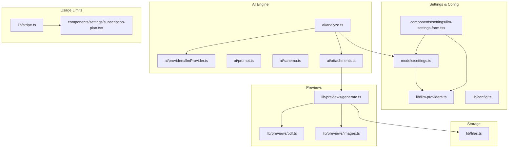
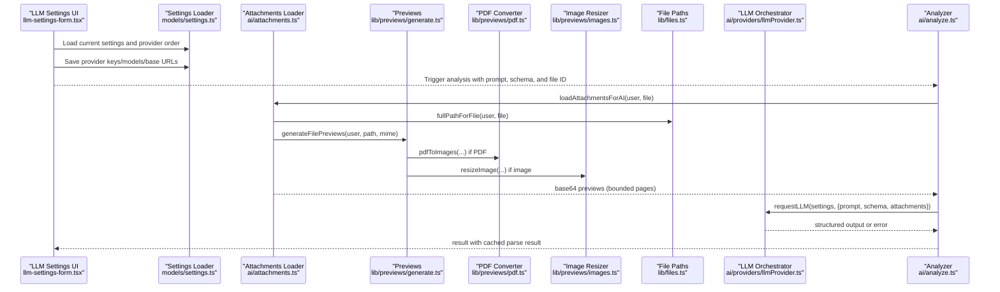
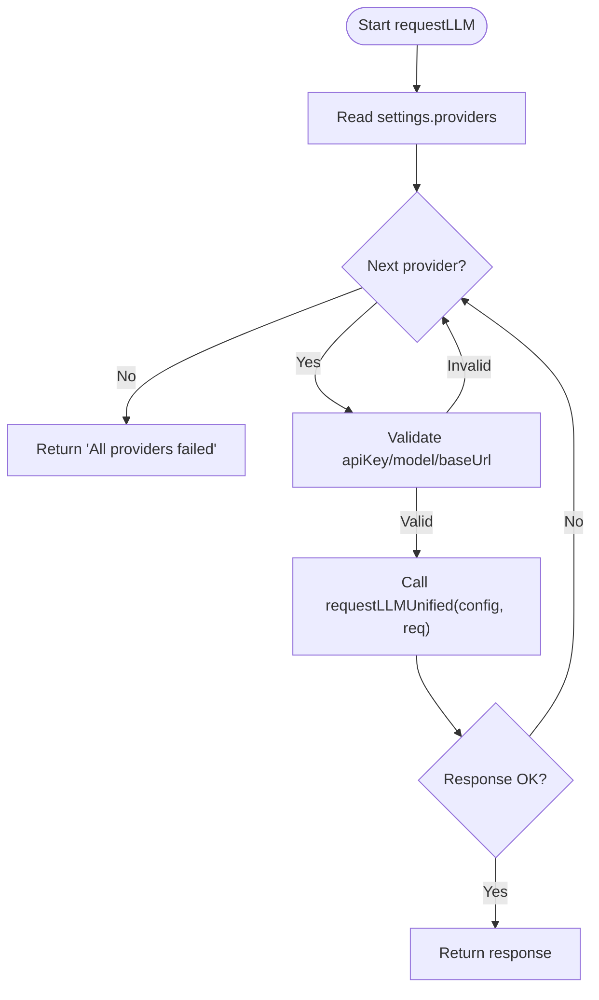
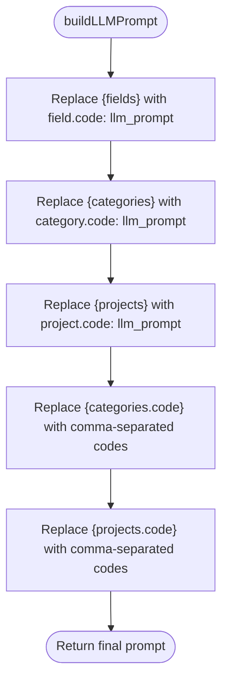
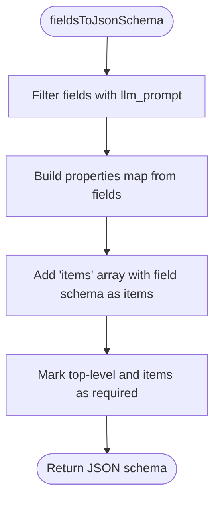
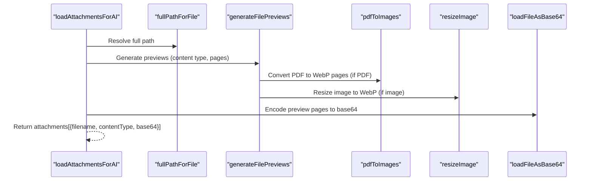
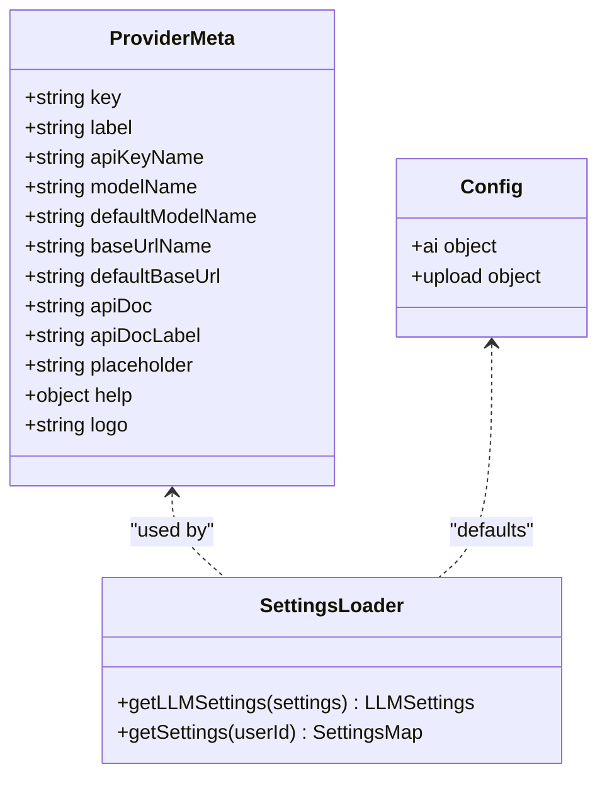
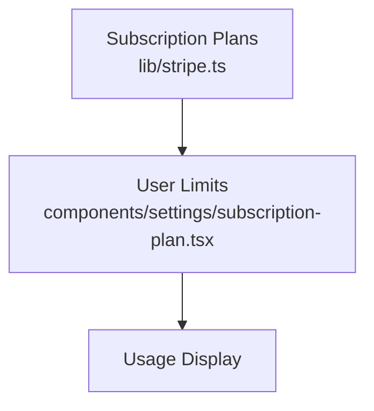
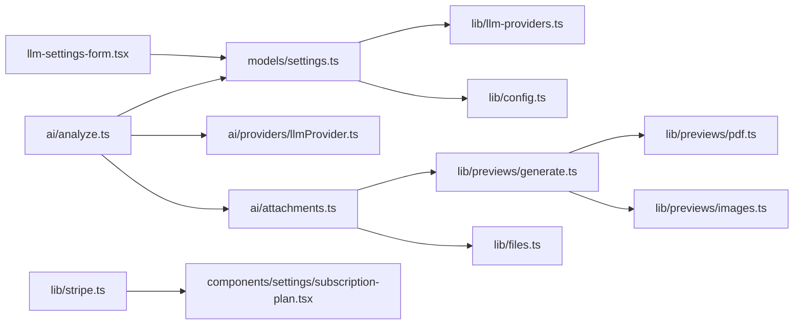

# AI Processing Engine

<cite>
**Referenced Files in This Document**
- [ai/providers/llmProvider.ts](file://ai/providers/llmProvider.ts)
- [ai/analyze.ts](file://ai/analyze.ts)
- [ai/prompt.ts](file://ai/prompt.ts)
- [ai/schema.ts](file://ai/schema.ts)
- [ai/attachments.ts](file://ai/attachments.ts)
- [lib/llm-providers.ts](file://lib/llm-providers.ts)
- [lib/config.ts](file://lib/config.ts)
- [models/settings.ts](file://models/settings.ts)
- [components/settings/llm-settings-form.tsx](file://components/settings/llm-settings-form.tsx)
- [lib/previews/generate.ts](file://lib/previews/generate.ts)
- [lib/previews/pdf.ts](file://lib/previews/pdf.ts)
- [lib/previews/images.ts](file://lib/previews/images.ts)
- [lib/files.ts](file://lib/files.ts)
- [lib/stripe.ts](file://lib/stripe.ts)
- [components/settings/subscription-plan.tsx](file://components/settings/subscription-plan.tsx)
</cite>

## Table of Contents
1. [Introduction](#introduction)
2. [Project Structure](#project-structure)
3. [Core Components](#core-components)
4. [Architecture Overview](#architecture-overview)
5. [Detailed Component Analysis](#detailed-component-analysis)
6. [Dependency Analysis](#dependency-analysis)
7. [Performance Considerations](#performance-considerations)
8. [Troubleshooting Guide](#troubleshooting-guide)
9. [Conclusion](#conclusion)
10. [Appendices](#appendices)

## Introduction
This document describes the AI processing engine powering TaxHacker’s automated document analysis. It explains the multi-provider LLM architecture supporting OpenAI, Google Gemini, Mistral AI, and local OpenAI-compatible APIs. It documents the end-to-end pipeline from file upload and preview generation through structured extraction and transaction caching. It also covers prompt engineering, schema-driven extraction, provider selection logic, and cost/usage considerations.

## Project Structure
The AI engine is organized around a small set of focused modules:
- LLM orchestration and provider abstraction
- Prompt building and JSON schema generation
- Attachment loading and image/PDF preview generation
- Settings and configuration for providers and prompts
- Preview pipeline for PDFs and images
- Storage and file path utilities

**Diagram sources**
- [ai/analyze.ts:14-57](file://ai/analyze.ts#L14-L57)
- [ai/providers/llmProvider.ts:106-132](file://ai/providers/llmProvider.ts#L106-L132)
- [ai/prompt.ts:3-39](file://ai/prompt.ts#L3-L39)
- [ai/schema.ts:3-34](file://ai/schema.ts#L3-L34)
- [ai/attachments.ts:14-35](file://ai/attachments.ts#L14-L35)
- [models/settings.ts:11-51](file://models/settings.ts#L11-L51)
- [lib/llm-providers.ts:16-79](file://lib/llm-providers.ts#L16-L79)
- [lib/config.ts:27-79](file://lib/config.ts#L27-L79)
- [components/settings/llm-settings-form.tsx:29-129](file://components/settings/llm-settings-form.tsx#L29-L129)
- [lib/previews/generate.ts:5-19](file://lib/previews/generate.ts#L5-L19)
- [lib/previews/pdf.ts:10-53](file://lib/previews/pdf.ts#L10-L53)
- [lib/previews/images.ts:10-52](file://lib/previews/images.ts#L10-L52)
- [lib/files.ts:39-68](file://lib/files.ts#L39-L68)
- [lib/stripe.ts:24-57](file://lib/stripe.ts#L24-L57)
- [components/settings/subscription-plan.tsx:31-71](file://components/settings/subscription-plan.tsx#L31-L71)

**Section sources**
- [ai/analyze.ts:14-57](file://ai/analyze.ts#L14-L57)
- [ai/providers/llmProvider.ts:106-132](file://ai/providers/llmProvider.ts#L106-L132)
- [ai/prompt.ts:3-39](file://ai/prompt.ts#L3-L39)
- [ai/schema.ts:3-34](file://ai/schema.ts#L3-L34)
- [ai/attachments.ts:14-35](file://ai/attachments.ts#L14-L35)
- [models/settings.ts:11-51](file://models/settings.ts#L11-L51)
- [lib/llm-providers.ts:16-79](file://lib/llm-providers.ts#L16-L79)
- [lib/config.ts:27-79](file://lib/config.ts#L27-L79)
- [components/settings/llm-settings-form.tsx:29-129](file://components/settings/llm-settings-form.tsx#L29-L129)
- [lib/previews/generate.ts:5-19](file://lib/previews/generate.ts#L5-L19)
- [lib/previews/pdf.ts:10-53](file://lib/previews/pdf.ts#L10-L53)
- [lib/previews/images.ts:10-52](file://lib/previews/images.ts#L10-L52)
- [lib/files.ts:39-68](file://lib/files.ts#L39-L68)
- [lib/stripe.ts:24-57](file://lib/stripe.ts#L24-L57)
- [components/settings/subscription-plan.tsx:31-71](file://components/settings/subscription-plan.tsx#L31-L71)

## Core Components
- LLM orchestration and provider selection:
  - Supports OpenAI, Google Gemini, Mistral, and OpenAI-compatible local/self-hosted endpoints.
  - Iterates through user-configured providers in priority order, skipping unconfigured ones.
  - Uses structured outputs for schema-aligned extraction except for compatible providers.
- Prompt engineering:
  - Builds a dynamic prompt incorporating fields, categories, and projects with optional LLM prompts.
- Schema generation:
  - Produces a JSON schema for structured outputs, including an items array for line-item extraction.
- Attachment pipeline:
  - Loads original files, generates previews (PDFs to images, images resized), and converts up to a bounded number of pages to base64 for multimodal LLM consumption.
- Settings and configuration:
  - Provider metadata, environment-backed defaults, and user-configurable priorities and credentials.
- Preview and storage:
  - PDF conversion to WebP, image resizing, and safe path handling for uploads and previews.
- Usage limits:
  - Subscription plans track AI analysis limits and customer identifiers.

**Section sources**
- [ai/providers/llmProvider.ts:6-31](file://ai/providers/llmProvider.ts#L6-L31)
- [ai/providers/llmProvider.ts:106-132](file://ai/providers/llmProvider.ts#L106-L132)
- [ai/prompt.ts:3-39](file://ai/prompt.ts#L3-L39)
- [ai/schema.ts:3-34](file://ai/schema.ts#L3-L34)
- [ai/attachments.ts:6-35](file://ai/attachments.ts#L6-L35)
- [models/settings.ts:11-51](file://models/settings.ts#L11-L51)
- [lib/llm-providers.ts:16-79](file://lib/llm-providers.ts#L16-L79)
- [lib/previews/generate.ts:5-19](file://lib/previews/generate.ts#L5-L19)
- [lib/previews/pdf.ts:10-53](file://lib/previews/pdf.ts#L10-L53)
- [lib/previews/images.ts:10-52](file://lib/previews/images.ts#L10-L52)
- [lib/files.ts:39-68](file://lib/files.ts#L39-L68)
- [lib/stripe.ts:24-57](file://lib/stripe.ts#L24-L57)

## Architecture Overview
The AI analysis pipeline integrates frontend configuration, backend orchestration, and external LLM providers. The flow below maps actual source files and their interactions.

**Diagram sources**
- [components/settings/llm-settings-form.tsx:29-129](file://components/settings/llm-settings-form.tsx#L29-L129)
- [models/settings.ts:11-51](file://models/settings.ts#L11-L51)
- [ai/attachments.ts:14-35](file://ai/attachments.ts#L14-L35)
- [lib/previews/generate.ts:5-19](file://lib/previews/generate.ts#L5-L19)
- [lib/previews/pdf.ts:10-53](file://lib/previews/pdf.ts#L10-L53)
- [lib/previews/images.ts:10-52](file://lib/previews/images.ts#L10-L52)
- [lib/files.ts:39-68](file://lib/files.ts#L39-L68)
- [ai/providers/llmProvider.ts:106-132](file://ai/providers/llmProvider.ts#L106-L132)
- [ai/analyze.ts:14-57](file://ai/analyze.ts#L14-L57)

## Detailed Component Analysis

### LLM Provider Orchestration
- Provider types and configuration:
  - Supports OpenAI, Google, Mistral, and OpenAI-compatible (local/self-hosted).
  - Configuration includes provider key, model name, and optional base URL for compatible providers.
- Structured output vs. compatible mode:
  - For OpenAI, Google, and Mistral, uses structured output with a JSON schema.
  - For compatible providers, sends raw text and parses JSON from the response.
- Provider selection logic:
  - Reads user preferences and iterates through providers in order.
  - Skips providers missing required keys or models.
  - Returns the first successful response or an aggregated error.

**Diagram sources**
- [ai/providers/llmProvider.ts:106-132](file://ai/providers/llmProvider.ts#L106-L132)
- [ai/providers/llmProvider.ts:32-104](file://ai/providers/llmProvider.ts#L32-L104)

**Section sources**
- [ai/providers/llmProvider.ts:6-31](file://ai/providers/llmProvider.ts#L6-L31)
- [ai/providers/llmProvider.ts:32-104](file://ai/providers/llmProvider.ts#L32-L104)
- [ai/providers/llmProvider.ts:106-132](file://ai/providers/llmProvider.ts#L106-L132)

### Prompt Engineering System
- Dynamic prompt construction:
  - Injects field, category, and project mappings with their LLM prompts.
  - Provides code lists for categories and projects for disambiguation.
- Template customization:
  - Users can edit the prompt template via settings; the system replaces placeholders with contextual data.

**Diagram sources**
- [ai/prompt.ts:3-39](file://ai/prompt.ts#L3-L39)

**Section sources**
- [ai/prompt.ts:3-39](file://ai/prompt.ts#L3-L39)

### Schema Validation and Data Transformation
- JSON schema generation:
  - Builds a schema from enabled fields with their types and descriptions.
  - Adds an items array for line-item extraction, requiring all field properties per item.
- Structured output:
  - LLMs return validated objects matching the schema, ensuring consistent downstream processing.

**Diagram sources**
- [ai/schema.ts:3-34](file://ai/schema.ts#L3-L34)

**Section sources**
- [ai/schema.ts:3-34](file://ai/schema.ts#L3-L34)

### File Attachment Processing Workflow
- Attachment loading:
  - Validates file existence, resolves full path, and generates previews.
  - Bounded to a small number of pages to limit LLM input size.
- Preview generation:
  - PDFs converted to WebP images with DPI and quality controls.
  - Images resized to WebP with configurable max dimensions and quality.
- Base64 encoding:
  - Previews are encoded to base64 for inclusion in multimodal messages.

**Diagram sources**
- [ai/attachments.ts:14-35](file://ai/attachments.ts#L14-L35)
- [lib/previews/generate.ts:5-19](file://lib/previews/generate.ts#L5-L19)
- [lib/previews/pdf.ts:10-53](file://lib/previews/pdf.ts#L10-L53)
- [lib/previews/images.ts:10-52](file://lib/previews/images.ts#L10-L52)
- [lib/files.ts:39-68](file://lib/files.ts#L39-L68)

**Section sources**
- [ai/attachments.ts:6-35](file://ai/attachments.ts#L6-L35)
- [lib/previews/generate.ts:5-19](file://lib/previews/generate.ts#L5-L19)
- [lib/previews/pdf.ts:10-53](file://lib/previews/pdf.ts#L10-L53)
- [lib/previews/images.ts:10-52](file://lib/previews/images.ts#L10-L52)
- [lib/files.ts:39-68](file://lib/files.ts#L39-L68)

### Provider Selection Logic and Configuration
- Provider metadata:
  - Defines keys, labels, API key names, model names, defaults, base URLs, and help links.
- Environment-backed defaults:
  - Application configuration reads environment variables for provider keys and models.
- User settings:
  - Users can reorder providers, set keys, models, and base URLs.
  - Settings loader constructs provider configs from user preferences and environment defaults.

**Diagram sources**
- [lib/llm-providers.ts:1-80](file://lib/llm-providers.ts#L1-L80)
- [models/settings.ts:11-51](file://models/settings.ts#L11-L51)
- [lib/config.ts:27-79](file://lib/config.ts#L27-L79)

**Section sources**
- [lib/llm-providers.ts:16-79](file://lib/llm-providers.ts#L16-L79)
- [lib/config.ts:27-79](file://lib/config.ts#L27-L79)
- [models/settings.ts:11-51](file://models/settings.ts#L11-L51)
- [components/settings/llm-settings-form.tsx:29-129](file://components/settings/llm-settings-form.tsx#L29-L129)

### Token Usage Tracking and Cost Management
- Current state:
  - The LLM orchestration returns a response object that includes a provider identifier.
  - There is no built-in token usage aggregation or cost calculation in the analyzed code.
- Usage limits:
  - Subscription plans define AI analysis limits and customer identifiers.
  - The UI displays remaining AI analyses against plan limits.

**Diagram sources**
- [lib/stripe.ts:24-57](file://lib/stripe.ts#L24-L57)
- [components/settings/subscription-plan.tsx:31-71](file://components/settings/subscription-plan.tsx#L31-L71)

**Section sources**
- [lib/stripe.ts:24-57](file://lib/stripe.ts#L24-L57)
- [components/settings/subscription-plan.tsx:31-71](file://components/settings/subscription-plan.tsx#L31-L71)

## Dependency Analysis
- Cohesion:
  - Each module has a single responsibility: provider orchestration, prompt building, schema generation, attachments, previews, settings, and usage limits.
- Coupling:
  - ai/analyze.ts depends on models/settings.ts and ai/providers/llmProvider.ts.
  - ai/attachments.ts depends on lib/previews/generate.ts and lib/files.ts.
  - lib/previews/generate.ts depends on lib/previews/pdf.ts and lib/previews/images.ts.
  - components/settings/llm-settings-form.tsx depends on models/settings.ts and lib/llm-providers.ts.
- External dependencies:
  - LangChain providers for OpenAI, Google, and Mistral.
  - pdf2pic and sharp for PDF and image processing.
  - Stripe for subscription and limits.

**Diagram sources**
- [components/settings/llm-settings-form.tsx:29-129](file://components/settings/llm-settings-form.tsx#L29-L129)
- [models/settings.ts:11-51](file://models/settings.ts#L11-L51)
- [lib/llm-providers.ts:16-79](file://lib/llm-providers.ts#L16-L79)
- [lib/config.ts:27-79](file://lib/config.ts#L27-L79)
- [ai/analyze.ts:14-57](file://ai/analyze.ts#L14-L57)
- [ai/providers/llmProvider.ts:106-132](file://ai/providers/llmProvider.ts#L106-L132)
- [ai/attachments.ts:14-35](file://ai/attachments.ts#L14-L35)
- [lib/previews/generate.ts:5-19](file://lib/previews/generate.ts#L5-L19)
- [lib/previews/pdf.ts:10-53](file://lib/previews/pdf.ts#L10-L53)
- [lib/previews/images.ts:10-52](file://lib/previews/images.ts#L10-L52)
- [lib/files.ts:39-68](file://lib/files.ts#L39-L68)
- [lib/stripe.ts:24-57](file://lib/stripe.ts#L24-L57)
- [components/settings/subscription-plan.tsx:31-71](file://components/settings/subscription-plan.tsx#L31-L71)

**Section sources**
- [ai/analyze.ts:14-57](file://ai/analyze.ts#L14-L57)
- [ai/providers/llmProvider.ts:106-132](file://ai/providers/llmProvider.ts#L106-L132)
- [ai/attachments.ts:14-35](file://ai/attachments.ts#L14-L35)
- [lib/previews/generate.ts:5-19](file://lib/previews/generate.ts#L5-L19)
- [lib/previews/pdf.ts:10-53](file://lib/previews/pdf.ts#L10-L53)
- [lib/previews/images.ts:10-52](file://lib/previews/images.ts#L10-L52)
- [lib/files.ts:39-68](file://lib/files.ts#L39-L68)
- [models/settings.ts:11-51](file://models/settings.ts#L11-L51)
- [lib/llm-providers.ts:16-79](file://lib/llm-providers.ts#L16-L79)
- [lib/config.ts:27-79](file://lib/config.ts#L27-L79)
- [lib/stripe.ts:24-57](file://lib/stripe.ts#L24-L57)
- [components/settings/subscription-plan.tsx:31-71](file://components/settings/subscription-plan.tsx#L31-L71)

## Performance Considerations
- Preview limits:
  - The attachment loader caps pages to a small number to reduce LLM input size and cost.
- Image optimization:
  - PDFs are converted to WebP with configurable DPI and quality; images are resized to WebP with quality and dimension limits.
- Provider fallback:
  - Early exit on first successful response reduces latency when multiple providers are configured.
- Recommendations:
  - Monitor provider quotas and adjust model sizes and page limits based on cost targets.
  - Consider caching repeated analyses and deduplicating attachments when appropriate.

[No sources needed since this section provides general guidance]

## Troubleshooting Guide
- Provider configuration errors:
  - Missing API keys or models cause providers to be skipped; check settings and environment variables.
- File not found:
  - Attachment loading validates file existence; ensure the file exists at the resolved path.
- PDF conversion failures:
  - Errors during PDF to image conversion are logged; verify system dependencies and permissions.
- Image resizing failures:
  - Errors during image processing fall back to original paths; check Sharp availability and permissions.
- Usage limits:
  - If AI analysis limits are reached, the UI indicates remaining balance; upgrade or wait until reset.

**Section sources**
- [ai/providers/llmProvider.ts:106-132](file://ai/providers/llmProvider.ts#L106-L132)
- [ai/attachments.ts:14-35](file://ai/attachments.ts#L14-L35)
- [lib/previews/pdf.ts:42-53](file://lib/previews/pdf.ts#L42-L53)
- [lib/previews/images.ts:45-51](file://lib/previews/images.ts#L45-L51)
- [components/settings/subscription-plan.tsx:31-71](file://components/settings/subscription-plan.tsx#L31-L71)

## Conclusion
The AI processing engine provides a robust, extensible framework for automated document analysis across multiple LLM providers. It combines dynamic prompt engineering, schema-driven extraction, and efficient preview pipelines to deliver reliable, cost-conscious results. Users can tailor provider priorities, credentials, and prompts while monitoring usage against subscription limits.

[No sources needed since this section summarizes without analyzing specific files]

## Appendices

### Configuration Options
- Environment variables:
  - Provider keys and default model names for OpenAI, Google, and Mistral.
- Frontend settings:
  - Reorder providers, set keys, models, and base URLs for compatible providers.
  - Edit the prompt template for file analysis.

**Section sources**
- [lib/config.ts:7-23](file://lib/config.ts#L7-L23)
- [components/settings/llm-settings-form.tsx:29-129](file://components/settings/llm-settings-form.tsx#L29-L129)

### Example Workflows
- Successful extraction:
  - Upload a PDF or image, configure providers and prompt, trigger analysis, and review cached results.
- Provider fallback:
  - If the primary provider fails, the engine attempts subsequent providers in order until success or exhaustion.

**Section sources**
- [ai/analyze.ts:14-57](file://ai/analyze.ts#L14-L57)
- [ai/providers/llmProvider.ts:106-132](file://ai/providers/llmProvider.ts#L106-L132)