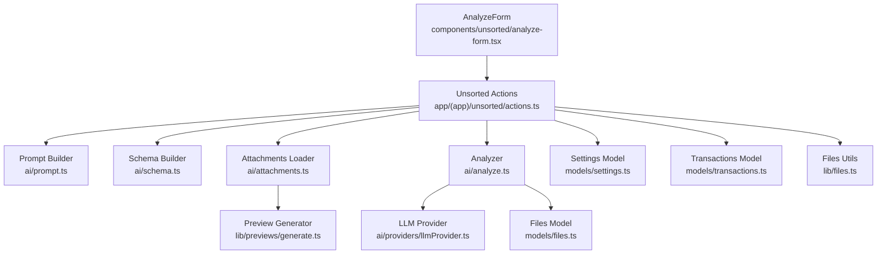
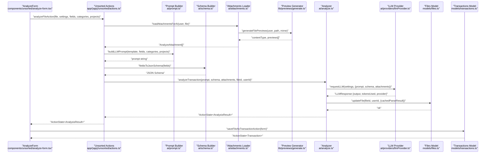
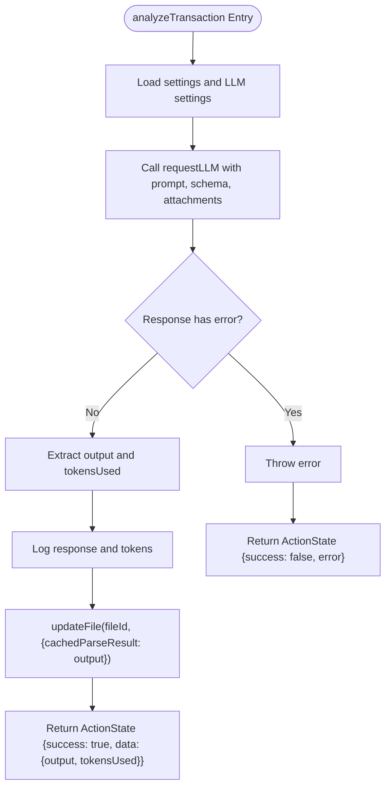
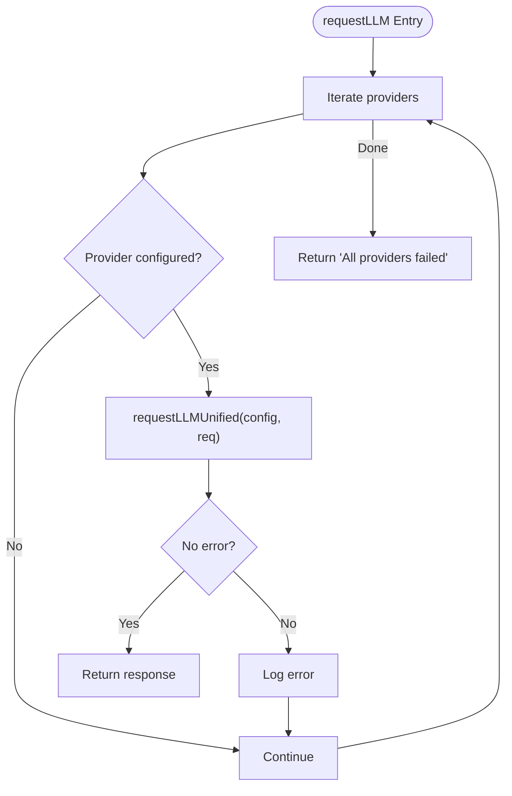
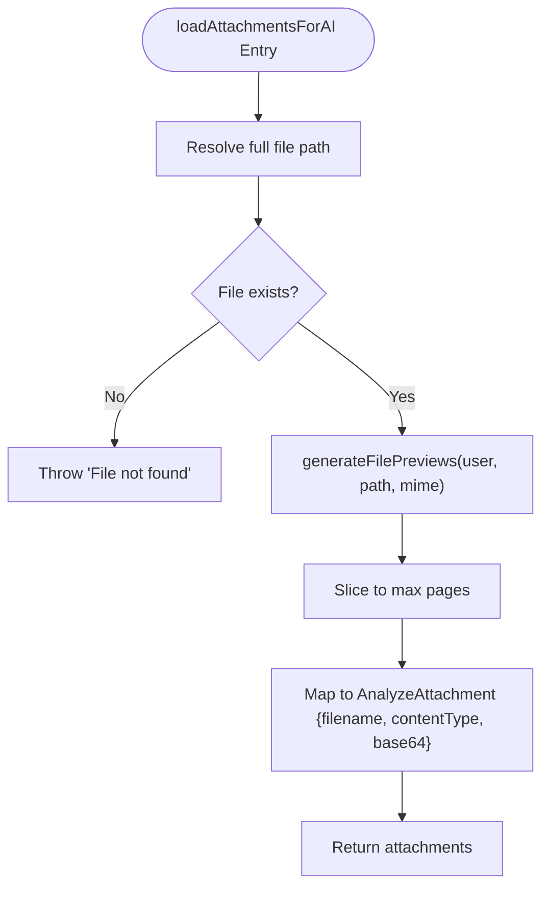
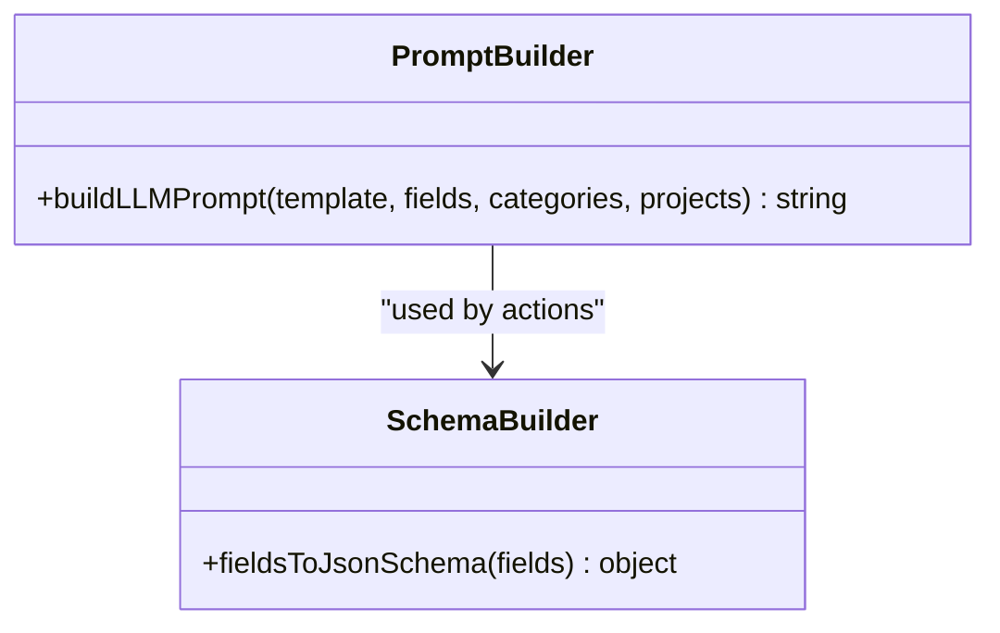
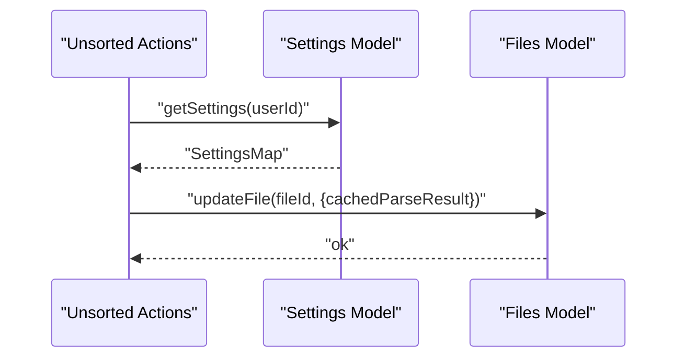
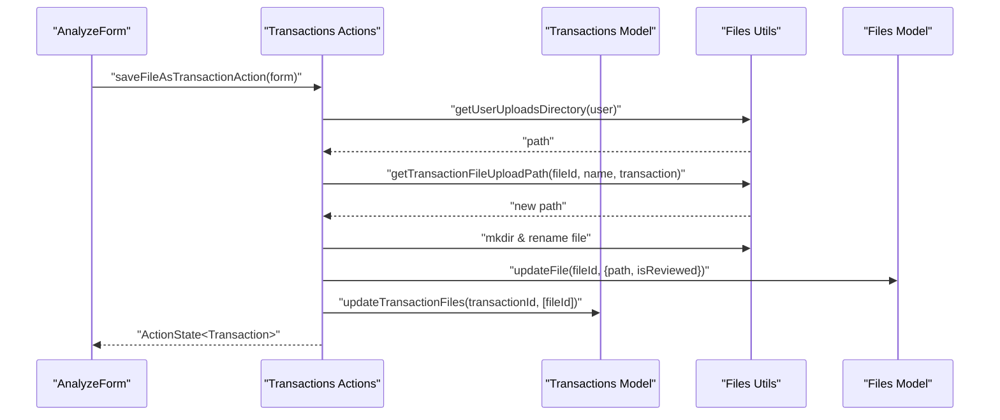
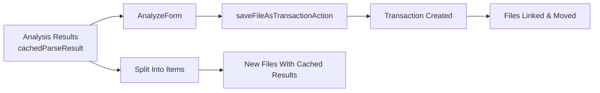
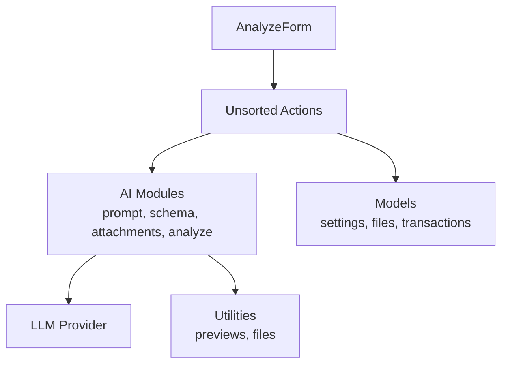

# Analysis Workflow

<cite>
**Referenced Files in This Document**
- [ai/analyze.ts](file://ai/analyze.ts)
- [ai/providers/llmProvider.ts](file://ai/providers/llmProvider.ts)
- [ai/attachments.ts](file://ai/attachments.ts)
- [ai/prompt.ts](file://ai/prompt.ts)
- [ai/schema.ts](file://ai/schema.ts)
- [lib/actions.ts](file://lib/actions.ts)
- [lib/previews/generate.ts](file://lib/previews/generate.ts)
- [lib/files.ts](file://lib/files.ts)
- [models/files.ts](file://models/files.ts)
- [models/settings.ts](file://models/settings.ts)
- [models/transactions.ts](file://models/transactions.ts)
- [app/(app)/unsorted/actions.ts](file://app/(app)/unsorted/actions.ts)
- [app/(app)/transactions/actions.ts](file://app/(app)/transactions/actions.ts)
- [components/unsorted/analyze-form.tsx](file://components/unsorted/analyze-form.tsx)
- [components/unsorted/analyze-all-button.tsx](file://components/unsorted/analyze-all-button.tsx)
</cite>

## Table of Contents
1. [Introduction](#introduction)
2. [Project Structure](#project-structure)
3. [Core Components](#core-components)
4. [Architecture Overview](#architecture-overview)
5. [Detailed Component Analysis](#detailed-component-analysis)
6. [Dependency Analysis](#dependency-analysis)
7. [Performance Considerations](#performance-considerations)
8. [Troubleshooting Guide](#troubleshooting-guide)
9. [Conclusion](#conclusion)
10. [Appendices](#appendices)

## Introduction
This document explains the complete AI analysis workflow in the system, from initial file upload through final transaction creation. It focuses on the analyzeTransaction function orchestration, state management via ActionState, error handling, integration with file models and settings, and result caching. It also documents the ActionState pattern, success/error handling, and data transformation processes, and clarifies how analysis results relate to subsequent transaction creation. Workflow diagrams, state transitions, and integration points with the broader system are included to aid understanding.

## Project Structure
The AI analysis workflow spans several layers:
- Frontend UI components trigger analysis and present results.
- Backend actions coordinate prompts, schema, attachments, and LLM requests.
- AI modules build prompts and schemas, load file previews, and call LLM providers.
- Models manage settings, files, and transactions.
- Utilities handle file paths, previews, and storage checks.

**Diagram sources**
- [components/unsorted/analyze-form.tsx:1-356](file://components/unsorted/analyze-form.tsx#L1-L356)
- [app/(app)/unsorted/actions.ts:27-80](file://app/(app)/unsorted/actions.ts#L27-L80)
- [ai/prompt.ts:3-39](file://ai/prompt.ts#L3-L39)
- [ai/schema.ts:3-34](file://ai/schema.ts#L3-L34)
- [ai/attachments.ts:14-30](file://ai/attachments.ts#L14-L30)
- [lib/previews/generate.ts:5-19](file://lib/previews/generate.ts#L5-L19)
- [ai/analyze.ts:14-57](file://ai/analyze.ts#L14-L57)
- [ai/providers/llmProvider.ts:106-132](file://ai/providers/llmProvider.ts#L106-L132)
- [models/files.ts:63-67](file://models/files.ts#L63-L67)
- [models/settings.ts:53-62](file://models/settings.ts#L53-L62)
- [models/transactions.ts:135-146](file://models/transactions.ts#L135-L146)
- [lib/files.ts:39-51](file://lib/files.ts#L39-L51)

**Section sources**
- [components/unsorted/analyze-form.tsx:1-356](file://components/unsorted/analyze-form.tsx#L1-L356)
- [app/(app)/unsorted/actions.ts:27-80](file://app/(app)/unsorted/actions.ts#L27-L80)
- [ai/analyze.ts:14-57](file://ai/analyze.ts#L14-L57)

## Core Components
- ActionState: A uniform response wrapper for server actions with success, error, and data fields.
- analyzeTransaction: Orchestrates LLM prompting, schema enforcement, attachment preparation, and result caching.
- LLM Providers: Unified request function supporting OpenAI, Google, Mistral, and openai-compatible providers.
- Attachments: Loads file previews and converts them to base64 images for multimodal LLM consumption.
- Prompt and Schema Builders: Construct dynamic prompts and JSON Schemas from user-defined fields and settings.
- Models: Settings, Files, and Transactions provide persistence and transformations.
- UI: AnalyzeForm drives the workflow end-to-end, invoking actions and rendering results.

**Section sources**
- [lib/actions.ts:1-6](file://lib/actions.ts#L1-L6)
- [ai/analyze.ts:14-57](file://ai/analyze.ts#L14-L57)
- [ai/providers/llmProvider.ts:106-132](file://ai/providers/llmProvider.ts#L106-L132)
- [ai/attachments.ts:14-30](file://ai/attachments.ts#L14-L30)
- [ai/prompt.ts:3-39](file://ai/prompt.ts#L3-L39)
- [ai/schema.ts:3-34](file://ai/schema.ts#L3-L34)
- [models/settings.ts:53-62](file://models/settings.ts#L53-L62)
- [models/files.ts:63-67](file://models/files.ts#L63-L67)
- [models/transactions.ts:135-146](file://models/transactions.ts#L135-L146)
- [components/unsorted/analyze-form.tsx:117-143](file://components/unsorted/analyze-form.tsx#L117-L143)

## Architecture Overview
The workflow follows a strict sequence: UI triggers analysis, backend composes prompt and schema, loads previews, queries LLM, caches results, and optionally splits items into multiple files. Subsequent transaction creation persists the parsed data and moves files to the appropriate storage.

**Diagram sources**
- [components/unsorted/analyze-form.tsx:117-143](file://components/unsorted/analyze-form.tsx#L117-L143)
- [app/(app)/unsorted/actions.ts:27-80](file://app/(app)/unsorted/actions.ts#L27-L80)
- [ai/prompt.ts:3-39](file://ai/prompt.ts#L3-L39)
- [ai/schema.ts:3-34](file://ai/schema.ts#L3-L34)
- [ai/attachments.ts:14-30](file://ai/attachments.ts#L14-L30)
- [lib/previews/generate.ts:5-19](file://lib/previews/generate.ts#L5-L19)
- [ai/analyze.ts:14-57](file://ai/analyze.ts#L14-L57)
- [ai/providers/llmProvider.ts:106-132](file://ai/providers/llmProvider.ts#L106-L132)
- [models/files.ts:63-67](file://models/files.ts#L63-L67)
- [models/transactions.ts:82-129](file://models/transactions.ts#L82-L129)

## Detailed Component Analysis

### analyzeTransaction Orchestration and State Management
- Input: prompt, JSON schema, attachments, fileId, userId.
- Fetches user settings and derives LLM settings.
- Calls unified LLM request function with structured output.
- Validates response and throws on errors.
- Caches parsed output into the file record.
- Returns ActionState with success flag, optional data, and optional error.

**Diagram sources**
- [ai/analyze.ts:20-56](file://ai/analyze.ts#L20-L56)
- [models/files.ts:63-67](file://models/files.ts#L63-L67)

**Section sources**
- [ai/analyze.ts:14-57](file://ai/analyze.ts#L14-L57)
- [lib/actions.ts:1-6](file://lib/actions.ts#L1-L6)

### LLM Provider Integration
- Supports multiple providers with unified configuration and invocation.
- Uses structured output for OpenAI variants; raw text parsing for openai-compatible providers.
- Iterates through configured providers until a successful response is obtained or all fail.

**Diagram sources**
- [ai/providers/llmProvider.ts:106-132](file://ai/providers/llmProvider.ts#L106-L132)
- [ai/providers/llmProvider.ts:32-104](file://ai/providers/llmProvider.ts#L32-L104)

**Section sources**
- [ai/providers/llmProvider.ts:106-132](file://ai/providers/llmProvider.ts#L106-L132)

### Attachment Loading and Preview Generation
- Validates file existence and generates previews (PDF to images, image resizing).
- Limits analysis to a fixed number of pages.
- Converts preview paths to base64 for inclusion in multimodal messages.

**Diagram sources**
- [ai/attachments.ts:14-30](file://ai/attachments.ts#L14-L30)
- [lib/previews/generate.ts:5-19](file://lib/previews/generate.ts#L5-L19)
- [ai/attachments.ts:32-35](file://ai/attachments.ts#L32-L35)

**Section sources**
- [ai/attachments.ts:14-30](file://ai/attachments.ts#L14-L30)
- [lib/previews/generate.ts:5-19](file://lib/previews/generate.ts#L5-L19)

### Prompt and Schema Construction
- Prompt builder injects fields, categories, and projects into a template.
- Schema builder creates a JSON Schema enforcing required fields and an items array for line items.

**Diagram sources**
- [ai/prompt.ts:3-39](file://ai/prompt.ts#L3-L39)
- [ai/schema.ts:3-34](file://ai/schema.ts#L3-L34)

**Section sources**
- [ai/prompt.ts:3-39](file://ai/prompt.ts#L3-L39)
- [ai/schema.ts:3-34](file://ai/schema.ts#L3-L34)

### Settings and Result Caching
- Settings are loaded per user and transformed into LLM provider configurations.
- Analysis results are cached in the file record under a dedicated field for reuse.

**Diagram sources**
- [models/settings.ts:53-62](file://models/settings.ts#L53-L62)
- [models/files.ts:63-67](file://models/files.ts#L63-L67)
- [app/(app)/unsorted/actions.ts:75-77](file://app/(app)/unsorted/actions.ts#L75-L77)

**Section sources**
- [models/settings.ts:53-62](file://models/settings.ts#L53-L62)
- [models/files.ts:63-67](file://models/files.ts#L63-L67)

### Transaction Creation and File Movement
- After analysis, the UI submits a form to create a transaction.
- Backend validates form data, creates transaction, moves file to transaction-specific storage, updates file records, and refreshes caches.

**Diagram sources**
- [components/unsorted/analyze-form.tsx:99-115](file://components/unsorted/analyze-form.tsx#L99-L115)
- [app/(app)/transactions/actions.ts:82-129](file://app/(app)/transactions/actions.ts#L82-L129)
- [lib/files.ts:39-51](file://lib/files.ts#L39-L51)
- [models/transactions.ts:161-166](file://models/transactions.ts#L161-L166)

**Section sources**
- [app/(app)/transactions/actions.ts:82-129](file://app/(app)/transactions/actions.ts#L82-L129)
- [models/transactions.ts:135-146](file://models/transactions.ts#L135-L146)

### Relationship Between Analysis Results and Transaction Creation
- Analysis populates the form with parsed fields and items.
- The form’s save action persists a new transaction and links the analyzed file.
- Splitting items produces multiple files, each carrying cached parse results for quick reuse.

**Diagram sources**
- [components/unsorted/analyze-form.tsx:82-96](file://components/unsorted/analyze-form.tsx#L82-L96)
- [app/(app)/unsorted/actions.ts:146-220](file://app/(app)/unsorted/actions.ts#L146-L220)
- [models/files.ts:63-67](file://models/files.ts#L63-L67)

**Section sources**
- [components/unsorted/analyze-form.tsx:82-96](file://components/unsorted/analyze-form.tsx#L82-L96)
- [app/(app)/unsorted/actions.ts:146-220](file://app/(app)/unsorted/actions.ts#L146-L220)

## Dependency Analysis
The workflow exhibits clear layering:
- UI depends on backend actions.
- Actions depend on AI modules, models, and utilities.
- AI modules depend on providers and file utilities.
- Models encapsulate persistence and transformations.

**Diagram sources**
- [components/unsorted/analyze-form.tsx:1-356](file://components/unsorted/analyze-form.tsx#L1-L356)
- [app/(app)/unsorted/actions.ts:1-221](file://app/(app)/unsorted/actions.ts#L1-L221)
- [ai/analyze.ts:1-58](file://ai/analyze.ts#L1-L58)
- [ai/providers/llmProvider.ts:1-133](file://ai/providers/llmProvider.ts#L1-L133)
- [models/settings.ts:1-76](file://models/settings.ts#L1-L76)
- [models/files.ts:1-96](file://models/files.ts#L1-L96)
- [models/transactions.ts:1-221](file://models/transactions.ts#L1-L221)
- [lib/previews/generate.ts:1-20](file://lib/previews/generate.ts#L1-L20)
- [lib/files.ts:1-94](file://lib/files.ts#L1-L94)

**Section sources**
- [app/(app)/unsorted/actions.ts:1-221](file://app/(app)/unsorted/actions.ts#L1-L221)
- [ai/analyze.ts:1-58](file://ai/analyze.ts#L1-L58)
- [models/settings.ts:1-76](file://models/settings.ts#L1-L76)
- [models/files.ts:1-96](file://models/files.ts#L1-L96)
- [models/transactions.ts:1-221](file://models/transactions.ts#L1-L221)
- [lib/previews/generate.ts:1-20](file://lib/previews/generate.ts#L1-L20)
- [lib/files.ts:1-94](file://lib/files.ts#L1-L94)

## Performance Considerations
- Preview generation and base64 conversion add I/O overhead; limiting pages reduces cost.
- Structured output minimizes retries but still depends on provider reliability.
- Caching results avoids repeated LLM calls for the same file.
- File movement and directory operations are synchronous; batch operations could reduce overhead.
- Token accounting decrements AI balance only when tokensUsed is positive.

[No sources needed since this section provides general guidance]

## Troubleshooting Guide
Common failure points and resolutions:
- File not found on disk: Ensure the file exists before analysis; the loader throws if missing.
- No model configured for provider: requestLLM skips providers without a model or proper credentials.
- All providers failed: Verify API keys, base URLs, and model names; fallback occurs only after exhausting attempts.
- Validation errors on save: The transaction form schema must pass; check required fields and types.
- Storage limits: Uploading files requires sufficient storage; backend checks limits before upload.
- Path traversal protection: Utilities enforce safe path joins; ensure paths originate from trusted sources.
- Subscription or AI balance issues: Actions guard against expired subscriptions and exhausted AI scans.

**Section sources**
- [ai/attachments.ts:17-18](file://ai/attachments.ts#L17-L18)
- [ai/providers/llmProvider.ts:106-132](file://ai/providers/llmProvider.ts#L106-L132)
- [app/(app)/unsorted/actions.ts:40-52](file://app/(app)/unsorted/actions.ts#L40-L52)
- [app/(app)/transactions/actions.ts:125-203](file://app/(app)/transactions/actions.ts#L125-L203)
- [lib/files.ts:53-58](file://lib/files.ts#L53-L58)
- [app/(app)/unsorted/actions.ts:146-220](file://app/(app)/unsorted/actions.ts#L146-L220)

## Conclusion
The AI analysis workflow integrates UI, actions, AI modules, and models to transform uploaded documents into structured transactions. The ActionState pattern ensures consistent success/error reporting, while result caching accelerates subsequent operations. The system balances flexibility (multiple providers, dynamic prompts/schemas) with robustness (validation, safety checks, and clear error propagation).

[No sources needed since this section summarizes without analyzing specific files]

## Appendices

### Example Pipelines
- Single-file analysis and save:
  - UI click triggers analyzeFileAction.
  - Prompt and schema built from settings and fields.
  - Attachments loaded and sent to LLM.
  - Result cached; form populated.
  - Save action creates transaction and moves file.

- Splitting items into separate files:
  - UI detects items and invokes split action.
  - Original file content duplicated into new files.
  - Each new file carries cached parse results.
  - Original deleted; storage updated.

**Section sources**
- [components/unsorted/analyze-form.tsx:117-143](file://components/unsorted/analyze-form.tsx#L117-L143)
- [app/(app)/unsorted/actions.ts:146-220](file://app/(app)/unsorted/actions.ts#L146-L220)
- [components/unsorted/analyze-all-button.tsx:6-35](file://components/unsorted/analyze-all-button.tsx#L6-L35)