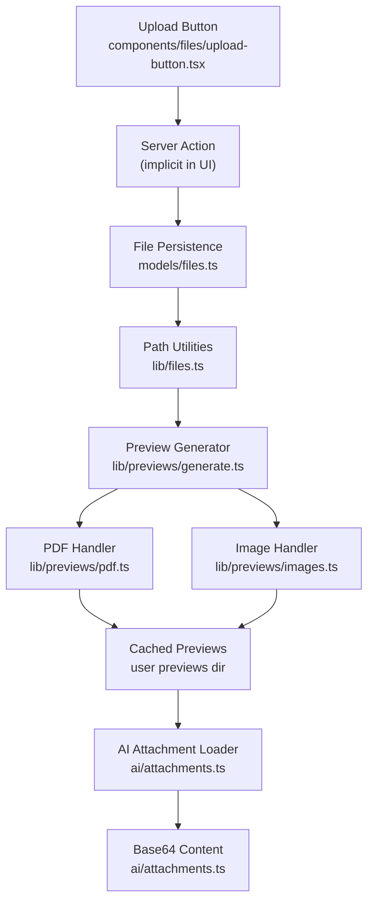
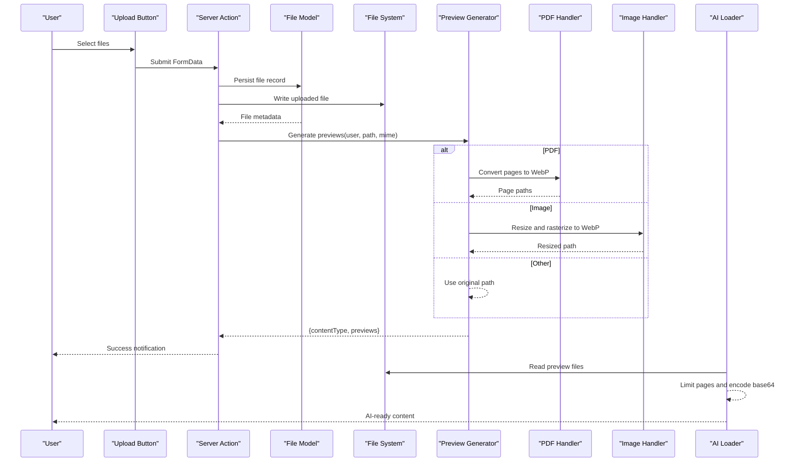
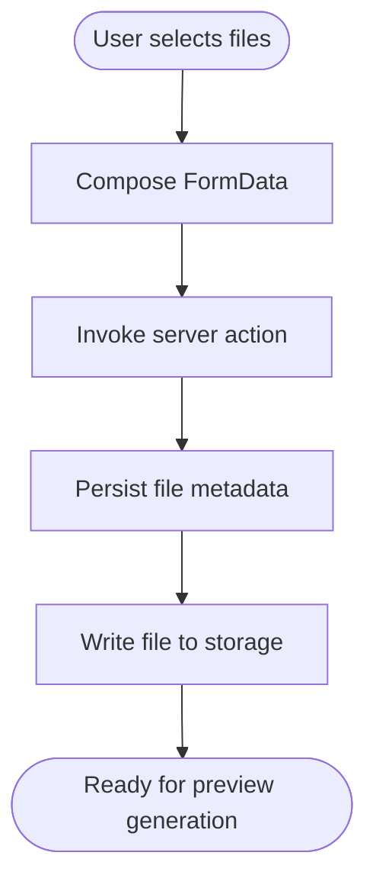
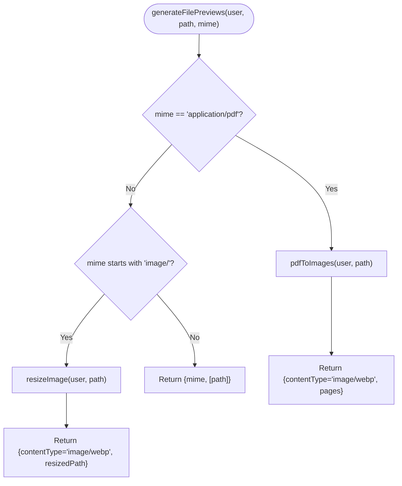
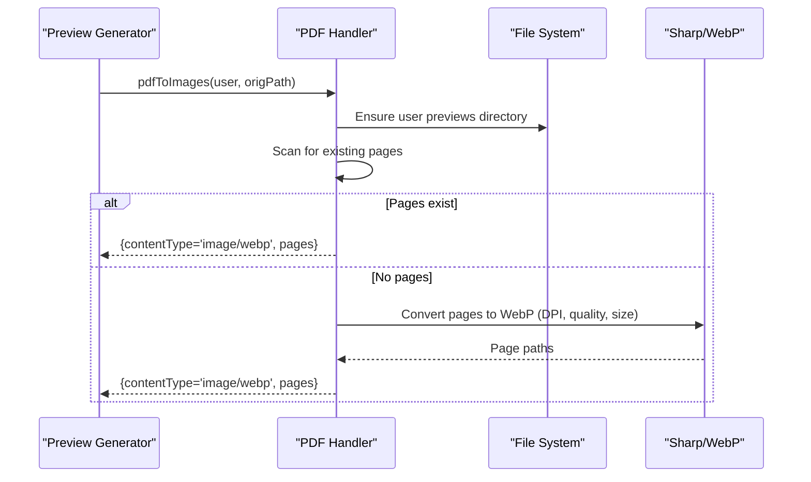
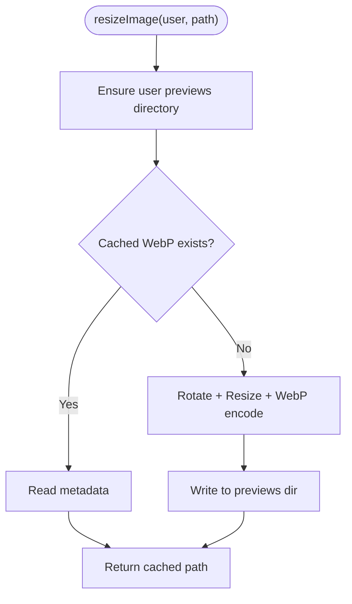
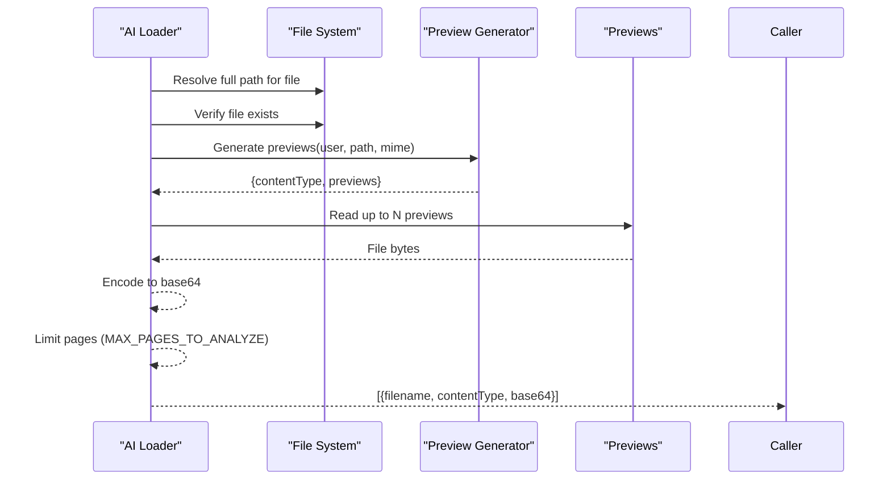
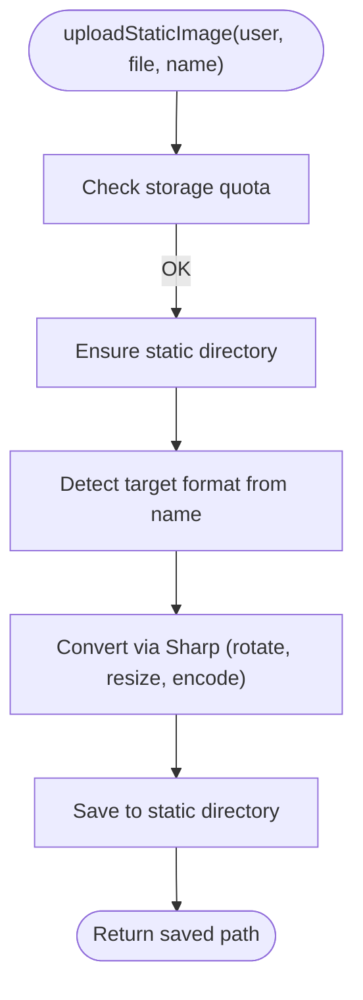
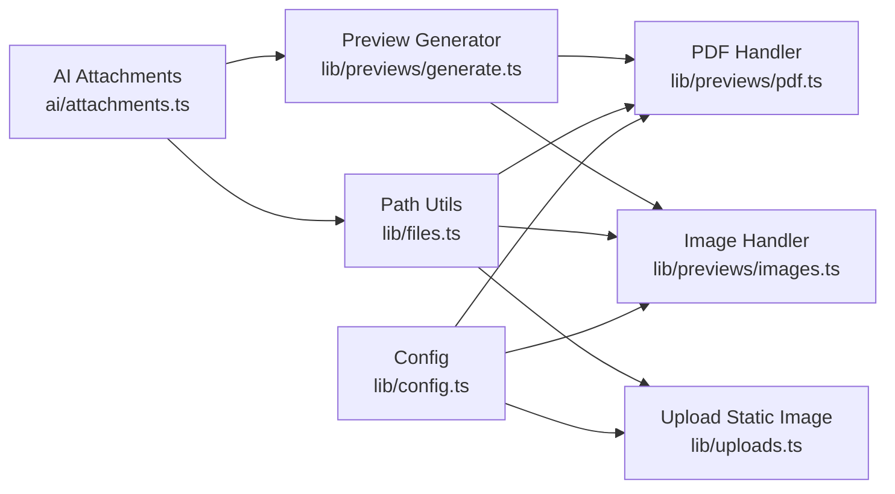

# File Processing Pipeline

<cite>
**Referenced Files in This Document**
- [ai/attachments.ts](file://ai/attachments.ts)
- [lib/previews/generate.ts](file://lib/previews/generate.ts)
- [lib/previews/pdf.ts](file://lib/previews/pdf.ts)
- [lib/previews/images.ts](file://lib/previews/images.ts)
- [lib/files.ts](file://lib/files.ts)
- [lib/uploads.ts](file://lib/uploads.ts)
- [lib/config.ts](file://lib/config.ts)
- [models/files.ts](file://models/files.ts)
- [components/files/upload-button.tsx](file://components/files/upload-button.tsx)
</cite>

## Table of Contents
1. [Introduction](#introduction)
2. [Project Structure](#project-structure)
3. [Core Components](#core-components)
4. [Architecture Overview](#architecture-overview)
5. [Detailed Component Analysis](#detailed-component-analysis)
6. [Dependency Analysis](#dependency-analysis)
7. [Performance Considerations](#performance-considerations)
8. [Troubleshooting Guide](#troubleshooting-guide)
9. [Conclusion](#conclusion)

## Introduction
This document explains the file processing pipeline responsible for ingesting user-uploaded documents, preparing them for AI analysis, and generating previews. It covers the end-to-end workflow from upload through format detection, conversion, enhancement, and caching, and outlines storage management, supported formats, size limits, and processing considerations. The pipeline supports PDFs, images, and common office-like documents, transforming them into AI-ready content while preserving security and performance.

## Project Structure
The file processing pipeline spans several modules:
- Upload and UI: client-side upload button triggers server actions that persist files and metadata.
- Storage and paths: utilities define user-specific upload directories, preview directories, and static asset locations.
- Preview generation: format-specific handlers convert PDFs to images and resize/rasterize images to web-friendly formats.
- AI ingestion: the AI module loads preview files and emits base64-encoded content for analysis.

**Diagram sources**
- [components/files/upload-button.tsx:1-77](file://components/files/upload-button.tsx#L1-L77)
- [models/files.ts:54-61](file://models/files.ts#L54-L61)
- [lib/files.ts:39-42](file://lib/files.ts#L39-L42)
- [lib/previews/generate.ts:5-19](file://lib/previews/generate.ts#L5-L19)
- [lib/previews/pdf.ts:10-54](file://lib/previews/pdf.ts#L10-L54)
- [lib/previews/images.ts:10-52](file://lib/previews/images.ts#L10-L52)
- [ai/attachments.ts:14-35](file://ai/attachments.ts#L14-L35)

**Section sources**
- [components/files/upload-button.tsx:1-77](file://components/files/upload-button.tsx#L1-L77)
- [models/files.ts:54-61](file://models/files.ts#L54-L61)
- [lib/files.ts:12-59](file://lib/files.ts#L12-L59)
- [lib/previews/generate.ts:5-19](file://lib/previews/generate.ts#L5-L19)
- [lib/previews/pdf.ts:10-54](file://lib/previews/pdf.ts#L10-L54)
- [lib/previews/images.ts:10-52](file://lib/previews/images.ts#L10-L52)
- [ai/attachments.ts:14-35](file://ai/attachments.ts#L14-L35)

## Core Components
- Upload and UI trigger: the upload button composes a multipart form and invokes a server action to persist files.
- Metadata persistence: creates file records with user-scoped paths and metadata.
- Path utilities: compute user-specific upload and preview directories, enforce safe path joins, and resolve absolute paths.
- Preview generator: detects content type and dispatches to appropriate handler (PDF or image).
- PDF handler: converts pages to WebP, caches results per user, and returns page paths.
- Image handler: resizes and rasterizes images to WebP, caches results per user, and returns the cached path.
- AI loader: reads preview files, limits pages for analysis, and returns base64-encoded content for AI consumption.

**Section sources**
- [components/files/upload-button.tsx:19-42](file://components/files/upload-button.tsx#L19-L42)
- [models/files.ts:54-61](file://models/files.ts#L54-L61)
- [lib/files.ts:39-59](file://lib/files.ts#L39-L59)
- [lib/previews/generate.ts:5-19](file://lib/previews/generate.ts#L5-L19)
- [lib/previews/pdf.ts:10-54](file://lib/previews/pdf.ts#L10-L54)
- [lib/previews/images.ts:10-52](file://lib/previews/images.ts#L10-L52)
- [ai/attachments.ts:14-35](file://ai/attachments.ts#L14-L35)

## Architecture Overview
The pipeline follows a layered design:
- Presentation layer: upload UI and server action invocation.
- Domain layer: file persistence and metadata management.
- Infrastructure layer: path resolution, storage checks, and preview generation.
- AI ingestion layer: consumes prepared previews and emits base64 content.

**Diagram sources**
- [components/files/upload-button.tsx:19-42](file://components/files/upload-button.tsx#L19-L42)
- [models/files.ts:54-61](file://models/files.ts#L54-L61)
- [lib/previews/generate.ts:5-19](file://lib/previews/generate.ts#L5-L19)
- [lib/previews/pdf.ts:10-54](file://lib/previews/pdf.ts#L10-L54)
- [lib/previews/images.ts:10-52](file://lib/previews/images.ts#L10-L52)
- [ai/attachments.ts:14-35](file://ai/attachments.ts#L14-L35)

## Detailed Component Analysis

### Upload and Persistence
- The upload button composes a FormData with multiple files and invokes a server action.
- The server action persists file records via the file model, ensuring user-scoped storage and metadata.
- Path utilities compute safe, user-specific directories for uploads and previews.

**Diagram sources**
- [components/files/upload-button.tsx:19-42](file://components/files/upload-button.tsx#L19-L42)
- [models/files.ts:54-61](file://models/files.ts#L54-L61)
- [lib/files.ts:39-42](file://lib/files.ts#L39-L42)

**Section sources**
- [components/files/upload-button.tsx:19-42](file://components/files/upload-button.tsx#L19-L42)
- [models/files.ts:54-61](file://models/files.ts#L54-L61)
- [lib/files.ts:39-42](file://lib/files.ts#L39-L42)

### Preview Generation Orchestration
- The preview generator inspects the MIME type and routes to either the PDF handler or the image handler.
- For unknown types, it returns the original path as-is.

**Diagram sources**
- [lib/previews/generate.ts:5-19](file://lib/previews/generate.ts#L5-L19)
- [lib/previews/pdf.ts:10-54](file://lib/previews/pdf.ts#L10-L54)
- [lib/previews/images.ts:10-52](file://lib/previews/images.ts#L10-L52)

**Section sources**
- [lib/previews/generate.ts:5-19](file://lib/previews/generate.ts#L5-L19)

### PDF Conversion and Caching
- Converts PDF pages to WebP using configurable DPI, quality, and maximum dimensions.
- Caches converted pages under the user’s preview directory.
- Reuses cached pages if they already exist, avoiding redundant conversions.

**Diagram sources**
- [lib/previews/pdf.ts:10-54](file://lib/previews/pdf.ts#L10-L54)

**Section sources**
- [lib/previews/pdf.ts:10-54](file://lib/previews/pdf.ts#L10-L54)
- [lib/config.ts:42-48](file://lib/config.ts#L42-L48)

### Image Enhancement and Rasterization
- Resizes images to configured maximum dimensions, rotates based on EXIF orientation, and writes as WebP.
- Caches the result under the user’s preview directory and returns the cached path.
- On failure, falls back to returning the original path with an “unknown” content type.

**Diagram sources**
- [lib/previews/images.ts:10-52](file://lib/previews/images.ts#L10-L52)

**Section sources**
- [lib/previews/images.ts:10-52](file://lib/previews/images.ts#L10-L52)
- [lib/config.ts:37-41](file://lib/config.ts#L37-L41)

### AI Attachment Preparation
- Loads the original file, verifies its presence on disk, and generates previews.
- Limits analysis to a fixed number of pages.
- Reads each preview file and encodes it to base64 for AI consumption.

**Diagram sources**
- [ai/attachments.ts:14-35](file://ai/attachments.ts#L14-L35)
- [lib/previews/generate.ts:5-19](file://lib/previews/generate.ts#L5-L19)

**Section sources**
- [ai/attachments.ts:6-35](file://ai/attachments.ts#L6-L35)

### Static Image Upload (Additional Capability)
- Supports uploading and converting static images to WebP/JPEG/PNG/AVIF with configurable dimensions and quality.
- Enforces storage quota checks and safe path handling.

**Diagram sources**
- [lib/uploads.ts:8-60](file://lib/uploads.ts#L8-L60)

**Section sources**
- [lib/uploads.ts:8-60](file://lib/uploads.ts#L8-L60)
- [lib/files.ts:88-93](file://lib/files.ts#L88-L93)

## Dependency Analysis
- Preview generation depends on:
  - MIME type detection to choose the handler.
  - PDF handler for PDFs and image handler for images.
  - Path utilities for safe directory creation and file existence checks.
- AI ingestion depends on:
  - Preview generation for content preparation.
  - File existence verification and base64 encoding.

**Diagram sources**
- [lib/config.ts:35-49](file://lib/config.ts#L35-L49)
- [lib/previews/pdf.ts:10-54](file://lib/previews/pdf.ts#L10-L54)
- [lib/previews/images.ts:10-52](file://lib/previews/images.ts#L10-L52)
- [lib/uploads.ts:8-60](file://lib/uploads.ts#L8-L60)
- [lib/files.ts:39-59](file://lib/files.ts#L39-L59)
- [lib/previews/generate.ts:5-19](file://lib/previews/generate.ts#L5-L19)
- [ai/attachments.ts:14-35](file://ai/attachments.ts#L14-L35)

**Section sources**
- [lib/config.ts:35-49](file://lib/config.ts#L35-L49)
- [lib/previews/pdf.ts:10-54](file://lib/previews/pdf.ts#L10-L54)
- [lib/previews/images.ts:10-52](file://lib/previews/images.ts#L10-L52)
- [lib/uploads.ts:8-60](file://lib/uploads.ts#L8-L60)
- [lib/files.ts:39-59](file://lib/files.ts#L39-L59)
- [lib/previews/generate.ts:5-19](file://lib/previews/generate.ts#L5-L19)
- [ai/attachments.ts:14-35](file://ai/attachments.ts#L14-L35)

## Performance Considerations
- PDF conversion:
  - DPI, quality, and maximum dimensions are configurable; higher values increase CPU and memory usage.
  - Converting many pages is expensive; the pipeline caps pages per document and limits analysis to a small subset for AI.
- Image processing:
  - Rotation and resizing are performed per page; limiting maximum dimensions reduces processing time and storage.
- Caching:
  - Reuses previously generated previews to avoid repeated conversions.
- Storage checks:
  - Enforces quotas before writing static images to prevent excessive disk usage.

[No sources needed since this section provides general guidance]

## Troubleshooting Guide
- File not found on disk during AI ingestion:
  - Ensure the file exists at the computed full path and that the database record matches the filesystem state.
  - Confirm the upload succeeded and the path resolution is correct.
- Unsupported preview format:
  - For static uploads, ensure the target filename includes a supported extension (PNG, JPEG, WEBP, AVIF).
- Exceeded storage quota:
  - Verify user storage limits and available space before attempting uploads.
- PDF conversion errors:
  - Check logs for conversion failures; ensure the PDF is valid and not encrypted.
- Preview reuse issues:
  - If cached previews are missing despite existing files, regenerate previews or clear stale cache entries.

**Section sources**
- [ai/attachments.ts:17-19](file://ai/attachments.ts#L17-L19)
- [lib/uploads.ts:24-28](file://lib/uploads.ts#L24-L28)
- [lib/files.ts:88-93](file://lib/files.ts#L88-L93)
- [lib/previews/pdf.ts:50-53](file://lib/previews/pdf.ts#L50-L53)

## Conclusion
The file processing pipeline integrates upload, persistence, preview generation, and AI ingestion into a cohesive workflow. It supports PDFs, images, and common document formats, converts them to optimized WebP previews, enforces storage quotas, and prepares content for AI analysis with strict safety checks. By leveraging caching and configurable limits, it balances performance, reliability, and scalability.