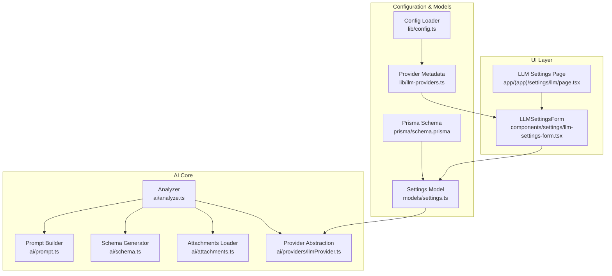
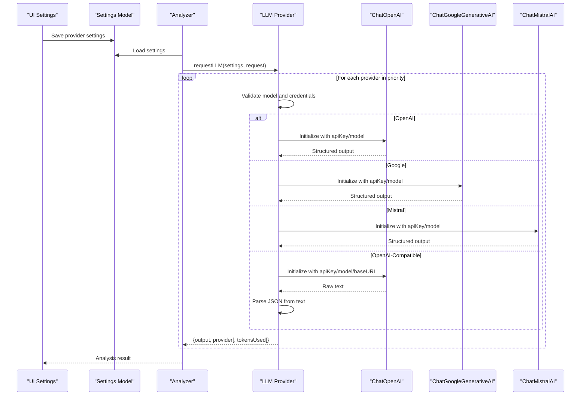
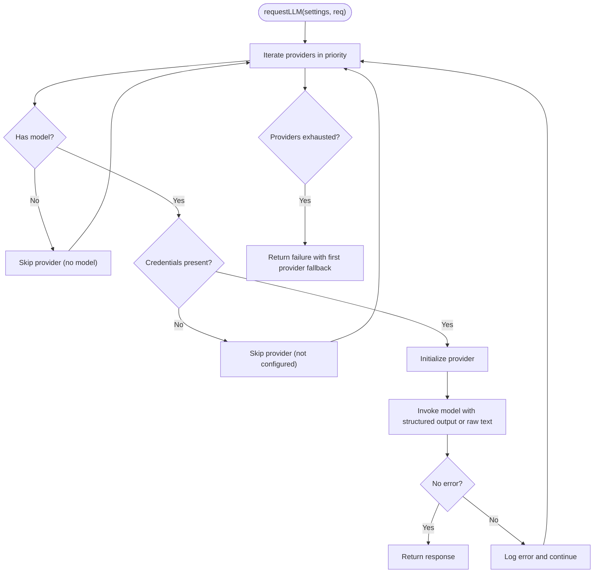
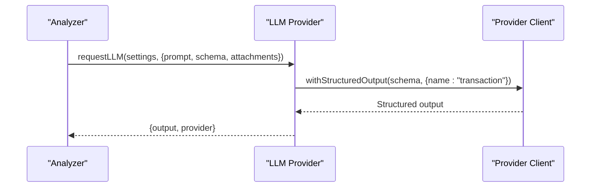
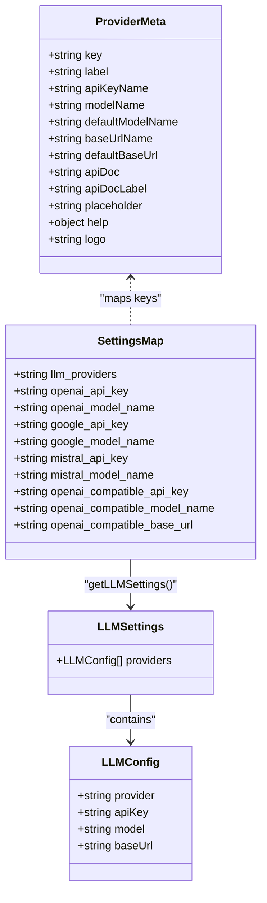
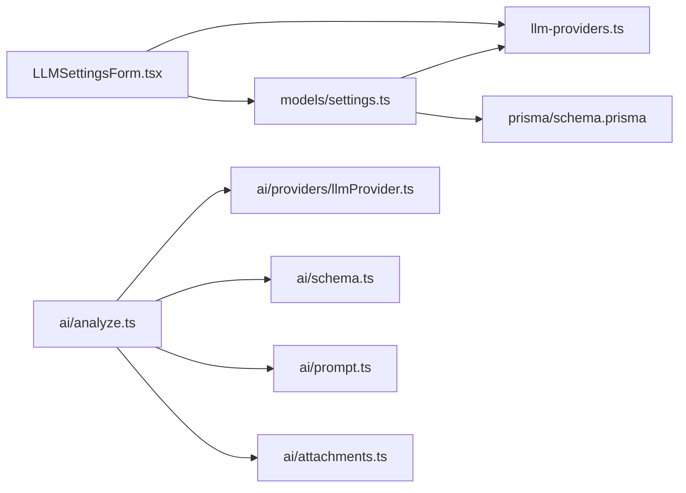

# LLM Provider Integration

<cite>
**Referenced Files in This Document**
- [llmProvider.ts](file://ai/providers/llmProvider.ts)
- [llm-providers.ts](file://lib/llm-providers.ts)
- [config.ts](file://lib/config.ts)
- [settings.ts](file://models/settings.ts)
- [llm-settings-form.tsx](file://components/settings/llm-settings-form.tsx)
- [llm\page.tsx](file://app/(app)/settings/llm/page.tsx)
- [analyze.ts](file://ai/analyze.ts)
- [prompt.ts](file://ai/prompt.ts)
- [schema.ts](file://ai/schema.ts)
- [attachments.ts](file://ai/attachments.ts)
- [schema.prisma](file://prisma/schema.prisma)
</cite>

## Table of Contents
1. [Introduction](#introduction)
2. [Project Structure](#project-structure)
3. [Core Components](#core-components)
4. [Architecture Overview](#architecture-overview)
5. [Detailed Component Analysis](#detailed-component-analysis)
6. [Dependency Analysis](#dependency-analysis)
7. [Performance Considerations](#performance-considerations)
8. [Troubleshooting Guide](#troubleshooting-guide)
9. [Conclusion](#conclusion)
10. [Appendices](#appendices)

## Introduction
This document explains the LLM provider integration system that powers AI-powered invoice analysis. It covers the unified provider abstraction supporting OpenAI, Google Gemini, Mistral AI, and local/self-hosted OpenAI-compatible APIs. It documents provider selection logic, configuration management, fallback mechanisms, request handling, authentication, and structured output generation. It also provides guidance on configuration examples, API key management, rate limiting strategies, token usage tracking, cost calculation, provider-specific features, and troubleshooting.

## Project Structure
The LLM integration spans several layers:
- Provider abstraction and request orchestration
- Configuration and settings extraction
- UI for managing provider preferences and credentials
- Data models for storing settings
- Prompt building and schema generation for structured outputs
- Attachment handling for multi-modal inputs

**Diagram sources**
- [llm-settings-form.tsx:1-244](file://components/settings/llm-settings-form.tsx#L1-L244)
- [llm\page.tsx](file://app/(app)/settings/llm/page.tsx#L1-L19)
- [config.ts:1-82](file://lib/config.ts#L1-L82)
- [llm-providers.ts:1-80](file://lib/llm-providers.ts#L1-L80)
- [settings.ts:1-76](file://models/settings.ts#L1-L76)
- [schema.prisma:92-103](file://prisma/schema.prisma#L92-L103)
- [analyze.ts:1-58](file://ai/analyze.ts#L1-L58)
- [prompt.ts:1-40](file://ai/prompt.ts#L1-L40)
- [schema.ts:1-35](file://ai/schema.ts#L1-L35)
- [attachments.ts:1-36](file://ai/attachments.ts#L1-L36)
- [llmProvider.ts:1-133](file://ai/providers/llmProvider.ts#L1-L133)

**Section sources**
- [llmProvider.ts:1-133](file://ai/providers/llmProvider.ts#L1-L133)
- [llm-providers.ts:1-80](file://lib/llm-providers.ts#L1-L80)
- [config.ts:1-82](file://lib/config.ts#L1-L82)
- [settings.ts:1-76](file://models/settings.ts#L1-L76)
- [llm-settings-form.tsx:1-244](file://components/settings/llm-settings-form.tsx#L1-L244)
- [llm\page.tsx](file://app/(app)/settings/llm/page.tsx#L1-L19)
- [analyze.ts:1-58](file://ai/analyze.ts#L1-L58)
- [prompt.ts:1-40](file://ai/prompt.ts#L1-L40)
- [schema.ts:1-35](file://ai/schema.ts#L1-L35)
- [attachments.ts:1-36](file://ai/attachments.ts#L1-L36)
- [schema.prisma:92-103](file://prisma/schema.prisma#L92-L103)

## Core Components
- Unified provider abstraction: A single function orchestrates requests to multiple providers and returns the first successful response.
- Provider metadata: Centralized provider definitions including keys, labels, default models, base URLs, and help links.
- Settings extraction: Converts persisted settings into typed provider configurations with priority ordering.
- Structured output: Uses LangChain’s structured output to constrain model responses to a JSON schema.
- Attachment handling: Loads file previews and encodes them for multimodal prompts.
- Prompt building: Assembles dynamic prompts using user-defined fields, categories, and projects.

**Section sources**
- [llmProvider.ts:6-30](file://ai/providers/llmProvider.ts#L6-L30)
- [llm-providers.ts:1-80](file://lib/llm-providers.ts#L1-L80)
- [settings.ts:11-51](file://models/settings.ts#L11-L51)
- [schema.ts:3-34](file://ai/schema.ts#L3-L34)
- [attachments.ts:14-30](file://ai/attachments.ts#L14-L30)
- [prompt.ts:3-39](file://ai/prompt.ts#L3-L39)

## Architecture Overview
The system routes analysis requests through a prioritized list of providers. Each provider is initialized with its API key and model. For OpenAI-compatible endpoints, a base URL is used instead of a dedicated API key. Structured output is enforced for OpenAI, Google, and Mistral via LangChain’s structured output, while OpenAI-compatible endpoints rely on parsing JSON from raw text.

**Diagram sources**
- [llmProvider.ts:32-104](file://ai/providers/llmProvider.ts#L32-L104)
- [llmProvider.ts:106-132](file://ai/providers/llmProvider.ts#L106-L132)
- [settings.ts:11-51](file://models/settings.ts#L11-L51)
- [analyze.ts:14-57](file://ai/analyze.ts#L14-L57)

## Detailed Component Analysis

### Unified Provider Abstraction
The abstraction encapsulates provider initialization, multimodal message construction, structured output enforcement, and error handling. It supports four providers and a fallback mechanism across the list.

**Diagram sources**
- [llmProvider.ts:106-132](file://ai/providers/llmProvider.ts#L106-L132)
- [llmProvider.ts:32-104](file://ai/providers/llmProvider.ts#L32-L104)

**Section sources**
- [llmProvider.ts:6-30](file://ai/providers/llmProvider.ts#L6-L30)
- [llmProvider.ts:32-104](file://ai/providers/llmProvider.ts#L32-L104)
- [llmProvider.ts:106-132](file://ai/providers/llmProvider.ts#L106-L132)

### Provider Initialization and Authentication
- OpenAI, Google, and Mistral: Initialized with apiKey and model; temperature is fixed to zero for deterministic outputs.
- OpenAI-Compatible: Accepts optional apiKey and requires a base URL pointing to an OpenAI-compatible endpoint. The baseURL is trimmed and passed to the underlying client.

Authentication handling:
- API keys are passed directly to provider clients.
- For OpenAI-Compatible, the apiKey is optional and can be omitted if the endpoint does not require it.

**Section sources**
- [llmProvider.ts:36-62](file://ai/providers/llmProvider.ts#L36-L62)
- [llm-providers.ts:62-78](file://lib/llm-providers.ts#L62-L78)

### Structured Output and Schema
- For OpenAI, Google, and Mistral, the provider client enforces structured output using a JSON schema derived from user-defined fields.
- For OpenAI-Compatible, the provider returns raw text; the system extracts JSON by removing code block markers and trimming whitespace.

**Diagram sources**
- [llmProvider.ts:88-91](file://ai/providers/llmProvider.ts#L88-L91)
- [schema.ts:3-34](file://ai/schema.ts#L3-L34)

**Section sources**
- [llmProvider.ts:88-91](file://ai/providers/llmProvider.ts#L88-L91)
- [schema.ts:3-34](file://ai/schema.ts#L3-L34)

### Multimodal Inputs and Attachments
- Attachments are loaded from file previews up to a configured maximum number of pages.
- Each preview is encoded to base64 and included as image_url parts alongside the text prompt.

**Section sources**
- [attachments.ts:14-30](file://ai/attachments.ts#L14-L30)

### Configuration Management and Provider Selection
- Provider metadata defines keys, labels, default models, base URLs, placeholders, and help links.
- Settings are persisted per user and include:
  - Priority order of providers
  - API keys per provider
  - Model names per provider
  - Base URL for OpenAI-Compatible
- The settings loader constructs typed provider configs from persisted values, falling back to defaults when missing.

**Diagram sources**
- [llm-providers.ts:1-80](file://lib/llm-providers.ts#L1-L80)
- [settings.ts:11-51](file://models/settings.ts#L11-L51)

**Section sources**
- [llm-providers.ts:1-80](file://lib/llm-providers.ts#L1-L80)
- [settings.ts:11-51](file://models/settings.ts#L11-L51)

### UI for Provider Configuration
- The settings form allows reordering providers via drag-and-drop; the first provider has the highest priority.
- Per-provider controls include API key, model name, and base URL for compatible endpoints.
- The form persists settings and displays the current JSON schema used for structured outputs.

**Section sources**
- [llm-settings-form.tsx:18-62](file://components/settings/llm-settings-form.tsx#L18-L62)
- [llm-settings-form.tsx:138-243](file://components/settings/llm-settings-form.tsx#L138-L243)
- [llm\page.tsx](file://app/(app)/settings/llm/page.tsx#L7-L18)

### Prompt Building and Dynamic Templates
- Prompts are built from templates and injected lists of fields, categories, and projects.
- Placeholders are replaced with formatted content to guide the model during analysis.

**Section sources**
- [prompt.ts:3-39](file://ai/prompt.ts#L3-L39)

### Token Usage Tracking and Cost Calculation
- The provider abstraction currently returns a tokensUsed field in the response interface but does not populate it in the implementation.
- Recommendation: Integrate provider SDK metrics to capture token usage and compute costs based on provider pricing.

**Section sources**
- [llmProvider.ts:25-30](file://ai/providers/llmProvider.ts#L25-L30)
- [analyze.ts:35-39](file://ai/analyze.ts#L35-L39)

## Dependency Analysis
- UI depends on provider metadata to render inputs and help links.
- Settings model depends on provider metadata to map persisted keys to typed configs.
- Analyzer depends on provider abstraction and schema builder to produce structured results.
- Prisma schema stores user settings as key-value pairs.

**Diagram sources**
- [llm-settings-form.tsx:1-244](file://components/settings/llm-settings-form.tsx#L1-L244)
- [llm-providers.ts:1-80](file://lib/llm-providers.ts#L1-L80)
- [settings.ts:1-76](file://models/settings.ts#L1-L76)
- [schema.prisma:92-103](file://prisma/schema.prisma#L92-L103)
- [analyze.ts:1-58](file://ai/analyze.ts#L1-L58)
- [llmProvider.ts:1-133](file://ai/providers/llmProvider.ts#L1-L133)
- [schema.ts:1-35](file://ai/schema.ts#L1-L35)
- [prompt.ts:1-40](file://ai/prompt.ts#L1-L40)
- [attachments.ts:1-36](file://ai/attachments.ts#L1-L36)

**Section sources**
- [llm-settings-form.tsx:1-244](file://components/settings/llm-settings-form.tsx#L1-L244)
- [settings.ts:1-76](file://models/settings.ts#L1-L76)
- [llmProvider.ts:1-133](file://ai/providers/llmProvider.ts#L1-L133)
- [schema.prisma:92-103](file://prisma/schema.prisma#L92-L103)

## Performance Considerations
- Provider selection short-circuits on the first successful response, reducing latency when earlier providers succeed.
- Structured output reduces retries by constraining model responses.
- Limit the number of attachment pages processed to balance accuracy and speed.
- Consider caching frequently used prompts or schemas to reduce repeated computation.

[No sources needed since this section provides general guidance]

## Troubleshooting Guide
Common issues and resolutions:
- No model configured: The provider is skipped. Ensure a model name is set for each enabled provider.
- Missing API key or base URL: The provider is skipped. Verify credentials and base URL for OpenAI-Compatible endpoints.
- All providers failed: The system returns a failure response. Check network connectivity, API quotas, and provider availability.
- Structured output errors: Validate the generated JSON schema and ensure required fields are present.
- Attachment loading failures: Confirm file existence and preview generation pipeline.

Operational logging:
- The provider logs skipped providers and errors encountered during invocation to aid diagnosis.

**Section sources**
- [llmProvider.ts:108-125](file://ai/providers/llmProvider.ts#L108-L125)
- [llmProvider.ts:97-103](file://ai/providers/llmProvider.ts#L97-L103)

## Conclusion
The LLM provider integration offers a flexible, extensible abstraction supporting multiple providers and a local OpenAI-compatible endpoint. It centralizes configuration, enables ordered fallbacks, and enforces structured outputs for reliable parsing. Extending token usage tracking and cost calculation would further improve observability and resource management.

[No sources needed since this section summarizes without analyzing specific files]

## Appendices

### Configuration Examples and Best Practices
- OpenAI
  - API key: Environment variable or saved in settings under the provider’s key.
  - Model: Set a suitable model name in settings.
  - Example: Use a fast, cost-effective model for initial drafts; switch to higher-capability models for complex documents.
- Google Gemini
  - API key: Obtain from the provider console and store securely.
  - Model: Choose a model aligned with your workload.
- Mistral AI
  - API key: Managed similarly to other providers.
  - Model: Select a model appropriate for structured outputs.
- OpenAI-Compatible (Local/LM Studio/Ollama)
  - Base URL: Point to your local endpoint.
  - API key: Optional depending on the endpoint configuration.
  - Model: Match the model served by your endpoint.

API key management:
- Store keys in environment variables for server-side configuration.
- Use the settings UI to manage keys per provider.
- Restrict access to sensitive settings and avoid exposing keys in client-side code.

Rate limiting strategies:
- Implement exponential backoff on provider timeouts and 429 responses.
- Use provider-side quotas and monitor usage.
- Batch requests when feasible and stagger high-volume operations.

Token usage tracking and cost calculation:
- Integrate provider SDK metrics to capture input/output tokens.
- Maintain a pricing table per provider and model to compute costs.
- Surface cost estimates in the UI for transparency.

[No sources needed since this section provides general guidance]