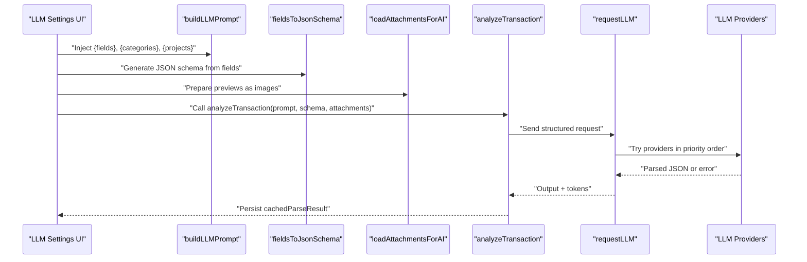
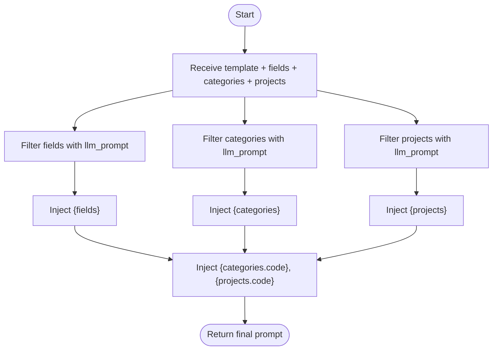
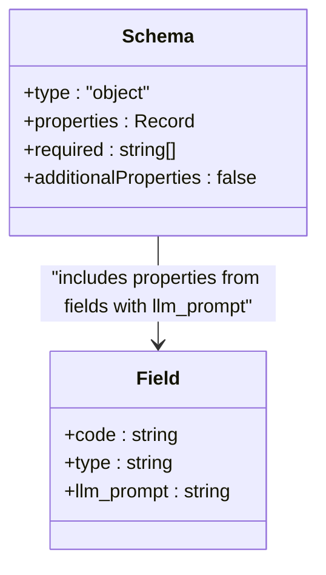
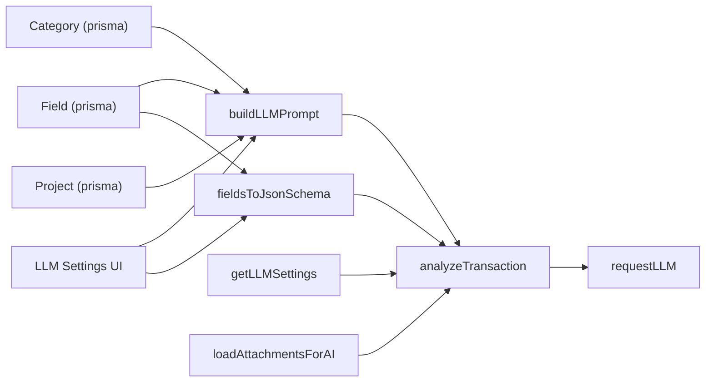

# Prompt Engineering System

<cite>
**Referenced Files in This Document**
- [ai/prompt.ts](file://ai/prompt.ts)
- [ai/schema.ts](file://ai/schema.ts)
- [ai/analyze.ts](file://ai/analyze.ts)
- [ai/providers/llmProvider.ts](file://ai/providers/llmProvider.ts)
- [ai/attachments.ts](file://ai/attachments.ts)
- [components/settings/llm-settings-form.tsx](file://components/settings/llm-settings-form.tsx)
- [models/settings.ts](file://models/settings.ts)
- [models/fields.ts](file://models/fields.ts)
- [prisma/schema.prisma](file://prisma/schema.prisma)
- [lib/llm-providers.ts](file://lib/llm-providers.ts)
- [app/(app)/unsorted/actions.ts](file://app/(app)/unsorted/actions.ts)
- [components/unsorted/analyze-form.tsx](file://components/unsorted/analyze-form.tsx)
- [components/transactions/edit.tsx](file://components/transactions/edit.tsx)
</cite>

## Table of Contents
1. [Introduction](#introduction)
2. [Project Structure](#project-structure)
3. [Core Components](#core-components)
4. [Architecture Overview](#architecture-overview)
5. [Detailed Component Analysis](#detailed-component-analysis)
6. [Dependency Analysis](#dependency-analysis)
7. [Performance Considerations](#performance-considerations)
8. [Troubleshooting Guide](#troubleshooting-guide)
9. [Conclusion](#conclusion)
10. [Appendices](#appendices)

## Introduction
This document explains the AI prompt engineering system that powers schema-driven data extraction for financial documents. It covers how prompts are constructed from templates and dynamic parameters, how the schema enforces data types and extraction rules, and how the system integrates with LLM providers and file attachments. It also provides practical guidance for customizing prompts, optimizing extraction quality, and debugging failures.

## Project Structure
The prompt engineering system spans several modules:
- Prompt construction and template injection
- Schema generation for structured outputs
- LLM request orchestration and fallback
- Attachment loading and image support
- UI for configuring prompts and viewing generated schemas
- Data models for fields, categories, and projects that feed prompts and schemas

```mermaid
graph TB
subgraph "AI Core"
P["ai/prompt.ts<br/>buildLLMPrompt"]
S["ai/schema.ts<br/>fieldsToJsonSchema"]
A["ai/analyze.ts<br/>analyzeTransaction"]
L["ai/providers/llmProvider.ts<br/>requestLLM"]
AT["ai/attachments.ts<br/>loadAttachmentsForAI"]
end
subgraph "Models & Settings"
MS["models/settings.ts<br/>getLLMSettings"]
MF["models/fields.ts<br/>getFields"]
PRISMA["prisma/schema.prisma<br/>Field/Category/Project"]
LP["lib/llm-providers.ts<br/>PROVIDERS"]
end
subgraph "UI"
UI["components/settings/llm-settings-form.tsx<br/>Prompt editor + Schema preview"]
UA["app/(app)/unsorted/actions.ts<br/>analyzeFileAction"]
AF["components/unsorted/analyze-form.tsx<br/>Analysis UI"]
TE["components/transactions/edit.tsx<br/>Items preview"]
end
UI --> P
UI --> S
UA --> P
UA --> S
UA --> AT
UA --> A
A --> L
MS --> L
MF --> P
MF --> S
PRISMA --> MF
LP --> UI
AF --> UA
TE --> UA
```

**Diagram sources**
- [ai/prompt.ts:1-40](file://ai/prompt.ts#L1-L40)
- [ai/schema.ts:1-35](file://ai/schema.ts#L1-L35)
- [ai/analyze.ts:1-58](file://ai/analyze.ts#L1-L58)
- [ai/providers/llmProvider.ts:1-133](file://ai/providers/llmProvider.ts#L1-L133)
- [ai/attachments.ts:1-36](file://ai/attachments.ts#L1-L36)
- [models/settings.ts:1-76](file://models/settings.ts#L1-L76)
- [models/fields.ts:1-47](file://models/fields.ts#L1-L47)
- [prisma/schema.prisma:135-152](file://prisma/schema.prisma#L135-L152)
- [lib/llm-providers.ts:1-80](file://lib/llm-providers.ts#L1-L80)
- [components/settings/llm-settings-form.tsx:1-244](file://components/settings/llm-settings-form.tsx#L1-L244)
- [app/(app)/unsorted/actions.ts:1-35](file://app/(app)/unsorted/actions.ts#L1-L35)
- [components/unsorted/analyze-form.tsx:313-355](file://components/unsorted/analyze-form.tsx#L313-L355)
- [components/transactions/edit.tsx:182-224](file://components/transactions/edit.tsx#L182-L224)

**Section sources**
- [ai/prompt.ts:1-40](file://ai/prompt.ts#L1-L40)
- [ai/schema.ts:1-35](file://ai/schema.ts#L1-L35)
- [ai/analyze.ts:1-58](file://ai/analyze.ts#L1-L58)
- [ai/providers/llmProvider.ts:1-133](file://ai/providers/llmProvider.ts#L1-L133)
- [ai/attachments.ts:1-36](file://ai/attachments.ts#L1-L36)
- [models/settings.ts:1-76](file://models/settings.ts#L1-L76)
- [models/fields.ts:1-47](file://models/fields.ts#L1-L47)
- [prisma/schema.prisma:135-152](file://prisma/schema.prisma#L135-L152)
- [lib/llm-providers.ts:1-80](file://lib/llm-providers.ts#L1-L80)
- [components/settings/llm-settings-form.tsx:1-244](file://components/settings/llm-settings-form.tsx#L1-L244)
- [app/(app)/unsorted/actions.ts:1-35](file://app/(app)/unsorted/actions.ts#L1-L35)
- [components/unsorted/analyze-form.tsx:313-355](file://components/unsorted/analyze-form.tsx#L313-L355)
- [components/transactions/edit.tsx:182-224](file://components/transactions/edit.tsx#L182-L224)

## Core Components
- Prompt builder: Injects field definitions, categories, and projects into a template string to produce a final prompt.
- Schema generator: Builds a JSON schema from enabled fields to guide structured LLM outputs.
- Analyzer: Orchestrates LLM requests with prompt and schema, handles attachments, and persists results.
- LLM provider: Supports multiple providers, structured output, and fallback logic.
- Attachments loader: Converts file previews to base64 images for multimodal analysis.
- Settings and UI: Allows users to configure providers, models, and the prompt template; previews the generated schema.

**Section sources**
- [ai/prompt.ts:3-39](file://ai/prompt.ts#L3-L39)
- [ai/schema.ts:3-34](file://ai/schema.ts#L3-L34)
- [ai/analyze.ts:14-57](file://ai/analyze.ts#L14-L57)
- [ai/providers/llmProvider.ts:32-132](file://ai/providers/llmProvider.ts#L32-L132)
- [ai/attachments.ts:14-35](file://ai/attachments.ts#L14-L35)
- [components/settings/llm-settings-form.tsx:82-126](file://components/settings/llm-settings-form.tsx#L82-L126)

## Architecture Overview
The system follows a pipeline:
- User configures prompt template and provider settings in the UI.
- The backend loads fields, categories, and projects to build the prompt and schema.
- Attachments are prepared for multimodal analysis.
- The analyzer sends the prompt and schema to the LLM provider(s) and stores the parsed result.



**Diagram sources**
- [components/settings/llm-settings-form.tsx:82-126](file://components/settings/llm-settings-form.tsx#L82-L126)
- [ai/prompt.ts:3-39](file://ai/prompt.ts#L3-L39)
- [ai/schema.ts:3-34](file://ai/schema.ts#L3-L34)
- [ai/attachments.ts:14-35](file://ai/attachments.ts#L14-L35)
- [ai/analyze.ts:14-57](file://ai/analyze.ts#L14-L57)
- [ai/providers/llmProvider.ts:106-132](file://ai/providers/llmProvider.ts#L106-L132)

## Detailed Component Analysis

### Prompt Construction and Template System
- Dynamic injection:
  - {fields}: Lists enabled fields with their llm_prompt and code.
  - {categories}, {projects}: Lists enabled items with llm_prompt and code.
  - {categories.code}, {projects.code}: Comma-separated lists of codes.
- Filtering: Only fields/categories/projects with llm_prompt are included.
- Ordering: The prompt preserves the order of injected lists.



**Diagram sources**
- [ai/prompt.ts:3-39](file://ai/prompt.ts#L3-L39)

**Section sources**
- [ai/prompt.ts:3-39](file://ai/prompt.ts#L3-L39)

### Schema-Driven Extraction Patterns
- Schema composition:
  - Top-level object with properties derived from fields that have llm_prompt.
  - An items array property containing line-item objects.
  - Line-item objects mirror the top-level properties and are required.
- Enforced structure:
  - Required keys include all field codes plus "items".
  - Additional properties disallowed at both top-level and items level.
- Purpose: Ensures the LLM returns a normalized structure suitable for downstream processing.



**Diagram sources**
- [ai/schema.ts:3-34](file://ai/schema.ts#L3-L34)
- [prisma/schema.prisma:135-152](file://prisma/schema.prisma#L135-L152)

**Section sources**
- [ai/schema.ts:3-34](file://ai/schema.ts#L3-L34)
- [prisma/schema.prisma:135-152](file://prisma/schema.prisma#L135-L152)

### Relationship Between Field Definitions and Prompt Templates
- Fields define extraction targets:
  - code: JSON key and lookup in the schema.
  - type: JSON schema type for validation.
  - llm_prompt: Natural-language instruction injected into the prompt.
  - Flags: Visibility and requirement influence UI and processing.
- Categories and Projects:
  - Provide contextual constraints and codes for classification tasks.
- Prompt template consumes these definitions via placeholders.

**Section sources**
- [prisma/schema.prisma:135-152](file://prisma/schema.prisma#L135-L152)
- [ai/prompt.ts:11-36](file://ai/prompt.ts#L11-L36)
- [models/fields.ts:10-17](file://models/fields.ts#L10-L17)

### Prompt Customization Options and Dynamic Parameter Injection
- Prompt editor:
  - Users can edit the prompt template for file analysis.
  - The UI displays the current JSON schema derived from fields for transparency.
- Provider configuration:
  - Reorderable providers with per-provider API keys, model names, and base URLs.
  - Priority determines fallback behavior during LLM requests.
- Dynamic parameters:
  - Fields, categories, and projects are dynamically injected into the prompt.
  - Codes are injected as comma-separated lists for quick reference.

**Section sources**
- [components/settings/llm-settings-form.tsx:82-126](file://components/settings/llm-settings-form.tsx#L82-L126)
- [models/settings.ts:11-51](file://models/settings.ts#L11-L51)
- [lib/llm-providers.ts:16-79](file://lib/llm-providers.ts#L16-L79)
- [ai/prompt.ts:11-36](file://ai/prompt.ts#L11-L36)

### Context Building and Multimodal Inputs
- Attachments:
  - Loads file previews and converts them to base64 images.
  - Limits pages to analyze to reduce cost and latency.
  - Attaches images alongside the text prompt for multimodal reasoning.
- Integration:
  - The analyzer composes the final prompt and schema, then attaches images before sending to the LLM.

**Section sources**
- [ai/attachments.ts:14-35](file://ai/attachments.ts#L14-L35)
- [ai/providers/llmProvider.ts:71-81](file://ai/providers/llmProvider.ts#L71-L81)
- [app/(app)/unsorted/actions.ts:27-35](file://app/(app)/unsorted/actions.ts#L27-L35)

### Schema Validation, Data Type Enforcement, and Extraction Rule Configuration
- Validation:
  - Structured output enforced by the LLM provider library.
  - JSON schema ensures required fields and rejects unknown properties.
- Data types:
  - Field.type maps to JSON schema type for each extracted key.
- Extraction rules:
  - Items are expected as an array of line-item objects.
  - Each item must include all field codes as required.

**Section sources**
- [ai/schema.ts:13-31](file://ai/schema.ts#L13-L31)
- [ai/providers/llmProvider.ts:88-91](file://ai/providers/llmProvider.ts#L88-L91)

### Examples of Effective Prompts for Different Document Types
- Generic invoice-like receipts:
  - Focus on extracting buyer/seller info, line items, totals, taxes, and dates.
  - Reference categories and projects for classification.
- Expense reports:
  - Emphasize per-item breakdowns and cost center/project assignment.
- Multi-page statements:
  - Instruct the model to consolidate across pages and normalize repeated headers.

Note: The prompt template is user-configurable and can be tailored per domain. The system injects field definitions and codes to guide extraction consistently.

**Section sources**
- [components/settings/llm-settings-form.tsx:82-87](file://components/settings/llm-settings-form.tsx#L82-L87)
- [ai/prompt.ts:11-36](file://ai/prompt.ts#L11-L36)

### Prompt Optimization Techniques
- Keep llm_prompt concise and specific per field.
- Use {fields}/{categories}/{projects} placeholders to avoid hardcoding.
- Leverage {categories.code} and {projects.code} for controlled vocabularies.
- Prefer deterministic instructions for items extraction to improve repeatability.
- Test with small batches and iterate on schema and prompt.

**Section sources**
- [ai/prompt.ts:11-36](file://ai/prompt.ts#L11-L36)
- [ai/schema.ts:17-27](file://ai/schema.ts#L17-L27)

### Debugging Approaches for Extraction Failures
- Inspect cachedParseResult stored on the file to review raw LLM output.
- Verify provider configuration and model availability.
- Confirm fields have llm_prompt and correct types.
- Reduce pages analyzed to isolate attachment issues.
- Review console logs for provider errors and token usage.

**Section sources**
- [ai/analyze.ts:35-41](file://ai/analyze.ts#L35-L41)
- [ai/providers/llmProvider.ts:106-132](file://ai/providers/llmProvider.ts#L106-L132)
- [ai/attachments.ts:14-35](file://ai/attachments.ts#L14-L35)

### Guidelines for Creating Custom Prompts and Extending the Schema System
- Define fields with meaningful codes and types; add llm_prompt to drive extraction.
- Use categories and projects to constrain classifications and enrich prompts.
- Keep the prompt modular; inject dynamic content via placeholders.
- Iterate on schema to tighten validation and reduce ambiguity.
- Add new providers by updating provider metadata and settings mapping.

**Section sources**
- [prisma/schema.prisma:135-152](file://prisma/schema.prisma#L135-L152)
- [models/fields.ts:10-17](file://models/fields.ts#L10-L17)
- [lib/llm-providers.ts:16-79](file://lib/llm-providers.ts#L16-L79)
- [models/settings.ts:11-51](file://models/settings.ts#L11-L51)

## Dependency Analysis
- Prompt depends on:
  - Field definitions for instructions and codes.
  - Category and Project definitions for contextual constraints.
- Schema depends on:
  - Field definitions for properties and types.
- Analyzer depends on:
  - Settings for provider configuration.
  - LLM provider for structured output.
  - Attachments for multimodal inputs.
- UI depends on:
  - Settings and fields to render editors and schema previews.



**Diagram sources**
- [prisma/schema.prisma:135-152](file://prisma/schema.prisma#L135-L152)
- [ai/prompt.ts:3-39](file://ai/prompt.ts#L3-L39)
- [ai/schema.ts:3-34](file://ai/schema.ts#L3-L34)
- [ai/analyze.ts:14-57](file://ai/analyze.ts#L14-L57)
- [models/settings.ts:11-51](file://models/settings.ts#L11-L51)
- [ai/providers/llmProvider.ts:106-132](file://ai/providers/llmProvider.ts#L106-L132)
- [ai/attachments.ts:14-35](file://ai/attachments.ts#L14-L35)
- [components/settings/llm-settings-form.tsx:82-126](file://components/settings/llm-settings-form.tsx#L82-L126)

**Section sources**
- [prisma/schema.prisma:135-152](file://prisma/schema.prisma#L135-L152)
- [ai/prompt.ts:3-39](file://ai/prompt.ts#L3-L39)
- [ai/schema.ts:3-34](file://ai/schema.ts#L3-L34)
- [ai/analyze.ts:14-57](file://ai/analyze.ts#L14-L57)
- [models/settings.ts:11-51](file://models/settings.ts#L11-L51)
- [ai/providers/llmProvider.ts:106-132](file://ai/providers/llmProvider.ts#L106-L132)
- [ai/attachments.ts:14-35](file://ai/attachments.ts#L14-L35)
- [components/settings/llm-settings-form.tsx:82-126](file://components/settings/llm-settings-form.tsx#L82-L126)

## Performance Considerations
- Limit pages analyzed to reduce token usage and latency.
- Keep llm_prompt concise to minimize prompt length.
- Prefer structured output to reduce retries and parsing overhead.
- Monitor tokensUsed in analyzer responses to track costs.

[No sources needed since this section provides general guidance]

## Troubleshooting Guide
- No model configured for a provider:
  - The analyzer skips providers without a model and logs a message.
- Missing API key or base URL for compatible providers:
  - The analyzer skips providers that are not fully configured.
- All providers fail:
  - The analyzer returns an error indicating all providers failed or are not configured.
- Large or noisy attachments:
  - Reduce pages or adjust preprocessing to improve reliability.

**Section sources**
- [ai/providers/llmProvider.ts:106-132](file://ai/providers/llmProvider.ts#L106-L132)
- [ai/attachments.ts:6-7](file://ai/attachments.ts#L6-L7)

## Conclusion
The system combines a flexible prompt template engine with a strict JSON schema to achieve reliable, schema-driven extraction. By configuring fields, categories, projects, and providers, users can tailor prompts for diverse document types while ensuring consistent, validated outputs. The UI exposes both the prompt and the generated schema, enabling iterative tuning and debugging.

[No sources needed since this section summarizes without analyzing specific files]

## Appendices

### Appendix A: How the Pipeline Is Triggered
- Unsorted file analysis action:
  - Loads settings and fields.
  - Builds prompt and schema.
  - Prepares attachments.
  - Calls analyzer to request LLM and persist results.

**Section sources**
- [app/(app)/unsorted/actions.ts:27-35](file://app/(app)/unsorted/actions.ts#L27-L35)
- [ai/analyze.ts:14-57](file://ai/analyze.ts#L14-L57)

### Appendix B: Viewing Detected Items
- After analysis, detected items appear in a tool window for inspection and correction.

**Section sources**
- [components/transactions/edit.tsx:219-224](file://components/transactions/edit.tsx#L219-L224)