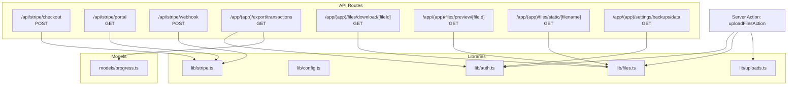
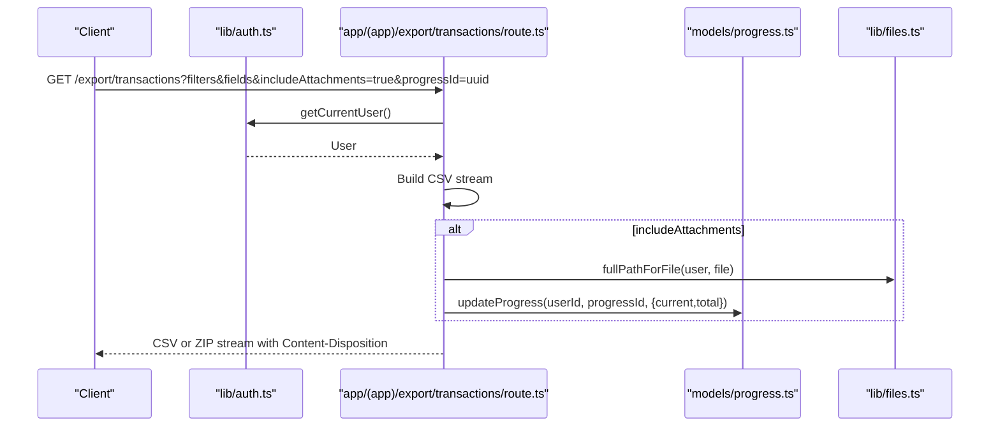
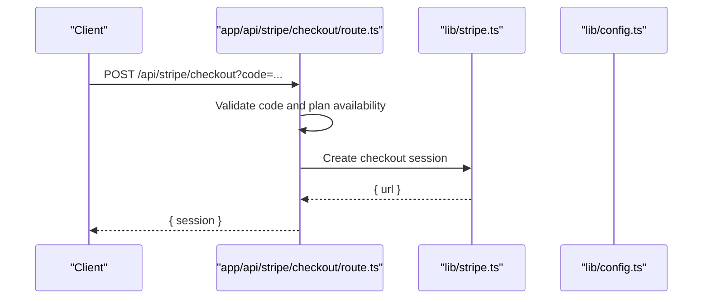
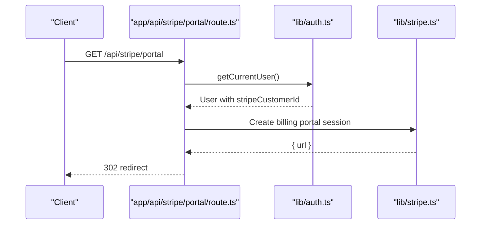
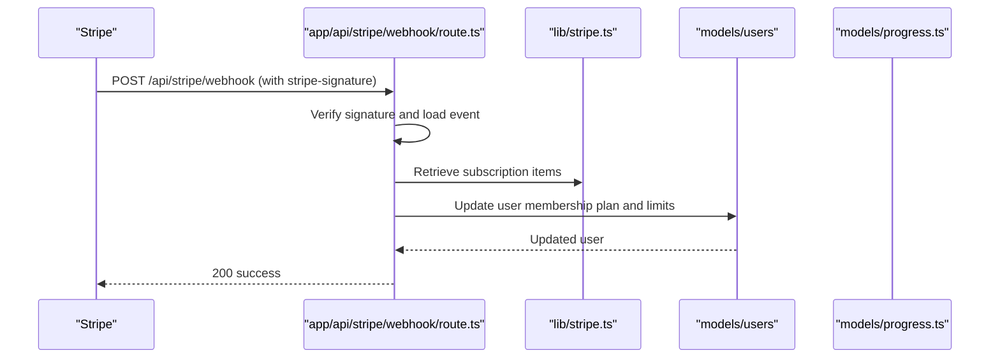
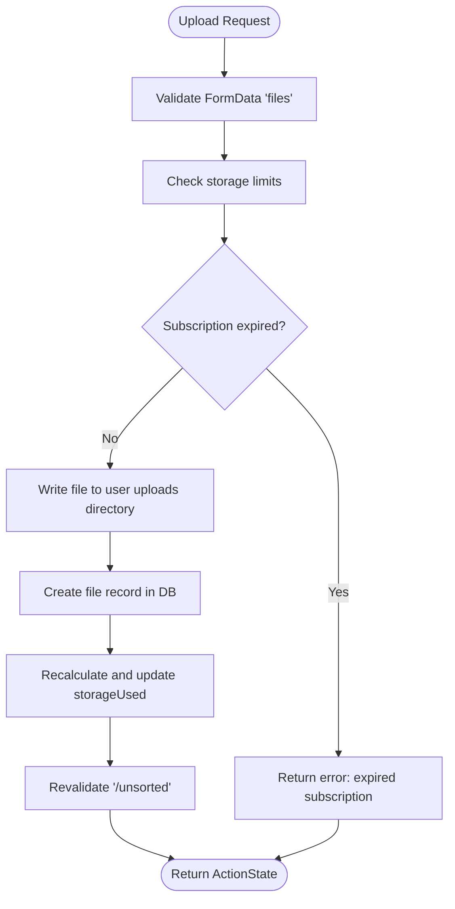
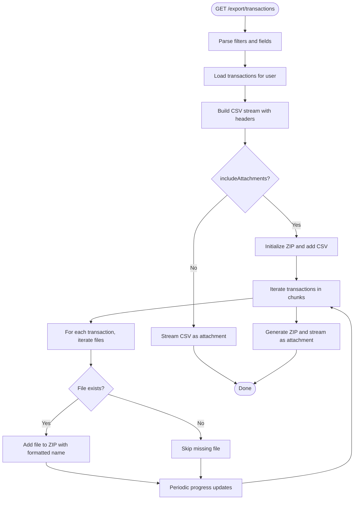
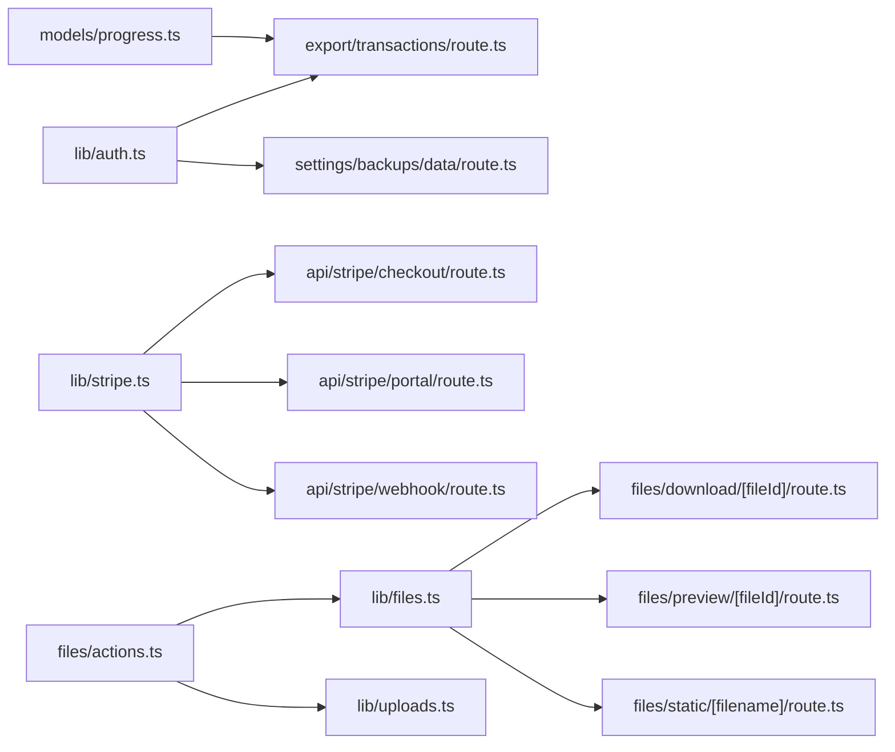

# API Reference

<cite>
**Referenced Files in This Document**
- [route.ts](file://app/api/stripe/checkout/route.ts)
- [route.ts](file://app/api/stripe/portal/route.ts)
- [route.ts](file://app/api/stripe/webhook/route.ts)
- [route.ts](file://app/(app)/export/transactions/route.ts)
- [route.ts](file://app/(app)/files/download/[fileId]/route.ts)
- [route.ts](file://app/(app)/files/preview/[fileId]/route.ts)
- [route.ts](file://app/(app)/files/static/[filename]/route.ts)
- [route.ts](file://app/(app)/settings/backups/data/route.ts)
- [actions.ts](file://app/(app)/files/actions.ts)
- [auth.ts](file://lib/auth.ts)
- [config.ts](file://lib/config.ts)
- [files.ts](file://lib/files.ts)
- [stripe.ts](file://lib/stripe.ts)
- [progress.ts](file://models/progress.ts)
- [uploads.ts](file://lib/uploads.ts)
</cite>

## Table of Contents
1. [Introduction](#introduction)
2. [Project Structure](#project-structure)
3. [Core Components](#core-components)
4. [Architecture Overview](#architecture-overview)
5. [Detailed Component Analysis](#detailed-component-analysis)
6. [Dependency Analysis](#dependency-analysis)
7. [Performance Considerations](#performance-considerations)
8. [Troubleshooting Guide](#troubleshooting-guide)
9. [Conclusion](#conclusion)
10. [Appendices](#appendices)

## Introduction
This document provides a comprehensive API reference for TaxHacker’s REST API surface implemented with Next.js 13+ App Router. It covers:
- Authentication endpoints under /api/auth/...
- Payment processing endpoints under /api/stripe/
- File upload and processing endpoints
- Data export endpoints
- Progress tracking endpoints
- Server Actions pattern for Next.js data operations
- API versioning strategy, rate limiting, error response formats
- Authentication headers, session management, and security considerations
- Client implementation examples, SDK usage patterns, and integration guidelines
- API testing strategies and debugging approaches

## Project Structure
The API is organized under the Next.js App Router conventions:
- app/api/stripe: Payment lifecycle endpoints (checkout, portal, webhook)
- app/(app)/export/transactions: Export transactions to CSV or ZIP with optional attachments
- app/(app)/files: File-related endpoints (download, preview, static)
- app/(app)/settings/backups/data: Backup data export endpoint
- app/(app)/files/actions.ts: Server Action for uploading files via FormData
- lib/auth.ts: Session retrieval and user identity helpers
- lib/config.ts: Environment-driven configuration including base URLs and Stripe settings
- lib/files.ts: File path utilities and safety checks
- lib/stripe.ts: Stripe client initialization and plan definitions
- models/progress.ts: Progress tracking model for long-running tasks
- lib/uploads.ts: Static image upload utilities

**Diagram sources**
- [route.ts:1-51](file://app/api/stripe/checkout/route.ts#L1-L51)
- [route.ts:1-31](file://app/api/stripe/portal/route.ts#L1-L31)
- [route.ts:1-112](file://app/api/stripe/webhook/route.ts#L1-L112)
- [route.ts](file://app/(app)/export/transactions/route.ts#L1-L189)
- [route.ts](file://app/(app)/files/download/[fileId]/route.ts)
- [route.ts](file://app/(app)/files/preview/[fileId]/route.ts)
- [route.ts](file://app/(app)/files/static/[filename]/route.ts)
- [route.ts](file://app/(app)/settings/backups/data/route.ts)
- [actions.ts](file://app/(app)/files/actions.ts#L1-L82)
- [auth.ts:1-114](file://lib/auth.ts#L1-L114)
- [config.ts:1-82](file://lib/config.ts#L1-L82)
- [files.ts:1-94](file://lib/files.ts#L1-L94)
- [stripe.ts:1-58](file://lib/stripe.ts#L1-L58)
- [progress.ts:1-63](file://models/progress.ts#L1-L63)
- [uploads.ts:1-61](file://lib/uploads.ts#L1-L61)

**Section sources**
- [route.ts:1-51](file://app/api/stripe/checkout/route.ts#L1-L51)
- [route.ts:1-31](file://app/api/stripe/portal/route.ts#L1-L31)
- [route.ts:1-112](file://app/api/stripe/webhook/route.ts#L1-L112)
- [route.ts](file://app/(app)/export/transactions/route.ts#L1-L189)
- [route.ts](file://app/(app)/files/download/[fileId]/route.ts)
- [route.ts](file://app/(app)/files/preview/[fileId]/route.ts)
- [route.ts](file://app/(app)/files/static/[filename]/route.ts)
- [route.ts](file://app/(app)/settings/backups/data/route.ts)
- [actions.ts](file://app/(app)/files/actions.ts#L1-L82)
- [auth.ts:1-114](file://lib/auth.ts#L1-L114)
- [config.ts:1-82](file://lib/config.ts#L1-L82)
- [files.ts:1-94](file://lib/files.ts#L1-L94)
- [stripe.ts:1-58](file://lib/stripe.ts#L1-L58)
- [progress.ts:1-63](file://models/progress.ts#L1-L63)
- [uploads.ts:1-61](file://lib/uploads.ts#L1-L61)

## Core Components
- Authentication: JWT-based sessions via better-auth, with cookie caching and email OTP plugin. Self-hosted mode supported.
- Payments: Stripe integration for checkout sessions, customer portal, and webhooks.
- File Management: Uploads via Server Actions, static image processing, and file path utilities with anti-path-traversal checks.
- Data Export: CSV export of transactions and optional ZIP packaging with attachments and progress tracking.
- Progress Tracking: Upsert, update, and incremental progress records for long-running operations.

**Section sources**
- [auth.ts:25-65](file://lib/auth.ts#L25-L65)
- [config.ts:63-78](file://lib/config.ts#L63-L78)
- [stripe.ts:4-8](file://lib/stripe.ts#L4-L8)
- [progress.ts:3-49](file://models/progress.ts#L3-L49)
- [files.ts:53-59](file://lib/files.ts#L53-L59)
- [uploads.ts:8-60](file://lib/uploads.ts#L8-L60)
- [actions.ts](file://app/(app)/files/actions.ts#L19-L81)

## Architecture Overview
The API follows Next.js App Router conventions with route handlers and Server Actions. Authentication is enforced per-route via session retrieval. Payment flows integrate with Stripe SDK and webhooks. File operations leverage local filesystem with strict path safety. Export endpoints stream CSV and optionally ZIP attachments while updating progress.

**Diagram sources**
- [route.ts](file://app/(app)/export/transactions/route.ts#L20-L188)
- [auth.ts:78-99](file://lib/auth.ts#L78-L99)
- [progress.ts:31-49](file://models/progress.ts#L31-L49)
- [files.ts:39-42](file://lib/files.ts#L39-L42)

## Detailed Component Analysis

### Authentication Endpoints
- Route: /api/auth/[...all]
- Pattern: Catch-all route handler for better-auth
- Authentication: Uses JWT session strategy with cookie caching; supports email OTP
- Self-hosted mode: Redirects to configured self-hosted URLs when enabled
- Headers: Authorization via cookies; session retrieved from headers
- Security: Cookie prefix configured; session expiry and update age set; path traversal protection in file utilities

Implementation references:
- [auth.ts:25-65](file://lib/auth.ts#L25-L65)
- [auth.ts:67-99](file://lib/auth.ts#L67-L99)
- [config.ts:63-67](file://lib/config.ts#L63-L67)

**Section sources**
- [auth.ts:25-65](file://lib/auth.ts#L25-L65)
- [auth.ts:67-99](file://lib/auth.ts#L67-L99)
- [config.ts:63-67](file://lib/config.ts#L63-L67)

### Payment Processing Endpoints
- Route: /api/stripe/checkout
  - Method: POST
  - Query: code (plan code)
  - Body: none
  - Response: { session: { url: string } }
  - Errors: 400 for missing code or invalid/inactive plan; 500 if Stripe disabled or session creation fails
- Route: /api/stripe/portal
  - Method: GET
  - Response: 302 redirect to Stripe Billing Portal session URL
  - Errors: 401 if unauthorized; 400 if user lacks Stripe customer ID; 500 if client not initialized
- Route: /api/stripe/webhook
  - Method: POST
  - Headers: stripe-signature required; webhookSecret required
  - Events handled: checkout.session.completed, customer.subscription.created, customer.subscription.updated, customer.subscription.deleted
  - Behavior: Updates user plan, limits, and expiration based on Stripe subscription items

Stripe client and plans:
- [stripe.ts:4-8](file://lib/stripe.ts#L4-L8)
- [stripe.ts:24-57](file://lib/stripe.ts#L24-L57)

Checkout flow sequence:

Portal flow sequence:

Webhook flow sequence:

**Diagram sources**
- [route.ts:5-50](file://app/api/stripe/checkout/route.ts#L5-L50)
- [route.ts:5-30](file://app/api/stripe/portal/route.ts#L5-L30)
- [route.ts:8-68](file://app/api/stripe/webhook/route.ts#L8-L68)
- [stripe.ts:4-8](file://lib/stripe.ts#L4-L8)
- [config.ts:68-73](file://lib/config.ts#L68-L73)

**Section sources**
- [route.ts:1-51](file://app/api/stripe/checkout/route.ts#L1-L51)
- [route.ts:1-31](file://app/api/stripe/portal/route.ts#L1-L31)
- [route.ts:1-112](file://app/api/stripe/webhook/route.ts#L1-L112)
- [stripe.ts:1-58](file://lib/stripe.ts#L1-L58)
- [config.ts:68-73](file://lib/config.ts#L68-L73)

### File Upload and Processing Endpoints
- Server Action: uploadFilesAction(formData)
  - Purpose: Accept multipart/form-data with key "files"; validates storage and subscription; writes files to user-specific directory; records metadata; updates storage usage; revalidates cache
  - Limits: Enforced via isEnoughStorageToUploadFile and subscription expiration check
  - Output: ActionState indicating success/error
  - References: [actions.ts](file://app/(app)/files/actions.ts#L19-L81), [files.ts:88-93](file://lib/files.ts#L88-L93), [auth.ts:78-99](file://lib/auth.ts#L78-L99)

- Static Image Upload Utility
  - Function: uploadStaticImage(user, file, saveFileName, maxWidth?, maxHeight?, quality?)
  - Features: Validates storage, ensures directory exists, resizes and converts images, writes to static directory
  - References: [uploads.ts:8-60](file://lib/uploads.ts#L8-L60)

- File Download Endpoint
  - Route: /files/download/[fileId]
  - Method: GET
  - Behavior: Streams file content to client; uses file path utilities for safety
  - References: [route.ts](file://app/(app)/files/download/[fileId]/route.ts), [files.ts:39-42](file://lib/files.ts#L39-L42)

- File Preview Endpoint
  - Route: /files/preview/[fileId]
  - Method: GET
  - Behavior: Returns preview image for a given file; uses preview path utilities
  - References: [route.ts](file://app/(app)/files/preview/[fileId]/route.ts), [files.ts:29-31](file://lib/files.ts#L29-L31)

- Static File Endpoint
  - Route: /files/static/[filename]
  - Method: GET
  - Behavior: Serves static files from user-specific static directory; enforces safe path joining
  - References: [route.ts](file://app/(app)/files/static/[filename]/route.ts), [files.ts:16-18](file://lib/files.ts#L16-L18), [files.ts:53-59](file://lib/files.ts#L53-L59)

- File Upload Flow

**Diagram sources**
- [actions.ts](file://app/(app)/files/actions.ts#L19-L81)
- [files.ts:88-93](file://lib/files.ts#L88-L93)
- [files.ts:39-42](file://lib/files.ts#L39-L42)
- [files.ts:16-18](file://lib/files.ts#L16-L18)
- [files.ts:53-59](file://lib/files.ts#L53-L59)

**Section sources**
- [actions.ts](file://app/(app)/files/actions.ts#L1-L82)
- [uploads.ts:1-61](file://lib/uploads.ts#L1-L61)
- [files.ts:1-94](file://lib/files.ts#L1-L94)

### Data Export Endpoints
- Route: /export/transactions
  - Method: GET
  - Query Parameters:
    - filters: arbitrary filters passed to backend
    - fields: comma-separated export fields
    - includeAttachments: "true" to include attachments in ZIP
    - progressId: optional UUID to track progress
  - Behavior:
    - Builds CSV stream from transactions filtered by user and query params
    - Optionally packages CSV + attachments into a ZIP
    - Updates progress periodically during attachment processing
  - Responses:
    - CSV: text/csv with Content-Disposition attachment
    - ZIP: application/zip with Content-Disposition attachment
  - Errors: 500 on internal errors
  - References: [route.ts](file://app/(app)/export/transactions/route.ts#L20-L188), [progress.ts:31-49](file://models/progress.ts#L31-L49)

Export flow:

**Diagram sources**
- [route.ts](file://app/(app)/export/transactions/route.ts#L20-L188)
- [progress.ts:31-49](file://models/progress.ts#L31-L49)

**Section sources**
- [route.ts](file://app/(app)/export/transactions/route.ts#L1-L189)
- [progress.ts:1-63](file://models/progress.ts#L1-L63)

### Progress Tracking Endpoints
- Model: Progress tracking via Prisma
  - getOrCreateProgress(userId, id, type?, data?, total?)
  - getProgressById(userId, id)
  - updateProgress(userId, id, { current?, total?, data? })
  - incrementProgress(userId, id, amount?)
  - getAllProgressByUser(userId)
  - deleteProgress(userId, id)
- Usage: Export endpoint updates progress during ZIP creation; clients poll or subscribe to progress updates
- References: [progress.ts:3-62](file://models/progress.ts#L3-L62)

**Section sources**
- [progress.ts:1-63](file://models/progress.ts#L1-L63)

### Backup Data Export Endpoint
- Route: /settings/backups/data
  - Method: GET
  - Authentication: Requires current user session
  - Behavior: Exports backup data for the authenticated user
  - References: [route.ts](file://app/(app)/settings/backups/data/route.ts), [auth.ts:78-99](file://lib/auth.ts#L78-L99)

**Section sources**
- [route.ts](file://app/(app)/settings/backups/data/route.ts)
- [auth.ts:78-99](file://lib/auth.ts#L78-L99)

## Dependency Analysis
- Authentication depends on better-auth configuration and Prisma adapter
- Stripe endpoints depend on Stripe client initialization and plan definitions
- Export endpoint depends on transaction and field models, CSV formatter, and progress model
- File endpoints depend on file path utilities and filesystem access
- Server Actions depend on authentication and file utilities

**Diagram sources**
- [auth.ts:25-65](file://lib/auth.ts#L25-L65)
- [stripe.ts:4-8](file://lib/stripe.ts#L4-L8)
- [route.ts](file://app/(app)/export/transactions/route.ts#L1-L189)
- [route.ts](file://app/(app)/settings/backups/data/route.ts)
- [route.ts](file://app/(app)/files/download/[fileId]/route.ts)
- [route.ts](file://app/(app)/files/preview/[fileId]/route.ts)
- [route.ts](file://app/(app)/files/static/[filename]/route.ts)
- [actions.ts](file://app/(app)/files/actions.ts#L1-L82)
- [uploads.ts:1-61](file://lib/uploads.ts#L1-L61)
- [files.ts:1-94](file://lib/files.ts#L1-L94)
- [progress.ts:1-63](file://models/progress.ts#L1-L63)

**Section sources**
- [auth.ts:1-114](file://lib/auth.ts#L1-L114)
- [stripe.ts:1-58](file://lib/stripe.ts#L1-L58)
- [route.ts](file://app/(app)/export/transactions/route.ts#L1-L189)
- [route.ts](file://app/(app)/files/download/[fileId]/route.ts)
- [route.ts](file://app/(app)/files/preview/[fileId]/route.ts)
- [route.ts](file://app/(app)/files/static/[filename]/route.ts)
- [actions.ts](file://app/(app)/files/actions.ts#L1-L82)
- [uploads.ts:1-61](file://lib/uploads.ts#L1-L61)
- [files.ts:1-94](file://lib/files.ts#L1-L94)
- [progress.ts:1-63](file://models/progress.ts#L1-L63)

## Performance Considerations
- Streaming: Export endpoints stream CSV and ZIP to reduce memory usage
- Chunking: Transactions and file processing are chunked to manage memory and progress updates
- Compression: ZIP generation uses DEFLATE with level 6
- Path Safety: All file paths are validated to prevent traversal attacks
- Storage Limits: Pre-validate upload sizes against user limits

[No sources needed since this section provides general guidance]

## Troubleshooting Guide
- Authentication failures:
  - Ensure cookies are present and session is valid
  - Verify self-hosted mode configuration and redirects
  - References: [auth.ts:67-99](file://lib/auth.ts#L67-L99), [config.ts:50-54](file://lib/config.ts#L50-L54)
- Stripe errors:
  - Confirm secret keys and webhook secrets are set
  - Verify webhook signature header and event type handling
  - References: [config.ts:68-73](file://lib/config.ts#L68-L73), [route.ts:8-27](file://app/api/stripe/webhook/route.ts#L8-L27)
- File operations:
  - Check path traversal prevention and directory permissions
  - Validate MIME types and file extensions
  - References: [files.ts:53-59](file://lib/files.ts#L53-L59), [config.ts:35-49](file://lib/config.ts#L35-L49)
- Export issues:
  - Confirm filters and fields match user-defined fields
  - Monitor progress updates and logs for long-running exports
  - References: [route.ts](file://app/(app)/export/transactions/route.ts#L20-L188), [progress.ts:31-49](file://models/progress.ts#L31-L49)

**Section sources**
- [auth.ts:67-99](file://lib/auth.ts#L67-L99)
- [config.ts:50-54](file://lib/config.ts#L50-L54)
- [config.ts:68-73](file://lib/config.ts#L68-L73)
- [route.ts:8-27](file://app/api/stripe/webhook/route.ts#L8-L27)
- [files.ts:53-59](file://lib/files.ts#L53-L59)
- [config.ts:35-49](file://lib/config.ts#L35-L49)
- [route.ts](file://app/(app)/export/transactions/route.ts#L20-L188)
- [progress.ts:31-49](file://models/progress.ts#L31-L49)

## Conclusion
TaxHacker’s API leverages Next.js App Router and Server Actions to deliver secure, scalable functionality for authentication, payments, file management, and data export. The design emphasizes streaming, chunking, and progress tracking for long-running operations, while robust session management and path safety ensure reliability and security.

[No sources needed since this section summarizes without analyzing specific files]

## Appendices

### API Versioning Strategy
- Stripe API version is explicitly set in the Stripe client initialization
- References: [stripe.ts](file://lib/stripe.ts#L6)

**Section sources**
- [stripe.ts](file://lib/stripe.ts#L6)

### Rate Limiting
- Not implemented in the analyzed code
- Recommendation: Integrate a rate limiter at the route level or via middleware

[No sources needed since this section provides general guidance]

### Error Response Formats
- Consistent JSON bodies with an error field for API endpoints
- Examples:
  - Missing plan code: { error: "Missing plan code" } (400)
  - Stripe disabled: { error: "Stripe is not enabled" } (500)
  - Signature verification failed: { error: "Webhook signature verification failed" } (400)
- References: [route.ts:9-11](file://app/api/stripe/checkout/route.ts#L9-L11), [route.ts:13-15](file://app/api/stripe/checkout/route.ts#L13-L15), [route.ts:24-27](file://app/api/stripe/webhook/route.ts#L24-L27)

**Section sources**
- [route.ts:9-15](file://app/api/stripe/checkout/route.ts#L9-L15)
- [route.ts:24-27](file://app/api/stripe/webhook/route.ts#L24-L27)

### Authentication Headers and Session Management
- Session strategy: JWT with cookie caching
- Cookie prefix: taxhacker
- Session expiry and update age configured
- Self-hosted mode redirect behavior
- References: [auth.ts:35-43](file://lib/auth.ts#L35-L43), [auth.ts:44-49](file://lib/auth.ts#L44-L49), [auth.ts:67-99](file://lib/auth.ts#L67-L99), [config.ts:50-54](file://lib/config.ts#L50-L54)

**Section sources**
- [auth.ts:35-43](file://lib/auth.ts#L35-L43)
- [auth.ts:44-49](file://lib/auth.ts#L44-L49)
- [auth.ts:67-99](file://lib/auth.ts#L67-L99)
- [config.ts:50-54](file://lib/config.ts#L50-L54)

### Client Implementation Examples and SDK Usage Patterns
- Payment:
  - Use checkout endpoint to create a Stripe checkout session; redirect client to returned URL
  - Use portal endpoint to obtain a billing portal session URL
  - Configure webhook endpoint with proper signature verification
  - References: [route.ts:5-50](file://app/api/stripe/checkout/route.ts#L5-L50), [route.ts:5-30](file://app/api/stripe/portal/route.ts#L5-L30), [route.ts:8-68](file://app/api/stripe/webhook/route.ts#L8-L68)
- File Upload:
  - Submit multipart/form-data with key "files"
  - Handle ActionState success/error and revalidation
  - References: [actions.ts](file://app/(app)/files/actions.ts#L19-L81)
- Export:
  - Call export endpoint with desired filters, fields, and includeAttachments flag
  - Optionally pass progressId to track progress
  - References: [route.ts](file://app/(app)/export/transactions/route.ts#L20-L188)

**Section sources**
- [route.ts:5-50](file://app/api/stripe/checkout/route.ts#L5-L50)
- [route.ts:5-30](file://app/api/stripe/portal/route.ts#L5-L30)
- [route.ts:8-68](file://app/api/stripe/webhook/route.ts#L8-L68)
- [actions.ts](file://app/(app)/files/actions.ts#L19-L81)
- [route.ts](file://app/(app)/export/transactions/route.ts#L20-L188)

### API Testing Strategies and Debugging Approaches
- Authentication:
  - Verify cookie presence and session validity
  - Test self-hosted redirect behavior
- Payments:
  - Mock Stripe events and test webhook signature verification
  - Validate plan code and availability
- Files:
  - Test path traversal prevention and directory permissions
  - Validate MIME types and file sizes
- Export:
  - Stress-test with large datasets and monitor memory usage
  - Verify progress updates and completion signals

[No sources needed since this section provides general guidance]