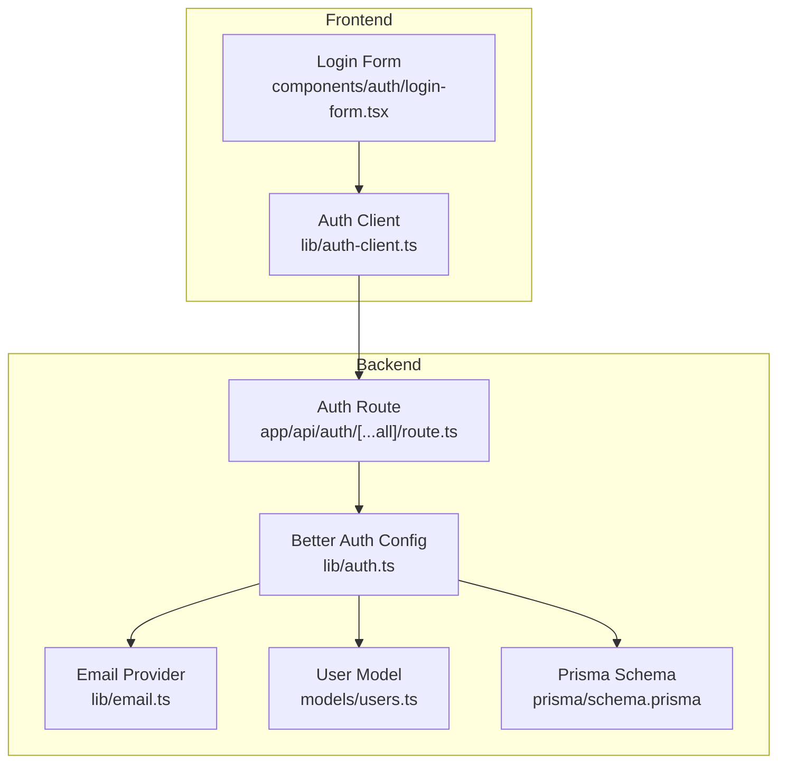
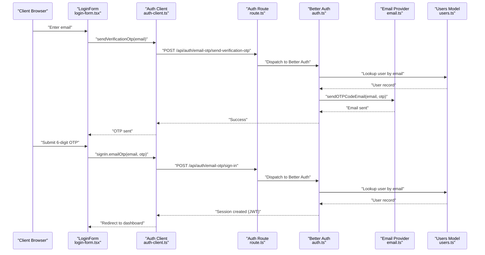
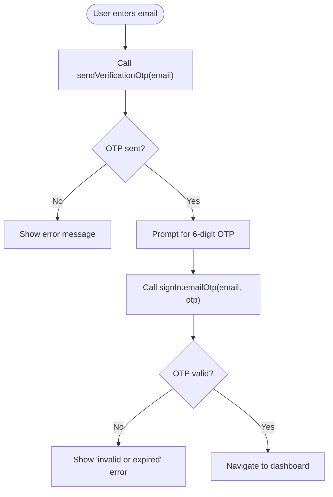
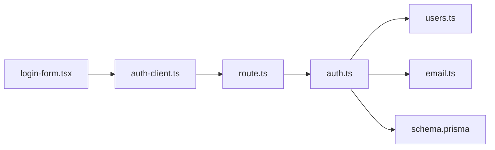

# Authentication API

<cite>
**Referenced Files in This Document**
- [route.ts](file://app/api/auth/[...all]/route.ts)
- [auth.ts](file://lib/auth.ts)
- [auth-client.ts](file://lib/auth-client.ts)
- [login-form.tsx](file://components/auth/login-form.tsx)
- [page.tsx](file://app/(auth)/enter/page.tsx)
- [config.ts](file://lib/config.ts)
- [users.ts](file://models/users.ts)
- [email.ts](file://lib/email.ts)
- [schema.prisma](file://prisma/schema.prisma)
</cite>

## Table of Contents
1. [Introduction](#introduction)
2. [Project Structure](#project-structure)
3. [Core Components](#core-components)
4. [Architecture Overview](#architecture-overview)
5. [Detailed Component Analysis](#detailed-component-analysis)
6. [Dependency Analysis](#dependency-analysis)
7. [Performance Considerations](#performance-considerations)
8. [Troubleshooting Guide](#troubleshooting-guide)
9. [Conclusion](#conclusion)
10. [Appendices](#appendices)

## Introduction
This document provides comprehensive API documentation for TaxHacker’s authentication system built with Better Auth. It covers the authentication flow using email OTP verification, session management via JWT, and integration with the frontend client. It also documents the main authentication endpoint, request/response characteristics, session token handling, JWT lifecycle, error handling, security considerations, and client implementation guidance.

## Project Structure
The authentication system spans backend Next.js routes, Better Auth configuration, client-side auth helpers, and UI components. The primary backend entry point is a catch-all API route that delegates to Better Auth’s Next.js adapter. Frontend components use a Better Auth client configured for email OTP.

**Diagram sources**
- [route.ts:1-5](file://app/api/auth/[...all]/route.ts#L1-L5)
- [auth.ts:25-65](file://lib/auth.ts#L25-L65)
- [auth-client.ts:1-7](file://lib/auth-client.ts#L1-L7)
- [login-form.tsx:1-94](file://components/auth/login-form.tsx#L1-L94)
- [email.ts:1-30](file://lib/email.ts#L1-L30)
- [users.ts:1-69](file://models/users.ts#L1-L69)
- [schema.prisma:34-69](file://prisma/schema.prisma#L34-L69)

**Section sources**
- [route.ts:1-5](file://app/api/auth/[...all]/route.ts#L1-L5)
- [auth.ts:25-65](file://lib/auth.ts#L25-L65)
- [auth-client.ts:1-7](file://lib/auth-client.ts#L1-L7)
- [login-form.tsx:1-94](file://components/auth/login-form.tsx#L1-L94)
- [email.ts:1-30](file://lib/email.ts#L1-L30)
- [users.ts:1-69](file://models/users.ts#L1-L69)
- [schema.prisma:34-69](file://prisma/schema.prisma#L34-L69)

## Core Components
- Backend handler: A Next.js catch-all API route that wraps Better Auth’s Next.js adapter, exposing GET and POST handlers for the Better Auth API.
- Better Auth configuration: Defines database adapter, session strategy (JWT), email provider, cookie prefix, and the email OTP plugin with custom OTP delivery.
- Client-side auth client: A Better Auth client configured with the email OTP plugin for frontend flows.
- Login UI: A client component that orchestrates sending OTP and verifying OTP with the Better Auth client.
- Email provider: Uses Resend to send OTP emails.
- User model: Provides user lookup and self-hosted user handling.
- Database schema: Defines user and session entities used by Better Auth.

**Section sources**
- [route.ts:1-5](file://app/api/auth/[...all]/route.ts#L1-L5)
- [auth.ts:25-65](file://lib/auth.ts#L25-L65)
- [auth-client.ts:1-7](file://lib/auth-client.ts#L1-L7)
- [login-form.tsx:1-94](file://components/auth/login-form.tsx#L1-L94)
- [email.ts:1-30](file://lib/email.ts#L1-L30)
- [users.ts:1-69](file://models/users.ts#L1-L69)
- [schema.prisma:34-69](file://prisma/schema.prisma#L34-L69)

## Architecture Overview
The authentication flow leverages Better Auth’s email OTP plugin. The frontend sends an OTP request, Better Auth verifies the user exists, and the system sends an email via Resend. On successful verification, Better Auth creates or refreshes a JWT session stored in cookies.

**Diagram sources**
- [login-form.tsx:18-61](file://components/auth/login-form.tsx#L18-L61)
- [auth-client.ts:1-7](file://lib/auth-client.ts#L1-L7)
- [route.ts:1-5](file://app/api/auth/[...all]/route.ts#L1-L5)
- [auth.ts:50-65](file://lib/auth.ts#L50-L65)
- [email.ts:9-18](file://lib/email.ts#L9-L18)
- [users.ts:51-55](file://models/users.ts#L51-L55)

## Detailed Component Analysis

### Main Authentication Endpoint
- Path: /api/auth/[...all]
- Methods:
  - POST: Handles Better Auth operations (e.g., email OTP sign-in).
  - GET: Handles Better Auth operations (e.g., session retrieval).
- Request/Response:
  - Requests are JSON payloads conforming to Better Auth’s API expectations.
  - Responses include cookies for session management and JSON bodies for errors or success.
- Authentication requirements:
  - Not applicable for OTP send and sign-in endpoints; session is established after successful OTP verification.
  - Subsequent protected requests require a valid session cookie.

Implementation note: The route file delegates to Better Auth’s Next.js adapter, which exposes GET and POST handlers for the Better Auth API.

**Section sources**
- [route.ts:1-5](file://app/api/auth/[...all]/route.ts#L1-L5)

### Better Auth Configuration
- Database adapter: Prisma adapter for PostgreSQL.
- Session strategy: JWT with long-lived tokens and periodic updates.
- Cookie settings: Cookie prefix “taxhacker” with extended max age.
- Plugins:
  - Email OTP plugin with:
    - Fixed 6-digit OTP length.
    - 10-minute expiry.
    - Custom OTP delivery that validates user existence and sends email via Resend.
  - nextCookies plugin registered last.
- Self-hosted mode:
  - Redirects to a dedicated path when self-hosted mode is enabled.
  - Session retrieval and current user resolution adapt to self-hosted behavior.

**Section sources**
- [auth.ts:25-65](file://lib/auth.ts#L25-L65)
- [config.ts:50-54](file://lib/config.ts#L50-L54)

### Email OTP Plugin Behavior
- OTP generation and delivery:
  - Validates that the email corresponds to an existing user.
  - Sends an OTP email using the Resend provider.
- Verification:
  - Accepts a 6-digit OTP with a 10-minute validity window.
  - On success, Better Auth establishes a session.

**Section sources**
- [auth.ts:50-65](file://lib/auth.ts#L50-L65)
- [email.ts:9-18](file://lib/email.ts#L9-L18)
- [users.ts:51-55](file://models/users.ts#L51-L55)

### Client-Side Authentication Flow
- UI component:
  - Two-phase flow: send OTP, then verify OTP.
  - Displays user-friendly errors for OTP send and verification failures.
- Client library:
  - Uses Better Auth client with email OTP plugin.
  - Handles redirects and session persistence automatically via cookies.

**Diagram sources**
- [login-form.tsx:18-61](file://components/auth/login-form.tsx#L18-L61)
- [auth-client.ts:1-7](file://lib/auth-client.ts#L1-L7)

**Section sources**
- [login-form.tsx:1-94](file://components/auth/login-form.tsx#L1-L94)
- [auth-client.ts:1-7](file://lib/auth-client.ts#L1-L7)

### Session Management and JWT Lifecycle
- Session strategy: JWT with:
  - Long expiry (configurable).
  - Periodic update window to refresh tokens.
- Cookies:
  - Prefix: taxhacker.
  - Extended max age suitable for long-term sessions.
- Self-hosted mode:
  - Bypasses Better Auth session handling and redirects appropriately.

**Section sources**
- [auth.ts:35-43](file://lib/auth.ts#L35-L43)
- [auth.ts:67-99](file://lib/auth.ts#L67-L99)

### Protected Routes and Current User Resolution
- Backend helpers:
  - getSession: Retrieves session using Better Auth API or self-hosted fallback.
  - getCurrentUser: Returns the current user or redirects to the login path if not authenticated.
- Frontend integration:
  - The login page conditionally renders based on self-hosted mode and uses the login form component.

**Section sources**
- [auth.ts:67-99](file://lib/auth.ts#L67-L99)
- [page.tsx](file://app/(auth)/enter/page.tsx#L8-L11)

### Database Schema for Sessions and Users
- User entity: Stores user metadata and relationships to sessions and accounts.
- Session entity: Stores JWT token, expiration, IP, user agent, and user relationship.
- These tables underpin Better Auth’s session and account management.

**Section sources**
- [schema.prisma:34-69](file://prisma/schema.prisma#L34-L69)

## Dependency Analysis

**Diagram sources**
- [login-form.tsx:1-94](file://components/auth/login-form.tsx#L1-L94)
- [auth-client.ts:1-7](file://lib/auth-client.ts#L1-L7)
- [route.ts:1-5](file://app/api/auth/[...all]/route.ts#L1-L5)
- [auth.ts:25-65](file://lib/auth.ts#L25-L65)
- [users.ts:1-69](file://models/users.ts#L1-L69)
- [email.ts:1-30](file://lib/email.ts#L1-L30)
- [schema.prisma:34-69](file://prisma/schema.prisma#L34-L69)

**Section sources**
- [login-form.tsx:1-94](file://components/auth/login-form.tsx#L1-L94)
- [auth-client.ts:1-7](file://lib/auth-client.ts#L1-L7)
- [route.ts:1-5](file://app/api/auth/[...all]/route.ts#L1-L5)
- [auth.ts:25-65](file://lib/auth.ts#L25-L65)
- [users.ts:1-69](file://models/users.ts#L1-L69)
- [email.ts:1-30](file://lib/email.ts#L1-L30)
- [schema.prisma:34-69](file://prisma/schema.prisma#L34-L69)

## Performance Considerations
- Token lifetime and update frequency: Configure JWT expiry and update age to balance security and user experience.
- Cookie caching: Enable cookie cache to reduce server load for session validation.
- Email delivery: Ensure reliable email provider configuration to avoid delays in OTP delivery.

[No sources needed since this section provides general guidance]

## Troubleshooting Guide
Common issues and resolutions:
- OTP not received:
  - Verify email provider credentials and sender configuration.
  - Confirm the user exists in the database before OTP send.
- Invalid or expired OTP:
  - Ensure the OTP is entered within the 10-minute validity window.
  - Check client-side error messages and retry OTP send.
- Authentication failure or redirect loops:
  - Review self-hosted mode configuration and redirects.
  - Confirm session cookie presence and correct domain/base URL settings.
- Session not persisting:
  - Check cookie prefix and domain configuration.
  - Validate JWT expiry and update settings.

**Section sources**
- [auth.ts:50-65](file://lib/auth.ts#L50-L65)
- [email.ts:9-18](file://lib/email.ts#L9-L18)
- [config.ts:50-54](file://lib/config.ts#L50-L54)

## Conclusion
TaxHacker’s authentication system integrates Better Auth with an email OTP flow, robust session management via JWT, and a clean frontend client. The documented endpoint and flows enable secure, user-friendly sign-in experiences while maintaining flexibility for self-hosted deployments.

[No sources needed since this section summarizes without analyzing specific files]

## Appendices

### API Definition: /api/auth/[...all]
- Methods:
  - POST: Better Auth email OTP sign-in and related operations.
  - GET: Better Auth session retrieval and related operations.
- Request/Response:
  - Requests: JSON payloads per Better Auth API.
  - Responses: JSON bodies and cookies for session management.
- Authentication requirements:
  - Not required for OTP send/sign-in; session established upon successful verification.

**Section sources**
- [route.ts:1-5](file://app/api/auth/[...all]/route.ts#L1-L5)

### Client Implementation Examples
- Frontend flow:
  - Use the login form component to trigger OTP send and verification.
  - The Better Auth client handles session cookies automatically.
- Token storage:
  - Rely on cookies prefixed with “taxhacker” for session persistence.
- Session renewal:
  - Leverage Better Auth’s JWT update mechanism to refresh tokens periodically.

**Section sources**
- [login-form.tsx:1-94](file://components/auth/login-form.tsx#L1-L94)
- [auth-client.ts:1-7](file://lib/auth-client.ts#L1-L7)
- [auth.ts:35-43](file://lib/auth.ts#L35-L43)

### Security Considerations
- CSRF protection: Use CSRF protection mechanisms appropriate for your deployment and framework.
- Rate limiting: Apply rate limits on OTP send and sign-in endpoints to prevent abuse.
- Secure cookies: Ensure cookies are marked as HttpOnly and SameSite policies are configured as needed.
- Email provider: Use environment variables for API keys and sender identity.

**Section sources**
- [auth.ts:25-65](file://lib/auth.ts#L25-L65)
- [config.ts:13-22](file://lib/config.ts#L13-L22)