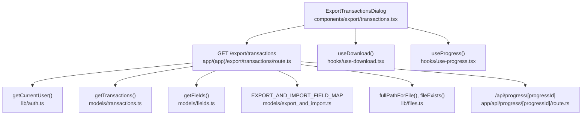
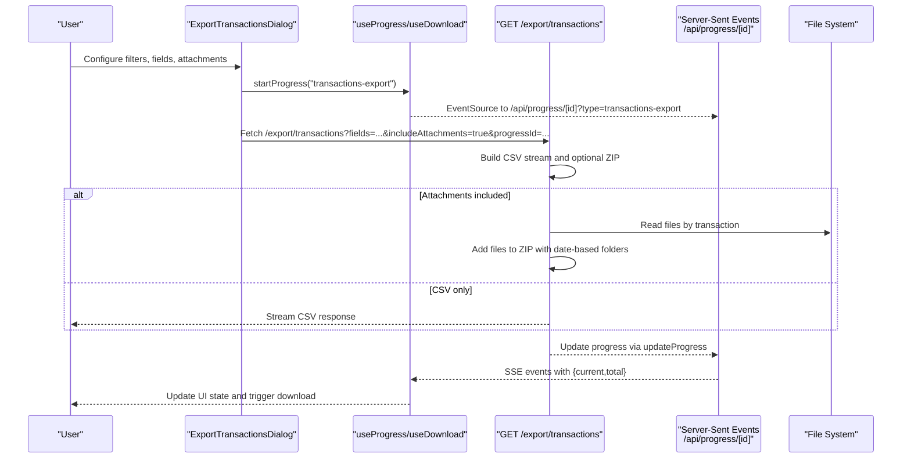
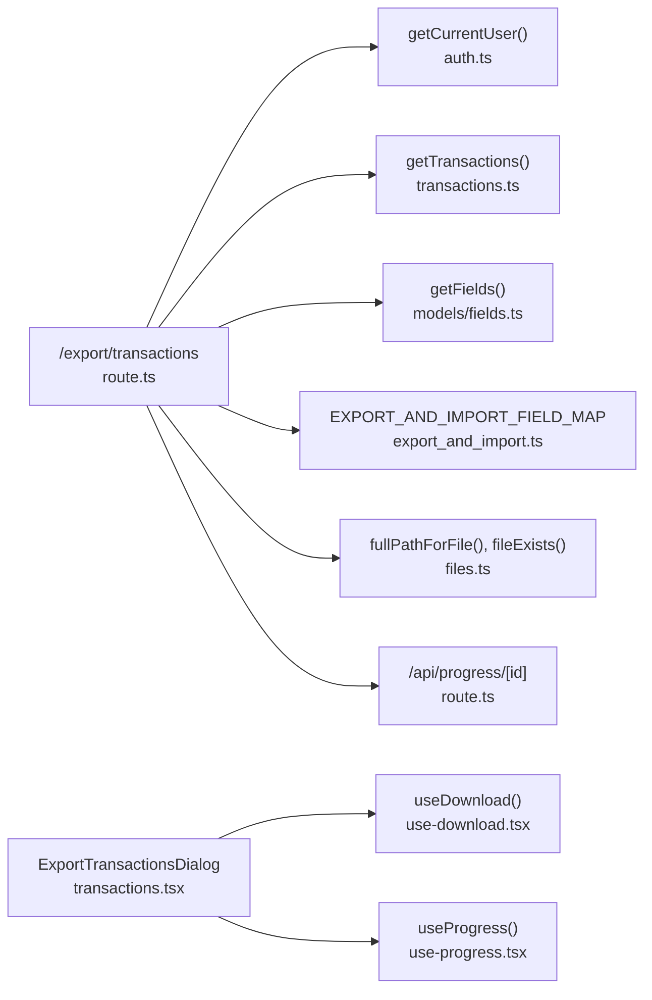

# Data Export API

<cite>
**Referenced Files in This Document**
- [route.ts](file://app/(app)/export/transactions/route.ts)
- [transactions.tsx](file://components/export/transactions.tsx)
- [use-download.tsx](file://hooks/use-download.tsx)
- [use-progress.tsx](file://hooks/use-progress.tsx)
- [route.ts](file://app/api/progress/[progressId]/route.ts)
- [export_and_import.ts](file://models/export_and_import.ts)
- [transactions.ts](file://models/transactions.ts)
- [files.ts](file://lib/files.ts)
- [auth.ts](file://lib/auth.ts)
- [middleware.ts](file://middleware.ts)
- [config.ts](file://lib/config.ts)
</cite>

## Table of Contents
1. [Introduction](#introduction)
2. [Project Structure](#project-structure)
3. [Core Components](#core-components)
4. [Architecture Overview](#architecture-overview)
5. [Detailed Component Analysis](#detailed-component-analysis)
6. [Dependency Analysis](#dependency-analysis)
7. [Performance Considerations](#performance-considerations)
8. [Troubleshooting Guide](#troubleshooting-guide)
9. [Conclusion](#conclusion)
10. [Appendices](#appendices)

## Introduction
This document specifies the Data Export API for transactions, focusing on the endpoint that exports transaction records and optionally associated files. It covers supported formats, request parameters, filtering, response formats, file generation, download mechanism, authentication, progress tracking, and client-side integration. It also documents privacy considerations, validation, and performance optimization for large datasets.

## Project Structure
The export functionality spans a serverless route, client UI, and supporting libraries:
- Server route: handles export requests, builds CSV or ZIP archives, streams responses, and updates progress.
- Client UI: a modal dialog to configure filters, fields, and attachment inclusion, and to initiate downloads.
- Supporting modules: field mapping, transaction filtering, file system helpers, authentication, and progress streaming.

**Diagram sources**
- [route.ts](file://app/(app)/export/transactions/route.ts#L20-L188)
- [transactions.tsx:26-193](file://components/export/transactions.tsx#L26-L193)
- [use-download.tsx:8-49](file://hooks/use-download.tsx#L8-L49)
- [use-progress.tsx:18-87](file://hooks/use-progress.tsx#L18-L87)
- [route.ts:7-64](file://app/api/progress/[progressId]/route.ts#L7-L64)
- [export_and_import.ts:19-131](file://models/export_and_import.ts#L19-L131)
- [transactions.ts:43-117](file://models/transactions.ts#L43-L117)
- [files.ts:39-68](file://lib/files.ts#L39-L68)
- [auth.ts:78-99](file://lib/auth.ts#L78-L99)

**Section sources**
- [route.ts](file://app/(app)/export/transactions/route.ts#L1-L189)
- [transactions.tsx:1-193](file://components/export/transactions.tsx#L1-L193)
- [use-download.tsx:1-49](file://hooks/use-download.tsx#L1-L49)
- [use-progress.tsx:1-87](file://hooks/use-progress.tsx#L1-L87)
- [route.ts:1-65](file://app/api/progress/[progressId]/route.ts#L1-L65)
- [export_and_import.ts:1-164](file://models/export_and_import.ts#L1-L164)
- [transactions.ts:1-221](file://models/transactions.ts#L1-L221)
- [files.ts:1-94](file://lib/files.ts#L1-L94)
- [auth.ts:1-114](file://lib/auth.ts#L1-L114)
- [middleware.ts:1-28](file://middleware.ts#L1-L28)
- [config.ts:1-82](file://lib/config.ts#L1-L82)

## Core Components
- Export endpoint: GET /export/transactions
- Client dialog: ExportTransactionsDialog
- Download hook: useDownload
- Progress hook: useProgress
- Progress SSE endpoint: /api/progress/[progressId]
- Field mapping and export transforms: EXPORT_AND_IMPORT_FIELD_MAP
- Transaction filters and retrieval: TransactionFilters and getTransactions
- File system helpers: fullPathForFile, fileExists
- Authentication: getCurrentUser and middleware protection

**Section sources**
- [route.ts](file://app/(app)/export/transactions/route.ts#L20-L25)
- [transactions.tsx:26-75](file://components/export/transactions.tsx#L26-L75)
- [use-download.tsx:8-49](file://hooks/use-download.tsx#L8-L49)
- [use-progress.tsx:18-87](file://hooks/use-progress.tsx#L18-L87)
- [route.ts:7-64](file://app/api/progress/[progressId]/route.ts#L7-L64)
- [export_and_import.ts:19-131](file://models/export_and_import.ts#L19-L131)
- [transactions.ts:27-36](file://models/transactions.ts#L27-L36)
- [files.ts:39-68](file://lib/files.ts#L39-L68)
- [auth.ts:78-99](file://lib/auth.ts#L78-L99)
- [middleware.ts:5-15](file://middleware.ts#L5-L15)

## Architecture Overview
The export flow integrates UI controls, server route processing, and streaming responses. When attachments are included, the server generates a ZIP containing a CSV and extracted files organized by date and transaction.

**Diagram sources**
- [transactions.tsx:56-75](file://components/export/transactions.tsx#L56-L75)
- [use-progress.tsx:32-79](file://hooks/use-progress.tsx#L32-L79)
- [route.ts:7-64](file://app/api/progress/[progressId]/route.ts#L7-L64)
- [route.ts](file://app/(app)/export/transactions/route.ts#L20-L188)
- [files.ts:39-68](file://lib/files.ts#L39-L68)

## Detailed Component Analysis

### Endpoint Definition: GET /export/transactions
- Purpose: Export transactions to CSV or ZIP with optional attachments.
- Method: GET
- Path: /export/transactions
- Authentication: Required (session cookie or self-hosted user)
- Rate limiting: Not implemented in code; consider deploying rate limiting at reverse proxy or platform level.
- Export size limits: Not enforced in code; large exports may impact memory and streaming.

Request parameters
- Query parameters:
  - fields: Comma-separated list of field codes to include in CSV (validated against user’s configured fields).
  - includeAttachments: Boolean string ("true" or any other value) to include files in a ZIP archive.
  - progressId: Optional string to enable progress tracking via SSE.
  - Filters (all optional):
    - search: Free-text search across name, merchant, description, note, text.
    - dateFrom: ISO date string for issuedAt lower bound.
    - dateTo: ISO date string for issuedAt upper bound.
    - ordering: Sort field with optional "-" prefix for descending.
    - categoryCode: Filter by category code.
    - projectCode: Filter by project code.
    - type: Filter by transaction type.

Behavior
- Validates requested fields against user’s existing fields.
- Streams CSV rows using a transform stream; writes custom headers derived from field names.
- If includeAttachments is false, returns a CSV file as a streamed response.
- If includeAttachments is true:
  - Adds CSV to a ZIP archive.
  - Iterates transactions and files in chunks to manage memory.
  - Builds a folder hierarchy by year/month and optional transaction name/id.
  - Streams the ZIP as a binary response.
- Progress tracking:
  - Counts total files to process.
  - Updates progress periodically and on completion via updateProgress.
  - SSE endpoint exposes progress events.

Responses
- CSV file: Content-Type: text/csv; Content-Disposition: attachment; filename=transactions.csv
- ZIP archive: Content-Type: application/zip; Content-Disposition: attachment; filename=transactions.zip
- Error: 500 Internal Server Error on failure.

**Section sources**
- [route.ts](file://app/(app)/export/transactions/route.ts#L20-L25)
- [route.ts](file://app/(app)/export/transactions/route.ts#L27-L29)
- [route.ts](file://app/(app)/export/transactions/route.ts#L31-L68)
- [route.ts](file://app/(app)/export/transactions/route.ts#L70-L78)
- [route.ts](file://app/(app)/export/transactions/route.ts#L80-L183)
- [route.ts](file://app/(app)/export/transactions/route.ts#L184-L187)
- [transactions.ts:27-36](file://models/transactions.ts#L27-L36)
- [transactions.ts:43-117](file://models/transactions.ts#L43-L117)
- [export_and_import.ts:19-131](file://models/export_and_import.ts#L19-L131)
- [files.ts:39-68](file://lib/files.ts#L39-L68)

### Client Integration: ExportTransactionsDialog
- Purpose: UI to configure export parameters and trigger downloads.
- Features:
  - Date range picker for issuedAt bounds.
  - Category and project selectors.
  - Field selection checkboxes (some fields deselected by default).
  - Toggle to include attachments (ZIP).
  - Progress and download states.

Workflow
- On submit:
  - Starts progress tracking via useProgress to obtain a progressId.
  - Constructs URL with filters, fields, includeAttachments, and progressId.
  - Uses useDownload to fetch and save the resulting file.

Progress and download
- Progress: useProgress opens an SSE connection to /api/progress/[id] and updates UI state.
- Download: useDownload fetches the endpoint, reads Content-Disposition for filename, creates a Blob, and triggers browser download.

**Section sources**
- [transactions.tsx:26-75](file://components/export/transactions.tsx#L26-L75)
- [transactions.tsx:82-191](file://components/export/transactions.tsx#L82-L191)
- [use-progress.tsx:32-79](file://hooks/use-progress.tsx#L32-L79)
- [use-download.tsx:11-42](file://hooks/use-download.tsx#L11-L42)

### Progress Tracking: SSE Endpoint /api/progress/[progressId]
- Purpose: Stream progress updates for long-running operations.
- Method: GET
- Path: /api/progress/[progressId]?type=...
- Authentication: Required (session-based).
- Behavior:
  - Creates or retrieves progress record for the user and progressId.
  - Polls progress at a fixed interval and sends Server-Sent Events.
  - Closes the stream when progress completes.

**Section sources**
- [route.ts:7-64](file://app/api/progress/[progressId]/route.ts#L7-L64)
- [use-progress.tsx:32-79](file://hooks/use-progress.tsx#L32-L79)
- [route.ts](file://app/(app)/export/transactions/route.ts#L109-L165)

### Field Mapping and Export Transforms
- Purpose: Define how fields are exported and transformed for CSV output.
- Supported fields and transformations:
  - name, description, merchant, note: raw string export.
  - total, convertedTotal: numeric export; values divided by 100 for export, multiplied by 100 for import.
  - currencyCode, convertedCurrencyCode: raw string export/import.
  - type: lowercase export/import.
  - categoryCode, projectCode: export resolves to category/project name; import resolves to code.
  - issuedAt: export formatted as yyyy-MM-dd; import parsed to Date.

Validation
- Export respects only fields present in the user’s field configuration.

**Section sources**
- [export_and_import.ts:19-131](file://models/export_and_import.ts#L19-L131)
- [route.ts](file://app/(app)/export/transactions/route.ts#L31-L68)

### File Handling and ZIP Generation
- Purpose: Include transaction files in a ZIP archive when requested.
- Behavior:
  - Iterates transactions and files in chunks to manage memory.
  - Builds a folder structure under "files/" using year/month and optional transaction name/id.
  - Reads file content from the user’s upload directory and adds to ZIP.
  - Skips missing files and logs warnings.
  - Generates ZIP with DEFLATE compression.

Security
- Path normalization and traversal checks are performed when constructing file paths.

**Section sources**
- [route.ts](file://app/(app)/export/transactions/route.ts#L93-L160)
- [files.ts:39-68](file://lib/files.ts#L39-L68)

### Authentication and Middleware
- Authentication:
  - getCurrentUser resolves the current user from session or self-hosted context.
  - Middleware enforces session presence for protected routes, including /export/*.
- Self-hosted mode:
  - When enabled, middleware allows access without session checks.

**Section sources**
- [auth.ts:78-99](file://lib/auth.ts#L78-L99)
- [middleware.ts:5-15](file://middleware.ts#L5-L15)
- [middleware.ts:17-27](file://middleware.ts#L17-L27)
- [config.ts:50-54](file://lib/config.ts#L50-L54)

## Dependency Analysis
The export route depends on:
- Authentication and session resolution
- Transaction retrieval with filters
- Field configuration and mapping
- File system utilities for path resolution and existence checks
- Progress persistence and SSE streaming

**Diagram sources**
- [route.ts](file://app/(app)/export/transactions/route.ts#L1-L14)
- [auth.ts:78-99](file://lib/auth.ts#L78-L99)
- [transactions.ts:43-117](file://models/transactions.ts#L43-L117)
- [export_and_import.ts:19-131](file://models/export_and_import.ts#L19-L131)
- [files.ts:39-68](file://lib/files.ts#L39-L68)
- [route.ts:7-64](file://app/api/progress/[progressId]/route.ts#L7-L64)
- [transactions.tsx:26-75](file://components/export/transactions.tsx#L26-L75)
- [use-download.tsx:8-49](file://hooks/use-download.tsx#L8-L49)
- [use-progress.tsx:18-87](file://hooks/use-progress.tsx#L18-L87)

**Section sources**
- [route.ts](file://app/(app)/export/transactions/route.ts#L1-L14)
- [transactions.ts:43-117](file://models/transactions.ts#L43-L117)
- [export_and_import.ts:19-131](file://models/export_and_import.ts#L19-L131)
- [files.ts:39-68](file://lib/files.ts#L39-L68)
- [route.ts:7-64](file://app/api/progress/[progressId]/route.ts#L7-L64)
- [transactions.tsx:26-75](file://components/export/transactions.tsx#L26-L75)
- [use-download.tsx:8-49](file://hooks/use-download.tsx#L8-L49)
- [use-progress.tsx:18-87](file://hooks/use-progress.tsx#L18-L87)

## Performance Considerations
- Chunked processing:
  - Transactions are processed in chunks to reduce peak memory usage during CSV generation.
  - Files are processed in smaller batches to control memory during ZIP assembly.
- Streaming:
  - CSV is streamed to the client; ZIP is generated asynchronously and streamed as a binary response.
- Progress updates:
  - Progress is updated at a fixed interval to balance responsiveness and overhead.
- Large datasets:
  - Consider adding pagination or export size caps at the application or infrastructure level to prevent excessive resource consumption.
- Compression:
  - ZIP uses DEFLATE compression; adjust compression level if CPU usage becomes a bottleneck.

[No sources needed since this section provides general guidance]

## Troubleshooting Guide
Common issues and resolutions
- Unauthorized access:
  - Symptom: 401 Unauthorized or redirect to login.
  - Cause: Missing or invalid session; middleware requires a session for protected routes.
  - Resolution: Ensure user is logged in; verify cookies/session; confirm self-hosted mode settings.
- Empty or partial ZIP:
  - Symptom: ZIP downloaded but files are missing.
  - Cause: Files may be missing on disk or path traversal prevented.
  - Resolution: Verify fileExists checks; ensure upload directory permissions; confirm fullPathForFile correctness.
- Progress not updating:
  - Symptom: Progress UI remains idle.
  - Cause: SSE connection failed or progressId mismatch.
  - Resolution: Confirm progressId is passed; check /api/progress/[id] SSE endpoint; verify useProgress configuration.
- CSV formatting anomalies:
  - Symptom: Unexpected values in exported fields.
  - Cause: Field mapping or export transforms.
  - Resolution: Review EXPORT_AND_IMPORT_FIELD_MAP; ensure requested fields exist for the user.
- Download fails:
  - Symptom: Download error or blank file.
  - Cause: Network issues or server errors.
  - Resolution: Retry; inspect network tab; verify endpoint response and headers.

**Section sources**
- [middleware.ts:5-15](file://middleware.ts#L5-L15)
- [route.ts](file://app/(app)/export/transactions/route.ts#L184-L187)
- [files.ts:61-68](file://lib/files.ts#L61-L68)
- [route.ts:7-64](file://app/api/progress/[progressId]/route.ts#L7-L64)
- [use-progress.tsx:32-79](file://hooks/use-progress.tsx#L32-L79)
- [export_and_import.ts:19-131](file://models/export_and_import.ts#L19-L131)
- [use-download.tsx:11-42](file://hooks/use-download.tsx#L11-L42)

## Conclusion
The Data Export API provides a robust, streaming-based solution for exporting transactions to CSV or ZIP with optional attachments. It integrates cleanly with the UI, supports configurable fields and filters, and offers progress tracking via SSE. For production deployments, consider adding rate limiting, export size caps, and monitoring to ensure reliability and performance.

[No sources needed since this section summarizes without analyzing specific files]

## Appendices

### API Reference: GET /export/transactions
- Method: GET
- Path: /export/transactions
- Query parameters:
  - fields: comma-separated field codes (validated against user fields)
  - includeAttachments: "true" to include files in ZIP
  - progressId: optional progress identifier for SSE
  - Filters:
    - search, dateFrom, dateTo, ordering, categoryCode, projectCode, type
- Responses:
  - CSV: text/csv with filename transactions.csv
  - ZIP: application/zip with filename transactions.zip
  - Error: 500 Internal Server Error

**Section sources**
- [route.ts](file://app/(app)/export/transactions/route.ts#L20-L25)
- [route.ts](file://app/(app)/export/transactions/route.ts#L70-L78)
- [route.ts](file://app/(app)/export/transactions/route.ts#L178-L183)

### Client Implementation Examples
- Progress tracking:
  - Use useProgress to start progress and subscribe to SSE updates.
  - Display progress percentage and status messages.
- Download:
  - Use useDownload to fetch the export URL and save the file.
  - Handle errors and retries gracefully.
- Filtering and fields:
  - Collect filters from UI components and pass them as query parameters.
  - Respect user field configuration when selecting fields.

**Section sources**
- [transactions.tsx:56-75](file://components/export/transactions.tsx#L56-L75)
- [use-progress.tsx:32-79](file://hooks/use-progress.tsx#L32-L79)
- [use-download.tsx:11-42](file://hooks/use-download.tsx#L11-L42)

### Data Privacy and Validation Notes
- Authentication: All export endpoints require a valid user session.
- Self-hosted mode: When enabled, middleware does not enforce sessions.
- Field privacy: Only fields configured for the user are exported.
- File privacy: Files are only included if present on disk and accessible via normalized paths.

**Section sources**
- [auth.ts:78-99](file://lib/auth.ts#L78-L99)
- [middleware.ts:5-15](file://middleware.ts#L5-L15)
- [config.ts:50-54](file://lib/config.ts#L50-L54)
- [route.ts](file://app/(app)/export/transactions/route.ts#L31-L32)
- [files.ts:39-68](file://lib/files.ts#L39-L68)