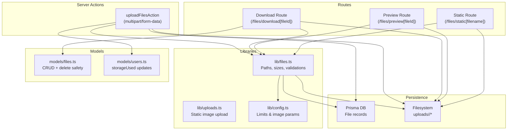
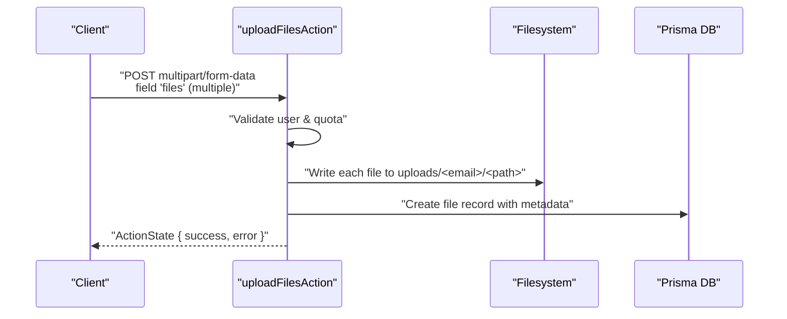
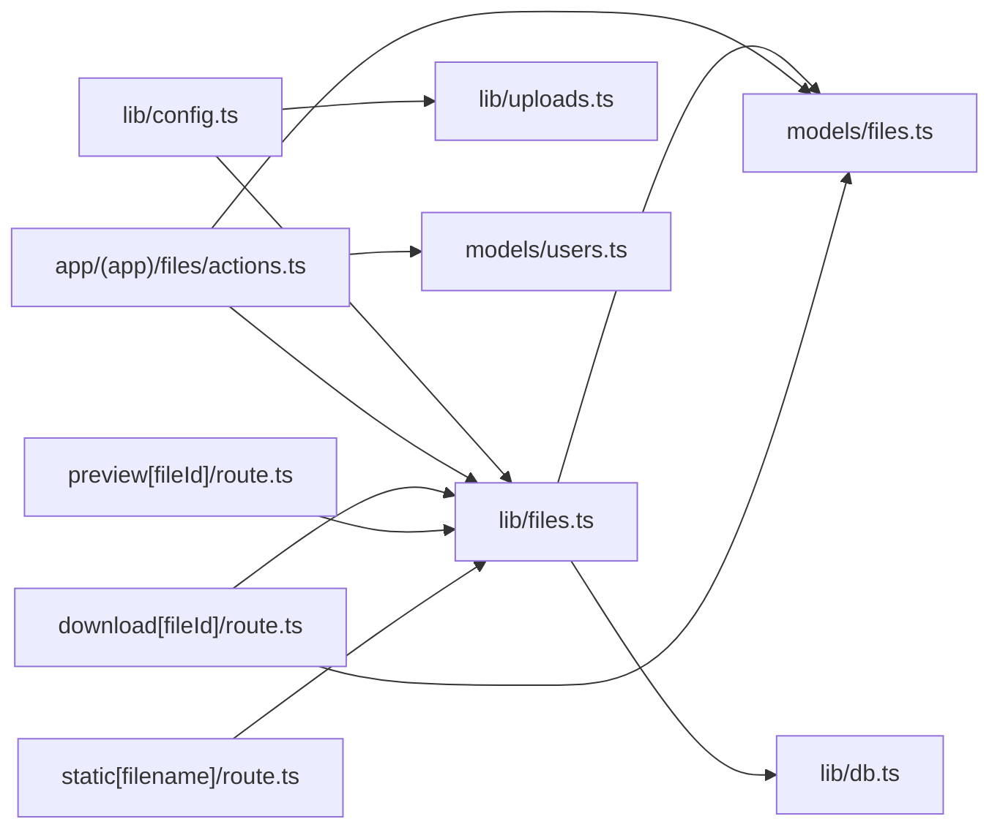

# File Management API

<cite>
**Referenced Files in This Document**
- [actions.ts](file://app/(app)/files/actions.ts)
- [files.ts](file://lib/files.ts)
- [uploads.ts](file://lib/uploads.ts)
- [files.ts](file://models/files.ts)
- [route.ts](file://app/(app)/files/download[fileId]/route.ts)
- [route.ts](file://app/(app)/files/preview[fileId]/route.ts)
- [route.ts](file://app/(app)/files/static[filename]/route.ts)
- [config.ts](file://lib/config.ts)
- [db.ts](file://lib/db.ts)
- [auth.ts](file://lib/auth.ts)
- [users.ts](file://models/users.ts)
</cite>

## Table of Contents
1. [Introduction](#introduction)
2. [Project Structure](#project-structure)
3. [Core Components](#core-components)
4. [Architecture Overview](#architecture-overview)
5. [Detailed Component Analysis](#detailed-component-analysis)
6. [Dependency Analysis](#dependency-analysis)
7. [Performance Considerations](#performance-considerations)
8. [Troubleshooting Guide](#troubleshooting-guide)
9. [Conclusion](#conclusion)

## Introduction
This document describes the File Management API used by TaxHacker for handling file uploads, downloads, previews, and static asset serving. It covers endpoint specifications, authentication requirements, supported formats, size limitations, metadata handling, storage quotas, and security measures. It also provides client implementation guidance for robust upload workflows, progress tracking, and error handling.

## Project Structure
The file management functionality spans several layers:
- Route handlers for download, preview, and static endpoints
- Server action for multipart form uploads
- Utility libraries for file paths, sizes, and validations
- Prisma models for file records and user storage metrics
- Configuration for storage limits and image processing

**Diagram sources**
- [actions.ts](file://app/(app)/files/actions.ts#L1-L82)
- [files.ts:1-94](file://lib/files.ts#L1-L94)
- [uploads.ts:1-61](file://lib/uploads.ts#L1-L61)
- [files.ts:1-96](file://models/files.ts#L1-L96)
- [route.ts](file://app/(app)/files/download[fileId]/route.ts)
- [route.ts](file://app/(app)/files/preview[fileId]/route.ts)
- [route.ts](file://app/(app)/files/static[filename]/route.ts)

**Section sources**
- [actions.ts](file://app/(app)/files/actions.ts#L1-L82)
- [files.ts:1-94](file://lib/files.ts#L1-L94)
- [uploads.ts:1-61](file://lib/uploads.ts#L1-L61)
- [files.ts:1-96](file://models/files.ts#L1-L96)

## Core Components
- Upload handler: Processes multipart form data, validates storage quota, writes files to disk, and persists records to the database.
- Download endpoint: Serves files by ID after validating ownership and existence.
- Preview endpoint: Generates and serves image previews for PDF pages.
- Static endpoint: Serves user-uploaded static assets.
- Storage utilities: Path normalization, directory size calculation, and quota checks.
- Image processing: Sharp-based resizing and format conversion for static images.

**Section sources**
- [actions.ts](file://app/(app)/files/actions.ts#L19-L81)
- [files.ts:12-94](file://lib/files.ts#L12-L94)
- [uploads.ts:8-61](file://lib/uploads.ts#L8-L61)
- [files.ts:54-95](file://models/files.ts#L54-L95)

## Architecture Overview
The system integrates Next.js server actions and route handlers with a local filesystem and a database. Authentication ensures requests operate within the current user's scope. Storage quotas are enforced via user metadata and directory size calculations.

**Diagram sources**
- [actions.ts](file://app/(app)/files/actions.ts#L19-L81)
- [files.ts:12-42](file://lib/files.ts#L12-L42)
- [files.ts:54-61](file://models/files.ts#L54-L61)

## Detailed Component Analysis

### Upload Endpoint
- Method: POST
- Path: multipart/form-data upload handled by a server action
- Field: files (multiple File entries)
- Authentication: Requires a logged-in user; subscription status checked
- Storage quota: Enforced per-user; total size of all files in the request is summed and compared against user.storageLimit
- Persistence:
  - Writes each file to the user-specific uploads directory under an unsorted path
  - Stores UUID-based filename with original extension
  - Records metadata: filename, filesystem path, MIME type, size, lastModified
- Response: ActionState indicating success or error

Supported formats:
- No explicit format filter in the upload action; any File is accepted. Validation rules are not enforced at this endpoint level.

Size limitations:
- Enforced by user storage limit and current usage; insufficient storage returns an error before writing files.

Security considerations:
- Path traversal protection via normalized joins
- Directory boundaries enforced during deletion and static uploads

**Section sources**
- [actions.ts](file://app/(app)/files/actions.ts#L19-L81)
- [files.ts:12-42](file://lib/files.ts#L12-L42)
- [files.ts:88-93](file://lib/files.ts#L88-L93)
- [files.ts:54-61](file://models/files.ts#L54-L61)

### Download Endpoint
- Path: /files/download[fileId]
- Method: GET
- Authentication: Requires a logged-in user; file ownership verified via model lookup
- Behavior:
  - Resolves absolute filesystem path for the file
  - Returns file stream as response
- Response formats:
  - Binary stream matching the stored file’s MIME/type
  - Uses the stored filename for the Content-Disposition header
- Error handling:
  - Not found if file does not exist or belongs to another user
  - Internal errors surfaced as generic failures

**Section sources**
- [route.ts](file://app/(app)/files/download[fileId]/route.ts)
- [files.ts:30-34](file://models/files.ts#L30-L34)
- [files.ts:39-42](file://lib/files.ts#L39-L42)

### Preview Endpoint
- Path: /files/preview[fileId]
- Method: GET
- Authentication: Requires a logged-in user; file ownership verified
- Behavior:
  - Generates image previews for PDF pages
  - Saves previews as webp images under the user’s previews directory
  - Returns the generated preview image
- Storage:
  - Previews cached on the filesystem under user-specific previews directory
- Response formats:
  - Image/png or image/webp depending on the underlying generation pipeline

Note: The preview generation and caching mechanism is implemented in the route handler and uses the filesystem for storage.

**Section sources**
- [route.ts](file://app/(app)/files/preview[fileId]/route.ts)
- [files.ts:20-31](file://lib/files.ts#L20-L31)

### Static Asset Serving Endpoint
- Path: /files/static[filename]
- Method: GET
- Authentication: Requires a logged-in user; file must reside within the user’s static directory
- Behavior:
  - Serves files from the user’s static directory
  - Supports configurable image processing for uploads (resize, format conversion)
- Response formats:
  - Binary stream of the requested static asset

**Section sources**
- [route.ts](file://app/(app)/files/static[filename]/route.ts)
- [files.ts:16-18](file://lib/files.ts#L16-L18)
- [uploads.ts:8-61](file://lib/uploads.ts#L8-L61)

### Static Image Upload (Server-side)
- Purpose: Upload processed static images for a user
- Parameters:
  - Target filename with extension (controls output format)
  - Optional max width/height and quality
- Processing:
  - Uses Sharp to rotate, resize, and encode to PNG/JPEG/WEBP/AVIF
- Storage:
  - Writes to user’s static directory under uploads/<email>/static/

**Section sources**
- [uploads.ts:8-61](file://lib/uploads.ts#L8-L61)

## Dependency Analysis
Key dependencies and their roles:
- lib/files.ts: Provides path utilities, directory size calculation, quota checks, and safe path joining
- models/files.ts: CRUD operations for file records and secure deletion with path traversal checks
- lib/uploads.ts: Static image upload with Sharp-based processing
- lib/config.ts: Centralized configuration for storage limits and image processing parameters
- lib/db.ts: Prisma client initialization for database operations
- lib/auth.ts: Current user retrieval and subscription status checks

**Diagram sources**
- [files.ts:1-94](file://lib/files.ts#L1-L94)
- [uploads.ts:1-61](file://lib/uploads.ts#L1-L61)
- [files.ts:1-96](file://models/files.ts#L1-L96)
- [actions.ts](file://app/(app)/files/actions.ts#L1-L82)
- [route.ts](file://app/(app)/files/download[fileId]/route.ts)
- [route.ts](file://app/(app)/files/preview[fileId]/route.ts)
- [route.ts](file://app/(app)/files/static[filename]/route.ts)

**Section sources**
- [files.ts:1-94](file://lib/files.ts#L1-L94)
- [uploads.ts:1-61](file://lib/uploads.ts#L1-L61)
- [files.ts:1-96](file://models/files.ts#L1-L96)
- [actions.ts](file://app/(app)/files/actions.ts#L1-L82)

## Performance Considerations
- Large file handling:
  - Stream uploads to avoid memory spikes; ensure server action handles large buffers efficiently
  - Consider chunked uploads for very large files
- Image processing:
  - Use appropriate max width/height and quality to balance fidelity and performance
  - Cache previews to reduce repeated processing
- Storage monitoring:
  - Periodically recalculate directory size and update user.storageUsed to prevent quota drift
- CDN/static assets:
  - Serve static assets via CDN for improved latency and bandwidth savings

[No sources needed since this section provides general guidance]

## Troubleshooting Guide
Common issues and resolutions:
- Insufficient storage:
  - Verify user.storageUsed vs user.storageLimit; trigger quota error before writing files
- Path traversal attempts:
  - Ensure all filesystem paths are constructed via safePathJoin and validated against base directories
- File not found:
  - Confirm file ownership and existence; route handlers return not found for missing or unauthorized files
- Preview generation failures:
  - Check PDF validity and ensure the previews directory exists and is writable
- Static upload errors:
  - Validate target filename extension and supported formats; confirm directory creation succeeds

**Section sources**
- [files.ts:53-59](file://lib/files.ts#L53-L59)
- [files.ts:70-95](file://models/files.ts#L70-L95)
- [uploads.ts:24-28](file://lib/uploads.ts#L24-L28)

## Conclusion
TaxHacker’s File Management API provides a robust foundation for uploading, storing, retrieving, previewing, and serving static assets. It enforces user isolation, prevents path traversal, and manages storage quotas through database and filesystem metrics. By following the documented endpoints, authentication requirements, and security practices, clients can implement reliable file workflows with predictable performance characteristics.