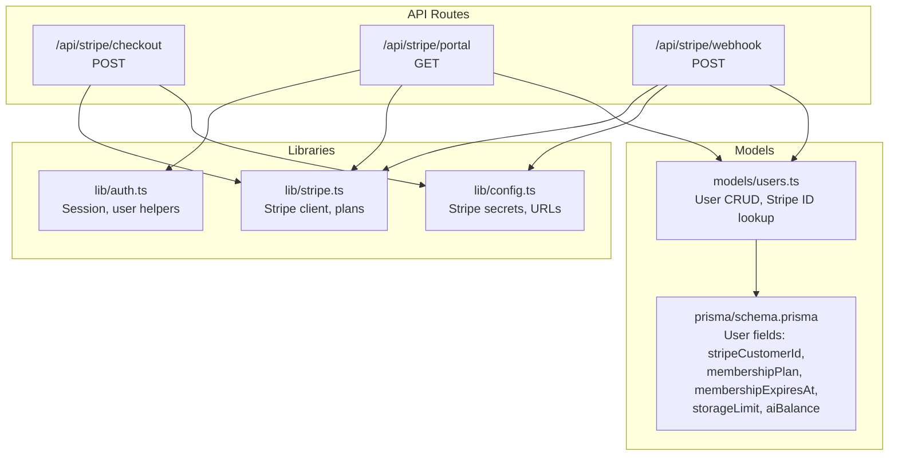
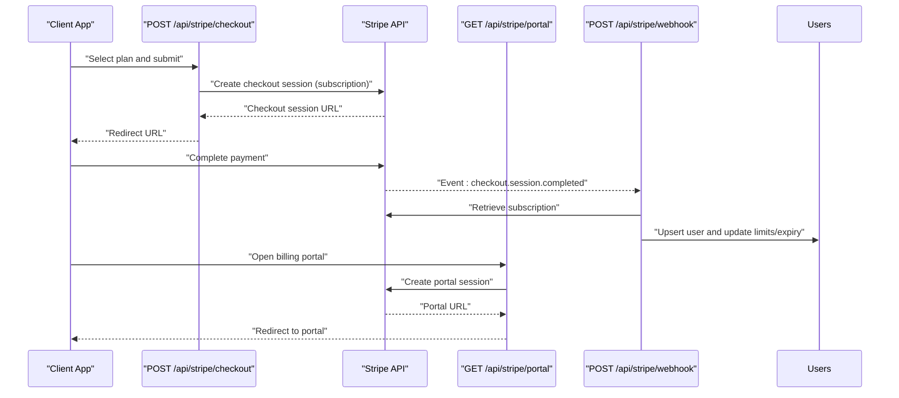
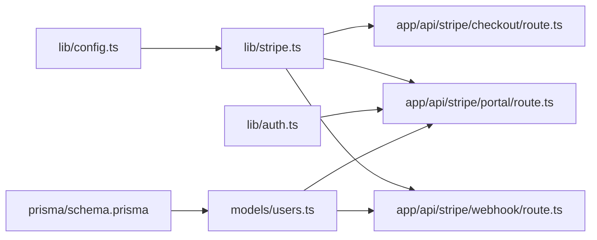

# Payment Processing API

<cite>
**Referenced Files in This Document**
- [checkout/route.ts](file://app/api/stripe/checkout/route.ts)
- [portal/route.ts](file://app/api/stripe/portal/route.ts)
- [webhook/route.ts](file://app/api/stripe/webhook/route.ts)
- [stripe.ts](file://lib/stripe.ts)
- [config.ts](file://lib/config.ts)
- [auth.ts](file://lib/auth.ts)
- [users.ts](file://models/users.ts)
- [schema.prisma](file://prisma/schema.prisma)
- [pricing-card.tsx](file://components/auth/pricing-card.tsx)
- [success/page.tsx](file://app/(auth)/cloud/payment/success/page.tsx)
</cite>

## Table of Contents
1. [Introduction](#introduction)
2. [Project Structure](#project-structure)
3. [Core Components](#core-components)
4. [Architecture Overview](#architecture-overview)
5. [Detailed Component Analysis](#detailed-component-analysis)
6. [Dependency Analysis](#dependency-analysis)
7. [Performance Considerations](#performance-considerations)
8. [Troubleshooting Guide](#troubleshooting-guide)
9. [Conclusion](#conclusion)
10. [Appendices](#appendices)

## Introduction
This document provides comprehensive API documentation for TaxHacker’s Stripe-powered payment processing endpoints. It covers:
- Checkout session creation for subscription plans
- Customer portal access for billing management
- Webhook handling for asynchronous payment and subscription events
- Request/response schemas, authentication, and security considerations
- Client implementation examples for checkout flow integration, webhook verification, and error handling
- Subscription lifecycle management, usage tracking, and refund processing guidance

## Project Structure
The payment processing APIs are implemented as Next.js routes under app/api/stripe with supporting libraries for Stripe configuration, plans, and user models.

**Diagram sources**
- [checkout/route.ts:1-51](file://app/api/stripe/checkout/route.ts#L1-L51)
- [portal/route.ts:1-31](file://app/api/stripe/portal/route.ts#L1-L31)
- [webhook/route.ts:1-112](file://app/api/stripe/webhook/route.ts#L1-L112)
- [config.ts:68-73](file://lib/config.ts#L68-L73)
- [stripe.ts:1-58](file://lib/stripe.ts#L1-L58)
- [auth.ts:78-99](file://lib/auth.ts#L78-L99)
- [users.ts:57-68](file://models/users.ts#L57-L68)
- [schema.prisma:14-45](file://prisma/schema.prisma#L14-L45)

**Section sources**
- [checkout/route.ts:1-51](file://app/api/stripe/checkout/route.ts#L1-L51)
- [portal/route.ts:1-31](file://app/api/stripe/portal/route.ts#L1-L31)
- [webhook/route.ts:1-112](file://app/api/stripe/webhook/route.ts#L1-L112)
- [config.ts:68-73](file://lib/config.ts#L68-L73)
- [stripe.ts:1-58](file://lib/stripe.ts#L1-L58)
- [auth.ts:78-99](file://lib/auth.ts#L78-L99)
- [users.ts:57-68](file://models/users.ts#L57-L68)
- [schema.prisma:14-45](file://prisma/schema.prisma#L14-L45)

## Core Components
- Stripe client initialization and plan definitions
- Environment-driven configuration for Stripe keys and URLs
- User model with Stripe customer linkage and subscription attributes
- Authentication helpers for session retrieval and user gating

Key responsibilities:
- lib/stripe.ts: Defines Stripe client and plan catalog with availability and limits
- lib/config.ts: Exposes Stripe secret key, webhook secret, and success/cancel URLs
- models/users.ts: Provides user lookup by Stripe customer ID and updates subscription fields
- lib/auth.ts: Retrieves current user for protected endpoints

**Section sources**
- [stripe.ts:1-58](file://lib/stripe.ts#L1-L58)
- [config.ts:68-73](file://lib/config.ts#L68-L73)
- [users.ts:57-68](file://models/users.ts#L57-L68)
- [auth.ts:78-99](file://lib/auth.ts#L78-L99)

## Architecture Overview
The payment flow integrates Stripe Checkout, Billing Portal, and webhooks to manage subscriptions and user entitlements.

**Diagram sources**
- [checkout/route.ts:22-38](file://app/api/stripe/checkout/route.ts#L22-L38)
- [webhook/route.ts:34-56](file://app/api/stripe/webhook/route.ts#L34-L56)
- [portal/route.ts:20-23](file://app/api/stripe/portal/route.ts#L20-L23)
- [users.ts:31-43](file://models/users.ts#L31-L43)

## Detailed Component Analysis

### Endpoint: POST /api/stripe/checkout
Purpose:
- Create a Stripe Checkout session for a selected subscription plan
- Redirect the client to Stripe-hosted payment flow
- On success, Stripe redirects back to the configured success URL

Request
- Method: POST
- URL: /api/stripe/checkout?code={plan_code}
- Query parameters:
  - code: Required string; plan code (e.g., early)
- Headers: None required by server
- Body: None

Response
- 200 OK: { session: { url: string } }
- 400 Bad Request: { error: string } (missing code, invalid/inactive plan)
- 500 Internal Server Error: { error: string } (Stripe disabled or creation failure)

Behavior highlights
- Validates plan existence and availability
- Uses automatic tax calculation and allows promotion codes
- Sets success and cancel URLs from configuration

Security and authentication
- No authentication required for this endpoint
- Ensure success/cancel URLs are set in environment configuration

Client integration example
- Frontend triggers POST /api/stripe/checkout?code=early
- On success, follows returned session.url to Stripe
- On cancel, redirects to configured cancel URL

**Section sources**
- [checkout/route.ts:5-50](file://app/api/stripe/checkout/route.ts#L5-L50)
- [config.ts:71-72](file://lib/config.ts#L71-L72)
- [stripe.ts:24-57](file://lib/stripe.ts#L24-L57)
- [pricing-card.tsx:14-32](file://components/auth/pricing-card.tsx#L14-L32)

### Endpoint: GET /api/stripe/portal
Purpose:
- Generate a Stripe Billing Portal session for the authenticated user
- Redirect the client to manage billing, update subscription, and change payment methods

Request
- Method: GET
- URL: /api/stripe/portal
- Headers: Authorization cookies/session as required by Better Auth
- Query parameters: None
- Body: None

Response
- 302 Found: Redirect to portal session URL
- 400 Bad Request: { error: string } (user has no Stripe customer ID)
- 401 Unauthorized: { error: string } (not authenticated)
- 500 Internal Server Error: { error: string } (Stripe client not initialized)

Behavior highlights
- Requires a logged-in user with a linked Stripe customer ID
- Return URL points to the user’s profile settings after portal actions

Security and authentication
- Protected by Better Auth; requires active session
- Ensure user has stripeCustomerId populated

**Section sources**
- [portal/route.ts:5-30](file://app/api/stripe/portal/route.ts#L5-L30)
- [auth.ts:78-99](file://lib/auth.ts#L78-L99)
- [users.ts:57-60](file://models/users.ts#L57-L60)

### Endpoint: POST /api/stripe/webhook
Purpose:
- Receive and verify Stripe webhook events
- Update user subscription plan, expiry, and usage limits based on events

Request
- Method: POST
- URL: /api/stripe/webhook
- Headers:
  - stripe-signature: Required for verification
- Body: Raw request body
- Query parameters: None
- Body: Event payload JSON

Response
- 200 OK: "Webhook processed successfully"
- 400 Bad Request: "Webhook signature or secret missing" or "No handler for event type"
- 400 Bad Request: "Webhook signature verification failed"
- 500 Internal Server Error: "Stripe client is not initialized" or "Webhook processing failed"

Supported events
- checkout.session.completed: Retrieve subscription and update user entitlements
- customer.subscription.created, customer.subscription.updated, customer.subscription.deleted: Update user based on subscription items

Processing logic
- Verifies webhook signature using webhook secret from configuration
- For each subscription item, resolves plan by Stripe price ID
- Upserts user if not found by Stripe customer ID
- Updates membership plan, membership expiry, storage limit, and AI balance

Security and authentication
- No authentication required for webhook endpoint
- Requires webhookSecret configured

**Section sources**
- [webhook/route.ts:8-68](file://app/api/stripe/webhook/route.ts#L8-L68)
- [webhook/route.ts:70-112](file://app/api/stripe/webhook/route.ts#L70-L112)
- [config.ts:22-22](file://lib/config.ts#L22-L22)

### Client Implementation Examples

#### Checkout Flow Integration
- Trigger POST /api/stripe/checkout?code=early
- On success, redirect to data.session.url
- On cancel, redirect to configured cancel URL
- On success, Stripe redirects to success URL; success page creates/updates user and sets entitlements

Example flow reference
- Frontend fetch and redirect: [pricing-card.tsx:14-32](file://components/auth/pricing-card.tsx#L14-L32)
- Success page behavior: [success/page.tsx](file://app/(auth)/cloud/payment/success/page.tsx#L33-L42)

#### Webhook Verification
- Use stripe-signature header and webhook secret to construct and verify event
- Handle supported event types and update user records accordingly

Reference
- Signature verification and event handling: [webhook/route.ts:22-67](file://app/api/stripe/webhook/route.ts#L22-L67)

#### Error Handling Strategies
- Validate plan code and availability before creating session
- Catch and log errors during session creation
- For portal, ensure user has stripeCustomerId before creating portal session
- For webhook, handle unsupported event types and verification failures gracefully

References
- Session creation error handling: [checkout/route.ts:46-49](file://app/api/stripe/checkout/route.ts#L46-L49)
- Portal error handling: [portal/route.ts:26-29](file://app/api/stripe/portal/route.ts#L26-L29)
- Webhook error handling: [webhook/route.ts:24-27](file://app/api/stripe/webhook/route.ts#L24-L27), [webhook/route.ts:64-67](file://app/api/stripe/webhook/route.ts#L64-L67)

**Section sources**
- [pricing-card.tsx:14-32](file://components/auth/pricing-card.tsx#L14-L32)
- [success/page.tsx](file://app/(auth)/cloud/payment/success/page.tsx#L33-L42)
- [checkout/route.ts:46-49](file://app/api/stripe/checkout/route.ts#L46-L49)
- [portal/route.ts:26-29](file://app/api/stripe/portal/route.ts#L26-L29)
- [webhook/route.ts:24-27](file://app/api/stripe/webhook/route.ts#L24-L27)
- [webhook/route.ts:64-67](file://app/api/stripe/webhook/route.ts#L64-L67)

### Subscription Lifecycle Management
- Plan selection and checkout: [checkout/route.ts:22-38](file://app/api/stripe/checkout/route.ts#L22-L38)
- Portal access for updates and payment method changes: [portal/route.ts:20-23](file://app/api/stripe/portal/route.ts#L20-L23)
- Webhook-driven updates to user entitlements: [webhook/route.ts:34-56](file://app/api/stripe/webhook/route.ts#L34-L56), [webhook/route.ts:99-108](file://app/api/stripe/webhook/route.ts#L99-L108)

Entitlement fields updated
- membershipPlan
- membershipExpiresAt
- storageLimit
- aiBalance

User model fields
- stripeCustomerId
- membershipPlan
- membershipExpiresAt
- storageLimit
- aiBalance

References
- User entitlement updates: [webhook/route.ts:99-108](file://app/api/stripe/webhook/route.ts#L99-L108)
- User model schema: [schema.prisma:28-34](file://prisma/schema.prisma#L28-L34)

**Section sources**
- [checkout/route.ts:22-38](file://app/api/stripe/checkout/route.ts#L22-L38)
- [portal/route.ts:20-23](file://app/api/stripe/portal/route.ts#L20-L23)
- [webhook/route.ts:34-56](file://app/api/stripe/webhook/route.ts#L34-L56)
- [webhook/route.ts:99-108](file://app/api/stripe/webhook/route.ts#L99-L108)
- [schema.prisma:28-34](file://prisma/schema.prisma#L28-L34)

### Usage Tracking and Refund Processing
Usage tracking
- storageUsed vs storageLimit
- aiBalance vs ai usage

Refund processing
- Stripe handles refunds; ensure webhook updates are processed to maintain accurate limits

References
- Usage fields: [schema.prisma:32-34](file://prisma/schema.prisma#L32-L34)
- Limits per plan: [stripe.ts:51-56](file://lib/stripe.ts#L51-L56)

**Section sources**
- [schema.prisma:32-34](file://prisma/schema.prisma#L32-L34)
- [stripe.ts:51-56](file://lib/stripe.ts#L51-L56)

## Dependency Analysis

**Diagram sources**
- [config.ts:68-73](file://lib/config.ts#L68-L73)
- [stripe.ts:1-58](file://lib/stripe.ts#L1-L58)
- [checkout/route.ts:1-3](file://app/api/stripe/checkout/route.ts#L1-L3)
- [portal/route.ts:1-3](file://app/api/stripe/portal/route.ts#L1-L3)
- [webhook/route.ts:1-6](file://app/api/stripe/webhook/route.ts#L1-L6)
- [auth.ts:78-99](file://lib/auth.ts#L78-L99)
- [users.ts:57-68](file://models/users.ts#L57-L68)
- [schema.prisma:14-45](file://prisma/schema.prisma#L14-L45)

**Section sources**
- [config.ts:68-73](file://lib/config.ts#L68-L73)
- [stripe.ts:1-58](file://lib/stripe.ts#L1-L58)
- [checkout/route.ts:1-3](file://app/api/stripe/checkout/route.ts#L1-L3)
- [portal/route.ts:1-3](file://app/api/stripe/portal/route.ts#L1-L3)
- [webhook/route.ts:1-6](file://app/api/stripe/webhook/route.ts#L1-L6)
- [auth.ts:78-99](file://lib/auth.ts#L78-L99)
- [users.ts:57-68](file://models/users.ts#L57-L68)
- [schema.prisma:14-45](file://prisma/schema.prisma#L14-L45)

## Performance Considerations
- Minimize synchronous Stripe calls in request handlers; consider queuing non-critical updates
- Cache plan definitions and user lookups where appropriate
- Use Stripe’s webhook retries and idempotency keys for robustness
- Keep success/cancel URLs short-lived and stateless to avoid long-running server logic

## Troubleshooting Guide
Common issues and resolutions
- Missing plan code or invalid plan:
  - Verify query parameter and plan availability
  - Reference: [checkout/route.ts:9-20](file://app/api/stripe/checkout/route.ts#L9-L20)
- Stripe client not initialized:
  - Ensure STRIPE_SECRET_KEY is set
  - Reference: [config.ts:21-21](file://lib/config.ts#L21-L21), [checkout/route.ts:13-15](file://app/api/stripe/checkout/route.ts#L13-L15)
- Webhook signature verification fails:
  - Confirm STRIPE_WEBHOOK_SECRET is set and matches Stripe Dashboard
  - Reference: [webhook/route.ts:12-27](file://app/api/stripe/webhook/route.ts#L12-L27)
- User lacks stripeCustomerId:
  - Portal requires a Stripe customer ID; ensure checkout completed and webhook processed
  - Reference: [portal/route.ts:16-18](file://app/api/stripe/portal/route.ts#L16-L18), [webhook/route.ts:85-95](file://app/api/stripe/webhook/route.ts#L85-L95)
- Webhook event not handled:
  - Only supported events are processed; ensure Stripe Dashboard event configuration matches handlers
  - Reference: [webhook/route.ts:58-61](file://app/api/stripe/webhook/route.ts#L58-L61)

Debugging steps
- Log event payloads and signatures for webhooks
- Verify success/cancel URLs include required placeholders
- Confirm user entitlements are updated after checkout.session.completed

**Section sources**
- [checkout/route.ts:9-20](file://app/api/stripe/checkout/route.ts#L9-L20)
- [checkout/route.ts:13-15](file://app/api/stripe/checkout/route.ts#L13-L15)
- [webhook/route.ts:12-27](file://app/api/stripe/webhook/route.ts#L12-L27)
- [webhook/route.ts:58-61](file://app/api/stripe/webhook/route.ts#L58-L61)
- [portal/route.ts:16-18](file://app/api/stripe/portal/route.ts#L16-L18)
- [config.ts:71-72](file://lib/config.ts#L71-L72)

## Conclusion
The TaxHacker payment processing system integrates Stripe Checkout, Billing Portal, and webhooks to deliver a seamless subscription experience. By validating plans, verifying webhooks, and updating user entitlements, the system maintains accurate subscription states and usage limits. Follow the provided client examples and troubleshooting guidance to implement reliable checkout flows, secure webhook handling, and effective subscription management.

## Appendices

### Request/Response Schemas

- POST /api/stripe/checkout
  - Query: code (string, required)
  - Response: { session: { url: string } }
  - Errors: 400 (invalid plan), 500 (Stripe disabled/creation failure)

- GET /api/stripe/portal
  - Response: 302 redirect to portal URL
  - Errors: 400 (no Stripe customer ID), 401 (unauthorized), 500 (Stripe client not initialized)

- POST /api/stripe/webhook
  - Headers: stripe-signature (required)
  - Response: "Webhook processed successfully" (200), or error (400/500)
  - Supported events: checkout.session.completed, customer.subscription.*

**Section sources**
- [checkout/route.ts:5-50](file://app/api/stripe/checkout/route.ts#L5-L50)
- [portal/route.ts:5-30](file://app/api/stripe/portal/route.ts#L5-L30)
- [webhook/route.ts:8-68](file://app/api/stripe/webhook/route.ts#L8-L68)

### Authentication and Security
- Authentication
  - /api/stripe/portal requires an active session via Better Auth
  - /api/stripe/checkout and /api/stripe/webhook do not require authentication
- Security
  - Use stripe-signature header for webhook verification
  - Configure STRIPE_SECRET_KEY and STRIPE_WEBHOOK_SECRET
  - Ensure success/cancel URLs are set in configuration

**Section sources**
- [auth.ts:78-99](file://lib/auth.ts#L78-L99)
- [config.ts:21-23](file://lib/config.ts#L21-L23)
- [webhook/route.ts:12-14](file://app/api/stripe/webhook/route.ts#L12-L14)