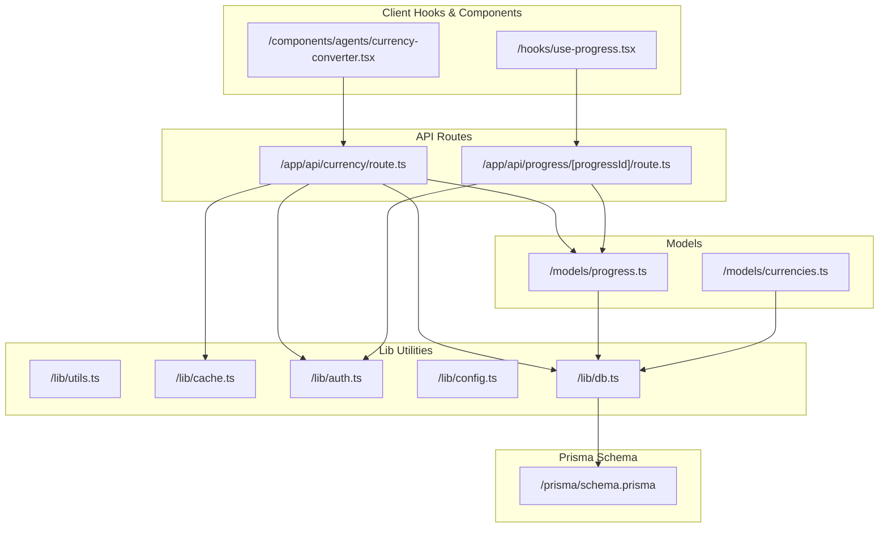
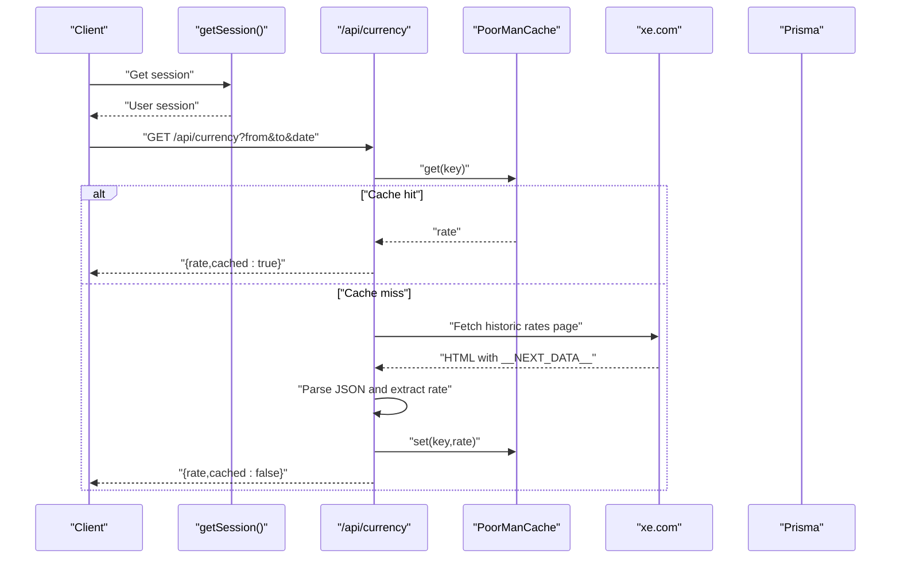
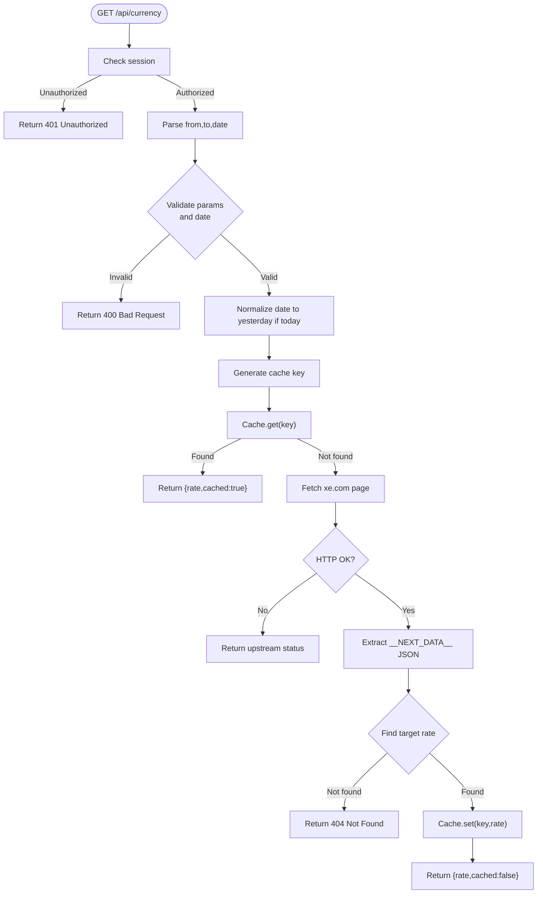
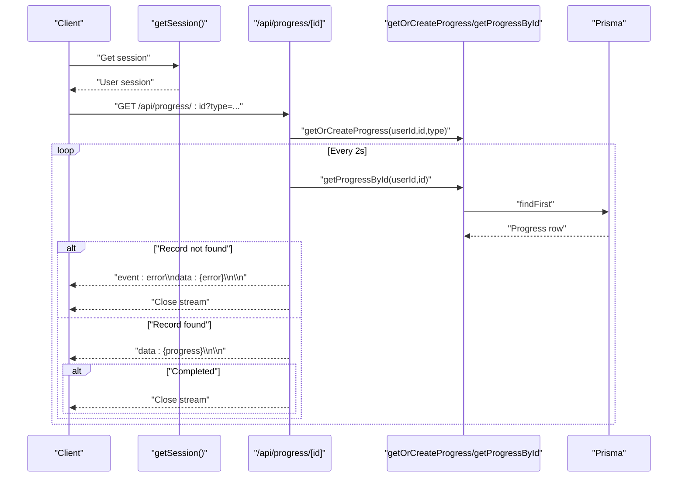
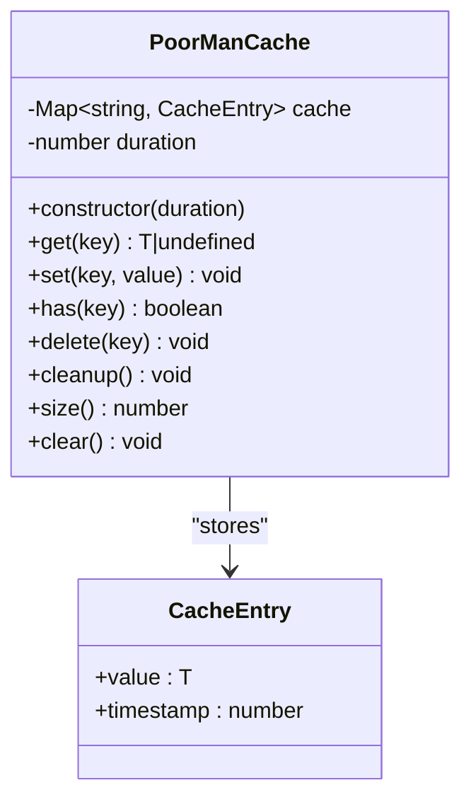
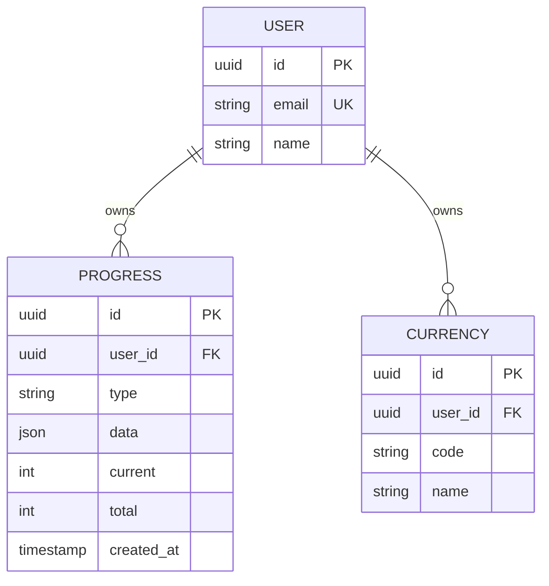
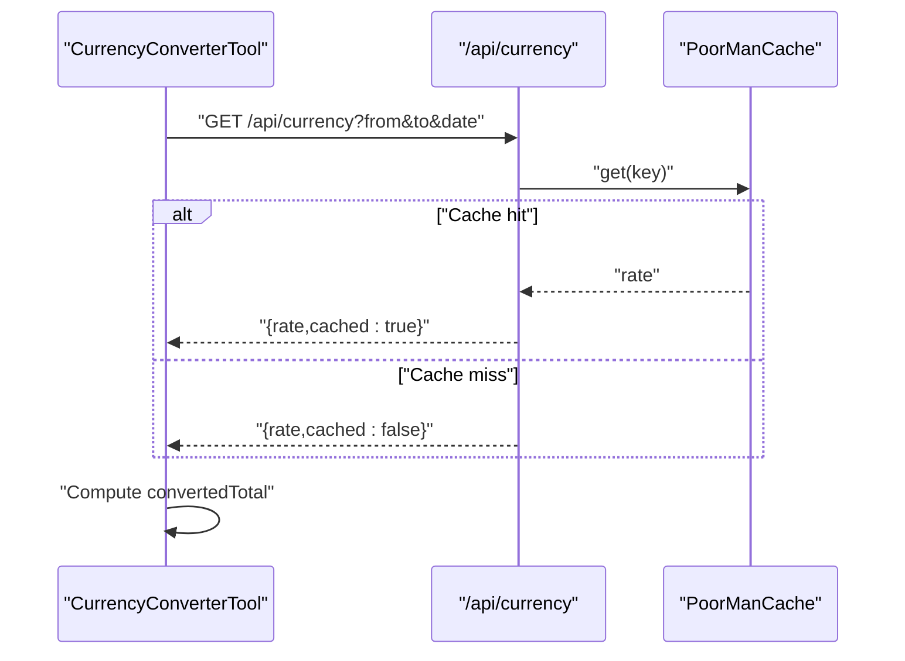
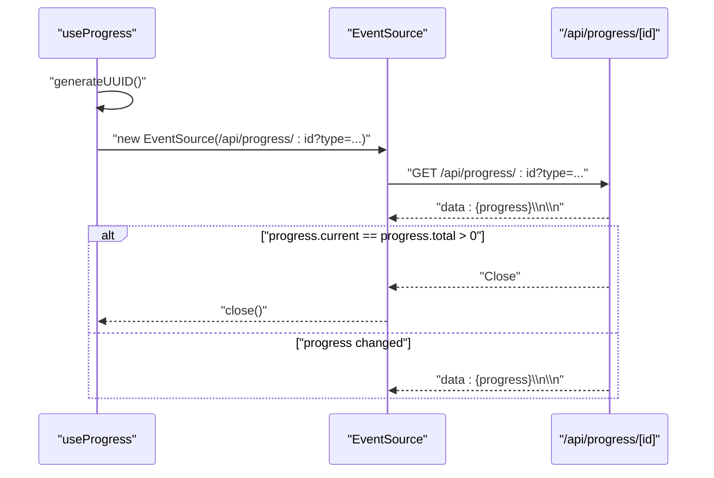
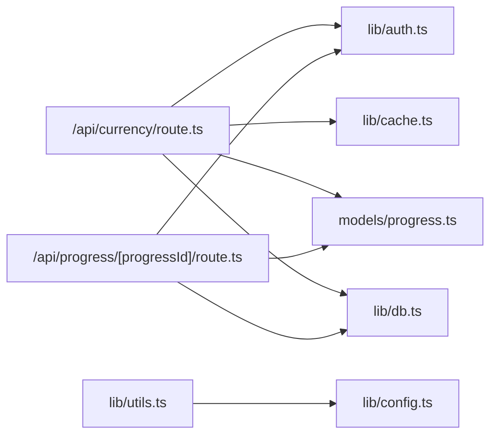

# Utility API

<cite>
**Referenced Files in This Document**
- [route.ts](file://app/api/currency/route.ts)
- [route.ts](file://app/api/progress/[progressId]/route.ts)
- [utils.ts](file://lib/utils.ts)
- [cache.ts](file://lib/cache.ts)
- [progress.ts](file://models/progress.ts)
- [currencies.ts](file://models/currencies.ts)
- [schema.prisma](file://prisma/schema.prisma)
- [config.ts](file://lib/config.ts)
- [auth.ts](file://lib/auth.ts)
- [db.ts](file://lib/db.ts)
- [use-progress.tsx](file://hooks/use-progress.tsx)
- [currency-converter.tsx](file://components/agents/currency-converter.tsx)
</cite>

## Table of Contents
1. [Introduction](#introduction)
2. [Project Structure](#project-structure)
3. [Core Components](#core-components)
4. [Architecture Overview](#architecture-overview)
5. [Detailed Component Analysis](#detailed-component-analysis)
6. [Dependency Analysis](#dependency-analysis)
7. [Performance Considerations](#performance-considerations)
8. [Troubleshooting Guide](#troubleshooting-guide)
9. [Conclusion](#conclusion)
10. [Appendices](#appendices)

## Introduction
This document describes the utility APIs and related utilities used by TaxHacker. It focuses on:
- Currency conversion endpoint for historical exchange rates
- Progress tracking endpoint for real-time status updates via Server-Sent Events (SSE)
- Utility functions for date formatting, data validation, and system configuration
- Request/response schemas, caching strategies, and performance considerations
- Client implementation examples for currency conversion workflows, progress monitoring, and utility function usage
- Error handling patterns, fallback mechanisms, and debugging approaches

## Project Structure
The utility endpoints are implemented as Next.js App Router API routes under app/api. Supporting utilities live in lib, and persistence is handled by Prisma models.

**Diagram sources**
- [route.ts:1-103](file://app/api/currency/route.ts#L1-L103)
- [route.ts:1-65](file://app/api/progress/[progressId]/route.ts#L1-L65)
- [utils.ts:1-159](file://lib/utils.ts#L1-L159)
- [cache.ts:1-109](file://lib/cache.ts#L1-L109)
- [progress.ts:1-63](file://models/progress.ts#L1-L63)
- [currencies.ts:1-39](file://models/currencies.ts#L1-L39)
- [schema.prisma:227-239](file://prisma/schema.prisma#L227-L239)
- [auth.ts:1-114](file://lib/auth.ts#L1-L114)
- [db.ts:1-10](file://lib/db.ts#L1-L10)
- [use-progress.tsx:1-87](file://hooks/use-progress.tsx#L1-L87)
- [currency-converter.tsx:1-118](file://components/agents/currency-converter.tsx#L1-L118)

**Section sources**
- [route.ts:1-103](file://app/api/currency/route.ts#L1-L103)
- [route.ts:1-65](file://app/api/progress/[progressId]/route.ts#L1-L65)
- [utils.ts:1-159](file://lib/utils.ts#L1-L159)
- [cache.ts:1-109](file://lib/cache.ts#L1-L109)
- [progress.ts:1-63](file://models/progress.ts#L1-L63)
- [currencies.ts:1-39](file://models/currencies.ts#L1-L39)
- [schema.prisma:227-239](file://prisma/schema.prisma#L227-L239)
- [auth.ts:1-114](file://lib/auth.ts#L1-L114)
- [db.ts:1-10](file://lib/db.ts#L1-L10)
- [use-progress.tsx:1-87](file://hooks/use-progress.tsx#L1-L87)
- [currency-converter.tsx:1-118](file://components/agents/currency-converter.tsx#L1-L118)

## Core Components
- Currency conversion API: Fetches historical exchange rates for a given date and pair, with caching and fallback parsing.
- Progress tracking API: Streams progress updates via SSE for long-running tasks.
- Utility functions: Formatting helpers, UUID generation, base64 image fetch, and configuration accessors.
- Caching: In-memory cache with TTL and periodic cleanup.
- Persistence: Progress and currencies stored in PostgreSQL via Prisma.

**Section sources**
- [route.ts:23-102](file://app/api/currency/route.ts#L23-L102)
- [route.ts:7-64](file://app/api/progress/[progressId]/route.ts#L7-L64)
- [utils.ts:12-159](file://lib/utils.ts#L12-L159)
- [cache.ts:7-108](file://lib/cache.ts#L7-L108)
- [progress.ts:3-49](file://models/progress.ts#L3-L49)
- [currencies.ts:5-38](file://models/currencies.ts#L5-L38)

## Architecture Overview
The utility APIs are protected by session checks and rely on Prisma for persistence. The currency endpoint scrapes a third-party page for historical rates and caches results. The progress endpoint streams updates via SSE.

**Diagram sources**
- [route.ts:23-97](file://app/api/currency/route.ts#L23-L97)
- [cache.ts:25-51](file://lib/cache.ts#L25-L51)
- [auth.ts:67-76](file://lib/auth.ts#L67-L76)

**Section sources**
- [route.ts:23-97](file://app/api/currency/route.ts#L23-L97)
- [cache.ts:7-108](file://lib/cache.ts#L7-L108)
- [auth.ts:67-76](file://lib/auth.ts#L67-L76)

## Detailed Component Analysis

### Currency Conversion Endpoint
- Path: /api/currency
- Method: GET
- Purpose: Return historical exchange rate for a currency pair on a specific date, with caching and fallback parsing.

#### Authentication and Authorization
- Requires a valid user session. Unauthorized requests return 401.

#### Request Parameters
- from: Base currency code (required)
- to: Target currency code (required)
- date: ISO date string (required)

#### Response Schemas
- Success (cached=true): { rate: number, cached: true }
- Success (cached=false): { rate: number, cached: false }
- Errors:
  - 400: Missing required parameters or invalid date format
  - 404: No rates found for the date or specific currency not found
  - 500: Internal server error or missing data in the scraped page

#### Processing Logic
- Validates session and parameters.
- Normalizes date to yesterday if today is requested.
- Generates cache key from from, to, and formatted date.
- Checks cache; if present, returns cached rate.
- Fetches historical rates page from xe.com.
- Parses __NEXT_DATA__ script tag to extract historicRates array.
- Searches for target currency rate; stores in cache if found.
- Returns rate with cached flag indicating cache hit.

**Diagram sources**
- [route.ts:23-97](file://app/api/currency/route.ts#L23-L97)
- [cache.ts:25-51](file://lib/cache.ts#L25-L51)

**Section sources**
- [route.ts:23-102](file://app/api/currency/route.ts#L23-L102)
- [cache.ts:7-108](file://lib/cache.ts#L7-L108)

### Progress Tracking Endpoint
- Path: /api/progress/[progressId]
- Method: GET
- Purpose: Stream progress updates for a long-running operation via SSE.

#### Authentication and Authorization
- Requires a valid user session. Unauthorized requests return 401.

#### Request Parameters
- type: Optional type string to categorize progress (default "unknown")

#### Streaming Behavior
- Establishes SSE stream with keep-alive headers.
- Polls progress every 2 seconds.
- Sends progress events only when changed.
- Closes stream upon completion (current equals total and total greater than zero).
- Emits an error event if progress record is not found.

**Diagram sources**
- [route.ts:7-64](file://app/api/progress/[progressId]/route.ts#L7-L64)
- [progress.ts:3-29](file://models/progress.ts#L3-L29)
- [auth.ts:67-76](file://lib/auth.ts#L67-L76)

**Section sources**
- [route.ts:7-64](file://app/api/progress/[progressId]/route.ts#L7-L64)
- [progress.ts:3-29](file://models/progress.ts#L3-L29)
- [auth.ts:67-76](file://lib/auth.ts#L67-L76)

### Utility Functions
- Date formatting helpers: formatCurrency, formatNumber, formatBytes, formatPeriodLabel
- Data validation and encoding: codeFromName, encodeFilename
- Cryptographic utilities: generateUUID, fetchAsBase64
- Color utilities: randomHexColor
- Configuration accessors: environment-based configuration via lib/config.ts

These utilities are used across the client and server for consistent formatting and safe operations.

**Section sources**
- [utils.ts:12-159](file://lib/utils.ts#L12-L159)
- [config.ts:1-82](file://lib/config.ts#L1-L82)

### Caching Strategies
- PoorManCache: In-memory cache with TTL and periodic cleanup.
- Currency endpoint uses a 24-hour TTL cache keyed by from/to/date.
- Cleanup runs every 90 minutes to remove expired entries.

**Diagram sources**
- [cache.ts:7-108](file://lib/cache.ts#L7-L108)

**Section sources**
- [route.ts:12-21](file://app/api/currency/route.ts#L12-L21)
- [cache.ts:7-108](file://lib/cache.ts#L7-L108)

### Data Models and Persistence
- Progress model tracks current and total counts, type, and optional data.
- Currency model stores user-specific currencies with unique code per user.
- Prisma client is globally cached to avoid reconnect overhead.

**Diagram sources**
- [schema.prisma:227-239](file://prisma/schema.prisma#L227-L239)
- [schema.prisma:205-214](file://prisma/schema.prisma#L205-L214)

**Section sources**
- [progress.ts:3-49](file://models/progress.ts#L3-L49)
- [currencies.ts:5-38](file://models/currencies.ts#L5-L38)
- [schema.prisma:227-239](file://prisma/schema.prisma#L227-L239)
- [schema.prisma:205-214](file://prisma/schema.prisma#L205-L214)
- [db.ts:1-10](file://lib/db.ts#L1-L10)

### Client Implementation Examples

#### Currency Conversion Workflow
- Use the CurrencyConverterTool component to fetch and display converted amounts.
- Internally calls /api/currency with from, to, and date parameters.
- Handles errors and retries gracefully.

**Diagram sources**
- [currency-converter.tsx:8-20](file://components/agents/currency-converter.tsx#L8-L20)
- [route.ts:23-97](file://app/api/currency/route.ts#L23-L97)
- [cache.ts:25-51](file://lib/cache.ts#L25-L51)

**Section sources**
- [currency-converter.tsx:1-118](file://components/agents/currency-converter.tsx#L1-L118)
- [route.ts:23-97](file://app/api/currency/route.ts#L23-L97)

#### Progress Monitoring
- Use the useProgress hook to start and monitor progress via SSE.
- Starts a new progress session by generating a UUID and connecting to /api/progress/[id].
- Parses incoming messages and closes automatically on completion.

**Diagram sources**
- [use-progress.tsx:32-79](file://hooks/use-progress.tsx#L32-L79)
- [route.ts:20-54](file://app/api/progress/[progressId]/route.ts#L20-L54)

**Section sources**
- [use-progress.tsx:1-87](file://hooks/use-progress.tsx#L1-L87)
- [route.ts:7-64](file://app/api/progress/[progressId]/route.ts#L7-L64)

## Dependency Analysis
- Currency endpoint depends on:
  - Session validation (lib/auth.ts)
  - PoorManCache (lib/cache.ts)
  - Prisma models (models/progress.ts) for initial upsert
  - Prisma client (lib/db.ts)
  - Third-party xe.com historical rates page
- Progress endpoint depends on:
  - Session validation (lib/auth.ts)
  - Prisma models (models/progress.ts)
  - Prisma client (lib/db.ts)
- Utilities depend on:
  - Environment configuration (lib/config.ts)
  - Browser/Node crypto APIs for UUID generation

**Diagram sources**
- [route.ts:1-4](file://app/api/currency/route.ts#L1-L4)
- [route.ts:1-3](file://app/api/progress/[progressId]/route.ts#L1-L3)
- [utils.ts:1-10](file://lib/utils.ts#L1-L10)
- [auth.ts:1-11](file://lib/auth.ts#L1-L11)
- [db.ts:1-10](file://lib/db.ts#L1-L10)
- [progress.ts:1-1](file://models/progress.ts#L1-L1)

**Section sources**
- [route.ts:1-4](file://app/api/currency/route.ts#L1-L4)
- [route.ts:1-3](file://app/api/progress/[progressId]/route.ts#L1-L3)
- [utils.ts:1-10](file://lib/utils.ts#L1-L10)
- [auth.ts:1-11](file://lib/auth.ts#L1-L11)
- [db.ts:1-10](file://lib/db.ts#L1-L10)
- [progress.ts:1-1](file://models/progress.ts#L1-L1)

## Performance Considerations
- Currency endpoint:
  - Uses a 24-hour TTL cache to reduce external requests and parsing overhead.
  - Periodic cleanup every 90 minutes prevents memory growth.
  - Scrapes xe.com; network latency and availability are potential bottlenecks.
- Progress endpoint:
  - SSE reduces server load compared to polling.
  - 2-second polling interval balances responsiveness and resource usage.
- Utilities:
  - UUID generation prefers native crypto APIs with fallbacks to ensure compatibility.
  - Formatting functions use built-in Intl APIs for locale-aware output.

[No sources needed since this section provides general guidance]

## Troubleshooting Guide
- Currency endpoint errors:
  - 400: Missing parameters or invalid date format. Verify from, to, and date query parameters.
  - 404: No rates found for the date or specific currency not available. Confirm date and currency codes.
  - 500: Missing data in scraped page or internal error. Check network connectivity and upstream service status.
  - Debugging: Inspect console logs for error messages and verify cache key generation and HTML parsing.
- Progress endpoint errors:
  - 401: Unauthorized. Ensure user session is established.
  - Not found: Progress record does not exist for the user. Verify progressId and user association.
  - SSE connection issues: Confirm browser support for EventSource and CORS headers.
- Utility functions:
  - UUID generation failures: Falls back to Math.random() if crypto APIs unavailable.
  - Formatting errors: Some currencies or locales may cause exceptions; fallback formats are used.

**Section sources**
- [route.ts:35-101](file://app/api/currency/route.ts#L35-L101)
- [route.ts:9-37](file://app/api/progress/[progressId]/route.ts#L9-L37)
- [utils.ts:106-140](file://lib/utils.ts#L106-L140)

## Conclusion
The utility APIs provide robust mechanisms for currency conversion with caching and progress tracking via SSE. The design emphasizes reliability, performance, and developer-friendly client integrations. Proper error handling and fallbacks ensure graceful degradation when upstream services or network conditions are suboptimal.

[No sources needed since this section summarizes without analyzing specific files]

## Appendices

### API Reference: Currency Conversion
- Endpoint: GET /api/currency
- Query Parameters:
  - from: string (required)
  - to: string (required)
  - date: string (required; ISO date)
- Responses:
  - 200: { rate: number, cached: boolean }
  - 400: { error: string }
  - 401: { error: string }
  - 404: { error: string }
  - 500: { error: string }

**Section sources**
- [route.ts:23-102](file://app/api/currency/route.ts#L23-L102)

### API Reference: Progress Tracking
- Endpoint: GET /api/progress/[progressId]
- Query Parameters:
  - type: string (optional; default "unknown")
- Response:
  - 200: SSE stream with progress events
  - 401: { error: string }
  - 404: { error: "Not found" } (sent as event)

**Section sources**
- [route.ts:7-64](file://app/api/progress/[progressId]/route.ts#L7-L64)

### Client Hooks and Components
- useProgress: Manages SSE connection, parses progress events, and handles completion.
- CurrencyConverterTool: Fetches rates and displays conversions with retry logic.

**Section sources**
- [use-progress.tsx:1-87](file://hooks/use-progress.tsx#L1-L87)
- [currency-converter.tsx:1-118](file://components/agents/currency-converter.tsx#L1-L118)