# Authentication & User Management

<cite>
**Referenced Files in This Document**
- [lib/auth.ts](file://lib/auth.ts)
- [lib/auth-client.ts](file://lib/auth-client.ts)
- [middleware.ts](file://middleware.ts)
- [lib/config.ts](file://lib/config.ts)
- [lib/email.ts](file://lib/email.ts)
- [components/emails/otp-email.tsx](file://components/emails/otp-email.tsx)
- [app/(auth)/enter/page.tsx](file://app/(auth)/enter/page.tsx)
- [components/auth/login-form.tsx](file://components/auth/login-form.tsx)
- [app/(auth)/self-hosted/page.tsx](file://app/(auth)/self-hosted/page.tsx)
- [app/(auth)/self-hosted/setup-form-client.tsx](file://app/(auth)/self-hosted/setup-form-client.tsx)
- [app/(auth)/actions.ts](file://app/(auth)/actions.ts)
- [models/users.ts](file://models/users.ts)
- [lib/db.ts](file://lib/db.ts)
- [prisma/schema.prisma](file://prisma/schema.prisma)
</cite>

## Table of Contents
1. [Introduction](#introduction)
2. [Project Structure](#project-structure)
3. [Core Components](#core-components)
4. [Architecture Overview](#architecture-overview)
5. [Detailed Component Analysis](#detailed-component-analysis)
6. [Dependency Analysis](#dependency-analysis)
7. [Performance Considerations](#performance-considerations)
8. [Troubleshooting Guide](#troubleshooting-guide)
9. [Conclusion](#conclusion)

## Introduction
This document explains the authentication and user management system for TaxHacker. It covers:
- Better Auth integration with email OTP authentication
- Dual authentication modes: cloud-based with Better Auth and self-hosted mode with auto-login
- User registration and login workflows, session management, and JWT token handling
- Authentication guards, protected routes, and middleware
- User roles, permissions, and feature access based on subscription status
- Passwordless email authentication flow, OTP verification, and session persistence
- Self-hosted configuration options, custom API key management, and security considerations
- Troubleshooting guidance for authentication and session issues

## Project Structure
The authentication system spans configuration, server-side auth setup, client-side auth client, middleware protection, UI flows, and data models.

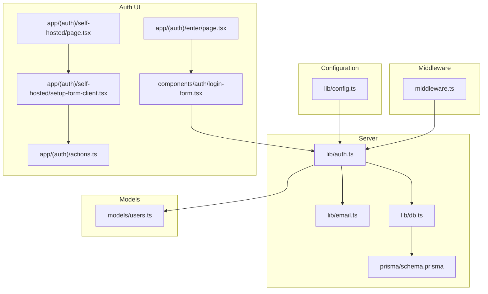

**Diagram sources**
- [lib/config.ts:1-82](file://lib/config.ts#L1-L82)
- [lib/auth.ts:1-114](file://lib/auth.ts#L1-L114)
- [lib/email.ts:1-30](file://lib/email.ts#L1-L30)
- [lib/db.ts:1-10](file://lib/db.ts#L1-L10)
- [prisma/schema.prisma:14-45](file://prisma/schema.prisma#L14-L45)
- [middleware.ts:1-28](file://middleware.ts#L1-L28)
- [app/(auth)/enter/page.tsx:1-25](file://app/(auth)/enter/page.tsx#L1-L25)
- [components/auth/login-form.tsx:1-94](file://components/auth/login-form.tsx#L1-L94)
- [app/(auth)/self-hosted/page.tsx:1-57](file://app/(auth)/self-hosted/page.tsx#L1-L57)
- [app/(auth)/self-hosted/setup-form-client.tsx:1-86](file://app/(auth)/self-hosted/setup-form-client.tsx#L1-L86)
- [app/(auth)/actions.ts:1-40](file://app/(auth)/actions.ts#L1-L40)
- [models/users.ts:1-69](file://models/users.ts#L1-L69)

**Section sources**
- [lib/config.ts:1-82](file://lib/config.ts#L1-L82)
- [lib/auth.ts:1-114](file://lib/auth.ts#L1-L114)
- [middleware.ts:1-28](file://middleware.ts#L1-L28)
- [prisma/schema.prisma:14-45](file://prisma/schema.prisma#L14-L45)
- [models/users.ts:1-69](file://models/users.ts#L1-L69)

## Core Components
- Better Auth server configuration with email OTP plugin, JWT session strategy, and cookie caching
- Client-side auth client configured for email OTP
- Middleware enforcing session presence for protected routes
- Self-hosted mode with auto-login and initial setup form
- Email provider integration via Resend for OTP delivery
- Prisma models for users, sessions, and related entities

Key responsibilities:
- Centralized auth configuration and session retrieval
- Route protection and redirection logic
- Self-hosted user creation and settings initialization
- Email OTP generation and delivery
- Subscription-based feature gating

**Section sources**
- [lib/auth.ts:25-65](file://lib/auth.ts#L25-L65)
- [lib/auth-client.ts:1-7](file://lib/auth-client.ts#L1-L7)
- [middleware.ts:5-15](file://middleware.ts#L5-L15)
- [app/(auth)/self-hosted/page.tsx:11-33](file://app/(auth)/self-hosted/page.tsx#L11-L33)
- [lib/email.ts:9-18](file://lib/email.ts#L9-L18)
- [prisma/schema.prisma:14-45](file://prisma/schema.prisma#L14-L45)

## Architecture Overview
The system supports two operational modes:
- Cloud mode: Better Auth handles sessions and redirects unauthenticated users to the login page
- Self-hosted mode: Auto-login occurs for a dedicated system user; middleware is bypassed; initial setup collects LLM keys and default currency

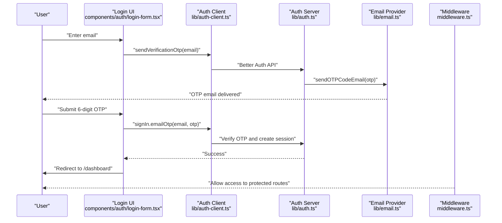

**Diagram sources**
- [components/auth/login-form.tsx:18-61](file://components/auth/login-form.tsx#L18-L61)
- [lib/auth-client.ts:4-6](file://lib/auth-client.ts#L4-L6)
- [lib/auth.ts:50-64](file://lib/auth.ts#L50-L64)
- [lib/email.ts:9-18](file://lib/email.ts#L9-L18)
- [middleware.ts:5-15](file://middleware.ts#L5-L15)

## Detailed Component Analysis

### Better Auth Server Setup
- Database adapter configured with Prisma for PostgreSQL
- Application name, base URL, and secret loaded from configuration
- Email provider configured via Resend with sender and API key
- Session strategy: JWT with long expiration and refresh window
- Cookie cache enabled for performance
- Plugins:
  - Email OTP with configurable length, expiry, sign-up policy, and custom OTP delivery hook
  - Cookies plugin for session persistence

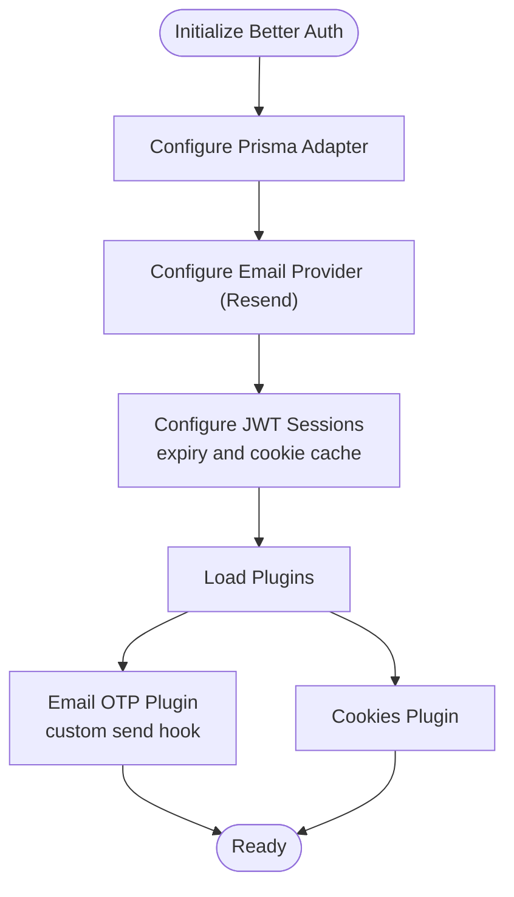

**Diagram sources**
- [lib/auth.ts:25-65](file://lib/auth.ts#L25-L65)

**Section sources**
- [lib/auth.ts:25-65](file://lib/auth.ts#L25-L65)
- [lib/config.ts:63-78](file://lib/config.ts#L63-L78)

### Client-Side Auth Client
- Creates a Better Auth client with email OTP plugin
- Used by the login form to send OTP and verify codes

**Section sources**
- [lib/auth-client.ts:1-7](file://lib/auth-client.ts#L1-L7)
- [components/auth/login-form.tsx:6-6](file://components/auth/login-form.tsx#L6-L6)

### Login Workflow (Cloud Mode)
- Renders the cloud login page and the login form
- The login form sends OTP to the provided email and verifies the 6-digit code
- On success, redirects to the dashboard

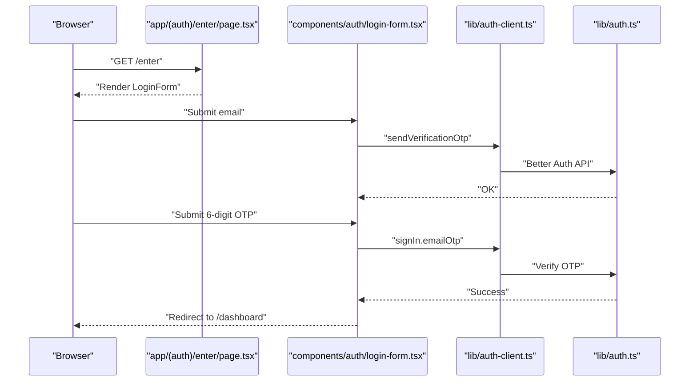

**Diagram sources**
- [app/(auth)/enter/page.tsx:8-24](file://app/(auth)/enter/page.tsx#L8-L24)
- [components/auth/login-form.tsx:18-61](file://components/auth/login-form.tsx#L18-L61)
- [lib/auth-client.ts:4-6](file://lib/auth-client.ts#L4-L6)
- [lib/auth.ts:50-64](file://lib/auth.ts#L50-L64)

**Section sources**
- [app/(auth)/enter/page.tsx:8-24](file://app/(auth)/enter/page.tsx#L8-L24)
- [components/auth/login-form.tsx:10-94](file://components/auth/login-form.tsx#L10-L94)

### Self-Hosted Mode and Auto-Login
- Self-hosted mode is enabled via configuration
- If enabled, the system auto-logs in a dedicated system user and redirects to a configured URL
- Initial setup page collects provider selection, API keys, and default currency
- On submit, settings are persisted and the user is redirected to the dashboard

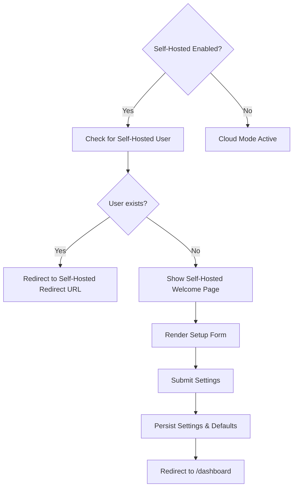

**Diagram sources**
- [lib/config.ts:50-54](file://lib/config.ts#L50-L54)
- [app/(auth)/self-hosted/page.tsx:11-33](file://app/(auth)/self-hosted/page.tsx#L11-L33)
- [app/(auth)/self-hosted/setup-form-client.tsx:16-86](file://app/(auth)/self-hosted/setup-form-client.tsx#L16-L86)
- [app/(auth)/actions.ts:9-39](file://app/(auth)/actions.ts#L9-L39)
- [models/users.ts:13-29](file://models/users.ts#L13-L29)

**Section sources**
- [lib/config.ts:50-54](file://lib/config.ts#L50-L54)
- [app/(auth)/self-hosted/page.tsx:11-54](file://app/(auth)/self-hosted/page.tsx#L11-L54)
- [app/(auth)/self-hosted/setup-form-client.tsx:16-86](file://app/(auth)/self-hosted/setup-form-client.tsx#L16-L86)
- [app/(auth)/actions.ts:9-39](file://app/(auth)/actions.ts#L9-L39)
- [models/users.ts:7-29](file://models/users.ts#L7-L29)

### Middleware and Protected Routes
- Middleware checks for a session cookie prefix used by Better Auth
- If missing, redirects to the configured login URL
- Applies to protected routes under transactions, settings, exports, imports, files, and dashboard

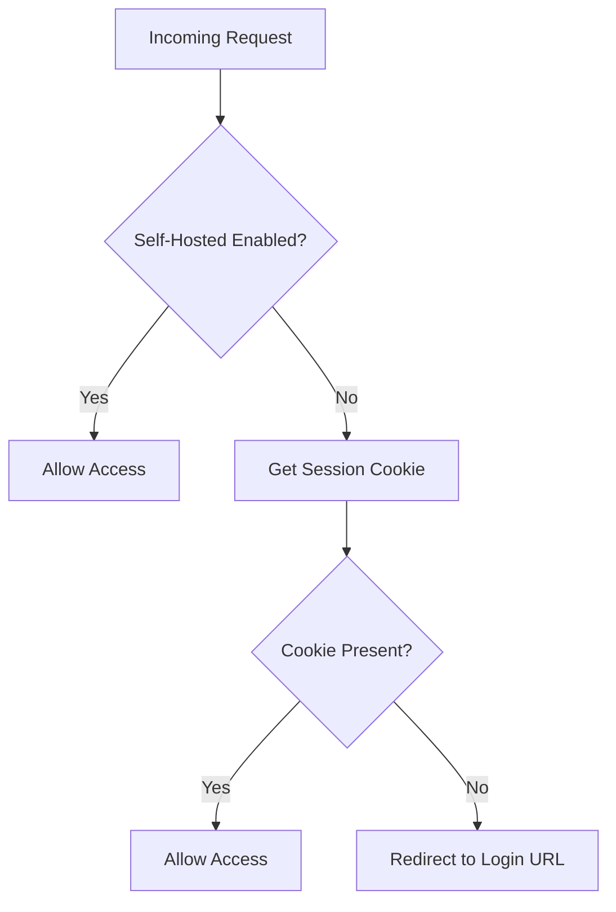

**Diagram sources**
- [middleware.ts:5-15](file://middleware.ts#L5-L15)
- [lib/config.ts:65-66](file://lib/config.ts#L65-L66)

**Section sources**
- [middleware.ts:5-27](file://middleware.ts#L5-L27)
- [lib/config.ts:65-66](file://lib/config.ts#L65-L66)

### Session Management and JWT Handling
- JWT sessions configured with long expiry and periodic updates
- Cookie cache enabled for improved performance
- Session retrieval and current user resolution handled centrally
- Self-hosted mode bypasses Better Auth sessions and returns a system user

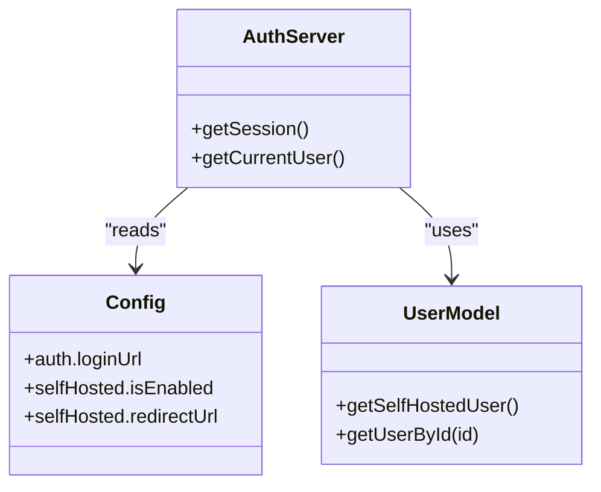

**Diagram sources**
- [lib/auth.ts:67-99](file://lib/auth.ts#L67-L99)
- [lib/config.ts:50-54](file://lib/config.ts#L50-L54)
- [models/users.ts:13-49](file://models/users.ts#L13-L49)

**Section sources**
- [lib/auth.ts:35-43](file://lib/auth.ts#L35-L43)
- [lib/auth.ts:67-99](file://lib/auth.ts#L67-L99)
- [lib/config.ts:50-54](file://lib/config.ts#L50-L54)

### Email OTP Delivery
- OTP emails are sent via Resend with a templated OTP component
- The OTP is generated and delivered by Better Auth’s email OTP plugin
- Expiration is enforced server-side

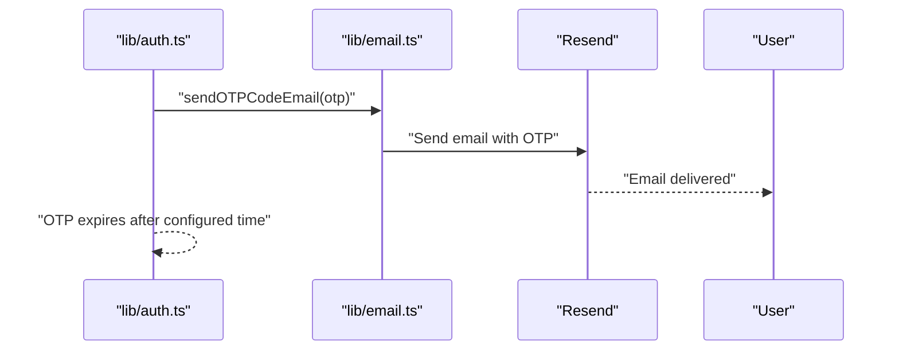

**Diagram sources**
- [lib/auth.ts:55-61](file://lib/auth.ts#L55-L61)
- [lib/email.ts:9-18](file://lib/email.ts#L9-L18)
- [components/emails/otp-email.tsx:8-38](file://components/emails/otp-email.tsx#L8-L38)

**Section sources**
- [lib/auth.ts:50-64](file://lib/auth.ts#L50-L64)
- [lib/email.ts:9-18](file://lib/email.ts#L9-L18)
- [components/emails/otp-email.tsx:1-39](file://components/emails/otp-email.tsx#L1-L39)

### User Roles, Permissions, and Feature Access
- Subscription-based gating:
  - Subscription expiration check
  - AI balance exhaustion check (skips for self-hosted)
- Self-hosted mode uses a special system user profile with unlimited access
- Middleware protects routes; feature checks can be applied in UI logic based on user attributes

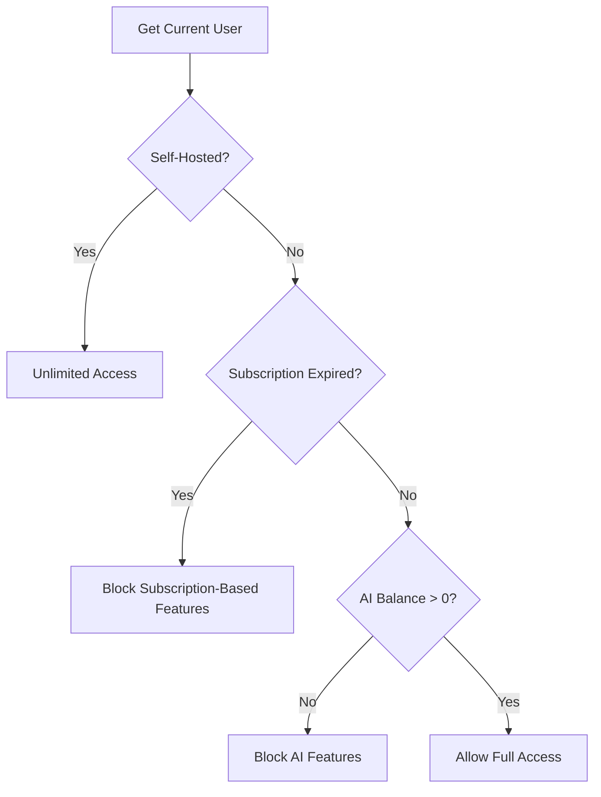

**Diagram sources**
- [lib/auth.ts:101-113](file://lib/auth.ts#L101-L113)
- [models/users.ts:7-11](file://models/users.ts#L7-L11)

**Section sources**
- [lib/auth.ts:101-113](file://lib/auth.ts#L101-L113)
- [models/users.ts:7-11](file://models/users.ts#L7-L11)

### Data Model Overview
Users, sessions, and related entities are defined in Prisma. Users include subscription and feature-related fields.

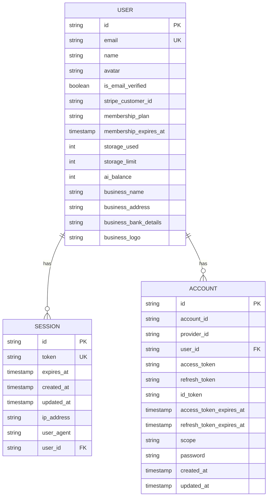

**Diagram sources**
- [prisma/schema.prisma:14-45](file://prisma/schema.prisma#L14-L45)
- [prisma/schema.prisma:47-79](file://prisma/schema.prisma#L47-L79)
- [prisma/schema.prisma:62-79](file://prisma/schema.prisma#L62-L79)

**Section sources**
- [prisma/schema.prisma:14-45](file://prisma/schema.prisma#L14-L45)
- [prisma/schema.prisma:47-79](file://prisma/schema.prisma#L47-L79)

## Dependency Analysis
- Configuration drives Better Auth setup, email provider, and feature toggles
- Middleware depends on session cookies and configuration for redirects
- UI components depend on the client auth library and server endpoints
- Models encapsulate user and session access patterns
- Prisma schema defines the underlying data model

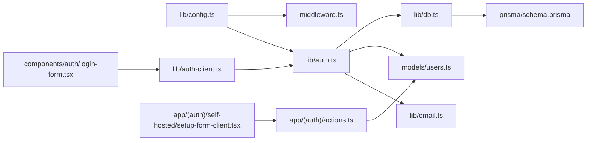

**Diagram sources**
- [lib/config.ts:1-82](file://lib/config.ts#L1-L82)
- [lib/auth.ts:1-114](file://lib/auth.ts#L1-L114)
- [lib/email.ts:1-30](file://lib/email.ts#L1-L30)
- [models/users.ts:1-69](file://models/users.ts#L1-L69)
- [lib/db.ts:1-10](file://lib/db.ts#L1-L10)
- [prisma/schema.prisma:14-45](file://prisma/schema.prisma#L14-L45)
- [components/auth/login-form.tsx:1-94](file://components/auth/login-form.tsx#L1-L94)
- [lib/auth-client.ts:1-7](file://lib/auth-client.ts#L1-L7)
- [app/(auth)/self-hosted/setup-form-client.tsx:1-86](file://app/(auth)/self-hosted/setup-form-client.tsx#L1-L86)
- [app/(auth)/actions.ts:1-40](file://app/(auth)/actions.ts#L1-L40)

**Section sources**
- [lib/config.ts:1-82](file://lib/config.ts#L1-L82)
- [lib/auth.ts:1-114](file://lib/auth.ts#L1-L114)
- [middleware.ts:1-28](file://middleware.ts#L1-L28)
- [models/users.ts:1-69](file://models/users.ts#L1-L69)
- [prisma/schema.prisma:14-45](file://prisma/schema.prisma#L14-L45)

## Performance Considerations
- JWT sessions with cookie cache reduce server load and improve response times
- Long session expiry reduces re-auth frequency; periodic updates keep sessions fresh
- Middleware checks are lightweight and only apply to protected routes
- Email OTP delivery uses a single provider; ensure provider quotas and retry policies are considered

[No sources needed since this section provides general guidance]

## Troubleshooting Guide
Common issues and resolutions:
- OTP not received
  - Verify email provider credentials and sender configuration
  - Confirm OTP email template renders correctly
  - Check for rate limits or deliverability issues
- OTP invalid or expired
  - Ensure OTP length and expiry match configuration
  - Confirm client and server clocks are synchronized
- Redirect loops to login
  - Check session cookie presence and prefix
  - Verify login URL configuration
- Self-hosted mode not activating
  - Confirm self-hosted flag is enabled
  - Ensure system user exists and redirect URL is configured
- Subscription-based feature blocked unexpectedly
  - Validate subscription expiration and AI balance fields
  - Confirm self-hosted mode bypass logic

**Section sources**
- [lib/config.ts:63-78](file://lib/config.ts#L63-L78)
- [lib/auth.ts:50-64](file://lib/auth.ts#L50-L64)
- [middleware.ts:5-15](file://middleware.ts#L5-L15)
- [lib/email.ts:9-18](file://lib/email.ts#L9-L18)
- [models/users.ts:7-11](file://models/users.ts#L7-L11)

## Conclusion
TaxHacker’s authentication system combines Better Auth with email OTP for secure, passwordless cloud login and a streamlined self-hosted auto-login experience. JWT sessions with cookie caching optimize performance, while middleware and configuration enforce access control. Subscription and feature gating ensure appropriate access controls across modes. The modular design allows easy maintenance and extension of authentication and user management features.