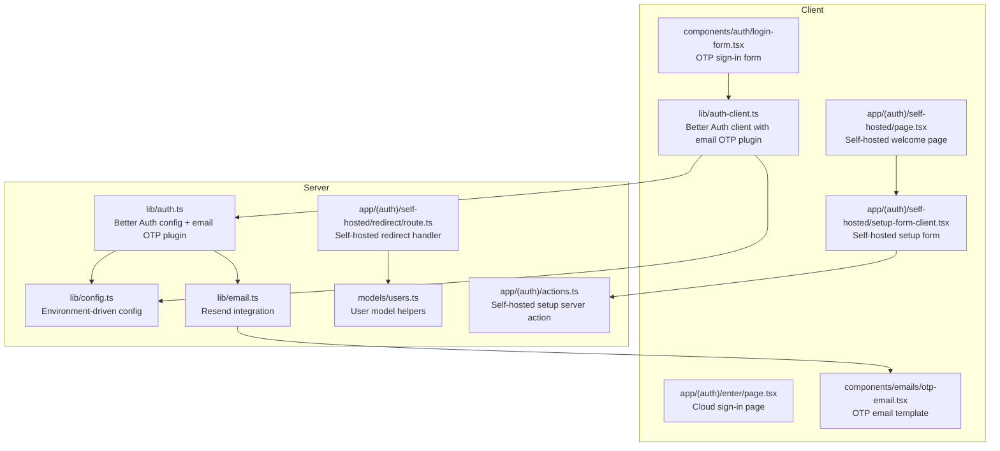
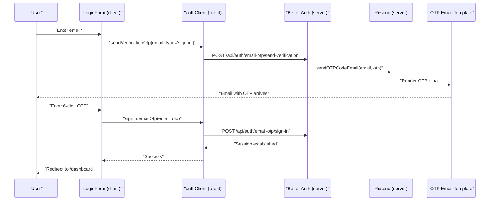
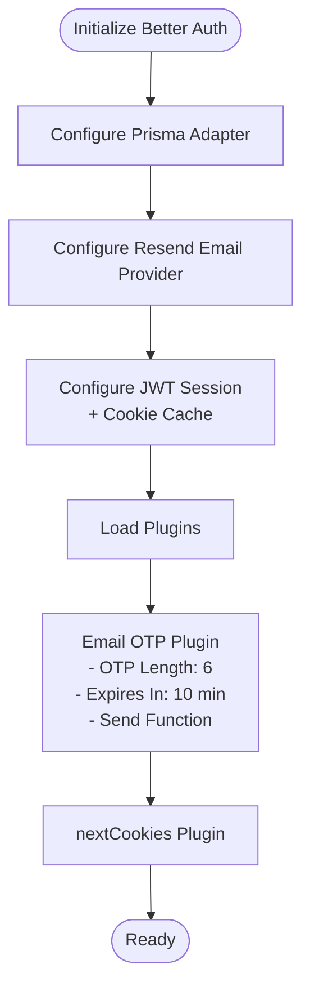
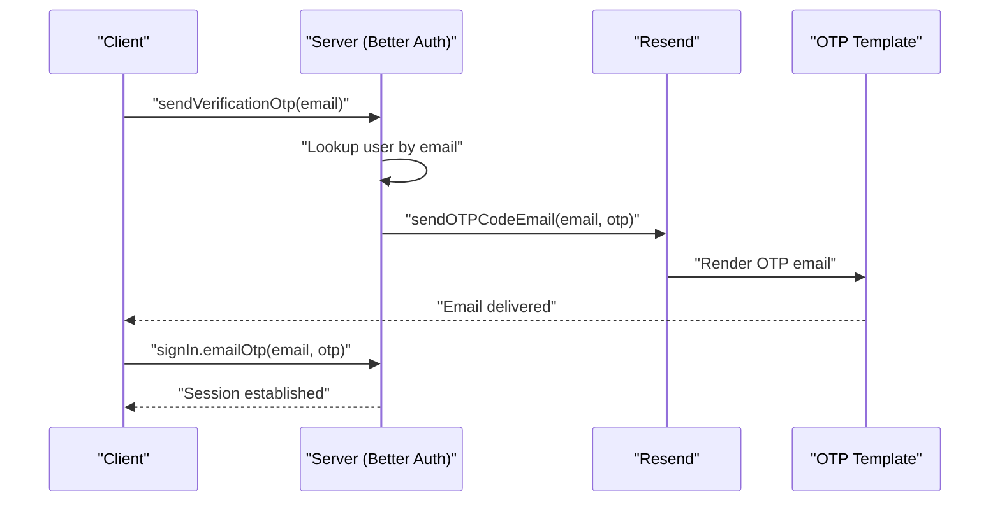
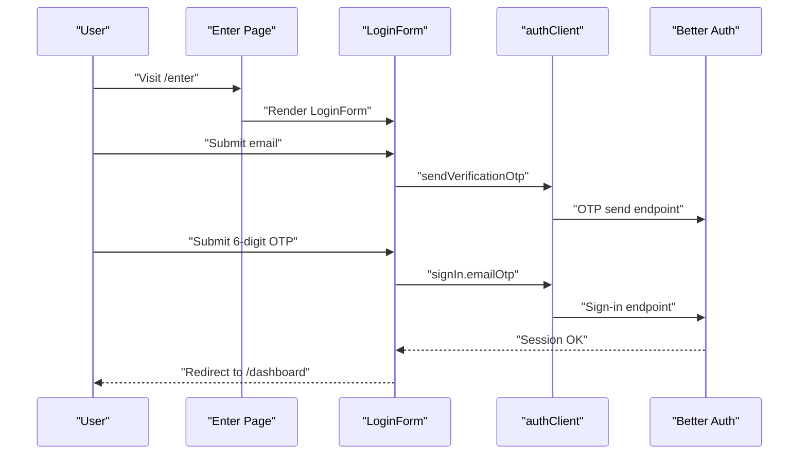
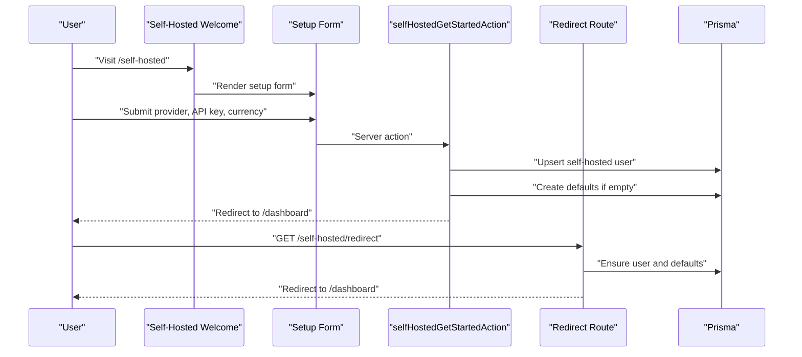
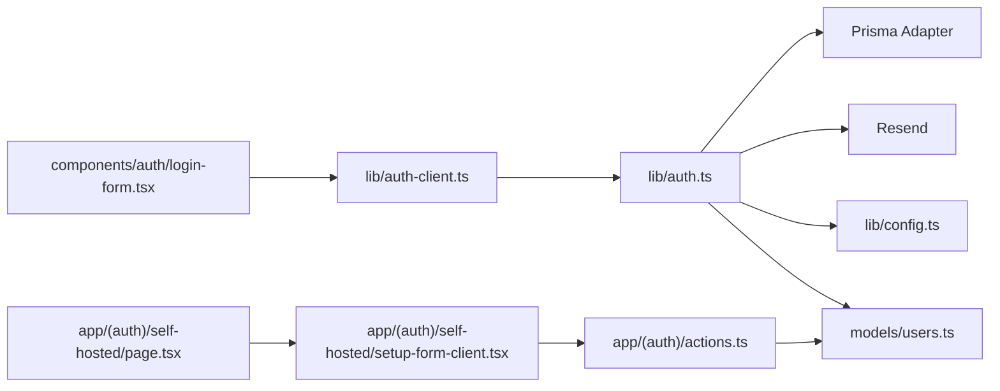

# Authentication Mechanisms

<cite>
**Referenced Files in This Document**
- [lib/auth.ts](file://lib/auth.ts)
- [lib/auth-client.ts](file://lib/auth-client.ts)
- [lib/config.ts](file://lib/config.ts)
- [lib/email.ts](file://lib/email.ts)
- [components/auth/login-form.tsx](file://components/auth/login-form.tsx)
- [app/(auth)/enter/page.tsx](file://app/(auth)/enter/page.tsx)
- [app/(auth)/cloud/page.tsx](file://app/(auth)/cloud/page.tsx)
- [app/(auth)/self-hosted/page.tsx](file://app/(auth)/self-hosted/page.tsx)
- [app/(auth)/self-hosted/setup-form-client.tsx](file://app/(auth)/self-hosted/setup-form-client.tsx)
- [app/(auth)/self-hosted/redirect/route.ts](file://app/(auth)/self-hosted/redirect/route.ts)
- [app/(auth)/actions.ts](file://app/(auth)/actions.ts)
- [models/users.ts](file://models/users.ts)
- [components/emails/otp-email.tsx](file://components/emails/otp-email.tsx)
</cite>

## Table of Contents
1. [Introduction](#introduction)
2. [Project Structure](#project-structure)
3. [Core Components](#core-components)
4. [Architecture Overview](#architecture-overview)
5. [Detailed Component Analysis](#detailed-component-analysis)
6. [Dependency Analysis](#dependency-analysis)
7. [Performance Considerations](#performance-considerations)
8. [Troubleshooting Guide](#troubleshooting-guide)
9. [Conclusion](#conclusion)
10. [Appendices](#appendices)

## Introduction
This document explains the authentication mechanisms in TaxHacker, focusing on the Better Auth integration with an email OTP system. It covers:
- Dual authentication modes: cloud-based with Better Auth and self-hosted mode with auto-login.
- Email OTP plugin configuration, OTP length, expiration, and verification flow.
- End-to-end authentication flow from registration to login and session establishment.
- Differences between cloud and self-hosted modes, including configuration and security implications.
- Authentication API endpoints, request/response patterns, and error handling.
- Practical examples for implementing authentication in Next.js app router using server actions and client components.

## Project Structure
Authentication spans several layers:
- Server-side configuration and session management via Better Auth.
- Client-side authentication client and UI components for OTP-based sign-in.
- Self-hosted mode with automatic user creation and initial setup.
- Email delivery via Resend with a dedicated OTP email template.

**Diagram sources**
- [lib/auth.ts:25-65](file://lib/auth.ts#L25-L65)
- [lib/config.ts:27-82](file://lib/config.ts#L27-L82)
- [lib/email.ts:7-18](file://lib/email.ts#L7-L18)
- [models/users.ts:13-29](file://models/users.ts#L13-L29)
- [app/(auth)/self-hosted/redirect/route.ts:7-23](file://app/(auth)/self-hosted/redirect/route.ts#L7-L23)
- [app/(auth)/actions.ts:9-39](file://app/(auth)/actions.ts#L9-L39)
- [lib/auth-client.ts:4-6](file://lib/auth-client.ts#L4-L6)
- [components/auth/login-form.tsx:18-61](file://components/auth/login-form.tsx#L18-L61)
- [app/(auth)/enter/page.tsx:8-24](file://app/(auth)/enter/page.tsx#L8-L24)
- [app/(auth)/self-hosted/page.tsx:11-54](file://app/(auth)/self-hosted/page.tsx#L11-L54)
- [app/(auth)/self-hosted/setup-form-client.tsx:16-85](file://app/(auth)/self-hosted/setup-form-client.tsx#L16-L85)
- [components/emails/otp-email.tsx:8-38](file://components/emails/otp-email.tsx#L8-L38)

**Section sources**
- [lib/auth.ts:25-65](file://lib/auth.ts#L25-L65)
- [lib/auth-client.ts:4-6](file://lib/auth-client.ts#L4-L6)
- [lib/config.ts:27-82](file://lib/config.ts#L27-L82)
- [lib/email.ts:7-18](file://lib/email.ts#L7-L18)
- [components/auth/login-form.tsx:18-61](file://components/auth/login-form.tsx#L18-L61)
- [app/(auth)/enter/page.tsx:8-24](file://app/(auth)/enter/page.tsx#L8-L24)
- [app/(auth)/cloud/page.tsx:8-38](file://app/(auth)/cloud/page.tsx#L8-L38)
- [app/(auth)/self-hosted/page.tsx:11-54](file://app/(auth)/self-hosted/page.tsx#L11-L54)
- [app/(auth)/self-hosted/setup-form-client.tsx:16-85](file://app/(auth)/self-hosted/setup-form-client.tsx#L16-L85)
- [app/(auth)/self-hosted/redirect/route.ts:7-23](file://app/(auth)/self-hosted/redirect/route.ts#L7-L23)
- [app/(auth)/actions.ts:9-39](file://app/(auth)/actions.ts#L9-L39)
- [models/users.ts:13-29](file://models/users.ts#L13-L29)
- [components/emails/otp-email.tsx:8-38](file://components/emails/otp-email.tsx#L8-L38)

## Core Components
- Better Auth server configuration with email OTP plugin:
  - Session strategy: JWT with long-lived cookie cache.
  - Email provider configured via Resend.
  - Email OTP plugin: fixed OTP length, expiration, and custom send function.
- Better Auth client with email OTP plugin for client-side flows.
- Environment-driven configuration controlling cloud vs self-hosted behavior and signup rules.
- Self-hosted user model and automatic setup flow.
- Email template for OTP delivery.

Key configuration highlights:
- OTP length: 6 digits.
- OTP expiration: 10 minutes.
- Disable sign-up flag is derived from environment and self-hosted mode.
- Session lifetime: 365 days with 24-hour update age.
- Cookie cache: 365 days.

**Section sources**
- [lib/auth.ts:25-65](file://lib/auth.ts#L25-L65)
- [lib/auth-client.ts:4-6](file://lib/auth-client.ts#L4-L6)
- [lib/config.ts:63-67](file://lib/config.ts#L63-L67)
- [lib/email.ts:7-18](file://lib/email.ts#L7-L18)
- [models/users.ts:7-11](file://models/users.ts#L7-L11)

## Architecture Overview
The system supports two authentication modes:

- Cloud mode (Better Auth):
  - Uses Better Auth server APIs for session management and OTP verification.
  - Client uses Better Auth client to trigger OTP send and sign-in.
  - Redirects to dashboard upon successful sign-in.

- Self-hosted mode:
  - Automatically creates a special self-hosted user if none exists.
  - Provides a setup form to configure LLM provider and default currency.
  - Redirects to dashboard after initial setup.

**Diagram sources**
- [components/auth/login-form.tsx:18-61](file://components/auth/login-form.tsx#L18-L61)
- [lib/auth-client.ts:4-6](file://lib/auth-client.ts#L4-L6)
- [lib/auth.ts:50-64](file://lib/auth.ts#L50-L64)
- [lib/email.ts:9-18](file://lib/email.ts#L9-L18)
- [components/emails/otp-email.tsx:8-38](file://components/emails/otp-email.tsx#L8-L38)

## Detailed Component Analysis

### Better Auth Server Configuration
- Database adapter: Prisma PostgreSQL.
- Application name, base URL, and secret loaded from environment.
- Email provider: Resend with sender address from environment.
- Session: JWT strategy with long expiry and cookie cache.
- Advanced: Cookie prefix and UUID generation.
- Plugins:
  - Email OTP plugin with:
    - Fixed OTP length and expiration.
    - Custom send function validating user existence and sending OTP email.
  - nextCookies plugin included last.

Session retrieval and current user resolution:
- For self-hosted mode: resolves a special user automatically.
- For cloud mode: retrieves session via Better Auth API and loads user by ID.

**Diagram sources**
- [lib/auth.ts:25-65](file://lib/auth.ts#L25-L65)

**Section sources**
- [lib/auth.ts:25-65](file://lib/auth.ts#L25-L65)
- [lib/config.ts:27-82](file://lib/config.ts#L27-L82)

### Better Auth Client
- Creates a client with email OTP plugin enabled.
- Used by the login form to trigger OTP send and sign-in.

**Section sources**
- [lib/auth-client.ts:4-6](file://lib/auth-client.ts#L4-L6)

### Email OTP Plugin Configuration and Verification
- OTP length: 6 digits.
- Expiration: 10 minutes.
- Send function:
  - Validates user exists by email.
  - Sends OTP email via Resend using a React email template.
- Verification flow:
  - Client triggers OTP send and sign-in.
  - On success, redirects to dashboard.

**Diagram sources**
- [lib/auth.ts:50-64](file://lib/auth.ts#L50-L64)
- [lib/email.ts:9-18](file://lib/email.ts#L9-L18)
- [components/emails/otp-email.tsx:8-38](file://components/emails/otp-email.tsx#L8-L38)

**Section sources**
- [lib/auth.ts:50-64](file://lib/auth.ts#L50-L64)
- [lib/email.ts:9-18](file://lib/email.ts#L9-L18)
- [components/emails/otp-email.tsx:8-38](file://components/emails/otp-email.tsx#L8-L38)

### Cloud Mode Authentication Flow
- Entry page renders the login form.
- Login form uses Better Auth client to:
  - Send OTP to the provided email.
  - Verify OTP and establish a session.
- Successful sign-in redirects to dashboard.

**Diagram sources**
- [app/(auth)/enter/page.tsx:8-24](file://app/(auth)/enter/page.tsx#L8-L24)
- [components/auth/login-form.tsx:18-61](file://components/auth/login-form.tsx#L18-L61)
- [lib/auth-client.ts:4-6](file://lib/auth-client.ts#L4-L6)
- [lib/auth.ts:50-64](file://lib/auth.ts#L50-L64)

**Section sources**
- [app/(auth)/enter/page.tsx:8-24](file://app/(auth)/enter/page.tsx#L8-L24)
- [components/auth/login-form.tsx:18-61](file://components/auth/login-form.tsx#L18-L61)
- [lib/auth-client.ts:4-6](file://lib/auth-client.ts#L4-L6)
- [lib/auth.ts:50-64](file://lib/auth.ts#L50-L64)

### Self-Hosted Mode Authentication Flow
- Welcome page checks if self-hosted mode is enabled.
- If no self-hosted user exists, redirects to setup form.
- Setup form posts to a server action that:
  - Ensures a self-hosted user exists.
  - Initializes default settings if database is empty.
  - Revalidates dashboard path and redirects to dashboard.
- Redirect route:
  - Ensures user exists and initializes defaults if needed.
  - Redirects to dashboard.

**Diagram sources**
- [app/(auth)/self-hosted/page.tsx:11-54](file://app/(auth)/self-hosted/page.tsx#L11-L54)
- [app/(auth)/self-hosted/setup-form-client.tsx:16-85](file://app/(auth)/self-hosted/setup-form-client.tsx#L16-L85)
- [app/(auth)/actions.ts:9-39](file://app/(auth)/actions.ts#L9-L39)
- [app/(auth)/self-hosted/redirect/route.ts:7-23](file://app/(auth)/self-hosted/redirect/route.ts#L7-L23)
- [models/users.ts:13-29](file://models/users.ts#L13-L29)

**Section sources**
- [app/(auth)/self-hosted/page.tsx:11-54](file://app/(auth)/self-hosted/page.tsx#L11-L54)
- [app/(auth)/self-hosted/setup-form-client.tsx:16-85](file://app/(auth)/self-hosted/setup-form-client.tsx#L16-L85)
- [app/(auth)/actions.ts:9-39](file://app/(auth)/actions.ts#L9-L39)
- [app/(auth)/self-hosted/redirect/route.ts:7-23](file://app/(auth)/self-hosted/redirect/route.ts#L7-L23)
- [models/users.ts:13-29](file://models/users.ts#L13-L29)

### Authentication API Endpoints
- OTP send endpoint:
  - Path: /api/auth/email-otp/send-verification
  - Method: POST
  - Request body: { email, type: "sign-in" }
  - Response: success or error object.
- OTP sign-in endpoint:
  - Path: /api/auth/email-otp/sign-in
  - Method: POST
  - Request body: { email, otp }
  - Response: success or error object.
- Session retrieval:
  - Method: GET
  - Path: /api/auth/session
  - Headers: cookies
  - Response: session object or null.

Notes:
- These endpoints are provided by Better Auth and used by the client.
- Error handling:
  - OTP send failure: user not found throws a NOT_FOUND error.
  - OTP verify failure: invalid or expired code handled gracefully in the UI.

**Section sources**
- [lib/auth.ts:50-64](file://lib/auth.ts#L50-L64)
- [lib/auth-client.ts:4-6](file://lib/auth-client.ts#L4-L6)

### Difference Between Cloud and Self-Hosted Modes
- Cloud mode:
  - Uses Better Auth server for sessions and OTP verification.
  - Redirects to dashboard after successful sign-in.
  - Sign-up behavior controlled by environment variable.
- Self-hosted mode:
  - Automatically creates a special self-hosted user if none exists.
  - Requires initial setup of provider and default currency.
  - Redirects to dashboard after setup completion.
  - Redirect route ensures defaults are initialized.

Security implications:
- Cloud mode relies on Better Auth’s session management and cookie cache.
- Self-hosted mode bypasses external authentication and uses a local user account.

**Section sources**
- [lib/config.ts:50-54](file://lib/config.ts#L50-L54)
- [lib/config.ts:63-67](file://lib/config.ts#L63-L67)
- [models/users.ts:7-11](file://models/users.ts#L7-L11)
- [app/(auth)/self-hosted/redirect/route.ts:7-23](file://app/(auth)/self-hosted/redirect/route.ts#L7-L23)

### Practical Implementation Examples
- Next.js app router with server actions:
  - Use a server action to initialize self-hosted user and defaults.
  - Revalidate the dashboard path and redirect to dashboard.
  - Reference: [app/(auth)/actions.ts:9-39](file://app/(auth)/actions.ts#L9-L39)
- Client component with Better Auth client:
  - Use the client to send OTP and sign in.
  - Handle errors and redirect on success.
  - Reference: [components/auth/login-form.tsx:18-61](file://components/auth/login-form.tsx#L18-L61)
- Environment configuration:
  - Configure Better Auth secret, resend keys, and self-hosted mode.
  - Reference: [lib/config.ts:3-25](file://lib/config.ts#L3-L25), [lib/config.ts:63-78](file://lib/config.ts#L63-L78)

**Section sources**
- [app/(auth)/actions.ts:9-39](file://app/(auth)/actions.ts#L9-L39)
- [components/auth/login-form.tsx:18-61](file://components/auth/login-form.tsx#L18-L61)
- [lib/config.ts:3-25](file://lib/config.ts#L3-L25)
- [lib/config.ts:63-78](file://lib/config.ts#L63-L78)

## Dependency Analysis
- Better Auth server depends on:
  - Prisma adapter for database operations.
  - Resend for email delivery.
  - Environment configuration for secrets and URLs.
- Client depends on:
  - Better Auth client with email OTP plugin.
  - UI components for OTP input and submission.
- Self-hosted flow depends on:
  - User model helpers to create or fetch the self-hosted user.
  - Server action to initialize defaults.

**Diagram sources**
- [lib/auth.ts:25-65](file://lib/auth.ts#L25-L65)
- [lib/config.ts:27-82](file://lib/config.ts#L27-L82)
- [lib/auth-client.ts:4-6](file://lib/auth-client.ts#L4-L6)
- [components/auth/login-form.tsx:18-61](file://components/auth/login-form.tsx#L18-L61)
- [app/(auth)/self-hosted/page.tsx:11-54](file://app/(auth)/self-hosted/page.tsx#L11-L54)
- [app/(auth)/self-hosted/setup-form-client.tsx:16-85](file://app/(auth)/self-hosted/setup-form-client.tsx#L16-L85)
- [app/(auth)/actions.ts:9-39](file://app/(auth)/actions.ts#L9-L39)
- [models/users.ts:13-29](file://models/users.ts#L13-L29)

**Section sources**
- [lib/auth.ts:25-65](file://lib/auth.ts#L25-L65)
- [lib/auth-client.ts:4-6](file://lib/auth-client.ts#L4-L6)
- [lib/config.ts:27-82](file://lib/config.ts#L27-L82)
- [components/auth/login-form.tsx:18-61](file://components/auth/login-form.tsx#L18-L61)
- [app/(auth)/self-hosted/page.tsx:11-54](file://app/(auth)/self-hosted/page.tsx#L11-L54)
- [app/(auth)/self-hosted/setup-form-client.tsx:16-85](file://app/(auth)/self-hosted/setup-form-client.tsx#L16-L85)
- [app/(auth)/actions.ts:9-39](file://app/(auth)/actions.ts#L9-L39)
- [models/users.ts:13-29](file://models/users.ts#L13-L29)

## Performance Considerations
- Session caching:
  - Long session expiry and cookie cache reduce repeated sign-ins.
- OTP send cost:
  - Each OTP send triggers an email; batch or rate-limit if needed.
- Self-hosted initialization:
  - First-time setup performs database writes; ensure fast DB connectivity.

[No sources needed since this section provides general guidance]

## Troubleshooting Guide
Common issues and resolutions:
- OTP send fails with “user not found”:
  - Ensure sign-up is enabled or the user exists in the database.
  - Check environment variable controlling sign-up.
- OTP verification fails:
  - Confirm OTP length and expiration.
  - Verify the email template renders correctly.
- Self-hosted redirect loop:
  - Ensure self-hosted mode is enabled and the special user exists.
  - Check redirect route initialization of defaults.
- Email delivery issues:
  - Verify Resend API key and sender address.
  - Confirm the OTP email template renders properly.

**Section sources**
- [lib/auth.ts:55-60](file://lib/auth.ts#L55-L60)
- [lib/config.ts:63-67](file://lib/config.ts#L63-L67)
- [app/(auth)/self-hosted/redirect/route.ts:7-23](file://app/(auth)/self-hosted/redirect/route.ts#L7-L23)
- [lib/email.ts:9-18](file://lib/email.ts#L9-L18)
- [components/emails/otp-email.tsx:8-38](file://components/emails/otp-email.tsx#L8-L38)

## Conclusion
TaxHacker’s authentication combines Better Auth with an email OTP plugin for secure, passwordless sign-in. The system supports both cloud and self-hosted modes, with environment-driven configuration and robust session management. The client-side login form integrates seamlessly with Better Auth endpoints, while self-hosted mode provides an automated setup path for local deployments.

[No sources needed since this section summarizes without analyzing specific files]

## Appendices
- Environment variables and their roles:
  - SELF_HOSTED_MODE: toggles self-hosted behavior.
  - BETTER_AUTH_SECRET: required for Better Auth encryption.
  - DISABLE_SIGNUP: controls sign-up availability.
  - RESEND_API_KEY and RESEND_FROM_EMAIL: configure email delivery.
- OTP configuration summary:
  - Length: 6 digits.
  - Expiration: 10 minutes.
  - Send function validates user existence and sends OTP email.

**Section sources**
- [lib/config.ts:3-25](file://lib/config.ts#L3-L25)
- [lib/config.ts:63-78](file://lib/config.ts#L63-L78)
- [lib/auth.ts:50-64](file://lib/auth.ts#L50-L64)