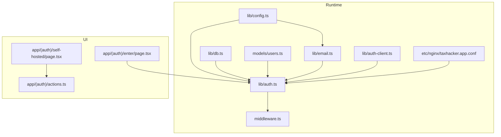
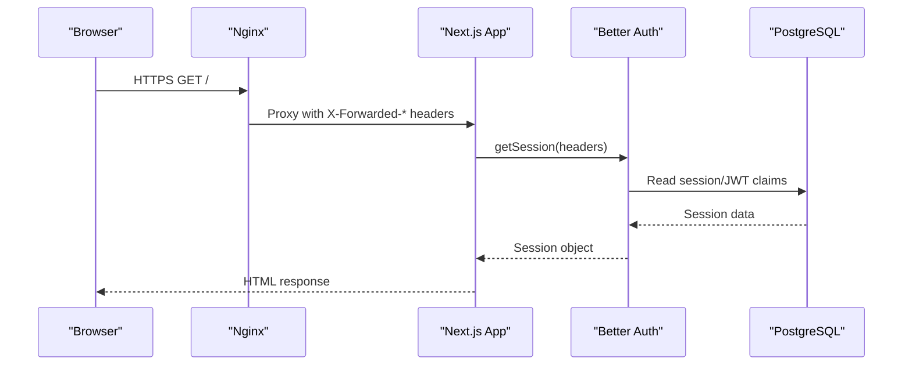
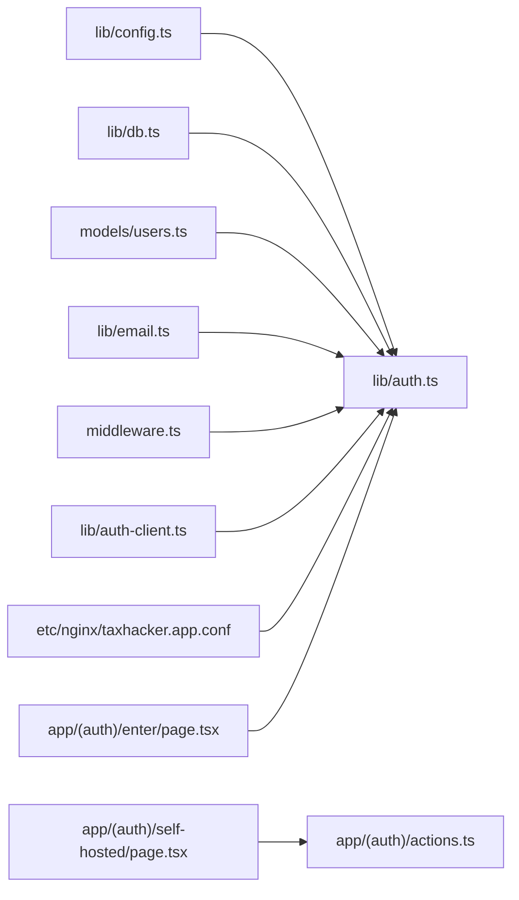

# Security Features

<cite>
**Referenced Files in This Document**
- [lib/auth.ts](file://lib/auth.ts)
- [lib/auth-client.ts](file://lib/auth-client.ts)
- [lib/config.ts](file://lib/config.ts)
- [middleware.ts](file://middleware.ts)
- [app/(auth)/actions.ts](file://app/(auth)/actions.ts)
- [app/(auth)/self-hosted/page.tsx](file://app/(auth)/self-hosted/page.tsx)
- [app/(auth)/enter/page.tsx](file://app/(auth)/enter/page.tsx)
- [lib/email.ts](file://lib/email.ts)
- [etc/nginx/taxhacker.app.conf](file://etc/nginx/taxhacker.app.conf)
- [lib/db.ts](file://lib/db.ts)
- [models/users.ts](file://models/users.ts)
</cite>

## Table of Contents
1. [Introduction](#introduction)
2. [Project Structure](#project-structure)
3. [Core Components](#core-components)
4. [Architecture Overview](#architecture-overview)
5. [Detailed Component Analysis](#detailed-component-analysis)
6. [Dependency Analysis](#dependency-analysis)
7. [Performance Considerations](#performance-considerations)
8. [Troubleshooting Guide](#troubleshooting-guide)
9. [Conclusion](#conclusion)
10. [Appendices](#appendices)

## Introduction
This document details the security posture of the TaxHacker authentication system. It covers JWT token lifecycle and storage, cookie security, CSRF protections, self-hosted configuration, custom API key management, passwordless and OTP verification, session hijacking prevention, middleware-based route protection, authentication guards, unauthorized access handling, security headers, HTTPS enforcement, and secure cookie attributes. It also outlines best practices, vulnerability mitigations, and production hardening guidance.

## Project Structure
The authentication system is centered around Better Auth with a PostgreSQL adapter, email OTP verification, and a self-hosted user model. Middleware enforces session presence for protected routes. Nginx configuration applies transport and browser security headers. Environment-driven configuration controls behavior across cloud and self-hosted modes.

**Diagram sources**
- [lib/config.ts:1-82](file://lib/config.ts#L1-L82)
- [lib/auth.ts:1-114](file://lib/auth.ts#L1-L114)
- [lib/auth-client.ts:1-7](file://lib/auth-client.ts#L1-L7)
- [middleware.ts:1-28](file://middleware.ts#L1-L28)
- [lib/db.ts:1-10](file://lib/db.ts#L1-L10)
- [models/users.ts:1-69](file://models/users.ts#L1-L69)
- [lib/email.ts:1-30](file://lib/email.ts#L1-L30)
- [etc/nginx/taxhacker.app.conf:1-43](file://etc/nginx/taxhacker.app.conf#L1-L43)
- [app/(auth)/enter/page.tsx:1-25](file://app/(auth)/enter/page.tsx#L1-L25)
- [app/(auth)/self-hosted/page.tsx:1-57](file://app/(auth)/self-hosted/page.tsx#L1-L57)
- [app/(auth)/actions.ts:1-40](file://app/(auth)/actions.ts#L1-L40)

**Section sources**
- [lib/auth.ts:1-114](file://lib/auth.ts#L1-L114)
- [lib/config.ts:1-82](file://lib/config.ts#L1-L82)
- [middleware.ts:1-28](file://middleware.ts#L1-L28)
- [etc/nginx/taxhacker.app.conf:1-43](file://etc/nginx/taxhacker.app.conf#L1-L43)

## Core Components
- Authentication engine: Better Auth configured with PostgreSQL adapter, JWT session strategy, email OTP plugin, and secure cookie caching.
- Session retrieval and current user resolution: Unified helpers that branch on self-hosted mode.
- Middleware protection: Route guard that validates session cookies for protected paths.
- Self-hosted mode: Dedicated onboarding flow and user creation/upsert for local deployments.
- Email OTP delivery: Resend-based OTP sending with templated emails.
- Nginx security headers: Transport and browser hardening applied at the edge.

**Section sources**
- [lib/auth.ts:25-65](file://lib/auth.ts#L25-L65)
- [lib/auth.ts:67-99](file://lib/auth.ts#L67-L99)
- [middleware.ts:5-15](file://middleware.ts#L5-L15)
- [app/(auth)/self-hosted/page.tsx:11-33](file://app/(auth)/self-hosted/page.tsx#L11-L33)
- [lib/email.ts:9-18](file://lib/email.ts#L9-L18)
- [etc/nginx/taxhacker.app.conf:17-24](file://etc/nginx/taxhacker.app.conf#L17-L24)

## Architecture Overview
The system uses Better Auth to manage sessions and OTP verification. Requests are gated by middleware for protected routes. Self-hosted mode bypasses cloud auth and uses a local user record. Nginx terminates TLS and injects security headers. Email OTP is delivered via Resend.

**Diagram sources**
- [lib/auth.ts:67-76](file://lib/auth.ts#L67-L76)
- [middleware.ts:10-14](file://middleware.ts#L10-L14)
- [etc/nginx/taxhacker.app.conf:32-36](file://etc/nginx/taxhacker.app.conf#L32-L36)

## Detailed Component Analysis

### JWT Token Security
- Strategy: JWT-based sessions with Better Auth.
- Expiration: Long-lived session lifetime with periodic refresh window.
- Cookie cache: Local cookie caching enabled with extended max age to reduce server round-trips while maintaining reasonable freshness.
- Secret management: Strong secret sourced from environment configuration.

Security considerations:
- Use short-lived JWTs or sliding expiration where appropriate for sensitive environments.
- Ensure secret rotation procedures and secure key storage.
- Monitor session revocation and logout flows.

**Section sources**
- [lib/auth.ts:35-43](file://lib/auth.ts#L35-L43)
- [lib/config.ts:13-16](file://lib/config.ts#L13-L16)

### Cookie Security Settings
- Cookie prefix: Scoped under a dedicated namespace to avoid collisions.
- Cookie caching: Enabled with long max age to improve UX and performance.
- Middleware validation: Session cookie presence enforced for protected routes.

Recommendations:
- Set SameSite=Lax or Strict depending on deployment needs.
- Ensure Secure and HttpOnly flags are applied by the framework.
- Align cookie domain/path with base URL and subdomain policy.

**Section sources**
- [lib/auth.ts:44-49](file://lib/auth.ts#L44-L49)
- [middleware.ts:10-14](file://middleware.ts#L10-L14)

### CSRF Protection
- Current implementation relies on session cookie presence and route-level middleware gating.
- CSRF protection is not explicitly configured in Better Auth options shown here.

Recommendations:
- Enable built-in CSRF protection in Better Auth if available.
- Add anti-CSRF tokens for state-changing forms and AJAX endpoints.
- Enforce SameSite cookies and Origin/Header checks where applicable.

**Section sources**
- [lib/auth.ts:25-65](file://lib/auth.ts#L25-L65)
- [middleware.ts:10-14](file://middleware.ts#L10-L14)

### Self-Hosted Security Configuration
- Mode toggle: Controlled by environment variable enabling self-hosted behavior.
- Onboarding: Initial setup action creates a local user and persists selected API keys.
- Redirects: Nonexistent self-hosted user triggers redirect to onboarding; existing user redirects to internal path.

Security considerations:
- Ensure environment variables are not exposed in client-side code.
- Sanitize and validate form inputs during onboarding.
- Restrict access to onboarding page when self-hosted mode is disabled.

**Section sources**
- [lib/config.ts:50-54](file://lib/config.ts#L50-L54)
- [app/(auth)/self-hosted/page.tsx:11-33](file://app/(auth)/self-hosted/page.tsx#L11-L33)
- [app/(auth)/actions.ts:9-39](file://app/(auth)/actions.ts#L9-L39)

### Custom API Key Management
- During onboarding, multiple LLM provider keys are written to user settings.
- Keys are stored in application settings; ensure encryption-at-rest and least-privilege access.

Best practices:
- Store keys in encrypted secrets management.
- Limit key scopes and rotate regularly.
- Avoid logging or exposing keys in any channel.

**Section sources**
- [app/(auth)/actions.ts:16-29](file://app/(auth)/actions.ts#L16-L29)
- [models/users.ts:13-29](file://models/users.ts#L13-L29)

### Passwordless Authentication and OTP Verification Security
- Email OTP plugin configured with fixed length and short expiry.
- OTP delivery via Resend with templated emails.
- Verification flow throws on missing user to prevent enumeration.

Security considerations:
- Enforce rate limiting per email/IP.
- Use one-time use tokens and immediate invalidation after verification.
- Ensure email templates do not leak internal state.

**Section sources**
- [lib/auth.ts:50-63](file://lib/auth.ts#L50-L63)
- [lib/email.ts:9-18](file://lib/email.ts#L9-L18)

### Session Hijacking Prevention
- Middleware checks for session cookie presence on protected routes.
- JWT strategy with server-side validation reduces stateful session risks.
- Consider adding IP binding, user agent binding, and rotation on sensitive actions.

**Section sources**
- [middleware.ts:5-15](file://middleware.ts#L5-L15)
- [lib/auth.ts:35-43](file://lib/auth.ts#L35-L43)

### Middleware-Based Route Protection and Authentication Guards
- Protected path matchers include core application areas.
- Guard logic redirects unauthenticated requests to login URL.

Recommendations:
- Expand matchers to cover all sensitive endpoints.
- Add granular permission checks beyond session presence.
- Implement per-route guards for resource-level authorization.

**Section sources**
- [middleware.ts:17-27](file://middleware.ts#L17-L27)
- [lib/auth.ts:67-99](file://lib/auth.ts#L67-L99)

### Unauthorized Access Handling
- Missing session cookie triggers redirect to login URL.
- Self-hosted mode with no user invokes onboarding redirect.

**Section sources**
- [middleware.ts:11-13](file://middleware.ts#L11-L13)
- [lib/auth.ts:84-98](file://lib/auth.ts#L84-L98)

### Security Headers and HTTPS Enforcement
- Nginx enforces HTTPS and sets strict transport, content type, referrer, frame options, permissions, and CSP headers.
- TLS termination with certificate files configured.

Recommendations:
- Ensure HSTS preload and includeSubDomains policies align with deployment.
- Review CSP to allow only necessary resources.
- Validate CORS headers for cross-origin requests.

**Section sources**
- [etc/nginx/taxhacker.app.conf:3-4](file://etc/nginx/taxhacker.app.conf#L3-L4)
- [etc/nginx/taxhacker.app.conf:17-24](file://etc/nginx/taxhacker.app.conf#L17-L24)

### Secure Cookie Attributes
- Cookie prefix and caching are configured in Better Auth.
- Nginx forwards X-Forwarded-Proto to inform secure cookie handling.

Recommendations:
- Explicitly set SameSite, Secure, HttpOnly, and Domain/Path attributes.
- Align cookie attributes with base URL and subdomain policy.

**Section sources**
- [lib/auth.ts:44-49](file://lib/auth.ts#L44-L49)
- [etc/nginx/taxhacker.app.conf:35](file://etc/nginx/taxhacker.app.conf#L35)

### Database and Secrets Security
- Prisma client initialized with logging enabled in non-production.
- Better Auth secret sourced from environment.

Recommendations:
- Disable verbose logging in production.
- Store Better Auth secret and Resend API key in secure secrets manager.
- Apply database connection encryption and network-level access controls.

**Section sources**
- [lib/db.ts:7-9](file://lib/db.ts#L7-L9)
- [lib/config.ts:13-19](file://lib/config.ts#L13-L19)

## Dependency Analysis

**Diagram sources**
- [lib/config.ts:1-82](file://lib/config.ts#L1-L82)
- [lib/auth.ts:1-114](file://lib/auth.ts#L1-L114)
- [lib/db.ts:1-10](file://lib/db.ts#L1-L10)
- [models/users.ts:1-69](file://models/users.ts#L1-L69)
- [lib/email.ts:1-30](file://lib/email.ts#L1-L30)
- [middleware.ts:1-28](file://middleware.ts#L1-L28)
- [lib/auth-client.ts:1-7](file://lib/auth-client.ts#L1-L7)
- [etc/nginx/taxhacker.app.conf:1-43](file://etc/nginx/taxhacker.app.conf#L1-L43)
- [app/(auth)/self-hosted/page.tsx:1-57](file://app/(auth)/self-hosted/page.tsx#L1-L57)
- [app/(auth)/actions.ts:1-40](file://app/(auth)/actions.ts#L1-L40)
- [app/(auth)/enter/page.tsx:1-25](file://app/(auth)/enter/page.tsx#L1-L25)

**Section sources**
- [lib/auth.ts:1-114](file://lib/auth.ts#L1-L114)
- [lib/config.ts:1-82](file://lib/config.ts#L1-L82)
- [middleware.ts:1-28](file://middleware.ts#L1-L28)

## Performance Considerations
- JWT session caching reduces server load for authenticated requests.
- Middleware cookie checks are lightweight but should be minimized to necessary paths.
- Consider lazy initialization of Better Auth client and caching strategies for session retrieval.

## Troubleshooting Guide
Common issues and mitigations:
- Missing session cookie on protected routes: Verify cookie prefix and domain alignment; ensure Nginx forwards X-Forwarded-Proto.
- Self-hosted onboarding not accessible: Confirm SELF_HOSTED_MODE is enabled and user does not yet exist.
- OTP not received: Validate Resend API key and sender configuration; check email template rendering.
- CSRF errors: Enable CSRF protection in Better Auth and ensure SameSite cookies are set appropriately.

**Section sources**
- [middleware.ts:10-14](file://middleware.ts#L10-L14)
- [lib/config.ts:50-54](file://lib/config.ts#L50-L54)
- [lib/email.ts:9-18](file://lib/email.ts#L9-L18)
- [lib/auth.ts:50-63](file://lib/auth.ts#L50-L63)

## Conclusion
TaxHacker’s authentication system leverages Better Auth with JWT sessions, email OTP verification, and middleware-based protection. Self-hosted mode simplifies local deployments with a streamlined onboarding flow. Production readiness requires tightening CSRF protection, hardening cookie attributes, enforcing stricter session policies, and applying robust secrets management. The included Nginx configuration provides strong transport and browser security headers.

## Appendices

### Security Best Practices Checklist
- Enforce CSRF protection and SameSite cookies.
- Rotate Better Auth secret and API keys periodically.
- Encrypt sensitive settings and enforce least privilege access.
- Harden CSP and CORS policies.
- Implement rate limiting for OTP and login attempts.
- Use HTTPS-only cookies and secure headers.
- Monitor and audit session activity and failed attempts.

### Vulnerability Mitigation Strategies
- Session fixation: Regenerate session ID on login and logout.
- Information disclosure: Avoid exposing internal errors; sanitize logs.
- Injection: Validate and sanitize all inputs; escape template outputs.
- Replay attacks: Short OTP expiry and one-time use tokens.
- SSRF: Restrict outbound connections and validate URLs.

### Production Hardening Guidance
- Deploy behind a hardened reverse proxy with TLS termination.
- Store secrets in environment-specific vaults; never commit to source control.
- Configure database firewalling and encrypted connections.
- Enable structured logging and centralized monitoring.
- Regularly review and update security headers and policies.