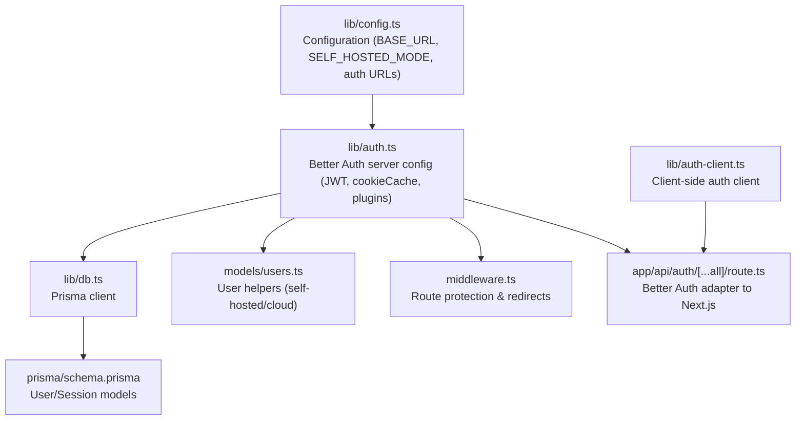
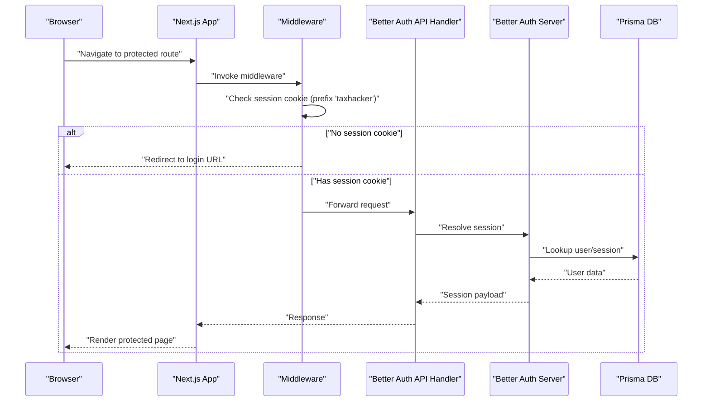
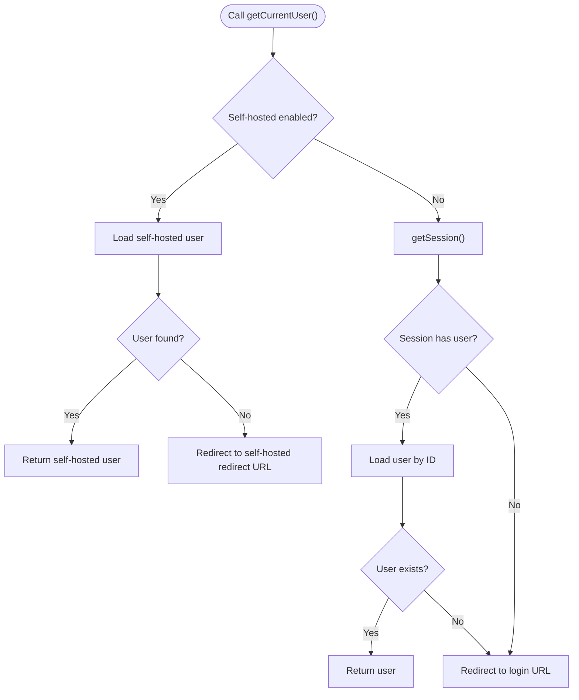
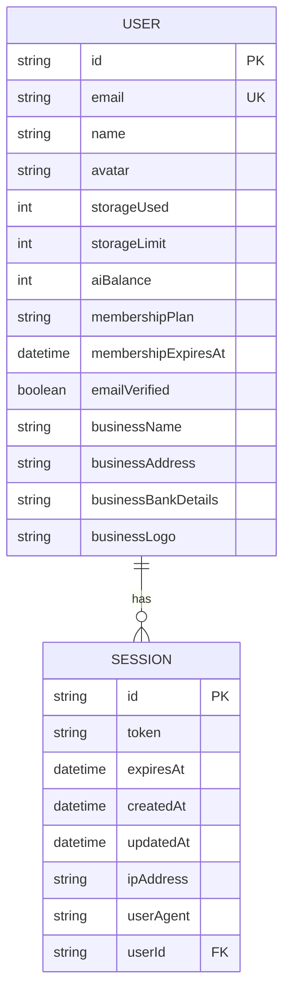
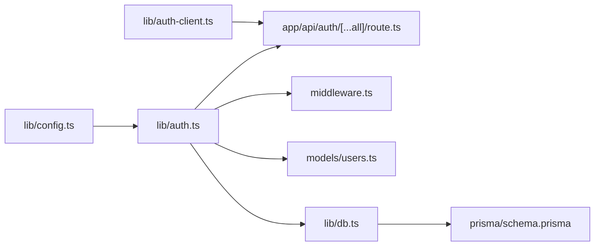

# Session Management

<cite>
**Referenced Files in This Document**
- [lib/auth.ts](file://lib/auth.ts)
- [lib/auth-client.ts](file://lib/auth-client.ts)
- [lib/config.ts](file://lib/config.ts)
- [lib/db.ts](file://lib/db.ts)
- [middleware.ts](file://middleware.ts)
- [app/api/auth/[...all]/route.ts](file://app/api/auth/[...all]/route.ts)
- [app/page.tsx](file://app/page.tsx)
- [app/(auth)/actions.ts](file://app/(auth)/actions.ts)
- [app/(auth)/self-hosted/page.tsx](file://app/(auth)/self-hosted/page.tsx)
- [models/users.ts](file://models/users.ts)
- [prisma/schema.prisma](file://prisma/schema.prisma)
- [app/docs/cookie/page.tsx](file://app/docs/cookie/page.tsx)
- [etc/nginx/taxhacker.app.conf](file://etc/nginx/taxhacker.app.conf)
</cite>

## Table of Contents
1. [Introduction](#introduction)
2. [Project Structure](#project-structure)
3. [Core Components](#core-components)
4. [Architecture Overview](#architecture-overview)
5. [Detailed Component Analysis](#detailed-component-analysis)
6. [Dependency Analysis](#dependency-analysis)
7. [Performance Considerations](#performance-considerations)
8. [Troubleshooting Guide](#troubleshooting-guide)
9. [Conclusion](#conclusion)

## Introduction
This document explains TaxHacker’s session management strategy built on JWT with better-auth. It covers:
- JWT session lifecycle: 365-day expiry and 24-hour update age
- Cookie caching with 365-day max age and cookie prefix configuration
- Session retrieval via getSession() and getCurrentUser() in cloud and self-hosted modes
- Middleware protection and automatic redirects based on authentication state
- Storage, cookie management, and cross-browser compatibility considerations
- Troubleshooting expired sessions and authentication state issues

## Project Structure
The session management stack spans configuration, server-side auth setup, middleware, API handlers, and database models.

**Diagram sources**
- [lib/config.ts:27-82](file://lib/config.ts#L27-L82)
- [lib/auth.ts:25-65](file://lib/auth.ts#L25-L65)
- [lib/auth-client.ts:1-7](file://lib/auth-client.ts#L1-L7)
- [middleware.ts:1-28](file://middleware.ts#L1-L28)
- [app/api/auth/[...all]/route.ts:1-4](file://app/api/auth/[...all]/route.ts#L1-L4)
- [models/users.ts:1-69](file://models/users.ts#L1-L69)
- [lib/db.ts:1-10](file://lib/db.ts#L1-L10)
- [prisma/schema.prisma:14-60](file://prisma/schema.prisma#L14-L60)

**Section sources**
- [lib/config.ts:27-82](file://lib/config.ts#L27-L82)
- [lib/auth.ts:25-65](file://lib/auth.ts#L25-L65)
- [lib/auth-client.ts:1-7](file://lib/auth-client.ts#L1-L7)
- [middleware.ts:1-28](file://middleware.ts#L1-L28)
- [app/api/auth/[...all]/route.ts:1-4](file://app/api/auth/[...all]/route.ts#L1-L4)
- [models/users.ts:1-69](file://models/users.ts#L1-L69)
- [lib/db.ts:1-10](file://lib/db.ts#L1-L10)
- [prisma/schema.prisma:14-60](file://prisma/schema.prisma#L14-L60)

## Core Components
- Better Auth server configured with JWT strategy, 365-day expiry, 24-hour update age, and cookie cache enabled with 365-day max age. A cookie prefix is set to “taxhacker”.
- Middleware checks for a session cookie and redirects unauthenticated requests to the login URL in cloud mode.
- API handler bridges better-auth to Next.js routes.
- Helpers for retrieving current user and self-hosted user behavior.
- Prisma models for User and Session.

Key behaviors:
- getSession() returns either a self-hosted user or a session from the better-auth API.
- getCurrentUser() resolves the current user or redirects to login depending on mode and session validity.
- Middleware protects protected routes by requiring a session cookie in cloud mode.

**Section sources**
- [lib/auth.ts:25-65](file://lib/auth.ts#L25-L65)
- [lib/auth.ts:67-99](file://lib/auth.ts#L67-L99)
- [middleware.ts:5-15](file://middleware.ts#L5-L15)
- [app/api/auth/[...all]/route.ts:1-4](file://app/api/auth/[...all]/route.ts#L1-L4)
- [models/users.ts:13-29](file://models/users.ts#L13-L29)
- [prisma/schema.prisma:47-60](file://prisma/schema.prisma#L47-L60)

## Architecture Overview
The session lifecycle integrates client and server components with cookie-based persistence.

**Diagram sources**
- [middleware.ts:5-15](file://middleware.ts#L5-L15)
- [app/api/auth/[...all]/route.ts:1-4](file://app/api/auth/[...all]/route.ts#L1-L4)
- [lib/auth.ts:25-65](file://lib/auth.ts#L25-L65)
- [prisma/schema.prisma:47-60](file://prisma/schema.prisma#L47-L60)

## Detailed Component Analysis

### JWT Session Strategy and Cookie Caching
- Strategy: JWT
- Expiration: 365 days
- Update Age: 24 hours
- Cookie Cache: Enabled with 365-day max age
- Cookie Prefix: “taxhacker”
- Plugin order: emailOTP followed by nextCookies (important placement)

These settings define long-lived JWT sessions with automatic refresh behavior and persistent cookie caching.

**Section sources**
- [lib/auth.ts:35-49](file://lib/auth.ts#L35-L49)
- [lib/auth.ts:50-65](file://lib/auth.ts#L50-L65)

### Session Retrieval: getSession() and getCurrentUser()
- getSession():
  - In self-hosted mode: returns the self-hosted user if present; otherwise null.
  - In cloud mode: calls better-auth API to resolve the session using request headers.
- getCurrentUser():
  - In self-hosted mode: returns the self-hosted user or redirects to the self-hosted redirect URL.
  - In cloud mode: attempts to resolve the user from the session; if not found, redirects to the login URL.

**Diagram sources**
- [lib/auth.ts:67-99](file://lib/auth.ts#L67-L99)
- [models/users.ts:45-49](file://models/users.ts#L45-L49)

**Section sources**
- [lib/auth.ts:67-99](file://lib/auth.ts#L67-L99)
- [models/users.ts:13-29](file://models/users.ts#L13-L29)

### Middleware Implementation
- Protects routes under specific paths in cloud mode.
- Extracts the session cookie using the configured cookie prefix.
- Redirects to the login URL if no session cookie is present.

Protected paths:
- /transactions/*
- /settings/*
- /export/*
- /import/*
- /unsorted/*
- /files/*
- /dashboard/*

**Section sources**
- [middleware.ts:5-27](file://middleware.ts#L5-L27)

### API Route Bridge
- Exposes better-auth endpoints to Next.js using the adapter.

**Section sources**
- [app/api/auth/[...all]/route.ts:1-4](file://app/api/auth/[...all]/route.ts#L1-L4)

### Self-Hosted Mode Behavior
- Self-hosted user is created or retrieved from the database.
- Onboarding action sets initial settings and redirects to dashboard.
- Welcome page guides setup when no self-hosted user exists.

**Section sources**
- [models/users.ts:13-29](file://models/users.ts#L13-L29)
- [app/(auth)/actions.ts:9-39](file://app/(auth)/actions.ts#L9-L39)
- [app/(auth)/self-hosted/page.tsx:11-33](file://app/(auth)/self-hosted/page.tsx#L11-L33)

### Database Models and Storage
- User model includes identity, preferences, billing fields, and relations to Sessions.
- Session model stores tokens, expiry, IP, and UA, linked to a user.

**Diagram sources**
- [prisma/schema.prisma:14-60](file://prisma/schema.prisma#L14-L60)

**Section sources**
- [prisma/schema.prisma:14-60](file://prisma/schema.prisma#L14-L60)

### Cookie Management and Security Headers
- Cookie policy confirms strict necessity for session/authentication cookies.
- Nginx configuration applies strong security headers including HSTS, X-Content-Type-Options, Referrer-Policy, X-Frame-Options, and Permissions-Policy.

**Section sources**
- [app/docs/cookie/page.tsx:32-55](file://app/docs/cookie/page.tsx#L32-L55)
- [etc/nginx/taxhacker.app.conf:17-23](file://etc/nginx/taxhacker.app.conf#L17-L23)

## Dependency Analysis

**Diagram sources**
- [lib/config.ts:27-82](file://lib/config.ts#L27-L82)
- [lib/auth.ts:25-65](file://lib/auth.ts#L25-L65)
- [app/api/auth/[...all]/route.ts:1-4](file://app/api/auth/[...all]/route.ts#L1-L4)
- [middleware.ts:1-28](file://middleware.ts#L1-L28)
- [models/users.ts:1-69](file://models/users.ts#L1-L69)
- [lib/db.ts:1-10](file://lib/db.ts#L1-L10)
- [prisma/schema.prisma:14-60](file://prisma/schema.prisma#L14-L60)
- [lib/auth-client.ts:1-7](file://lib/auth-client.ts#L1-L7)

**Section sources**
- [lib/config.ts:27-82](file://lib/config.ts#L27-L82)
- [lib/auth.ts:25-65](file://lib/auth.ts#L25-L65)
- [app/api/auth/[...all]/route.ts:1-4](file://app/api/auth/[...all]/route.ts#L1-L4)
- [middleware.ts:1-28](file://middleware.ts#L1-L28)
- [models/users.ts:1-69](file://models/users.ts#L1-L69)
- [lib/db.ts:1-10](file://lib/db.ts#L1-L10)
- [prisma/schema.prisma:14-60](file://prisma/schema.prisma#L14-L60)
- [lib/auth-client.ts:1-7](file://lib/auth-client.ts#L1-L7)

## Performance Considerations
- Long-lived JWT sessions reduce server-side session storage overhead but increase cookie size and client-side processing.
- Cookie cache enabled with 365-day max age minimizes network round-trips and server load.
- Middleware performs a lightweight check for the session cookie; keep protected path matchers minimal to avoid unnecessary checks.
- Using Prisma client globally reduces connection overhead.

[No sources needed since this section provides general guidance]

## Troubleshooting Guide
Common issues and resolutions:
- Expired or missing session cookie
  - Symptom: Automatic redirect to login URL in cloud mode.
  - Cause: No session cookie or cookie expired.
  - Resolution: Re-authenticate; ensure cookies are enabled and not blocked by browser policies.
- Self-hosted mode not enabled
  - Symptom: Redirect to self-hosted redirect URL.
  - Cause: SELF_HOSTED_MODE disabled; no self-hosted user found.
  - Resolution: Enable SELF_HOSTED_MODE and complete self-hosted setup.
- Authentication state mismatch
  - Symptom: getCurrentUser() returns null and redirects to login.
  - Cause: Session resolved but user not found in DB.
  - Resolution: Verify user record exists; re-authenticate if needed.
- Cross-browser compatibility
  - Symptom: Session not persisting across browsers or devices.
  - Cause: Cookie domain/path/security attributes differ per deployment.
  - Resolution: Confirm BASE_URL matches deployment; ensure cookies are accepted; review security headers and cookie policy.
- Protected route access denied
  - Symptom: Redirect to login URL on visiting protected pages.
  - Cause: Missing or invalid session cookie.
  - Resolution: Log in again; confirm middleware matcher does not exclude the route unintentionally.

**Section sources**
- [middleware.ts:5-15](file://middleware.ts#L5-L15)
- [lib/auth.ts:67-99](file://lib/auth.ts#L67-L99)
- [lib/config.ts:50-54](file://lib/config.ts#L50-L54)
- [app/docs/cookie/page.tsx:118-126](file://app/docs/cookie/page.tsx#L118-L126)

## Conclusion
TaxHacker employs a robust, long-lived JWT session strategy with cookie caching and a cookie prefix for safe, cross-domain operation. The middleware enforces authentication for protected routes in cloud mode, while self-hosted mode simplifies session handling by returning a local user. Together with Prisma-backed models and strong security headers, this design balances convenience, security, and maintainability.

[No sources needed since this section summarizes without analyzing specific files]