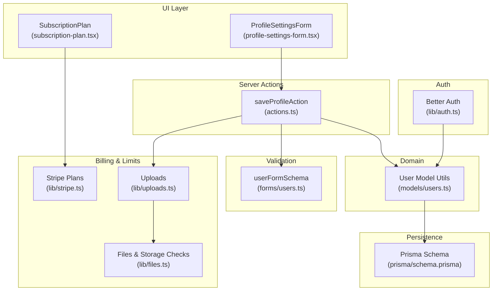
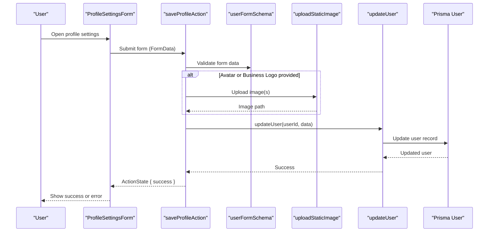
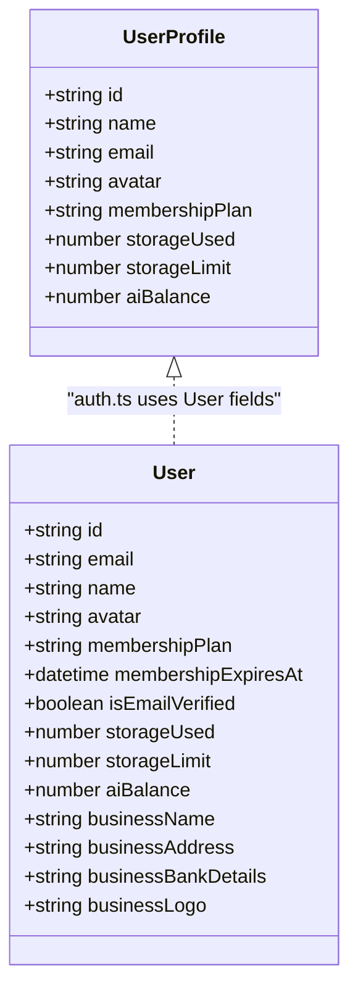
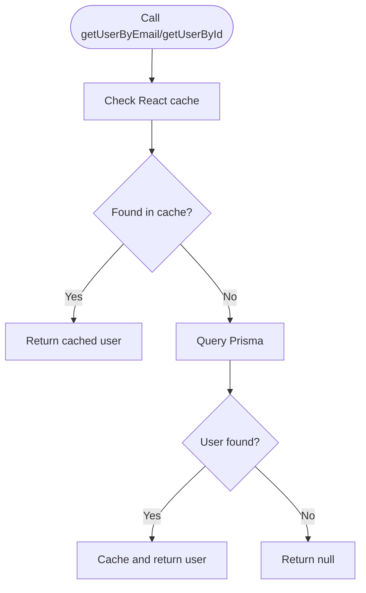
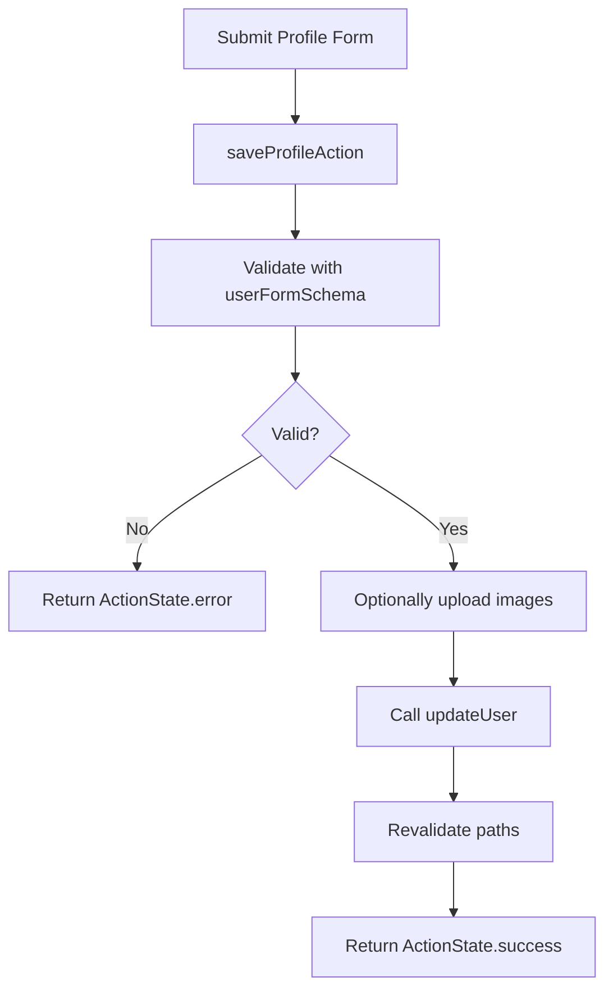
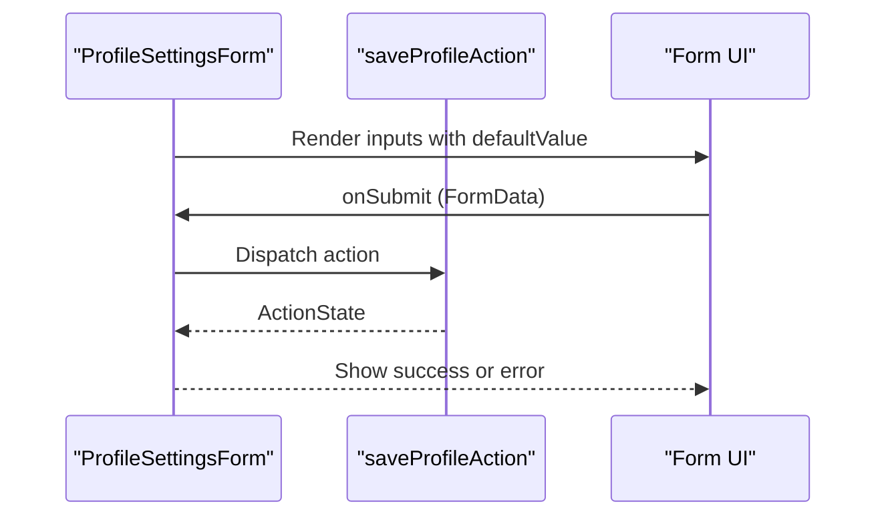
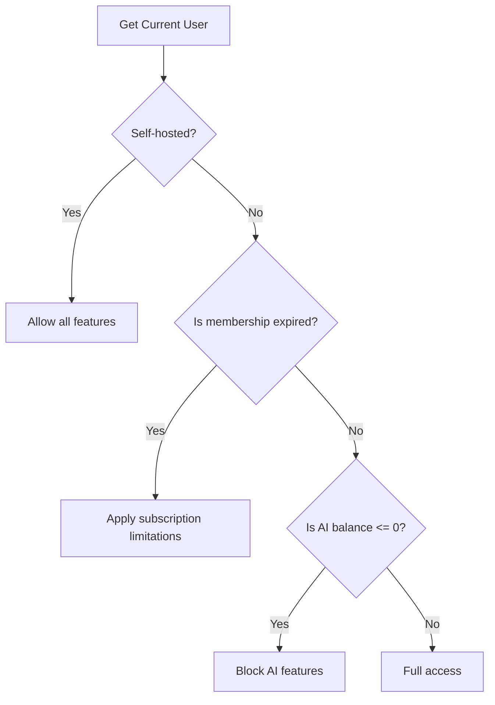
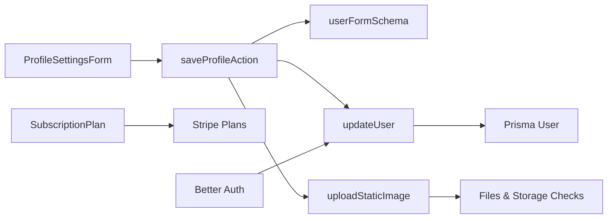

# User Profile Management

<cite>
**Referenced Files in This Document**
- [auth.ts](file://lib/auth.ts)
- [users.ts](file://models/users.ts)
- [schema.prisma](file://prisma/schema.prisma)
- [profile-settings-form.tsx](file://components/settings/profile-settings-form.tsx)
- [actions.ts](file://app/(app)/settings/actions.ts)
- [users.ts](file://forms/users.ts)
- [subscription-plan.tsx](file://components/settings/subscription-plan.tsx)
- [stripe.ts](file://lib/stripe.ts)
- [uploads.ts](file://lib/uploads.ts)
- [files.ts](file://lib/files.ts)
- [page.tsx](file://app/docs/privacy_policy/page.tsx)
</cite>

## Table of Contents
1. [Introduction](#introduction)
2. [Project Structure](#project-structure)
3. [Core Components](#core-components)
4. [Architecture Overview](#architecture-overview)
5. [Detailed Component Analysis](#detailed-component-analysis)
6. [Dependency Analysis](#dependency-analysis)
7. [Performance Considerations](#performance-considerations)
8. [Troubleshooting Guide](#troubleshooting-guide)
9. [Conclusion](#conclusion)
10. [Appendices](#appendices)

## Introduction
This document describes the user profile management system in TaxHacker. It covers the user data model, membership plan and billing fields, storage and AI balance tracking, user data retrieval and updates, validation and error handling, profile settings UI components, role-based access control, subscription status handling, feature limitations by membership tiers, and privacy and data retention considerations aligned with GDPR.

## Project Structure
User profile management spans several layers:
- Data model: Prisma schema defines the User entity and related fields.
- Domain logic: User retrieval, creation/upsert, and update utilities.
- Authentication and session: Better Auth integration with typed user profile representation.
- UI: Profile settings form and subscription plan display.
- Actions: Server-side profile update pipeline with validation and uploads.
- Billing and limits: Stripe plans and per-plan limits for storage and AI balance.
- Uploads and storage checks: Utilities to enforce storage limits and convert images.

**Diagram sources**
- [profile-settings-form.tsx:12-47](file://components/settings/profile-settings-form.tsx#L12-L47)
- [actions.ts:47-99](file://app/(app)/settings/actions.ts#L47-L99)
- [users.ts:1-69](file://models/users.ts#L1-L69)
- [auth.ts:14-114](file://lib/auth.ts#L14-L114)
- [schema.prisma:14-45](file://prisma/schema.prisma#L14-L45)
- [stripe.ts:10-58](file://lib/stripe.ts#L10-L58)
- [uploads.ts:8-61](file://lib/uploads.ts#L8-L61)
- [files.ts:68-93](file://lib/files.ts#L68-L93)

**Section sources**
- [auth.ts:14-114](file://lib/auth.ts#L14-L114)
- [users.ts:1-69](file://models/users.ts#L1-L69)
- [schema.prisma:14-45](file://prisma/schema.prisma#L14-L45)
- [profile-settings-form.tsx:12-47](file://components/settings/profile-settings-form.tsx#L12-L47)
- [actions.ts:47-99](file://app/(app)/settings/actions.ts#L47-L99)
- [users.ts:1-11](file://forms/users.ts#L1-L11)
- [subscription-plan.tsx:14-72](file://components/settings/subscription-plan.tsx#L14-L72)
- [stripe.ts:10-58](file://lib/stripe.ts#L10-L58)
- [uploads.ts:8-61](file://lib/uploads.ts#L8-L61)
- [files.ts:68-93](file://lib/files.ts#L68-L93)

## Core Components
- UserProfile type: A typed representation of user profile fields used by the authentication layer, including membership plan, storage usage, storage limits, and AI balance.
- User model fields: The Prisma User model includes membership plan, expiration date, email verification flag, storage usage and limits, AI balance, and business details.
- User retrieval and updates: Utilities to fetch users by ID, email, or Stripe customer ID, and to upsert self-hosted users. The update function writes changes to the database.
- Profile settings form: Client component that binds form fields to a server action for saving profile changes.
- Save profile action: Validates form data, optionally uploads avatar and business logo, and persists updates to the user record.
- Subscription plan display: Renders current plan, usage, and links to manage subscription.
- Stripe plans: Defines plan codes, names, descriptions, benefits, pricing, Stripe price IDs, and per-plan limits for storage and AI.
- Uploads and storage checks: Utility to upload static images and enforce storage limits.

**Section sources**
- [auth.ts:14-23](file://lib/auth.ts#L14-L23)
- [schema.prisma:14-45](file://prisma/schema.prisma#L14-L45)
- [users.ts:13-69](file://models/users.ts#L13-L69)
- [profile-settings-form.tsx:12-47](file://components/settings/profile-settings-form.tsx#L12-L47)
- [actions.ts:47-99](file://app/(app)/settings/actions.ts#L47-L99)
- [subscription-plan.tsx:14-72](file://components/settings/subscription-plan.tsx#L14-L72)
- [stripe.ts:10-58](file://lib/stripe.ts#L10-L58)
- [uploads.ts:8-61](file://lib/uploads.ts#L8-L61)
- [files.ts:68-93](file://lib/files.ts#L68-L93)

## Architecture Overview
The user profile management flow integrates UI, server actions, validation, persistence, and billing logic.

**Diagram sources**
- [profile-settings-form.tsx:12-47](file://components/settings/profile-settings-form.tsx#L12-L47)
- [actions.ts:47-99](file://app/(app)/settings/actions.ts#L47-L99)
- [users.ts:63-69](file://models/users.ts#L63-L69)
- [uploads.ts:8-61](file://lib/uploads.ts#L8-L61)

## Detailed Component Analysis

### UserProfile Interface and User Model Structure
- UserProfile type: Includes identity, contact info, avatar, membership plan, storage usage, storage limit, and AI balance. Used by the auth layer to represent the current user.
- User model fields: The schema defines membership plan, expiration date, email verification, storage usage and limits, AI balance, and business details. These fields enable tier-based access control and resource tracking.

**Diagram sources**
- [auth.ts:14-23](file://lib/auth.ts#L14-L23)
- [schema.prisma:14-45](file://prisma/schema.prisma#L14-L45)

**Section sources**
- [auth.ts:14-23](file://lib/auth.ts#L14-L23)
- [schema.prisma:14-45](file://prisma/schema.prisma#L14-L45)

### User Data Retrieval Functions
- Self-hosted user helpers: Retrieve or upsert a special self-hosted user when no DATABASE_URL is present.
- Cloud user helpers: Upsert users by email and initialize defaults if the database is empty.
- Lookup by ID, email, and Stripe customer ID: Cached retrieval functions to minimize DB load.
- Current user and session: Better Auth session handling with fallback to self-hosted mode.

**Diagram sources**
- [users.ts:51-61](file://models/users.ts#L51-L61)

**Section sources**
- [users.ts:13-69](file://models/users.ts#L13-L69)
- [auth.ts:67-99](file://lib/auth.ts#L67-L99)

### Profile Updates and Validation
- Form schema: Zod schema validates profile fields (name, avatar, business details) with optional files.
- Save profile action: Parses form data, conditionally uploads avatar/business logo, updates user fields, and revalidates routes.
- Error handling: Returns structured ActionState with error messages on validation failure or upload errors.

**Diagram sources**
- [actions.ts:47-99](file://app/(app)/settings/actions.ts#L47-L99)
- [users.ts:63-69](file://models/users.ts#L63-L69)
- [uploads.ts:8-61](file://lib/uploads.ts#L8-L61)

**Section sources**
- [users.ts:47-99](file://app/(app)/settings/actions.ts#L47-L99)
- [users.ts:3-10](file://forms/users.ts#L3-L10)
- [uploads.ts:8-61](file://lib/uploads.ts#L8-L61)

### User Profile Form Components and Data Binding
- ProfileSettingsForm: Client component bound to saveProfileAction via useActionState. Displays avatar and name inputs, and renders success/error feedback.
- Data binding: Uses defaultValue props from the current user and submits FormData to the server action.
- SubscriptionPlan: Displays current plan, usage metrics, and management links.

**Diagram sources**
- [profile-settings-form.tsx:12-47](file://components/settings/profile-settings-form.tsx#L12-L47)
- [actions.ts:47-99](file://app/(app)/settings/actions.ts#L47-L99)

**Section sources**
- [profile-settings-form.tsx:12-47](file://components/settings/profile-settings-form.tsx#L12-L47)
- [subscription-plan.tsx:14-72](file://components/settings/subscription-plan.tsx#L14-L72)

### Role-Based Access Control and Subscription Status
- Session and current user: Better Auth manages JWT sessions; self-hosted mode bypasses sessions.
- Subscription expired check: Compares membershipExpiresAt to current time; expired subscriptions trigger limitations.
- AI balance exhausted: For non-self-hosted users, determines if AI analysis quota is depleted.
- Plan limits: Stripe plans define storage and AI limits per tier; UI displays remaining quotas.

**Diagram sources**
- [auth.ts:78-114](file://lib/auth.ts#L78-L114)
- [stripe.ts:24-58](file://lib/stripe.ts#L24-L58)

**Section sources**
- [auth.ts:78-114](file://lib/auth.ts#L78-L114)
- [stripe.ts:24-58](file://lib/stripe.ts#L24-L58)

### Feature Limitations Based on Membership Tiers
- Storage limits: Per-plan storage limit enforced by isEnoughStorageToUploadFile; unlimited when negative.
- AI balance: Per-plan AI limit tracked via plan.limits.ai and user.aiBalance; UI shows remaining quota.
- Expiration: Non-expired memberships allow full feature set; expired memberships restrict access.

**Section sources**
- [subscription-plan.tsx:14-72](file://components/settings/subscription-plan.tsx#L14-L72)
- [stripe.ts:24-58](file://lib/stripe.ts#L24-L58)
- [files.ts:88-93](file://lib/files.ts#L88-L93)

### Data Privacy and GDPR Compliance
- Data storage location and security: Data hosted in Germany; files and personal data stored unencrypted; access restricted to authorized personnel.
- Legal basis: Consent and contract-based processing; users can withdraw consent.
- Retention: Data retained while account is active or until deletion is requested.
- User rights: Access, rectification, data portability, erasure, and rights under applicable data protection laws.
- Children’s privacy: Not intended for users under 18; no data collection from minors.

**Section sources**
- [page.tsx:109-201](file://app/docs/privacy_policy/page.tsx#L109-L201)

## Dependency Analysis
The user profile system exhibits clear separation of concerns:
- UI depends on server actions for mutations.
- Server actions depend on validation schemas and domain utilities.
- Domain utilities depend on Prisma for persistence.
- Billing and limits integrate with Stripe and local plan definitions.
- Uploads depend on file utilities and storage checks.

**Diagram sources**
- [profile-settings-form.tsx:12-47](file://components/settings/profile-settings-form.tsx#L12-L47)
- [actions.ts:47-99](file://app/(app)/settings/actions.ts#L47-L99)
- [users.ts:63-69](file://models/users.ts#L63-L69)
- [schema.prisma:14-45](file://prisma/schema.prisma#L14-L45)
- [uploads.ts:8-61](file://lib/uploads.ts#L8-L61)
- [files.ts:68-93](file://lib/files.ts#L68-L93)
- [subscription-plan.tsx:14-72](file://components/settings/subscription-plan.tsx#L14-L72)
- [stripe.ts:10-58](file://lib/stripe.ts#L10-L58)
- [auth.ts:67-99](file://lib/auth.ts#L67-L99)

**Section sources**
- [actions.ts:47-99](file://app/(app)/settings/actions.ts#L47-L99)
- [users.ts:63-69](file://models/users.ts#L63-L69)
- [schema.prisma:14-45](file://prisma/schema.prisma#L14-L45)
- [uploads.ts:8-61](file://lib/uploads.ts#L8-L61)
- [files.ts:68-93](file://lib/files.ts#L68-L93)
- [subscription-plan.tsx:14-72](file://components/settings/subscription-plan.tsx#L14-L72)
- [stripe.ts:10-58](file://lib/stripe.ts#L10-L58)
- [auth.ts:67-99](file://lib/auth.ts#L67-L99)

## Performance Considerations
- Caching: User retrieval functions leverage React caching to reduce database queries.
- Conditional uploads: Images are uploaded only when provided, avoiding unnecessary work.
- Batch updates: Profile updates write only changed fields, minimizing write overhead.
- Storage checks: Pre-validate uploads against user limits to fail fast.

[No sources needed since this section provides general guidance]

## Troubleshooting Guide
Common issues and resolutions:
- Validation errors: When form validation fails, the action returns an error state with a message. Ensure inputs match schema constraints (e.g., max lengths).
- Upload failures: Avatar or business logo uploads can fail due to unsupported formats or insufficient space. Verify file types and storage availability.
- Storage exceeded: If storageUsed plus the new file exceeds storageLimit, the upload throws an error. Upgrade plan or free up space.
- Session or current user missing: In self-hosted mode, ensure the special user exists; otherwise, redirects occur. For cloud mode, verify session cookies and JWT validity.

**Section sources**
- [actions.ts:47-99](file://app/(app)/settings/actions.ts#L47-L99)
- [uploads.ts:18-20](file://lib/uploads.ts#L18-L20)
- [files.ts:88-93](file://lib/files.ts#L88-L93)
- [auth.ts:78-99](file://lib/auth.ts#L78-L99)

## Conclusion
TaxHacker’s user profile management combines a robust data model with a clean separation of UI, validation, persistence, and billing logic. The system supports self-hosted and cloud modes, enforces storage and AI quotas per plan, and provides clear UI for managing profile and subscription details. Privacy and GDPR considerations are documented and reflected in the product’s data handling practices.

[No sources needed since this section summarizes without analyzing specific files]

## Appendices

### Example Operations and Workflows
- Retrieve current user: Use the current user resolver to obtain the authenticated user object.
- Update profile: Submit the profile form to save changes; the action validates inputs, optionally uploads images, and persists updates.
- Check subscription status: Determine if the subscription is expired or if AI balance is exhausted to apply appropriate feature limitations.
- Manage subscription: Navigate to the Stripe portal or purchase flow depending on existing Stripe customer ID and expiration.

**Section sources**
- [auth.ts:78-114](file://lib/auth.ts#L78-L114)
- [actions.ts:47-99](file://app/(app)/settings/actions.ts#L47-L99)
- [subscription-plan.tsx:14-72](file://components/settings/subscription-plan.tsx#L14-L72)
- [stripe.ts:24-58](file://lib/stripe.ts#L24-L58)