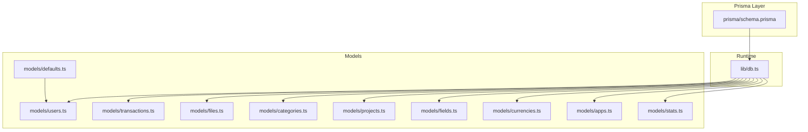
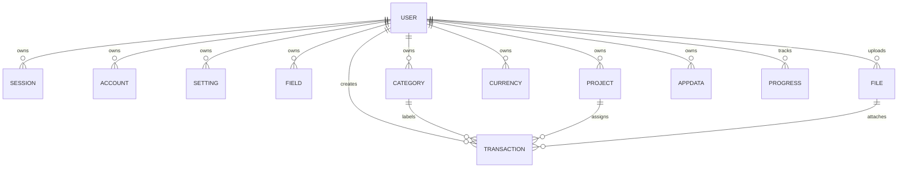
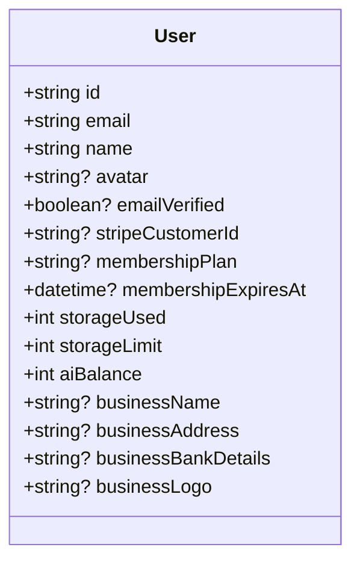
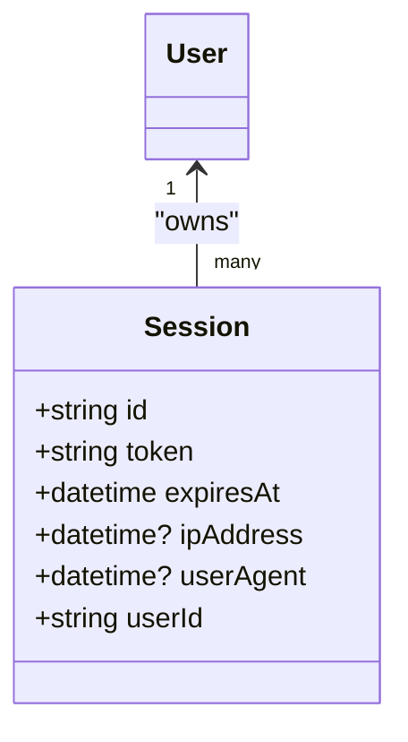
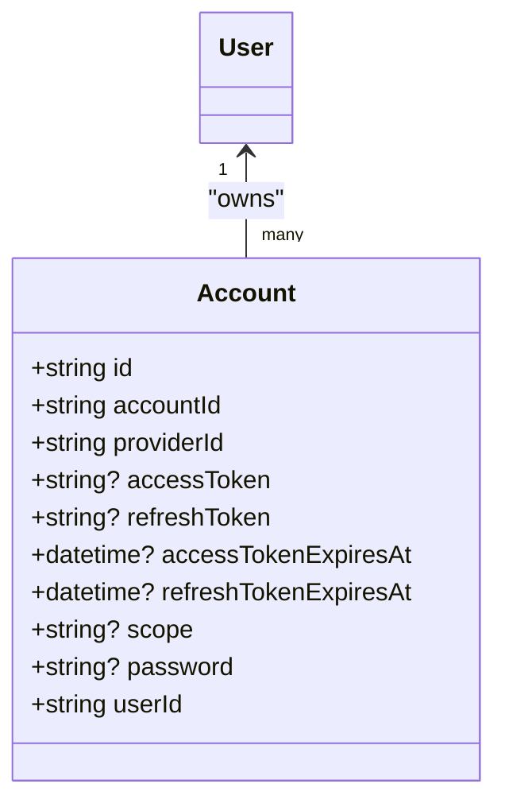
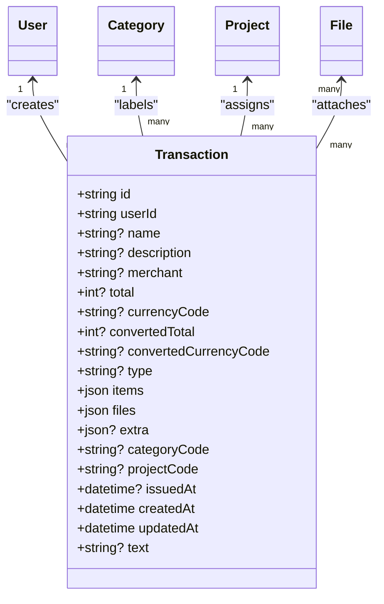
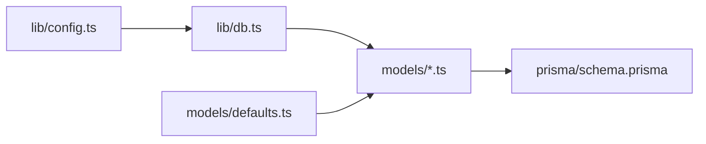

# Database Schema & Models

<cite>
**Referenced Files in This Document**
- [prisma/schema.prisma](file://prisma/schema.prisma)
- [lib/db.ts](file://lib/db.ts)
- [models/users.ts](file://models/users.ts)
- [models/transactions.ts](file://models/transactions.ts)
- [models/files.ts](file://models/files.ts)
- [models/categories.ts](file://models/categories.ts)
- [models/projects.ts](file://models/projects.ts)
- [models/fields.ts](file://models/fields.ts)
- [models/currencies.ts](file://models/currencies.ts)
- [models/apps.ts](file://models/apps.ts)
- [models/defaults.ts](file://models/defaults.ts)
- [models/stats.ts](file://models/stats.ts)
- [lib/config.ts](file://lib/config.ts)
</cite>

## Table of Contents
1. [Introduction](#introduction)
2. [Project Structure](#project-structure)
3. [Core Components](#core-components)
4. [Architecture Overview](#architecture-overview)
5. [Detailed Component Analysis](#detailed-component-analysis)
6. [Dependency Analysis](#dependency-analysis)
7. [Performance Considerations](#performance-considerations)
8. [Troubleshooting Guide](#troubleshooting-guide)
9. [Conclusion](#conclusion)
10. [Appendices](#appendices)

## Introduction
This document describes the database schema and models powering TaxHacker’s data architecture. It covers the Prisma schema, entity relationships, indexes, constraints, and referential integrity. It also documents data access patterns, caching strategies, and operational aspects such as initialization, migrations, and seeding. The focus is on Users, Transactions, Files, Categories, Projects, and AppData, along with related supporting models.

## Project Structure
The database layer is centered around Prisma schema definitions and a thin TypeScript wrapper for the Prisma client. Data access is encapsulated in model modules that expose typed CRUD and query functions. Environment configuration controls runtime behavior such as self-hosted mode and external integrations.



**Diagram sources**
- [prisma/schema.prisma](file://prisma/schema.prisma)
- [lib/db.ts](file://lib/db.ts)
- [models/users.ts](file://models/users.ts)
- [models/transactions.ts](file://models/transactions.ts)
- [models/files.ts](file://models/files.ts)
- [models/categories.ts](file://models/categories.ts)
- [models/projects.ts](file://models/projects.ts)
- [models/fields.ts](file://models/fields.ts)
- [models/currencies.ts](file://models/currencies.ts)
- [models/apps.ts](file://models/apps.ts)
- [models/stats.ts](file://models/stats.ts)
- [models/defaults.ts](file://models/defaults.ts)

**Section sources**
- [prisma/schema.prisma](file://prisma/schema.prisma)
- [lib/db.ts](file://lib/db.ts)
- [lib/config.ts](file://lib/config.ts)

## Core Components
This section outlines the core models and their roles in the system.

- Users: Core tenant account with identity, billing, and storage metadata.
- Sessions and Accounts: Authentication and third-party account linkage.
- Settings, Fields, Categories, Projects, Currencies: User-configurable domain entities.
- Files: Stored documents associated with transactions.
- Transactions: Financial records with JSON fields for structured and extensible data.
- AppData: Per-user application-specific data blobs.
- Progress: Background job/state tracking.

Key characteristics:
- UUID primary keys for most entities.
- Soft and hard constraints via Prisma relations and unique constraints.
- JSON fields for flexible transaction items and extra attributes.
- Extensive indexes on frequently filtered/searched columns.

**Section sources**
- [prisma/schema.prisma](file://prisma/schema.prisma)

## Architecture Overview
The database architecture follows a single-tenant per row pattern with explicit user scoping via userId. Relations enforce referential integrity with cascade deletes for user-dependent entities. Queries leverage indexes and include relations selectively to reduce payload size.



**Diagram sources**
- [prisma/schema.prisma](file://prisma/schema.prisma)

## Detailed Component Analysis

### Users
- Purpose: Store user identity, preferences, billing, and storage limits.
- Notable fields: email (unique), membership plan/expiry, Stripe customer ID, email verification flag, storage usage/limits, AI balance, business details.
- Constraints: Unique email; soft-deleted-like behavior via cascade on dependent models.
- Access patterns: Upsert for self-hosted/cloud users; retrieval by ID/email/customer ID; updates for profile and limits.



**Diagram sources**
- [prisma/schema.prisma](file://prisma/schema.prisma)

**Section sources**
- [prisma/schema.prisma](file://prisma/schema.prisma)
- [models/users.ts](file://models/users.ts)

### Sessions
- Purpose: Manage session tokens with expiry and device metadata.
- Constraints: Unique token; cascade delete with user.
- Access patterns: Create, validate by token, cleanup expired sessions.



**Diagram sources**
- [prisma/schema.prisma](file://prisma/schema.prisma)

**Section sources**
- [prisma/schema.prisma](file://prisma/schema.prisma)

### Accounts
- Purpose: Link users to OAuth/social providers and store tokens.
- Constraints: Composite identifiers; cascade delete with user.
- Access patterns: Upsert tokens, refresh flows, connect/disconnect.



**Diagram sources**
- [prisma/schema.prisma](file://prisma/schema.prisma)

**Section sources**
- [prisma/schema.prisma](file://prisma/schema.prisma)

### Settings
- Purpose: User-level key-value configuration.
- Constraints: Unique (userId, code); cascade delete with user.
- Access patterns: Upsert, read by code.

**Section sources**
- [prisma/schema.prisma](file://prisma/schema.prisma)
- [models/users.ts](file://models/users.ts)

### Fields
- Purpose: Dynamic schema definition for transactions (standard vs extra).
- Constraints: Unique (userId, code); cascade delete with user.
- Access patterns: CRUD with automatic code generation from names.

**Section sources**
- [prisma/schema.prisma](file://prisma/schema.prisma)
- [models/fields.ts](file://models/fields.ts)
- [models/transactions.ts](file://models/transactions.ts)

### Categories
- Purpose: Expense/income classification with optional LLM prompts.
- Constraints: Unique (userId, code); cascade delete with user.
- Access patterns: CRUD; cascading nullification on transactions.

```mermaid
classDiagram
class Category {
+string id
+string userId
+string code
+string name
+string color
+string? llm_prompt
+datetime createdAt
}
User "1" <-- "many" Category : "owns"
Category ||--o{ Transaction : "labels"
```

**Diagram sources**
- [prisma/schema.prisma](file://prisma/schema.prisma)

**Section sources**
- [prisma/schema.prisma](file://prisma/schema.prisma)
- [models/categories.ts](file://models/categories.ts)

### Projects
- Purpose: Cost center or initiative tagging.
- Constraints: Unique (userId, code); cascade delete with user.
- Access patterns: CRUD; cascading nullification on transactions.

**Section sources**
- [prisma/schema.prisma](file://prisma/schema.prisma)
- [models/projects.ts](file://models/projects.ts)

### Currencies
- Purpose: Multi-currency support with exchange conversion totals.
- Constraints: Unique (userId, code); cascade delete with user.
- Access patterns: CRUD; used for totals and conversions.

**Section sources**
- [prisma/schema.prisma](file://prisma/schema.prisma)
- [models/currencies.ts](file://models/currencies.ts)

### Files
- Purpose: Persist uploaded documents; track review and parsing state.
- Constraints: None beyond standard uniqueness; deletion handled with path safety checks.
- Access patterns: List unsorted, CRUD, secure deletion with path traversal guard.

```mermaid
classDiagram
class File {
+string id
+string userId
+string filename
+string path
+string mimetype
+json? metadata
+boolean isReviewed
+boolean isSplitted
+json? cachedParseResult
}
User "1" <-- "many" File : "uploads"
File ||--o{ Transaction : "attached via files[]"
```

**Diagram sources**
- [prisma/schema.prisma](file://prisma/schema.prisma)

**Section sources**
- [prisma/schema.prisma](file://prisma/schema.prisma)
- [models/files.ts](file://models/files.ts)

### Transactions
- Purpose: Core financial record with standardized and extensible fields.
- Data model:
  - Standard fields: name, description, merchant, totals, currency codes, type, issued date, items/files/extra JSON, category/project relations.
  - Relations: Category and Project via composite foreign keys (code + userId).
  - Indexes: On userId, projectCode, categoryCode, issuedAt, name, merchant, total.
- Access patterns: Search with full-text-like filters (case-insensitive containment), date range, category/project/type, ordering, pagination; include relations selectively.



**Diagram sources**
- [prisma/schema.prisma](file://prisma/schema.prisma)

**Section sources**
- [prisma/schema.prisma](file://prisma/schema.prisma)
- [models/transactions.ts](file://models/transactions.ts)

### AppData
- Purpose: Store per-app configuration or state per user.
- Constraints: Unique (userId, app); cascade delete with user.
- Access patterns: Upsert/get data blob.

**Section sources**
- [prisma/schema.prisma](file://prisma/schema.prisma)
- [models/apps.ts](file://models/apps.ts)

### Progress
- Purpose: Track long-running tasks or import/export progress.
- Constraints: Indexed by userId; cascade delete with user.
- Access patterns: Create/update progress entries.

**Section sources**
- [prisma/schema.prisma](file://prisma/schema.prisma)
- [models/transactions.ts](file://models/transactions.ts)

## Dependency Analysis
- Prisma client is initialized once and reused globally except in production to avoid hot reload issues.
- Model modules depend on lib/db.ts for the Prisma client instance.
- Self-hosted mode and seeding rely on defaults module to provision initial categories, fields, currencies, and settings for new users.



**Diagram sources**
- [lib/config.ts](file://lib/config.ts)
- [lib/db.ts](file://lib/db.ts)
- [prisma/schema.prisma](file://prisma/schema.prisma)
- [models/defaults.ts](file://models/defaults.ts)

**Section sources**
- [lib/db.ts](file://lib/db.ts)
- [models/defaults.ts](file://models/defaults.ts)

## Performance Considerations
- Indexes:
  - Transactions: userId, projectCode, categoryCode, issuedAt, name, merchant, total.
  - Progress: indexed by userId.
- Query patterns:
  - Use selective includes (category, project) to avoid heavy joins when not needed.
  - Pagination via take/skip; count queries separated from data fetches.
  - Case-insensitive containment filters on multiple text fields; ensure appropriate index coverage.
- Caching:
  - React cache wrappers around frequent reads (users, categories, projects, fields, files, currencies).
- JSON fields:
  - Items and extra are JSON; keep them normalized where possible and avoid overly deep nesting.
- Storage:
  - Files are stored externally; database tracks metadata and paths.

[No sources needed since this section provides general guidance]

## Troubleshooting Guide
Common issues and resolutions:
- Authentication failures:
  - Verify session token uniqueness and expiry; ensure user exists and is not deleted indirectly.
- File deletion errors:
  - Confirm UPLOAD_PATH resolves safely; path traversal guard logs errors if violated.
- Migration or seeding:
  - Ensure DATABASE_URL is set; self-hosted mode creates a special user and seeds defaults upon first login.
- Query slowness:
  - Add missing indexes for new filters; prefer userId-scoped queries; avoid N+1 by using includes judiciously.
- Data integrity:
  - Cascade deletes on user-dependent entities; verify relation fields (categoryCode/projectCode) match existing codes.

**Section sources**
- [models/files.ts](file://models/files.ts)
- [models/users.ts](file://models/users.ts)
- [models/defaults.ts](file://models/defaults.ts)
- [prisma/schema.prisma](file://prisma/schema.prisma)

## Conclusion
TaxHacker’s database schema emphasizes flexibility (JSON fields), strong user scoping, and clear referential integrity via Prisma relations. The model layer provides efficient access patterns with caching and pagination, while defaults and seeding ensure a smooth onboarding experience. Proper indexing and cautious use of includes will maintain performance as datasets grow.

[No sources needed since this section summarizes without analyzing specific files]

## Appendices

### Prisma Schema Configuration
- Provider: PostgreSQL.
- Client generator configured to output Prisma client.
- Datasource URL loaded from environment variable.

**Section sources**
- [prisma/schema.prisma](file://prisma/schema.prisma)

### Migration Management
- Migrations directory present with numbered migration folders and lock file.
- Typical lifecycle: write schema changes, run migration command to apply, verify in database.

**Section sources**
- [prisma/schema.prisma](file://prisma/schema.prisma)

### Database Initialization and Seeding
- Self-hosted user creation/upsert.
- Defaults seeding for projects, categories, currencies, fields, and settings when a new user logs in for the first time.

**Section sources**
- [models/users.ts](file://models/users.ts)
- [models/defaults.ts](file://models/defaults.ts)

### Data Access Patterns and Examples
- Retrieve transactions with filters and pagination; optionally include category/project.
- Upsert user by email; create or update fields, categories, projects, currencies.
- Manage files with safe deletion and path validation.
- Compute dashboard and time-series statistics by grouping transactions.

**Section sources**
- [models/transactions.ts](file://models/transactions.ts)
- [models/files.ts](file://models/files.ts)
- [models/stats.ts](file://models/stats.ts)
- [models/fields.ts](file://models/fields.ts)
- [models/categories.ts](file://models/categories.ts)
- [models/projects.ts](file://models/projects.ts)
- [models/currencies.ts](file://models/currencies.ts)