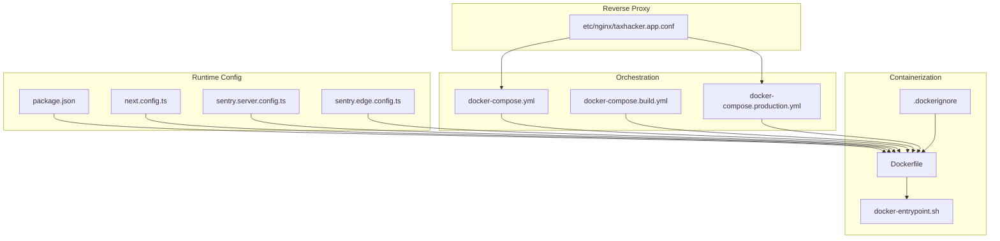
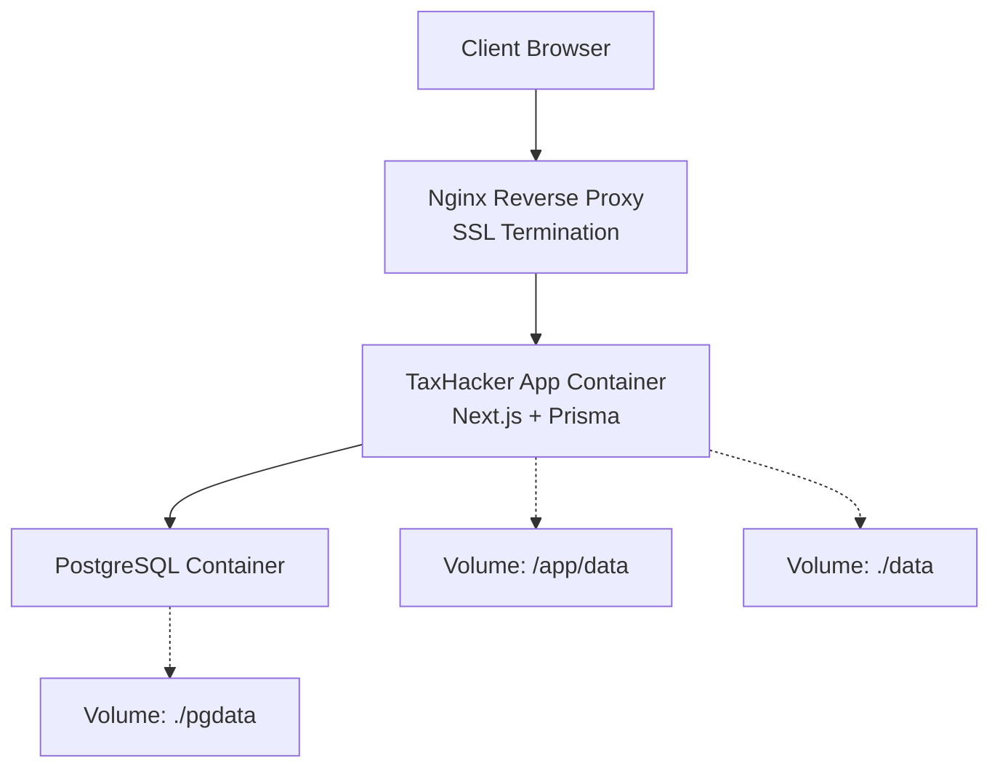
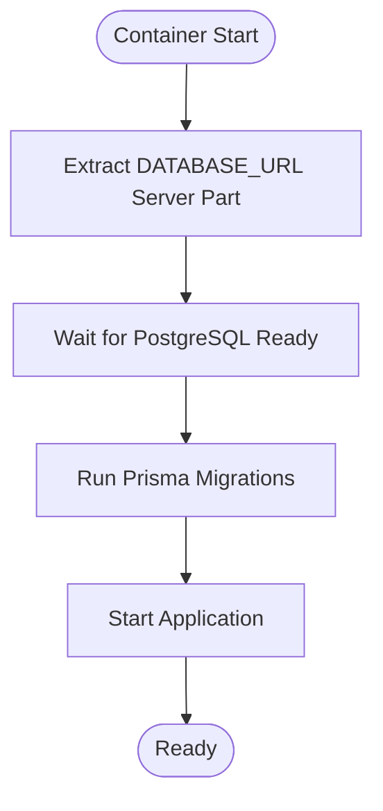
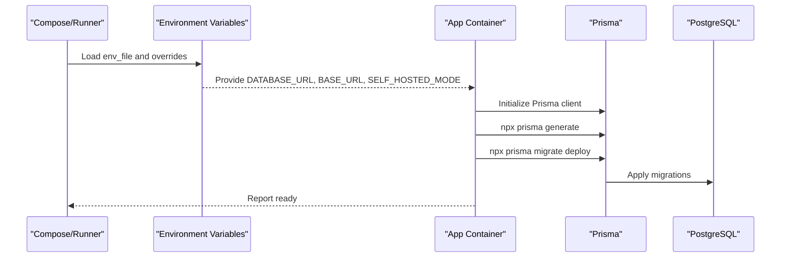
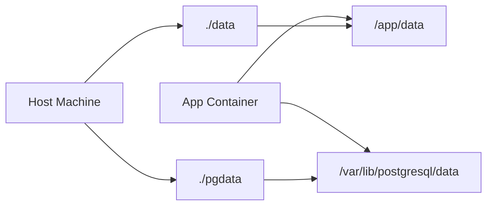
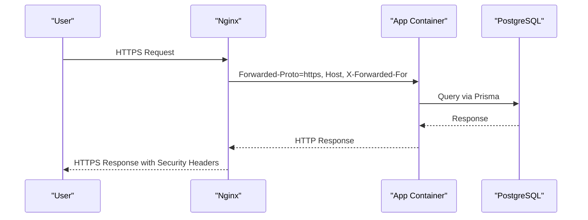
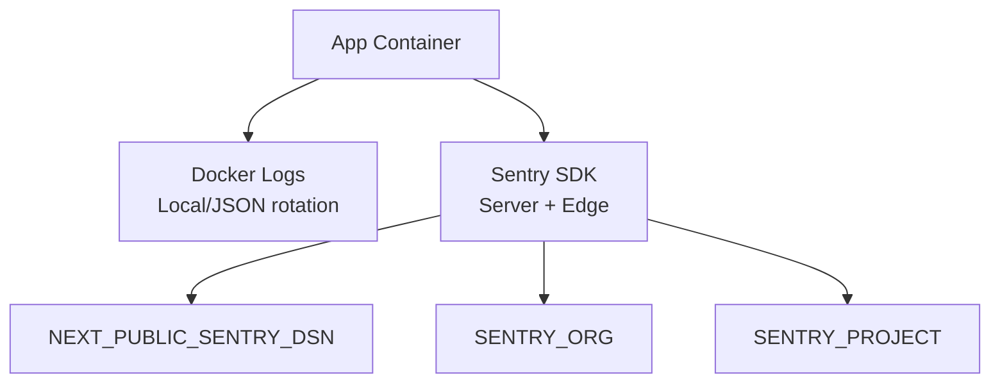
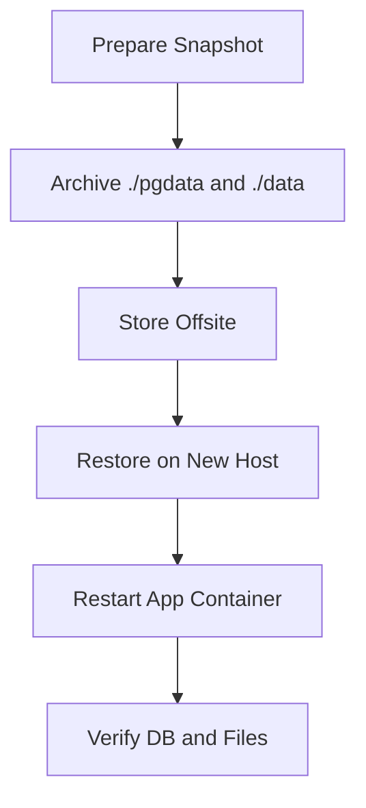
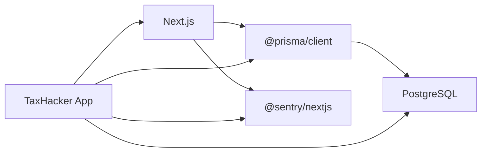

# Deployment & DevOps

<cite>
**Referenced Files in This Document**
- [Dockerfile](file://Dockerfile)
- [.dockerignore](file://.dockerignore)
- [docker-compose.yml](file://docker-compose.yml)
- [docker-compose.build.yml](file://docker-compose.build.yml)
- [docker-compose.production.yml](file://docker-compose.production.yml)
- [docker-entrypoint.sh](file://docker-entrypoint.sh)
- [etc/nginx/taxhacker.app.conf](file://etc/nginx/taxhacker.app.conf)
- [package.json](file://package.json)
- [next.config.ts](file://next.config.ts)
- [sentry.server.config.ts](file://sentry.server.config.ts)
- [sentry.edge.config.ts](file://sentry.edge.config.ts)
- [lib/config.ts](file://lib/config.ts)
- [lib/db.ts](file://lib/db.ts)
- [prisma/schema.prisma](file://prisma/schema.prisma)
- [prisma/migrations](file://prisma/migrations)
- [app/(auth)/self-hosted/page.tsx](file://app/(auth)/self-hosted/page.tsx)
- [app/settings/backups/actions.ts](file://app/settings/backups/actions.ts)
- [app/settings/backups/data/route.ts](file://app/settings/backups/data/route.ts)
</cite>

## Table of Contents
1. [Introduction](#introduction)
2. [Project Structure](#project-structure)
3. [Core Components](#core-components)
4. [Architecture Overview](#architecture-overview)
5. [Detailed Component Analysis](#detailed-component-analysis)
6. [Dependency Analysis](#dependency-analysis)
7. [Performance Considerations](#performance-considerations)
8. [Troubleshooting Guide](#troubleshooting-guide)
9. [Conclusion](#conclusion)
10. [Appendices](#appendices)

## Introduction
This document provides comprehensive deployment and DevOps guidance for TaxHacker. It covers containerization with Docker multi-stage builds, environment configuration, persistent storage, and volume management. It documents production deployment via Docker Compose, Nginx reverse proxy configuration with SSL termination, and self-hosted deployment options. It also outlines CI/CD considerations, automated testing, release management, monitoring with Sentry, health checks, logging configuration, backup and disaster recovery strategies, environment variable management, secrets handling, and security hardening practices. Finally, it includes troubleshooting guidance and performance optimization tips tailored to the repository’s current configuration.

## Project Structure
TaxHacker’s deployment artifacts and runtime configuration are organized as follows:
- Containerization: Dockerfile defines a multi-stage build and runtime entrypoint script.
- Orchestration: Multiple docker-compose files support local development, self-hosted, and production deployments.
- Reverse Proxy: Nginx configuration provides SSL termination and proxying to the application service.
- Monitoring: Sentry SDKs are integrated for server-side and edge features.
- Persistence: Prisma manages database migrations and schema; volumes persist uploaded files and Postgres data.

**Diagram sources**
- [Dockerfile:1-66](file://Dockerfile#L1-L66)
- [docker-entrypoint.sh:1-23](file://docker-entrypoint.sh#L1-L23)
- [.dockerignore:1-9](file://.dockerignore#L1-L9)
- [docker-compose.yml:1-36](file://docker-compose.yml#L1-L36)
- [docker-compose.build.yml:1-39](file://docker-compose.build.yml#L1-L39)
- [docker-compose.production.yml:1-30](file://docker-compose.production.yml#L1-L30)
- [etc/nginx/taxhacker.app.conf:1-43](file://etc/nginx/taxhacker.app.conf#L1-L43)
- [package.json:1-79](file://package.json#L1-L79)
- [next.config.ts:1-30](file://next.config.ts#L1-L30)
- [sentry.server.config.ts:1-16](file://sentry.server.config.ts#L1-L16)
- [sentry.edge.config.ts:1-17](file://sentry.edge.config.ts#L1-L17)

**Section sources**
- [Dockerfile:1-66](file://Dockerfile#L1-L66)
- [docker-compose.yml:1-36](file://docker-compose.yml#L1-L36)
- [docker-compose.build.yml:1-39](file://docker-compose.build.yml#L1-L39)
- [docker-compose.production.yml:1-30](file://docker-compose.production.yml#L1-L30)
- [etc/nginx/taxhacker.app.conf:1-43](file://etc/nginx/taxhacker.app.conf#L1-L43)
- [package.json:1-79](file://package.json#L1-L79)
- [next.config.ts:1-30](file://next.config.ts#L1-L30)
- [sentry.server.config.ts:1-16](file://sentry.server.config.ts#L1-L16)
- [sentry.edge.config.ts:1-17](file://sentry.edge.config.ts#L1-L17)

## Core Components
- Containerization
  - Multi-stage Docker build separates build-time dependencies from the runtime image, reducing attack surface and image size.
  - Runtime system dependencies include CA certificates, Ghostscript, GraphicsMagick, OpenSSL, WebP development libraries, and PostgreSQL client.
  - Application assets are copied from the builder stage, and the entrypoint script runs Prisma migrations and waits for the database before starting the app.
- Orchestration
  - Local development compose file exposes port 7331 and mounts a data directory for uploads.
  - Self-hosted compose file binds the app to localhost and loads environment variables from a file.
  - Production compose file sets BASE_URL, enables self-hosted mode, and uses JSON logging with rotation.
- Reverse Proxy
  - Nginx listens on 80/443, terminates TLS, applies security headers, and proxies requests to the app on 127.0.0.1:7331.
- Monitoring
  - Sentry is configured for server and edge environments, with sampling rate and optional tunnel route.
- Persistence
  - Prisma migrations are executed at startup via the entrypoint script.
  - Uploads and Postgres data are persisted via mounted volumes.

**Section sources**
- [Dockerfile:1-66](file://Dockerfile#L1-L66)
- [docker-entrypoint.sh:1-23](file://docker-entrypoint.sh#L1-L23)
- [docker-compose.yml:1-36](file://docker-compose.yml#L1-L36)
- [docker-compose.build.yml:1-39](file://docker-compose.build.yml#L1-L39)
- [docker-compose.production.yml:1-30](file://docker-compose.production.yml#L1-L30)
- [etc/nginx/taxhacker.app.conf:1-43](file://etc/nginx/taxhacker.app.conf#L1-L43)
- [next.config.ts:1-30](file://next.config.ts#L1-L30)
- [sentry.server.config.ts:1-16](file://sentry.server.config.ts#L1-L16)
- [sentry.edge.config.ts:1-17](file://sentry.edge.config.ts#L1-L17)

## Architecture Overview
The deployment architecture consists of:
- Application container running the Next.js server with Prisma migrations on boot.
- PostgreSQL container for persistence.
- Nginx reverse proxy terminating TLS and forwarding traffic to the application.
- Optional external secrets and environment files for production.

**Diagram sources**
- [docker-compose.production.yml:1-30](file://docker-compose.production.yml#L1-L30)
- [docker-compose.yml:1-36](file://docker-compose.yml#L1-L36)
- [etc/nginx/taxhacker.app.conf:1-43](file://etc/nginx/taxhacker.app.conf#L1-L43)

## Detailed Component Analysis

### Docker Containerization and Multi-Stage Builds
- Build stage installs Node dependencies and Prisma tooling, compiles the application, and prepares Next.js output.
- Runtime stage adds system-level packages for PDF/image processing and database connectivity, copies built assets, and sets the entrypoint.
- The entrypoint script extracts the server portion of DATABASE_URL, waits for PostgreSQL readiness, runs Prisma migrations, and starts the application.

**Diagram sources**
- [docker-entrypoint.sh:1-23](file://docker-entrypoint.sh#L1-L23)
- [Dockerfile:28-66](file://Dockerfile#L28-L66)

**Section sources**
- [Dockerfile:1-66](file://Dockerfile#L1-L66)
- [docker-entrypoint.sh:1-23](file://docker-entrypoint.sh#L1-L23)

### Environment Configuration and Secrets Management
- Environment variables are managed per deployment:
  - Local development compose sets NODE_ENV, SELF_HOSTED_MODE, UPLOAD_PATH, and DATABASE_URL.
  - Self-hosted compose sets NODE_ENV, BASE_URL, SELF_HOSTED_MODE, UPLOAD_PATH, and loads secrets from a file.
  - Production compose sets BASE_URL, SELF_HOSTED_MODE, and relies on env_file for sensitive values.
- Sentry requires NEXT_PUBLIC_SENTRY_DSN, SENTRY_ORG, and SENTRY_PROJECT for server-side monitoring.
- The application reads configuration via a centralized configuration module and connects to the database using Prisma.

**Diagram sources**
- [docker-compose.production.yml:12-13](file://docker-compose.production.yml#L12-L13)
- [docker-compose.yml:6-10](file://docker-compose.yml#L6-L10)
- [docker-entrypoint.sh:15-18](file://docker-entrypoint.sh#L15-L18)
- [lib/config.ts](file://lib/config.ts)
- [lib/db.ts](file://lib/db.ts)

**Section sources**
- [docker-compose.production.yml:1-30](file://docker-compose.production.yml#L1-L30)
- [docker-compose.yml:1-36](file://docker-compose.yml#L1-L36)
- [next.config.ts:18-29](file://next.config.ts#L18-L29)
- [lib/config.ts](file://lib/config.ts)
- [lib/db.ts](file://lib/db.ts)

### Volume Management and Data Persistence
- Uploads and application data are persisted under /app/data inside the container and mapped to ./data on the host.
- PostgreSQL data is persisted under ./pgdata on the host.
- The entrypoint ensures required directories exist at runtime.

**Diagram sources**
- [docker-compose.yml:11-12](file://docker-compose.yml#L11-L12)
- [docker-compose.build.yml:29-30](file://docker-compose.build.yml#L29-L30)
- [docker-compose.production.yml:14-15](file://docker-compose.production.yml#L14-L15)
- [Dockerfile:44-60](file://Dockerfile#L44-L60)

**Section sources**
- [docker-compose.yml:1-36](file://docker-compose.yml#L1-L36)
- [docker-compose.build.yml:1-39](file://docker-compose.build.yml#L1-L39)
- [docker-compose.production.yml:1-30](file://docker-compose.production.yml#L1-L30)
- [Dockerfile:1-66](file://Dockerfile#L1-L66)

### Production Deployment with Docker Compose and Nginx
- The production compose file runs the app container with restricted binding to 127.0.0.1:7331, uses JSON logging with rotation, and loads secrets from an env_file.
- Nginx configuration listens on 80/443, terminates TLS, applies security headers, and forwards requests to the app container.
- Self-hosted mode is enabled via SELF_HOSTED_MODE and BASE_URL is set appropriately.

**Diagram sources**
- [docker-compose.production.yml:19-25](file://docker-compose.production.yml#L19-L25)
- [etc/nginx/taxhacker.app.conf:25-41](file://etc/nginx/taxhacker.app.conf#L25-L41)

**Section sources**
- [docker-compose.production.yml:1-30](file://docker-compose.production.yml#L1-L30)
- [etc/nginx/taxhacker.app.conf:1-43](file://etc/nginx/taxhacker.app.conf#L1-L43)

### CI/CD Pipeline, Automated Testing, and Release Management
- The repository includes a funding file indicating community support but does not contain GitHub Actions workflows in the provided structure snapshot.
- Recommended practices:
  - Add a CI workflow to build the Docker image, run tests, and push to a container registry.
  - Integrate automated linting and unit/e2e tests prior to image promotion.
  - Use semantic versioning and release branches for controlled rollouts.
  - Store secrets in a secure secret manager and inject them via env_file or orchestration secrets.
- Current scripts and configuration indicate a production start command that runs Prisma migrations before starting the server.

**Section sources**
- [.github/FUNDING.yml:1-3](file://.github/FUNDING.yml#L1-L3)
- [package.json:6-11](file://package.json#L6-L11)

### Monitoring Setup with Sentry, Health Checks, and Logging
- Sentry is enabled conditionally based on environment variables and configured for server and edge runtimes.
- Logging:
  - Local compose uses the local driver with rotation.
  - Production compose uses the json-file driver with rotation.
- Health checks:
  - Implement a lightweight health endpoint in the application to probe readiness and liveness.
  - Optionally integrate with Docker healthcheck directives in the compose file.

**Diagram sources**
- [docker-compose.yml:16-20](file://docker-compose.yml#L16-L20)
- [docker-compose.production.yml:21-25](file://docker-compose.production.yml#L21-L25)
- [next.config.ts:18-29](file://next.config.ts#L18-L29)
- [sentry.server.config.ts:1-16](file://sentry.server.config.ts#L1-L16)
- [sentry.edge.config.ts:1-17](file://sentry.edge.config.ts#L1-L17)

**Section sources**
- [next.config.ts:1-30](file://next.config.ts#L1-L30)
- [sentry.server.config.ts:1-16](file://sentry.server.config.ts#L1-L16)
- [sentry.edge.config.ts:1-17](file://sentry.edge.config.ts#L1-L17)
- [docker-compose.yml:1-36](file://docker-compose.yml#L1-L36)
- [docker-compose.production.yml:1-30](file://docker-compose.production.yml#L1-L30)

### Backup Strategies, Disaster Recovery, and Data Migration
- Backups:
  - Persist Postgres data via ./pgdata and application uploads via ./data.
  - Implement periodic tar/zstd snapshots of these directories for offsite retention.
- Disaster Recovery:
  - Restore pgdata and data directories to identical paths on a new host.
  - Re-run the app container; the entrypoint will apply Prisma migrations and start the service.
- Data Migration:
  - Use Prisma’s migration system to evolve the schema safely.
  - For large datasets, consider logical exports/imports or dump/restore utilities.

**Section sources**
- [docker-compose.yml:11-12](file://docker-compose.yml#L11-L12)
- [docker-compose.build.yml:29-30](file://docker-compose.build.yml#L29-L30)
- [docker-entrypoint.sh:15-18](file://docker-entrypoint.sh#L15-L18)
- [prisma/migrations](file://prisma/migrations)

### Security Hardening Practices
- TLS and Headers:
  - Nginx enforces strict security headers and TLS termination.
- Network Isolation:
  - Use a dedicated bridge network for containers.
- Least Privileges:
  - Run containers as non-root where feasible.
- Secrets:
  - Store secrets in env_file and avoid committing them to version control.
- Image Hardening:
  - Use minimal base images and keep packages updated.

**Section sources**
- [etc/nginx/taxhacker.app.conf:17-23](file://etc/nginx/taxhacker.app.conf#L17-L23)
- [docker-compose.production.yml:27-29](file://docker-compose.production.yml#L27-L29)
- [Dockerfile:28-39](file://Dockerfile#L28-L39)

## Dependency Analysis
Key runtime dependencies and their roles:
- Next.js: Application framework and server runtime.
- Prisma: Database ORM and migrations.
- Sentry: Error tracking and performance monitoring.
- PostgreSQL: Relational data store.
- System packages: PDF/image processing and database connectivity.

**Diagram sources**
- [package.json:12-59](file://package.json#L12-L59)
- [next.config.ts:1-30](file://next.config.ts#L1-L30)
- [lib/db.ts](file://lib/db.ts)

**Section sources**
- [package.json:1-79](file://package.json#L1-L79)
- [next.config.ts:1-30](file://next.config.ts#L1-L30)
- [lib/db.ts](file://lib/db.ts)

## Performance Considerations
- Image Size and Startup:
  - Multi-stage build reduces runtime image size; ensure prune unused layers regularly.
- Database Connectivity:
  - Use connection pooling and optimize Prisma queries.
- Static Assets:
  - Leverage Next.js static generation and caching headers.
- Logging:
  - Prefer JSON logging with rotation to reduce disk overhead.
- Nginx:
  - Keep buffer sizes and timeouts tuned for expected traffic.

[No sources needed since this section provides general guidance]

## Troubleshooting Guide
Common deployment issues and resolutions:
- Database Not Ready
  - Symptom: App fails to start due to migration errors.
  - Resolution: Ensure the database container is healthy and reachable; confirm DATABASE_URL and credentials; verify the entrypoint waits for the server.
- Migration Failures
  - Symptom: Prisma migration errors on startup.
  - Resolution: Review migration logs, fix schema inconsistencies, and rerun migrations after backing up data.
- Port Conflicts
  - Symptom: Port 7331 already in use.
  - Resolution: Change mapped ports in compose or stop conflicting services.
- TLS Issues
  - Symptom: Mixed content or certificate errors behind Nginx.
  - Resolution: Confirm SSL certificate paths and header forwarding; ensure X-Forwarded-Proto is set.
- Logs Too Large
  - Symptom: Disk space exhaustion.
  - Resolution: Reduce log retention or increase rotation limits in compose logging options.
- Health Endpoint Needed
  - Symptom: No visibility into container readiness.
  - Resolution: Implement a /health endpoint and configure Docker healthchecks.

**Section sources**
- [docker-entrypoint.sh:1-23](file://docker-entrypoint.sh#L1-L23)
- [docker-compose.yml:16-20](file://docker-compose.yml#L16-L20)
- [docker-compose.production.yml:21-25](file://docker-compose.production.yml#L21-L25)
- [etc/nginx/taxhacker.app.conf:32-38](file://etc/nginx/taxhacker.app.conf#L32-L38)

## Conclusion
TaxHacker’s deployment model leverages a robust multi-stage Docker build, safe runtime dependencies, and a clear separation between development, self-hosted, and production environments. With Nginx handling TLS termination and Prisma managing schema evolution, the system is well-positioned for secure, scalable self-hosted operation. Integrating CI/CD, comprehensive health checks, and structured backup and disaster recovery procedures will further strengthen operational reliability.

[No sources needed since this section summarizes without analyzing specific files]

## Appendices

### Environment Variables Reference
- Required for App Startup
  - DATABASE_URL: PostgreSQL connection string.
  - SELF_HOSTED_MODE: Enables self-hosted features.
  - UPLOAD_PATH: Path for uploaded files inside the container.
  - BASE_URL: Public base URL for production.
- Optional for Monitoring
  - NEXT_PUBLIC_SENTRY_DSN: Sentry DSN for client-side telemetry.
  - SENTRY_ORG: Sentry organization slug.
  - SENTRY_PROJECT: Sentry project slug.
  - Tunnels: Optional tunnelRoute for Sentry uploads.

**Section sources**
- [docker-compose.yml:6-10](file://docker-compose.yml#L6-L10)
- [docker-compose.production.yml:7-13](file://docker-compose.production.yml#L7-L13)
- [next.config.ts:18-29](file://next.config.ts#L18-L29)

### Self-Hosted Deployment Options
- Local Development
  - Use the build compose file to build the image locally and mount data directories.
- Self-Hosted
  - Use the self-hosted compose file with env_file for secrets and restrict app binding to localhost.
- Production
  - Use the production compose file with BASE_URL and external Nginx/TLS termination.

**Section sources**
- [docker-compose.build.yml:1-39](file://docker-compose.build.yml#L1-L39)
- [docker-compose.yml:1-36](file://docker-compose.yml#L1-L36)
- [docker-compose.production.yml:1-30](file://docker-compose.production.yml#L1-L30)

### Backup and Disaster Recovery Procedures
- Backup
  - Archive ./pgdata and ./data directories periodically.
- Restore
  - On a new host, restore directories and restart the stack; migrations will run automatically.
- Migration
  - Use Prisma migrations to evolve the schema safely; test in staging first.

**Section sources**
- [docker-compose.yml:11-12](file://docker-compose.yml#L11-L12)
- [docker-compose.build.yml:29-30](file://docker-compose.build.yml#L29-L30)
- [docker-entrypoint.sh:15-18](file://docker-entrypoint.sh#L15-L18)
- [prisma/migrations](file://prisma/migrations)

### Monitoring and Logging Configuration
- Sentry
  - Configure DSN and organization/project; enable tunnelRoute if needed.
- Logging
  - Use local driver with rotation for local setups; use json-file driver with rotation for production.
- Health Checks
  - Implement a /health endpoint and Docker healthchecks for improved observability.

**Section sources**
- [next.config.ts:18-29](file://next.config.ts#L18-L29)
- [sentry.server.config.ts:1-16](file://sentry.server.config.ts#L1-L16)
- [sentry.edge.config.ts:1-17](file://sentry.edge.config.ts#L1-L17)
- [docker-compose.yml:16-20](file://docker-compose.yml#L16-L20)
- [docker-compose.production.yml:21-25](file://docker-compose.production.yml#L21-L25)