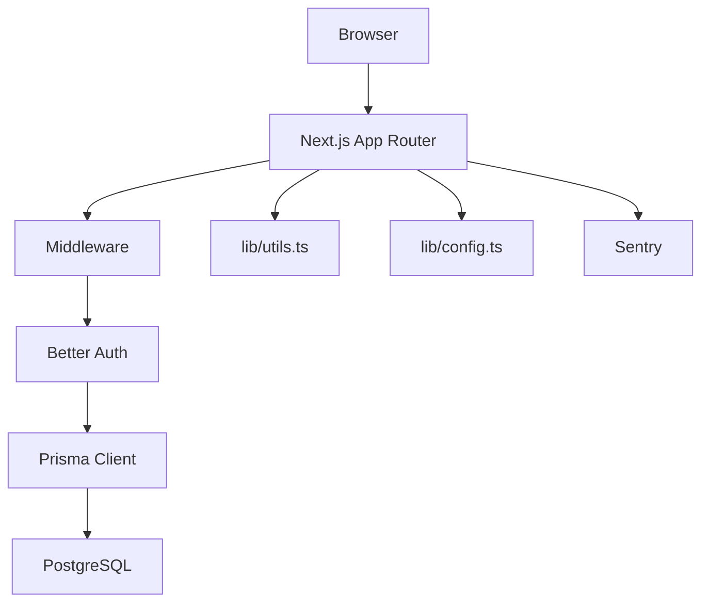
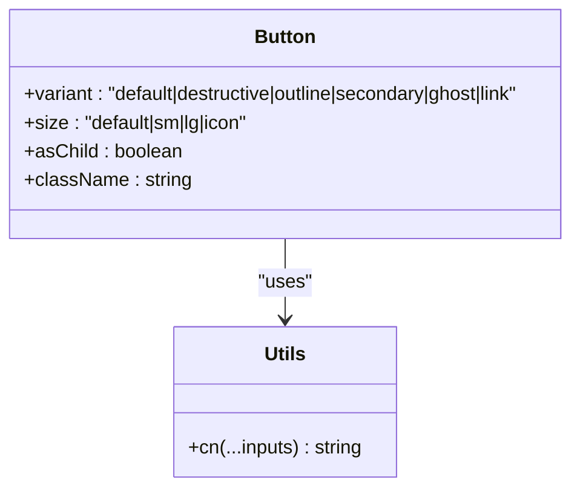
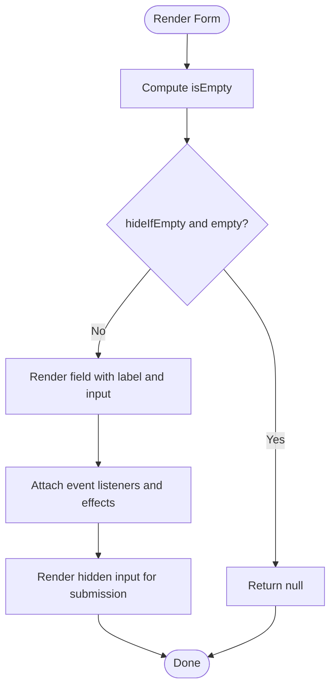
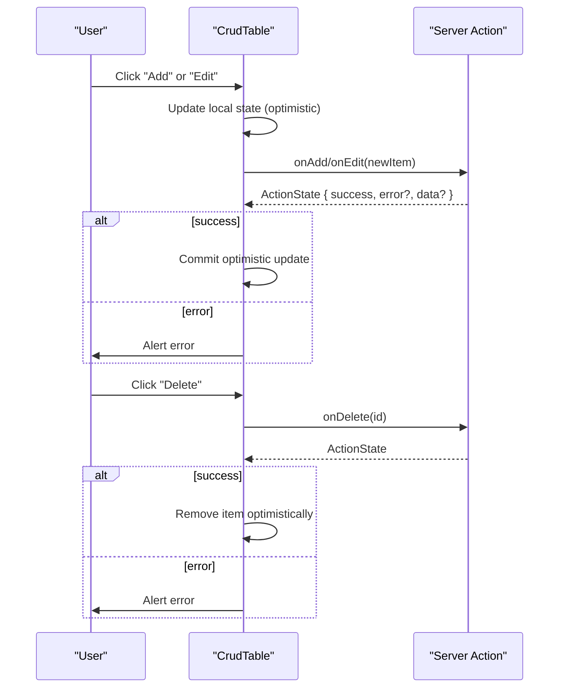
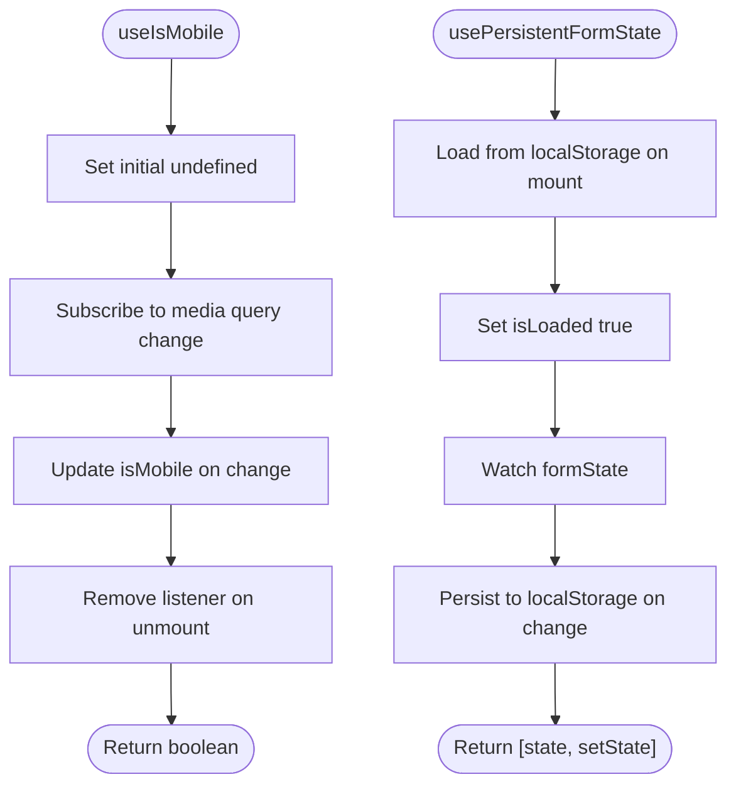
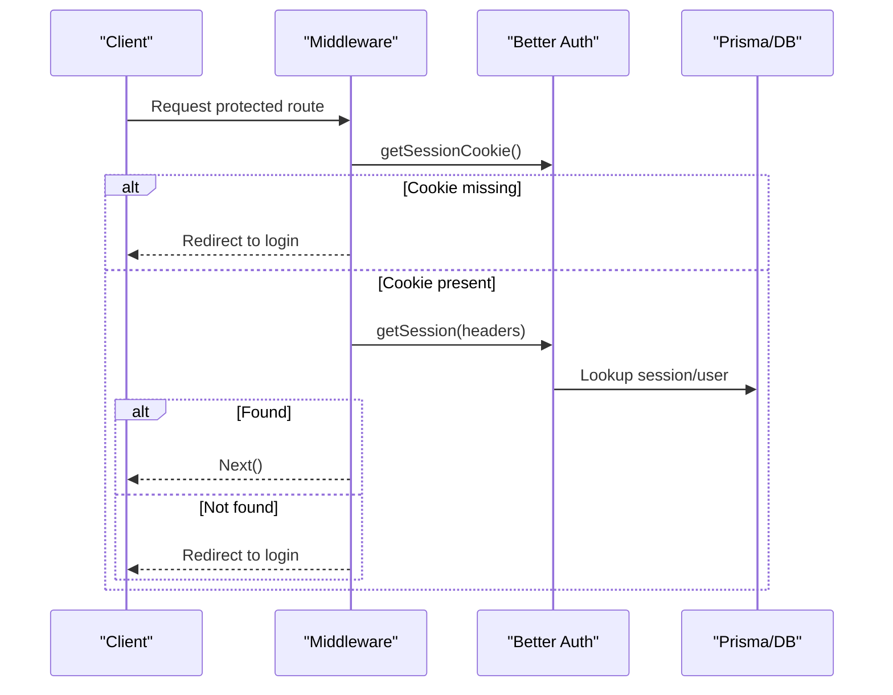
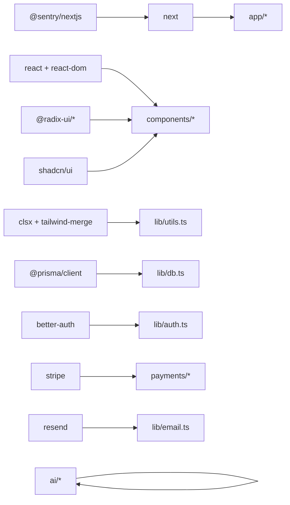

# Development Guidelines

<cite>
**Referenced Files in This Document**
- [package.json](file://package.json)
- [tsconfig.json](file://tsconfig.json)
- [eslint.config.mjs](file://eslint.config.mjs)
- [.prettierrc](file://.prettierrc)
- [next.config.ts](file://next.config.ts)
- [tailwind.config.ts](file://tailwind.config.ts)
- [components.json](file://components.json)
- [middleware.ts](file://middleware.ts)
- [lib/config.ts](file://lib/config.ts)
- [lib/utils.ts](file://lib/utils.ts)
- [hooks/use-mobile.tsx](file://hooks/use-mobile.tsx)
- [hooks/use-persistent-form-state.tsx](file://hooks/use-persistent-form-state.tsx)
- [components/ui/button.tsx](file://components/ui/button.tsx)
- [components/forms/simple.tsx](file://components/forms/simple.tsx)
- [components/settings/crud.tsx](file://components/settings/crud.tsx)
- [lib/actions.ts](file://lib/actions.ts)
- [lib/auth.ts](file://lib/auth.ts)
- [lib/db.ts](file://lib/db.ts)
</cite>

## Table of Contents
1. [Introduction](#introduction)
2. [Project Structure](#project-structure)
3. [Core Components](#core-components)
4. [Architecture Overview](#architecture-overview)
5. [Detailed Component Analysis](#detailed-component-analysis)
6. [Dependency Analysis](#dependency-analysis)
7. [Performance Considerations](#performance-considerations)
8. [Troubleshooting Guide](#troubleshooting-guide)
9. [Conclusion](#conclusion)
10. [Appendices](#appendices)

## Introduction
This document defines TaxHacker’s development guidelines and standards. It covers TypeScript configuration, ESLint and Prettier formatting, project structure conventions, React and Next.js best practices, testing strategy, code review and contribution standards, debugging and performance optimization, development environment setup, and quality/security/accessibility practices. The goal is to ensure consistent, maintainable, and secure development across the codebase.

## Project Structure
TaxHacker follows a Next.js App Router project layout with a clear separation of concerns:
- app: Next.js App Router pages, layouts, and API routes
- components: Reusable UI components organized by feature area
- hooks: Custom React hooks
- lib: Shared utilities, configuration, authentication, database, and actions
- models: Domain models and Prisma client usage
- ai: AI-related logic and providers
- prisma: Database schema and migrations
- public: Static assets and manifests
- docs: Project documentation and guides

```mermaid
graph TB
subgraph "App Router"
APP["app/"]
LAYOUTS["layouts, pages, API routes"]
end
subgraph "Components"
UI["components/ui/"]
FORMS["components/forms/"]
SETTINGS["components/settings/"]
DASHBOARD["components/dashboard/"]
TRANSACTIONS["components/transactions/"]
end
subgraph "Shared"
LIB["lib/"]
HOOKS["hooks/"]
MODELS["models/"]
end
subgraph "AI"
AI["ai/"]
end
subgraph "Infrastructure"
PRISMA["prisma/"]
DOCS["docs/"]
PUBLIC["public/"]
end
APP --> UI
APP --> FORMS
APP --> SETTINGS
APP --> DASHBOARD
APP --> TRANSACTIONS
APP --> LIB
APP --> HOOKS
APP --> MODELS
LIB --> MODELS
LIB --> PRISMA
AI --> LIB
APP --> PUBLIC
APP --> DOCS
```

**Diagram sources**
- [package.json:1-79](file://package.json#L1-L79)
- [lib/config.ts:1-82](file://lib/config.ts#L1-L82)

**Section sources**
- [package.json:1-79](file://package.json#L1-L79)
- [lib/config.ts:1-82](file://lib/config.ts#L1-L82)

## Core Components
This section documents the foundational configuration and shared utilities that define the project’s standards.

- TypeScript configuration
  - Strict mode enabled with ES2017 target and bundler module resolution
  - JSX preserved for Next.js compatibility
  - Path alias @/* mapped to repository root
  - Incremental compilation enabled

- ESLint configuration
  - Flat config extends Next.js core-web-vitals and TypeScript recommended presets
  - Ensures modern web vitals and TS best practices

- Prettier formatting
  - Indentation: 2 spaces, no tabs
  - Semicolons off, single quote on, trailing commas ES5
  - Arrow parens always, print width 120

- Next.js configuration
  - ESLint ignored during builds (temporary)
  - Images unoptimized for production stability
  - Server Actions body size limit increased to 256 MB
  - Sentry integration conditionally enabled via environment variables

- Tailwind CSS
  - Dark mode via class strategy
  - Content scanning across app, components, and pages
  - Theme extended with semantic color tokens and radius variables
  - Uses tailwindcss-animate plugin

- shadcn/ui configuration
  - RSC and TSX enabled
  - Tailwind config and CSS variables aligned
  - Aliases for components, utils, ui, lib, hooks

**Section sources**
- [tsconfig.json:1-42](file://tsconfig.json#L1-L42)
- [eslint.config.mjs:1-17](file://eslint.config.mjs#L1-L17)
- [.prettierrc:1-14](file://.prettierrc#L1-L14)
- [next.config.ts:1-30](file://next.config.ts#L1-L30)
- [tailwind.config.ts:1-73](file://tailwind.config.ts#L1-L73)
- [components.json:1-21](file://components.json#L1-L21)

## Architecture Overview
The application uses Next.js App Router with server-side rendering, server actions, and middleware for authentication gating. Authentication is handled by Better Auth with JWT sessions and email OTP verification. Data persistence uses Prisma with PostgreSQL. Sentry is integrated for error monitoring. Utilities and helpers live under lib, while reusable UI components are built with shadcn/ui and Radix UI primitives.



**Diagram sources**
- [middleware.ts:1-28](file://middleware.ts#L1-L28)
- [lib/auth.ts:1-114](file://lib/auth.ts#L1-L114)
- [lib/db.ts:1-10](file://lib/db.ts#L1-L10)
- [lib/utils.ts:1-159](file://lib/utils.ts#L1-L159)
- [lib/config.ts:1-82](file://lib/config.ts#L1-L82)
- [next.config.ts:18-29](file://next.config.ts#L18-L29)

## Detailed Component Analysis

### UI Component Patterns
Reusable UI components follow shadcn/ui design principles with variant-driven styling and Radix UI composable primitives. They expose consistent props, forward refs, and integrate with Tailwind classes via a centralized cn utility.



**Diagram sources**
- [components/ui/button.tsx:1-58](file://components/ui/button.tsx#L1-L58)
- [lib/utils.ts:8-10](file://lib/utils.ts#L8-L10)

**Section sources**
- [components/ui/button.tsx:1-58](file://components/ui/button.tsx#L1-L58)
- [lib/utils.ts:8-10](file://lib/utils.ts#L8-L10)

### Form Components and Controlled Behavior
Form components encapsulate controlled inputs, dynamic resizing, hidden submission values, and accessibility attributes. They demonstrate best practices for form state management and user feedback.



**Diagram sources**
- [components/forms/simple.tsx:23-41](file://components/forms/simple.tsx#L23-L41)
- [components/forms/simple.tsx:49-84](file://components/forms/simple.tsx#L49-L84)
- [components/forms/simple.tsx:106-165](file://components/forms/simple.tsx#L106-L165)

**Section sources**
- [components/forms/simple.tsx:1-289](file://components/forms/simple.tsx#L1-L289)

### CRUD Component with Optimistic Updates
The CRUD table demonstrates controlled editing, optimistic UI updates, and robust error handling. It supports multiple input types and integrates with server actions via an ActionState contract.



**Diagram sources**
- [components/settings/crud.tsx:26-362](file://components/settings/crud.tsx#L26-L362)
- [lib/actions.ts:1-6](file://lib/actions.ts#L1-L6)

**Section sources**
- [components/settings/crud.tsx:1-369](file://components/settings/crud.tsx#L1-L369)
- [lib/actions.ts:1-6](file://lib/actions.ts#L1-L6)

### Hooks: Responsive Detection and Persistent Form State
Custom hooks encapsulate cross-browser responsive detection and persistent form state using localStorage.



**Diagram sources**
- [hooks/use-mobile.tsx:1-20](file://hooks/use-mobile.tsx#L1-L20)
- [hooks/use-persistent-form-state.tsx:1-23](file://hooks/use-persistent-form-state.tsx#L1-L23)

**Section sources**
- [hooks/use-mobile.tsx:1-20](file://hooks/use-mobile.tsx#L1-L20)
- [hooks/use-persistent-form-state.tsx:1-23](file://hooks/use-persistent-form-state.tsx#L1-L23)

### Authentication and Session Management
Authentication is powered by Better Auth with email OTP verification, JWT sessions, and cookie caching. Self-hosted mode alters behavior for local deployments.



**Diagram sources**
- [middleware.ts:5-15](file://middleware.ts#L5-L15)
- [lib/auth.ts:67-99](file://lib/auth.ts#L67-L99)

**Section sources**
- [lib/auth.ts:1-114](file://lib/auth.ts#L1-L114)
- [middleware.ts:1-28](file://middleware.ts#L1-L28)
- [lib/config.ts:50-78](file://lib/config.ts#L50-L78)

## Dependency Analysis
The project relies on a cohesive set of libraries for UI, state, routing, auth, AI, payments, and observability. Dependencies are declared in package.json with pinned versions and overrides for compatibility.



**Diagram sources**
- [package.json:12-59](file://package.json#L12-L59)
- [lib/db.ts:1-10](file://lib/db.ts#L1-L10)
- [lib/auth.ts:1-114](file://lib/auth.ts#L1-L114)
- [next.config.ts:18-29](file://next.config.ts#L18-L29)

**Section sources**
- [package.json:1-79](file://package.json#L1-L79)

## Performance Considerations
- Prefer server actions for large payloads; the Next.js config increases body size limit to 256 MB to accommodate heavy operations.
- Use optimistic UI updates in CRUD components to reduce perceived latency.
- Leverage controlled components and minimal re-renders; avoid unnecessary state updates.
- Keep images optimized; upload limits and quality settings are configured centrally.
- Enable Sentry only when environment variables are present to avoid runtime overhead in local development.
- Use incremental TypeScript compilation and bundler module resolution for faster builds.

[No sources needed since this section provides general guidance]

## Troubleshooting Guide
- Linting failures
  - ESLint is currently disabled during builds; enable and fix issues by running the linter script.
  - Ensure flat config extends Next.js recommended rules.

- Middleware redirects
  - Protected routes redirect to login when no session cookie is present; verify cookie prefix and login URL configuration.

- Sentry errors
  - Sentry is conditionally enabled; ensure required environment variables are set for monitoring.

- Database queries
  - Prisma client logs are enabled in non-production environments; monitor logs for slow queries.

- Authentication issues
  - Verify Better Auth configuration, session cookies, and email OTP settings.

**Section sources**
- [next.config.ts:5-7](file://next.config.ts#L5-L7)
- [middleware.ts:10-14](file://middleware.ts#L10-L14)
- [lib/auth.ts:25-65](file://lib/auth.ts#L25-L65)
- [lib/db.ts:7-9](file://lib/db.ts#L7-L9)

## Conclusion
These guidelines establish a consistent foundation for building, testing, and maintaining TaxHacker. By adhering to the TypeScript, ESLint, and Prettier standards, following React and Next.js best practices, and leveraging the shared utilities and components, contributors can deliver reliable, secure, and accessible features efficiently.

[No sources needed since this section summarizes without analyzing specific files]

## Appendices

### Development Environment Setup
- Install dependencies using the package manager defined in the project.
- Run the development server with the provided script.
- Build and start commands are available for production-like testing.

**Section sources**
- [package.json:6-10](file://package.json#L6-L10)

### IDE Configuration Recommendations
- Enable TypeScript checking and ESLint integration in your editor.
- Configure Prettier to format on save with the provided rules.
- Use path aliases (@/*) consistently across imports.

**Section sources**
- [tsconfig.json:25-29](file://tsconfig.json#L25-L29)
- [.prettierrc:1-14](file://.prettierrc#L1-L14)

### Debugging Workflows
- Use browser DevTools and React DevTools to inspect components and hooks.
- Monitor network requests and server action payloads.
- Enable Sentry for error tracking and performance monitoring.
- Inspect Prisma logs in development to identify slow queries.

**Section sources**
- [next.config.ts:18-29](file://next.config.ts#L18-L29)
- [lib/db.ts:7-9](file://lib/db.ts#L7-L9)

### Testing Strategy
- Unit tests: Focus on pure functions in lib/utils.ts and isolated hooks.
- Integration tests: Validate server actions and database interactions using Prisma client.
- End-to-end tests: Cover critical user journeys (authentication, CRUD operations, file uploads) using a browser automation framework.

[No sources needed since this section provides general guidance]

### Code Review and Contribution Standards
- Branch naming: Use descriptive names prefixed with feature/, fix/, chore/.
- Pull requests: Include a summary, screenshots for UI changes, and test coverage notes.
- Reviews: Require at least one approving review; address comments promptly.
- Commits: Keep commits small and focused; reference issues by number.

[No sources needed since this section provides general guidance]

### Maintaining Code Quality
- Enforce strict TypeScript settings and flat ESLint rules.
- Format all code with Prettier before committing.
- Keep dependencies updated; audit for vulnerabilities regularly.

**Section sources**
- [tsconfig.json:11](file://tsconfig.json#L11)
- [eslint.config.mjs:12-14](file://eslint.config.mjs#L12-L14)
- [.prettierrc:1-14](file://.prettierrc#L1-14)

### Security Practices
- Validate and sanitize all user inputs; enforce strong secrets for Better Auth.
- Use HTTPS and secure cookies; configure CSRF protections via Better Auth plugins.
- Limit file uploads by MIME type and size; validate on both client and server.

**Section sources**
- [lib/config.ts:3-23](file://lib/config.ts#L3-L23)
- [lib/auth.ts:50-65](file://lib/auth.ts#L50-L65)

### Accessibility Compliance
- Use semantic HTML and ARIA attributes where appropriate.
- Ensure keyboard navigation and focus management in dialogs and modals.
- Provide labels for form controls and meaningful error messages.

[No sources needed since this section provides general guidance]