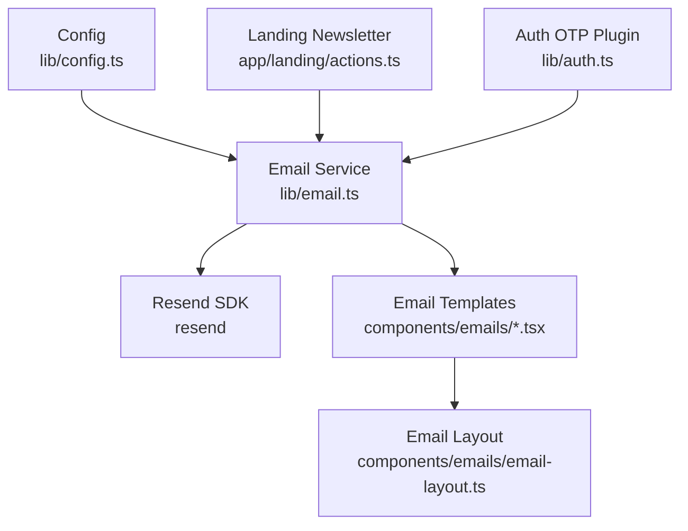
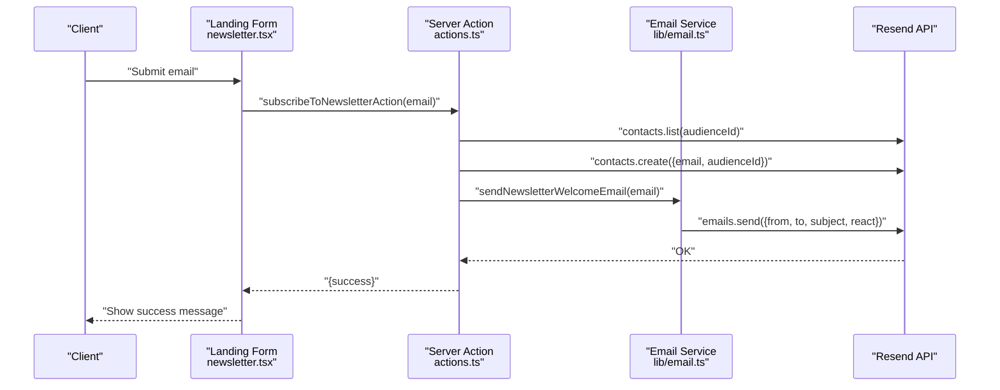
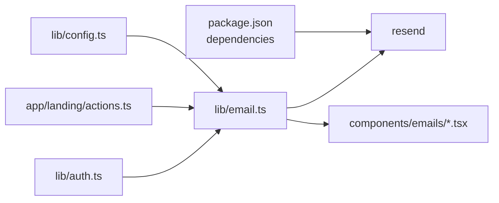

# Email System

<cite>
**Referenced Files in This Document**
- [email.ts](file://lib/email.ts)
- [config.ts](file://lib/config.ts)
- [email-layout.tsx](file://components/emails/email-layout.tsx)
- [otp-email.tsx](file://components/emails/otp-email.tsx)
- [newsletter-welcome-email.tsx](file://components/emails/newsletter-welcome-email.tsx)
- [actions.ts](file://app/landing/actions.ts)
- [newsletter.tsx](file://app/landing/newsletter.tsx)
- [auth.ts](file://lib/auth.ts)
- [auth-client.ts](file://lib/auth-client.ts)
- [package.json](file://package.json)
</cite>

## Table of Contents
1. [Introduction](#introduction)
2. [Project Structure](#project-structure)
3. [Core Components](#core-components)
4. [Architecture Overview](#architecture-overview)
5. [Detailed Component Analysis](#detailed-component-analysis)
6. [Dependency Analysis](#dependency-analysis)
7. [Performance Considerations](#performance-considerations)
8. [Troubleshooting Guide](#troubleshooting-guide)
9. [Conclusion](#conclusion)

## Introduction
This document describes the email system used by TaxHacker for transactional and marketing email capabilities. It covers configuration, provider integration via Resend, template composition, authentication and newsletter workflows, and operational guidance for reliability and deliverability.

## Project Structure
The email system is organized around a small set of focused modules:
- Configuration module defines environment-driven email settings.
- Email service module encapsulates Resend integration and exposes simple send functions.
- Email templates are React components that render HTML emails using a shared layout.
- Landing newsletter subscription integrates with the email service and Resend contacts.
- Authentication integration triggers OTP emails during sign-in flows.

**Diagram sources**
- [config.ts:74-78](file://lib/config.ts#L74-L78)
- [email.ts:4-7](file://lib/email.ts#L4-L7)
- [email.ts:9-29](file://lib/email.ts#L9-L29)
- [email-layout.tsx:1-59](file://components/emails/email-layout.tsx#L1-L59)
- [actions.ts:12-28](file://app/landing/actions.ts#L12-L28)
- [auth.ts:51-62](file://lib/auth.ts#L51-L62)

**Section sources**
- [config.ts:74-78](file://lib/config.ts#L74-L78)
- [email.ts:4-7](file://lib/email.ts#L4-L7)
- [email.ts:9-29](file://lib/email.ts#L9-L29)
- [email-layout.tsx:1-59](file://components/emails/email-layout.tsx#L1-L59)
- [actions.ts:12-28](file://app/landing/actions.ts#L12-L28)
- [auth.ts:51-62](file://lib/auth.ts#L51-L62)

## Core Components
- Email configuration
  - API key and sender identity are loaded from environment variables and exposed via a typed configuration object.
  - Audience ID is configured for marketing contact management.
- Email service
  - Initializes the Resend client using the configured API key.
  - Provides two primary functions:
    - Send OTP verification email with a React-rendered template.
    - Send newsletter welcome email with a React-rendered template.
- Email templates
  - OTP email template renders a verification code with expiration messaging.
  - Newsletter welcome email template communicates subscription benefits and team signature.
  - Shared layout component defines base styles and viewport metadata.
- Landing newsletter subscription
  - Validates email input, checks existing contacts via Resend, creates a new contact, and sends a welcome email.
- Authentication integration
  - Better Auth email OTP plugin triggers the OTP email during sign-in flows.

**Section sources**
- [config.ts:18-20](file://lib/config.ts#L18-L20)
- [config.ts:74-78](file://lib/config.ts#L74-L78)
- [email.ts:4-7](file://lib/email.ts#L4-L7)
- [email.ts:9-29](file://lib/email.ts#L9-L29)
- [otp-email.tsx:1-39](file://components/emails/otp-email.tsx#L1-L39)
- [newsletter-welcome-email.tsx:1-32](file://components/emails/newsletter-welcome-email.tsx#L1-L32)
- [email-layout.tsx:1-59](file://components/emails/email-layout.tsx#L1-L59)
- [actions.ts:6-37](file://app/landing/actions.ts#L6-L37)
- [auth.ts:51-62](file://lib/auth.ts#L51-L62)

## Architecture Overview
The email system follows a thin service layer pattern:
- Configuration is environment-driven and validated at startup.
- The email service composes React email components and delegates delivery to Resend.
- Landing newsletter and auth flows trigger the email service functions.

**Diagram sources**
- [newsletter.tsx:6-31](file://app/landing/newsletter.tsx#L6-L31)
- [actions.ts:6-37](file://app/landing/actions.ts#L6-L37)
- [email.ts:20-29](file://lib/email.ts#L20-L29)
- [config.ts:18-20](file://lib/config.ts#L18-L20)

## Detailed Component Analysis

### Email Configuration
- Environment variables:
  - API key for Resend.
  - Sender identity (from address).
  - Marketing audience ID for contact management.
- Validation and defaults:
  - Zod schema enforces presence and types; provides sensible defaults for local development.
- Access pattern:
  - The email service reads configuration to set the Resend client and sender identity.

Operational notes:
- Ensure the API key and sender identity are set in production.
- Audience ID is optional; if empty, the newsletter subscription flow will still send welcome emails but will skip contact deduplication and creation steps.

**Section sources**
- [config.ts:3-23](file://lib/config.ts#L3-L23)
- [config.ts:74-78](file://lib/config.ts#L74-L78)
- [email.ts:4-7](file://lib/email.ts#L4-L7)

### Email Service
- Initialization:
  - Creates a Resend client using the configured API key.
- OTP email:
  - Renders the OTP template with the provided code.
  - Sends with configured sender, recipient, subject, and React payload.
- Newsletter welcome:
  - Renders the welcome template.
  - Sends with configured sender, recipient, subject, and React payload.

Security and reliability:
- Uses a single sender identity configured centrally.
- Relies on Resend’s transport for delivery guarantees and bounce/webhook integrations.

**Section sources**
- [email.ts:4-7](file://lib/email.ts#L4-L7)
- [email.ts:9-29](file://lib/email.ts#L9-L29)

### Email Templates
- Layout:
  - Defines base HTML structure, viewport, color-scheme metadata, and inline styles for container, header, and footer.
- OTP email:
  - Displays the verification code prominently with expiration notice and a “not requested” disclaimer.
- Newsletter welcome:
  - Welcomes the user and outlines what they will receive.

Customization and branding:
- Modify the layout styles and template content to align with brand guidelines.
- Keep subject lines concise and aligned with user expectations.

Localization:
- Current templates are static; to localize, externalize strings and render templates conditionally by locale.

**Section sources**
- [email-layout.tsx:1-59](file://components/emails/email-layout.tsx#L1-L59)
- [otp-email.tsx:1-39](file://components/emails/otp-email.tsx#L1-L39)
- [newsletter-welcome-email.tsx:1-32](file://components/emails/newsletter-welcome-email.tsx#L1-L32)

### Landing Newsletter Subscription
- Workflow:
  - Validates email format.
  - Lists existing contacts in the configured audience and prevents duplicates.
  - Creates a new contact in the audience.
  - Sends the welcome email.
- Error handling:
  - Returns structured errors for invalid input and subscription failures.

Integration points:
- Requires a non-empty audience ID to enable deduplication and contact creation.
- Uses the email service for sending.

**Section sources**
- [actions.ts:6-37](file://app/landing/actions.ts#L6-L37)
- [email.ts:20-29](file://lib/email.ts#L20-L29)
- [config.ts:18-20](file://lib/config.ts#L18-L20)

### Authentication OTP Integration
- Plugin configuration:
  - Better Auth email OTP plugin is enabled with:
    - Fixed OTP length.
    - Expiration window.
    - Custom send function that invokes the email service.
- Behavior:
  - On verification requests, the plugin resolves the user by email and triggers the OTP email.

Operational impact:
- Ensures secure, time-bound verification codes are delivered via the same email infrastructure used by the rest of the system.

**Section sources**
- [auth.ts:51-62](file://lib/auth.ts#L51-L62)
- [auth-client.ts:1-6](file://lib/auth-client.ts#L1-L6)
- [email.ts:9-18](file://lib/email.ts#L9-L18)

## Dependency Analysis
- External dependency:
  - Resend SDK is used for sending emails and managing contacts.
- Internal dependencies:
  - Email service depends on configuration and React templates.
  - Landing action depends on the email service and Resend contacts API.
  - Auth plugin depends on the email service for OTP delivery.

**Diagram sources**
- [package.json](file://package.json)
- [email.ts:4-7](file://lib/email.ts#L4-L7)
- [email.ts:9-29](file://lib/email.ts#L9-L29)
- [actions.ts:3-4](file://app/landing/actions.ts#L3-L4)
- [auth.ts:51-62](file://lib/auth.ts#L51-L62)

**Section sources**
- [package.json](file://package.json)
- [email.ts:4-7](file://lib/email.ts#L4-L7)
- [email.ts:9-29](file://lib/email.ts#L9-L29)
- [actions.ts:3-4](file://app/landing/actions.ts#L3-L4)
- [auth.ts:51-62](file://lib/auth.ts#L51-L62)

## Performance Considerations
- Asynchronous delivery:
  - Email sends are awaited synchronously in current flows. For high volume, consider offloading to a background job queue (e.g., task queues) to avoid blocking request handlers.
- Template rendering:
  - Rendering React components for each email adds overhead. For scale, pre-render and cache templates or switch to server-side rendered HTML templates.
- Deduplication:
  - Listing contacts before subscription is O(n) over the number of contacts. For large audiences, consider indexing or caching strategies.

[No sources needed since this section provides general guidance]

## Troubleshooting Guide
Common issues and resolutions:
- Invalid sender identity
  - Symptom: Delivery failures or sandbox behavior.
  - Resolution: Verify the configured sender identity matches a verified domain/sender in Resend.
- Missing audience ID
  - Symptom: Duplicate subscriptions possible; contact creation skipped.
  - Resolution: Set the audience ID to enable deduplication and contact management.
- Network or rate limits
  - Symptom: Transient failures during send.
  - Resolution: Retry with exponential backoff; monitor Resend dashboard for rate limit events.
- Template rendering errors
  - Symptom: Blank or malformed emails.
  - Resolution: Validate React component props and ensure the layout styles are applied consistently.
- Authentication OTP not received
  - Symptom: User cannot complete sign-in verification.
  - Resolution: Confirm the user exists, check sender identity, and verify the OTP plugin configuration.

Operational checks:
- Confirm environment variables are present and valid.
- Review Resend logs and analytics for bounces, blocks, and delivery status.
- For newsletter, verify the audience exists and the contact was created.

**Section sources**
- [config.ts:18-20](file://lib/config.ts#L18-L20)
- [actions.ts:12-28](file://app/landing/actions.ts#L12-L28)
- [email.ts:9-29](file://lib/email.ts#L9-L29)
- [auth.ts:51-62](file://lib/auth.ts#L51-L62)

## Conclusion
TaxHacker’s email system is a compact, configuration-driven solution built on Resend. It supports essential transactional and marketing workflows—authentication OTP and newsletter subscription—through reusable React templates and a minimal service layer. For production, consider adding queue-backed delivery, localization, and robust analytics/bounce handling to improve scalability and reliability.