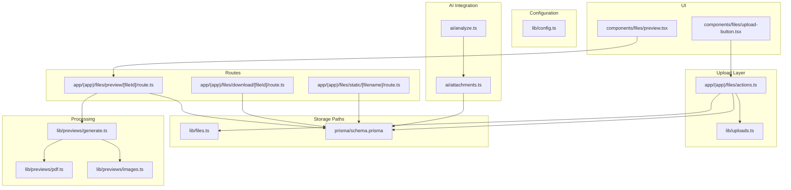
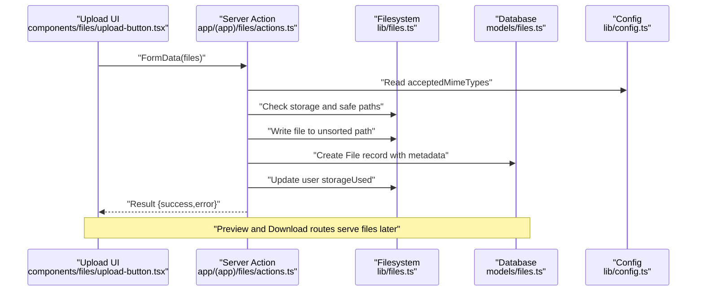
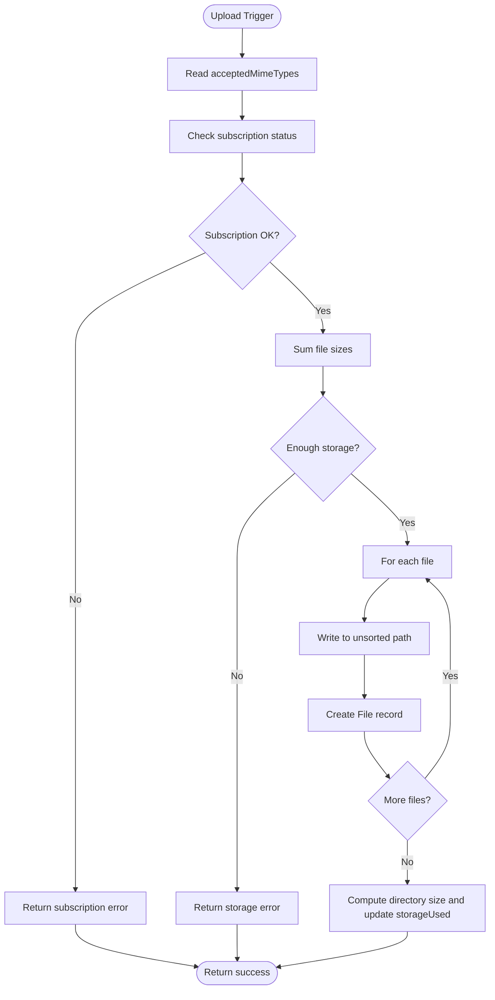
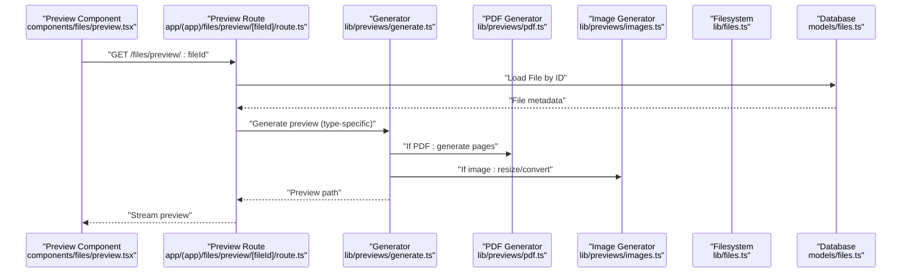
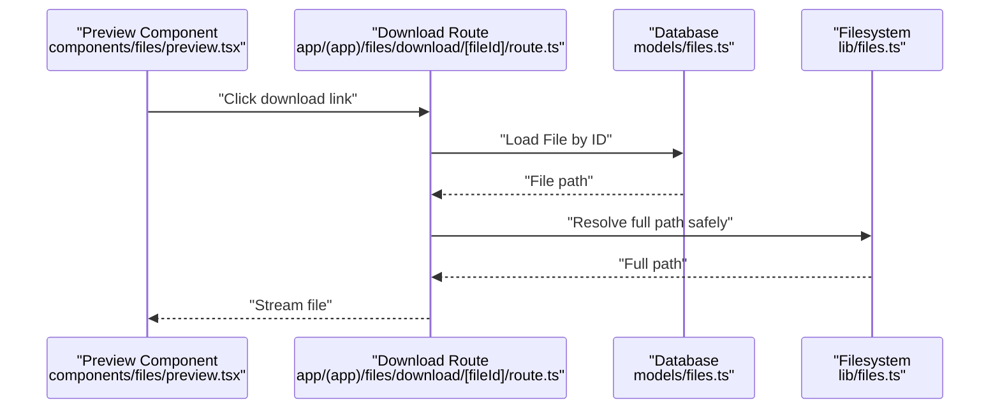
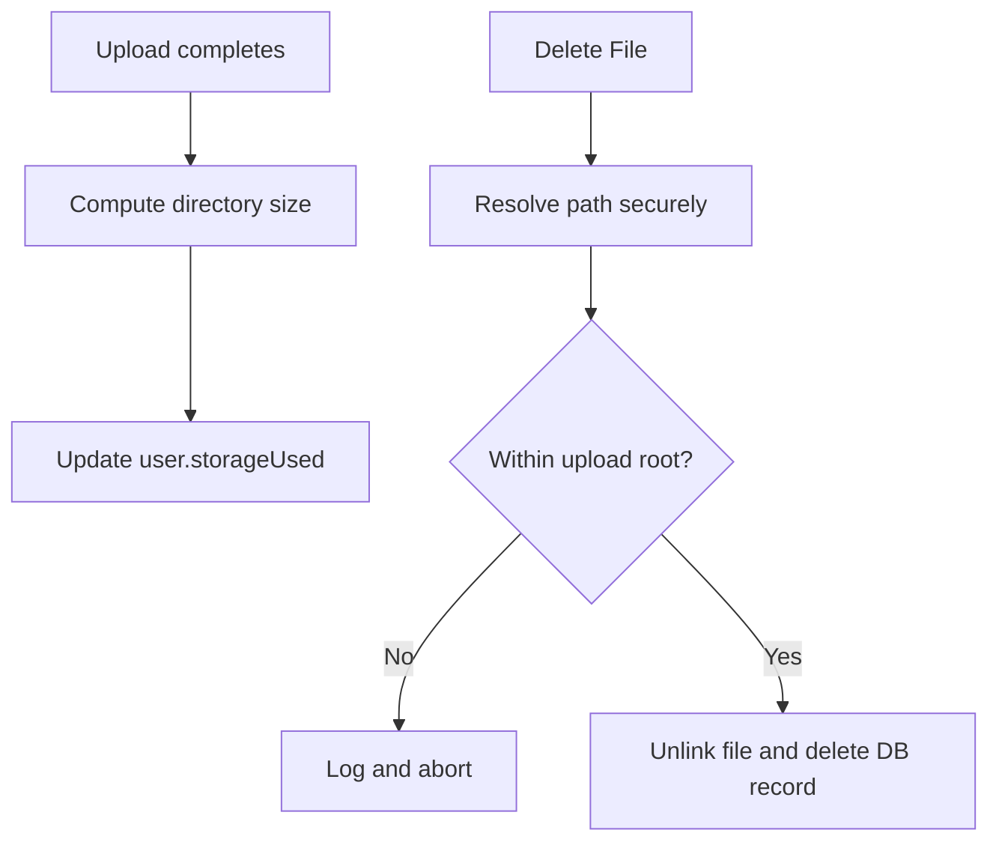
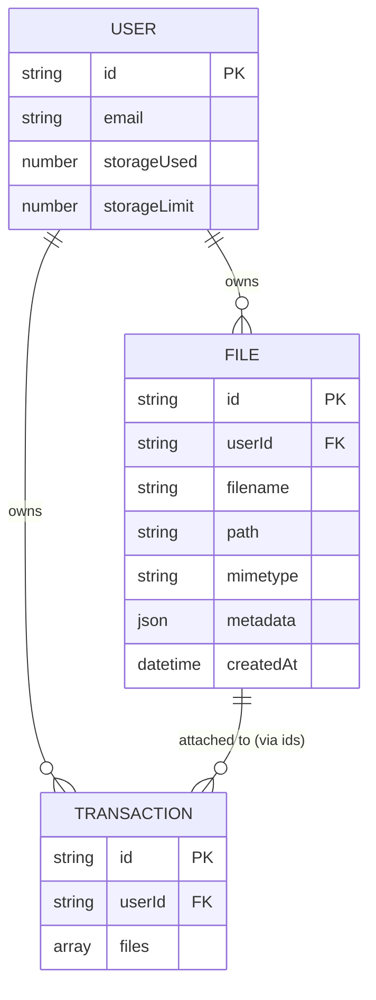
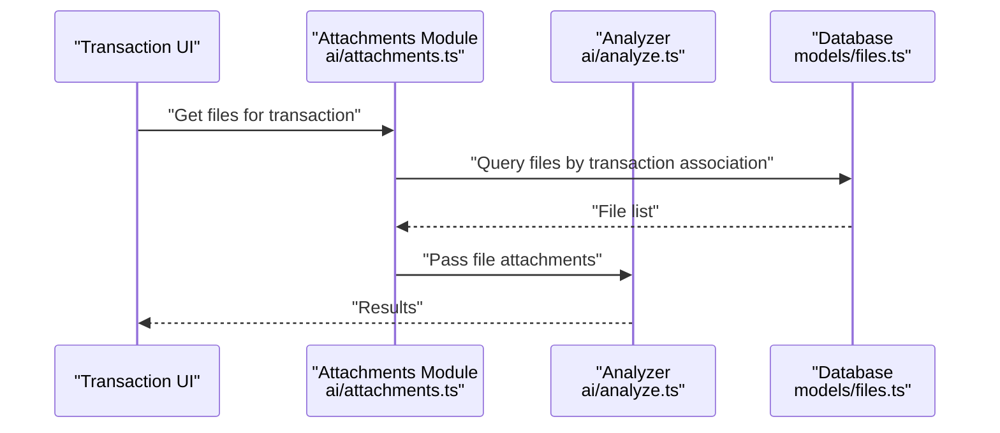
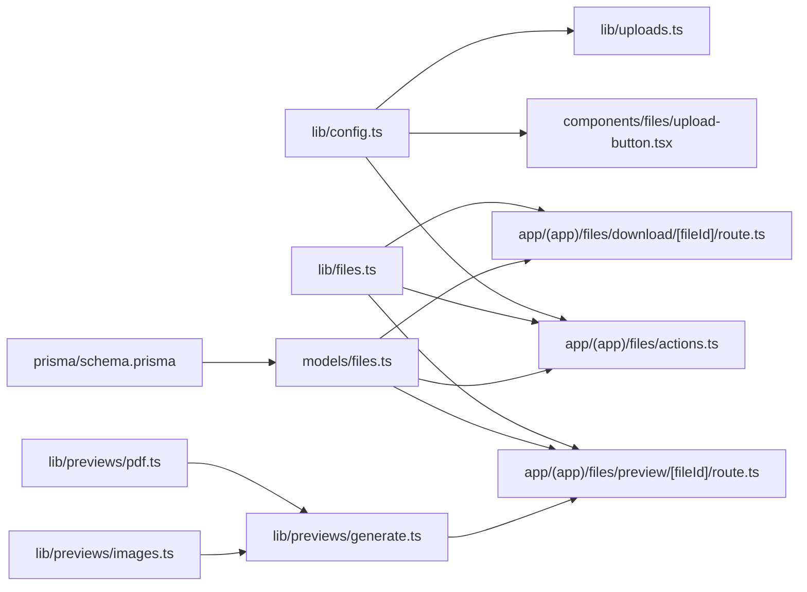

# File Management & Processing

<cite>
**Referenced Files in This Document**
- [lib/files.ts](file://lib/files.ts)
- [lib/uploads.ts](file://lib/uploads.ts)
- [lib/config.ts](file://lib/config.ts)
- [models/files.ts](file://models/files.ts)
- [app/(app)/files/actions.ts](file://app/(app)/files/actions.ts)
- [app/(app)/files/preview/[fileId]/route.ts](file://app/(app)/files/preview/[fileId]/route.ts)
- [app/(app)/files/static/[filename]/route.ts](file://app/(app)/files/static/[filename]/route.ts)
- [app/(app)/files/download/[fileId]/route.ts](file://app/(app)/files/download/[fileId]/route.ts)
- [components/files/preview.tsx](file://components/files/preview.tsx)
- [components/files/upload-button.tsx](file://components/files/upload-button.tsx)
- [lib/previews/generate.ts](file://lib/previews/generate.ts)
- [lib/previews/pdf.ts](file://lib/previews/pdf.ts)
- [lib/previews/images.ts](file://lib/previews/images.ts)
- [ai/attachments.ts](file://ai/attachments.ts)
- [ai/analyze.ts](file://ai/analyze.ts)
- [prisma/schema.prisma](file://prisma/schema.prisma)
</cite>

## Table of Contents
1. [Introduction](#introduction)
2. [Project Structure](#project-structure)
3. [Core Components](#core-components)
4. [Architecture Overview](#architecture-overview)
5. [Detailed Component Analysis](#detailed-component-analysis)
6. [Dependency Analysis](#dependency-analysis)
7. [Performance Considerations](#performance-considerations)
8. [Troubleshooting Guide](#troubleshooting-guide)
9. [Conclusion](#conclusion)
10. [Appendices](#appendices)

## Introduction
This document explains TaxHacker’s file management and processing capabilities. It covers multi-format uploads (PDFs, images, and office documents), the file processing pipeline (preview generation, thumbnails, and storage), validation and size-limit enforcement, security scanning, preview and download flows, temporary file handling, integration with the AI processing engine, transaction attachment workflows, storage quota management, cleanup and backup considerations, metadata handling and indexing/search, and troubleshooting guidance.

## Project Structure
The file management system spans several layers:
- Configuration defines accepted MIME types, image/PDF processing parameters, and self-hosted mode.
- Upload actions persist files to user-specific directories and record metadata in the database.
- Preview generation supports PDFs and images via dedicated generators.
- Static image uploads leverage Sharp for resizing and format conversion.
- Routes expose preview, static, and download endpoints.
- Models encapsulate database operations and path safety checks.
- UI components render previews and trigger uploads.

**Diagram sources**
- [lib/config.ts:35-49](file://lib/config.ts#L35-L49)
- [app/(app)/files/actions.ts:19-81](file://app/(app)/files/actions.ts#L19-L81)
- [lib/files.ts:6,12,16,20,24,29,33,39,53,70,88:6-94](file://lib/files.ts#L6-L94)
- [lib/uploads.ts:8-60](file://lib/uploads.ts#L8-L61)
- [lib/previews/generate.ts](file://lib/previews/generate.ts)
- [lib/previews/pdf.ts](file://lib/previews/pdf.ts)
- [lib/previews/images.ts](file://lib/previews/images.ts)
- [app/(app)/files/preview/[fileId]/route.ts](file://app/(app)/files/preview/[fileId]/route.ts)
- [app/(app)/files/static/[filename]/route.ts](file://app/(app)/files/static/[filename]/route.ts)
- [app/(app)/files/download/[fileId]/route.ts](file://app/(app)/files/download/[fileId]/route.ts)
- [components/files/upload-button.tsx:12-76](file://components/files/upload-button.tsx#L12-L76)
- [components/files/preview.tsx:9-53](file://components/files/preview.tsx#L9-L53)
- [ai/attachments.ts](file://ai/attachments.ts)
- [ai/analyze.ts](file://ai/analyze.ts)
- [prisma/schema.prisma](file://prisma/schema.prisma)

**Section sources**
- [lib/config.ts:35-49](file://lib/config.ts#L35-L49)
- [app/(app)/files/actions.ts:19-81](file://app/(app)/files/actions.ts#L19-L81)
- [lib/files.ts:6,12,16,20,24,29,33,39,53,70,88:6-94](file://lib/files.ts#L6-L94)
- [lib/uploads.ts:8-60](file://lib/uploads.ts#L8-L61)
- [lib/previews/generate.ts](file://lib/previews/generate.ts)
- [lib/previews/pdf.ts](file://lib/previews/pdf.ts)
- [lib/previews/images.ts](file://lib/previews/images.ts)
- [app/(app)/files/preview/[fileId]/route.ts](file://app/(app)/files/preview/[fileId]/route.ts)
- [app/(app)/files/static/[filename]/route.ts](file://app/(app)/files/static/[filename]/route.ts)
- [app/(app)/files/download/[fileId]/route.ts](file://app/(app)/files/download/[fileId]/route.ts)
- [components/files/upload-button.tsx:12-76](file://components/files/upload-button.tsx#L12-L76)
- [components/files/preview.tsx:9-53](file://components/files/preview.tsx#L9-L53)
- [ai/attachments.ts](file://ai/attachments.ts)
- [ai/analyze.ts](file://ai/analyze.ts)
- [prisma/schema.prisma](file://prisma/schema.prisma)

## Core Components
- Storage path utilities and safety:
  - Resolves per-user upload directories, preview directories, and static asset directories.
  - Provides safe path joining and traversal protection.
  - Computes directory sizes and checks storage availability against user quotas.
- Upload actions:
  - Validates subscription status and total upload size.
  - Persists files under unsorted paths and records metadata in the database.
  - Updates user storageUsed after upload.
- Static image upload:
  - Converts and resizes images using Sharp with configurable dimensions and quality.
  - Supports PNG, JPEG, WebP, and AVIF targets.
- Preview generation:
  - PDF previews: generates page-based WebP previews up to configured page limits.
  - Image previews: generates WebP thumbnails with resizing and rotation correction.
- Routes:
  - Preview endpoint serves per-file previews.
  - Static endpoint serves preprocessed static assets.
  - Download endpoint streams files from storage.
- Models:
  - CRUD operations for File entities, including secure deletion with path traversal checks.
- UI:
  - Upload button triggers server actions and handles feedback.
  - Preview component renders lazy-loaded previews and download links.

**Section sources**
- [lib/files.ts:6,12,16,20,24,29,33,39,53,70,88:6-94](file://lib/files.ts#L6-L94)
- [app/(app)/files/actions.ts:19-81](file://app/(app)/files/actions.ts#L19-L81)
- [lib/uploads.ts:8-60](file://lib/uploads.ts#L8-L61)
- [lib/previews/generate.ts](file://lib/previews/generate.ts)
- [lib/previews/pdf.ts](file://lib/previews/pdf.ts)
- [lib/previews/images.ts](file://lib/previews/images.ts)
- [app/(app)/files/preview/[fileId]/route.ts](file://app/(app)/files/preview/[fileId]/route.ts)
- [app/(app)/files/static/[filename]/route.ts](file://app/(app)/files/static/[filename]/route.ts)
- [app/(app)/files/download/[fileId]/route.ts](file://app/(app)/files/download/[fileId]/route.ts)
- [models/files.ts:54-95](file://models/files.ts#L54-L95)
- [components/files/upload-button.tsx:12-76](file://components/files/upload-button.tsx#L12-L76)
- [components/files/preview.tsx:9-53](file://components/files/preview.tsx#L9-L53)

## Architecture Overview
The file pipeline integrates frontend upload actions, backend processing, and storage with optional AI enrichment.

**Diagram sources**
- [components/files/upload-button.tsx:19-42](file://components/files/upload-button.tsx#L19-L42)
- [app/(app)/files/actions.ts:19-81](file://app/(app)/files/actions.ts#L19-L81)
- [lib/files.ts:6,12,16,20,24,29,33,39,53,70,88:6-94](file://lib/files.ts#L6-L94)
- [models/files.ts:54-67](file://models/files.ts#L54-L67)
- [lib/config.ts:35-36](file://lib/config.ts#L35-L36)

## Detailed Component Analysis

### Upload Pipeline and Validation
- Accepted formats are defined centrally and enforced by the upload UI.
- Subscription expiration blocks uploads.
- Total size is computed and compared against user storage limits.
- Each file is written to a per-user unsorted directory with UUID-named paths.
- Database records capture filename, path, MIME type, and metadata (size, lastModified).
- After upload, directory size is recalculated and user storageUsed is updated.

**Diagram sources**
- [lib/config.ts:35-36](file://lib/config.ts#L35-L36)
- [app/(app)/files/actions.ts:26-37](file://app/(app)/files/actions.ts#L26-L37)
- [app/(app)/files/actions.ts:27-30](file://app/(app)/files/actions.ts#L27-L30)
- [app/(app)/files/actions.ts:40-71](file://app/(app)/files/actions.ts#L40-L71)
- [lib/files.ts:70-86](file://lib/files.ts#L70-L86)
- [models/files.ts:54-67](file://models/files.ts#L54-L67)

**Section sources**
- [lib/config.ts:35-36](file://lib/config.ts#L35-L36)
- [app/(app)/files/actions.ts:19-81](file://app/(app)/files/actions.ts#L19-L81)
- [lib/files.ts:70-86](file://lib/files.ts#L70-L86)
- [models/files.ts:54-67](file://models/files.ts#L54-L67)

### Preview Generation and Thumbnails
- PDF previews:
  - Page-based WebP generation with DPI and page limits from configuration.
  - Outputs per-page files in the previews directory.
- Image previews:
  - Uses Sharp to rotate, resize, and convert to WebP with quality settings.
  - Supports PNG/JPEG/WebP/AVIF targets for static uploads.
- Preview route:
  - Serves generated previews by file ID.
- Static route:
  - Serves preprocessed static assets (e.g., resized images) from the static directory.

**Diagram sources**
- [components/files/preview.tsx:19-31](file://components/files/preview.tsx#L19-L31)
- [app/(app)/files/preview/[fileId]/route.ts](file://app/(app)/files/preview/[fileId]/route.ts)
- [lib/previews/generate.ts](file://lib/previews/generate.ts)
- [lib/previews/pdf.ts](file://lib/previews/pdf.ts)
- [lib/previews/images.ts](file://lib/previews/images.ts)
- [lib/files.ts:20,29,33,39](file://lib/files.ts#L20,L29,L33,L39)
- [models/files.ts:30-34](file://models/files.ts#L30-L34)

**Section sources**
- [lib/previews/generate.ts](file://lib/previews/generate.ts)
- [lib/previews/pdf.ts](file://lib/previews/pdf.ts)
- [lib/previews/images.ts](file://lib/previews/images.ts)
- [lib/uploads.ts:8-60](file://lib/uploads.ts#L8-L61)
- [lib/files.ts:20,29,33,39](file://lib/files.ts#L20,L29,L33,L39)
- [models/files.ts:30-34](file://models/files.ts#L30-L34)

### Download Functionality and Temporary Handling
- Download route streams files from storage using the File path recorded in the database.
- Path resolution enforces safe traversal to prevent directory traversal attacks.
- Temporary handling:
  - Unsorted uploads are placed under per-user directories until reviewed or attached.
  - Previews are generated separately in the previews directory.
  - Static assets are stored in the static directory for reuse.

**Diagram sources**
- [components/files/preview.tsx:38-38](file://components/files/preview.tsx#L38-L38)
- [app/(app)/files/download/[fileId]/route.ts](file://app/(app)/files/download/[fileId]/route.ts)
- [models/files.ts:30-34](file://models/files.ts#L30-L34)
- [lib/files.ts:39,53](file://lib/files.ts#L39,L53)

**Section sources**
- [app/(app)/files/download/[fileId]/route.ts](file://app/(app)/files/download/[fileId]/route.ts)
- [models/files.ts:30-34](file://models/files.ts#L30-L34)
- [lib/files.ts:39,53](file://lib/files.ts#L39,L53)

### Storage Quota Management and Cleanup
- Quota enforcement:
  - Per-user storageUsed is updated after uploads.
  - isEnoughStorageToUploadFile compares total upload size against user.storageLimit.
- Cleanup:
  - Deleting a File removes the physical file with path traversal checks.
  - Directory size computation supports quota reporting and cleanup planning.
- Backup considerations:
  - Backups can operate on the base UPLOAD_PATH directory tree.
  - Static and preview directories are organized by user and date to simplify selective restoration.

**Diagram sources**
- [app/(app)/files/actions.ts:73-74](file://app/(app)/files/actions.ts#L73-L74)
- [models/files.ts:70-95](file://models/files.ts#L70-L95)
- [lib/files.ts:70-86](file://lib/files.ts#L70-L86)

**Section sources**
- [app/(app)/files/actions.ts:73-74](file://app/(app)/files/actions.ts#L73-L74)
- [models/files.ts:70-95](file://models/files.ts#L70-L95)
- [lib/files.ts:70-86](file://lib/files.ts#L70-L86)

### Metadata Handling, Indexing, and Search
- Metadata:
  - Stored as JSON in the File model, including size and lastModified.
  - UI displays size and MIME type for previews.
- Indexing/Search:
  - Prisma queries filter and order files by user and transaction associations.
  - Unsorted files are ordered by creation time for review workflows.
- Transaction attachments:
  - Files associated with transactions are retrieved by transaction ID and ordered chronologically.

**Diagram sources**
- [prisma/schema.prisma](file://prisma/schema.prisma)
- [models/files.ts:9-28](file://models/files.ts#L9-L28)
- [models/files.ts:36-52](file://models/files.ts#L36-L52)
- [components/files/preview.tsx:12-13](file://components/files/preview.tsx#L12-L13)

**Section sources**
- [models/files.ts:9-28](file://models/files.ts#L9-L28)
- [models/files.ts:36-52](file://models/files.ts#L36-L52)
- [components/files/preview.tsx:12-13](file://components/files/preview.tsx#L12-L13)
- [prisma/schema.prisma](file://prisma/schema.prisma)

### AI Processing Engine Integration and Transaction Attachments
- Attachment workflow:
  - Files are attached to transactions; retrieval uses transaction ID to fetch associated files.
- AI analysis:
  - AI modules consume file attachments for processing and enrichment.
- Data flow:
  - File records are created during upload and later referenced by transactions and AI pipelines.

**Diagram sources**
- [ai/attachments.ts](file://ai/attachments.ts)
- [ai/analyze.ts](file://ai/analyze.ts)
- [models/files.ts:36-52](file://models/files.ts#L36-L52)

**Section sources**
- [ai/attachments.ts](file://ai/attachments.ts)
- [ai/analyze.ts](file://ai/analyze.ts)
- [models/files.ts:36-52](file://models/files.ts#L36-L52)

## Dependency Analysis
- Configuration dependency:
  - Upload actions and UI depend on acceptedMimeTypes.
  - Processing depends on image/PDF parameters.
- Storage dependency:
  - All file operations depend on safePathJoin and path traversal checks.
- Database dependency:
  - File CRUD operations rely on Prisma models and schema.
- Preview dependency:
  - Preview route depends on generator modules and filesystem paths.

**Diagram sources**
- [lib/config.ts:35-49](file://lib/config.ts#L35-L49)
- [app/(app)/files/actions.ts:19-81](file://app/(app)/files/actions.ts#L19-L81)
- [components/files/upload-button.tsx:58](file://components/files/upload-button.tsx#L58)
- [lib/files.ts:6,12,16,20,24,29,33,39,53,70,88:6-94](file://lib/files.ts#L6-L94)
- [app/(app)/files/preview/[fileId]/route.ts](file://app/(app)/files/preview/[fileId]/route.ts)
- [app/(app)/files/download/[fileId]/route.ts](file://app/(app)/files/download/[fileId]/route.ts)
- [prisma/schema.prisma](file://prisma/schema.prisma)
- [models/files.ts:54-95](file://models/files.ts#L54-L95)
- [lib/previews/generate.ts](file://lib/previews/generate.ts)
- [lib/previews/pdf.ts](file://lib/previews/pdf.ts)
- [lib/previews/images.ts](file://lib/previews/images.ts)

**Section sources**
- [lib/config.ts:35-49](file://lib/config.ts#L35-L49)
- [lib/files.ts:6,12,16,20,24,29,33,39,53,70,88:6-94](file://lib/files.ts#L6-L94)
- [models/files.ts:54-95](file://models/files.ts#L54-L95)
- [lib/previews/generate.ts](file://lib/previews/generate.ts)
- [lib/previews/pdf.ts](file://lib/previews/pdf.ts)
- [lib/previews/images.ts](file://lib/previews/images.ts)

## Performance Considerations
- Image processing:
  - Resize and rotate operations reduce memory and disk usage; tune maxWidth/maxHeight and quality for balance.
- PDF processing:
  - Limit maxPages and DPI to control preview generation time and storage.
- Streaming:
  - Serve previews and downloads as streams to avoid loading entire files into memory.
- Caching:
  - Revalidation after uploads ensures UI reflects new files promptly.
- Storage:
  - Periodic directory size computations help detect anomalies and inform cleanup.

[No sources needed since this section provides general guidance]

## Troubleshooting Guide
- Upload fails with insufficient storage:
  - Verify user storageUsed and storageLimit; ensure quota is updated after uploads.
- Subscription expired:
  - Check subscription status before upload; block uploads when expired.
- Invalid file or unsupported MIME type:
  - Confirm acceptedMimeTypes and file selection behavior.
- Path traversal error or file not found:
  - Ensure safePathJoin is used and resolved paths remain within the upload root.
- Preview not generated:
  - Confirm generator modules are present and accessible; check page limits for PDFs.
- Download returns empty or 404:
  - Validate File.path and ensure the file exists at the computed full path.
- Static image upload fails:
  - Verify target format is supported and quality parameters are valid.

**Section sources**
- [app/(app)/files/actions.ts:26-37](file://app/(app)/files/actions.ts#L26-L37)
- [lib/files.ts:53,70,88](file://lib/files.ts#L53,L70,L88)
- [lib/uploads.ts:24-28](file://lib/uploads.ts#L24-L28)
- [models/files.ts:76-84](file://models/files.ts#L76-L84)
- [lib/previews/pdf.ts](file://lib/previews/pdf.ts)
- [app/(app)/files/download/[fileId]/route.ts](file://app/(app)/files/download/[fileId]/route.ts)
- [lib/uploads.ts:41-57](file://lib/uploads.ts#L41-L57)

## Conclusion
TaxHacker’s file management system provides a robust, secure, and scalable foundation for multi-format uploads, preview generation, and storage management. It integrates cleanly with transaction workflows and AI processing while enforcing quotas, validating inputs, and safeguarding against common security pitfalls. The modular design enables efficient scaling and maintenance.

[No sources needed since this section summarizes without analyzing specific files]

## Appendices

### Endpoint Reference
- Upload:
  - Method: POST
  - Body: FormData with key "files" containing multiple File entries
  - Response: ActionState indicating success or error
- Preview:
  - GET /files/preview/{fileId}
  - Returns: Generated preview stream
- Static:
  - GET /files/static/{filename}
  - Returns: Preprocessed static asset
- Download:
  - GET /files/download/{fileId}
  - Returns: Original file stream

**Section sources**
- [app/(app)/files/actions.ts:19-81](file://app/(app)/files/actions.ts#L19-L81)
- [app/(app)/files/preview/[fileId]/route.ts](file://app/(app)/files/preview/[fileId]/route.ts)
- [app/(app)/files/static/[filename]/route.ts](file://app/(app)/files/static/[filename]/route.ts)
- [app/(app)/files/download/[fileId]/route.ts](file://app/(app)/files/download/[fileId]/route.ts)