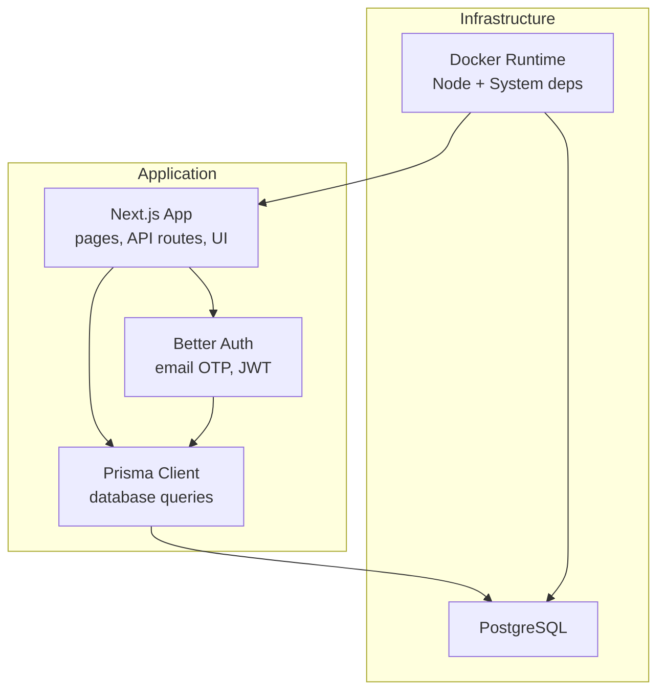
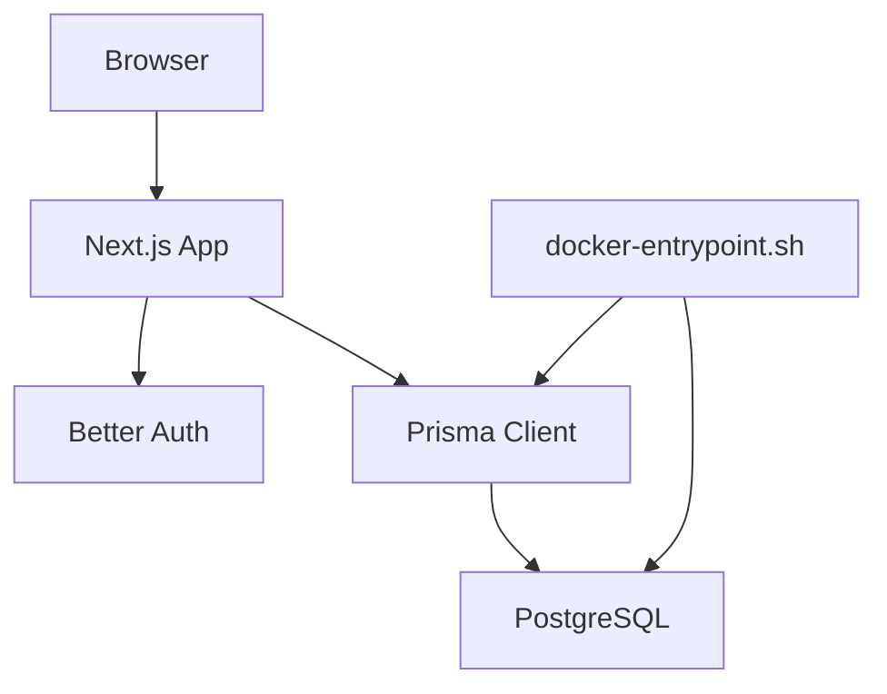
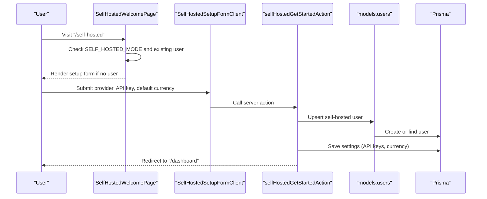
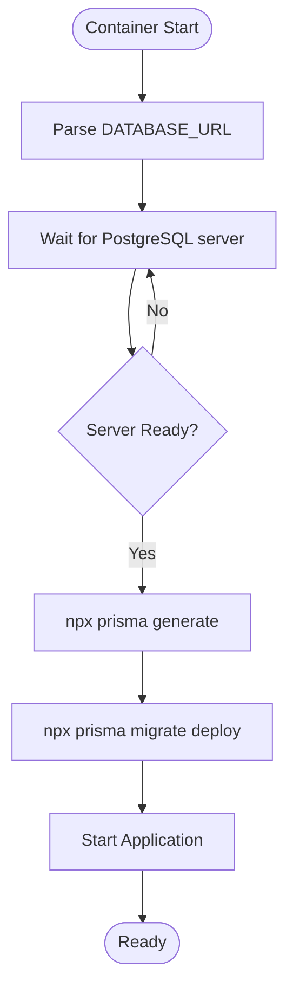
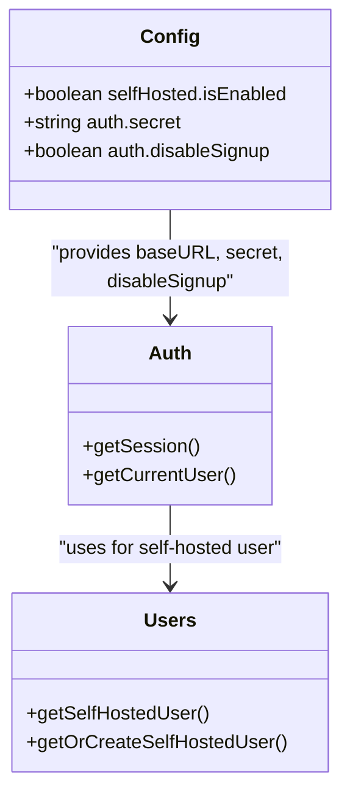
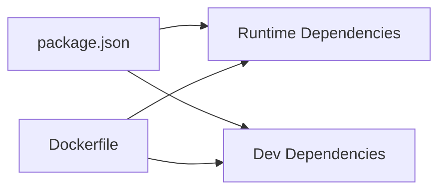

# Getting Started

<cite>
**Referenced Files in This Document**
- [README.md](file://README.md)
- [package.json](file://package.json)
- [Dockerfile](file://Dockerfile)
- [docker-compose.yml](file://docker-compose.yml)
- [docker-compose.production.yml](file://docker-compose.production.yml)
- [docker-entrypoint.sh](file://docker-entrypoint.sh)
- [lib/config.ts](file://lib/config.ts)
- [lib/db.ts](file://lib/db.ts)
- [lib/auth.ts](file://lib/auth.ts)
- [prisma/schema.prisma](file://prisma/schema.prisma)
- [app/(auth)/self-hosted/page.tsx](file://app/(auth)/self-hosted/page.tsx)
- [app/(auth)/self-hosted/setup-form-client.tsx](file://app/(auth)/self-hosted/setup-form-client.tsx)
- [app/(auth)/actions.ts](file://app/(auth)/actions.ts)
- [models/users.ts](file://models/users.ts)
</cite>

## Table of Contents
1. [Introduction](#introduction)
2. [Project Structure](#project-structure)
3. [Core Components](#core-components)
4. [Architecture Overview](#architecture-overview)
5. [Detailed Component Analysis](#detailed-component-analysis)
6. [Dependency Analysis](#dependency-analysis)
7. [Performance Considerations](#performance-considerations)
8. [Troubleshooting Guide](#troubleshooting-guide)
9. [Conclusion](#conclusion)
10. [Appendices](#appendices)

## Introduction
TaxHacker is a self-hosted AI-powered accounting application for freelancers, indie hackers, and small businesses. It automates expense and income tracking by extracting structured data from uploaded receipts, invoices, and PDFs, and supports multi-currency conversion, custom categories, projects, and fields. It offers both self-hosted and cloud modes, with optional subscription features in cloud mode and self-hosted mode enabling auto-login and custom API keys.

## Project Structure
At a high level, the project consists of:
- Next.js 15 application with TypeScript
- Prisma ORM for database modeling and migrations
- PostgreSQL database
- Docker-based deployment with Compose
- Authentication powered by Better Auth with email OTP and JWT sessions
- Self-hosted mode with a guided first-time setup flow

**Section sources**
- [README.md:116-230](file://README.md#L116-L230)
- [package.json:1-79](file://package.json#L1-L79)
- [Dockerfile:1-66](file://Dockerfile#L1-L66)

## Core Components
- Application runtime and build scripts
  - Development, build, and start scripts are defined in the package manifest.
  - Production startup runs Prisma migrations before launching the Next.js server.
- Configuration and environment validation
  - Environment variables are parsed and validated with zod, including required and optional keys.
  - Self-hosted mode toggles behavior such as auto-login and signup availability.
- Authentication
  - Better Auth integrates with Prisma adapter and Resend for email OTP.
  - Self-hosted mode bypasses cloud auth and auto-logs in a dedicated user.
- Database
  - Prisma schema defines models for users, sessions, categories, projects, fields, files, transactions, currencies, app data, and progress.
  - DATABASE_URL is sourced from environment and used by Prisma.

**Section sources**
- [package.json:6-11](file://package.json#L6-L11)
- [lib/config.ts:1-82](file://lib/config.ts#L1-L82)
- [lib/auth.ts:1-114](file://lib/auth.ts#L1-L114)
- [prisma/schema.prisma:1-240](file://prisma/schema.prisma#L1-L240)
- [lib/db.ts:1-10](file://lib/db.ts#L1-L10)

## Architecture Overview
The system architecture combines a Next.js frontend with a backend service that performs Prisma migrations on startup, connects to PostgreSQL, and serves authenticated routes. Self-hosted mode initializes a default user and guides the admin through initial configuration.

**Diagram sources**
- [lib/auth.ts:25-65](file://lib/auth.ts#L25-L65)
- [lib/db.ts:1-10](file://lib/db.ts#L1-L10)
- [docker-entrypoint.sh:1-23](file://docker-entrypoint.sh#L1-L23)

**Section sources**
- [lib/auth.ts:25-65](file://lib/auth.ts#L25-L65)
- [docker-entrypoint.sh:14-18](file://docker-entrypoint.sh#L14-L18)

## Detailed Component Analysis

### Environment Variables and Configuration
- Required variables
  - UPLOAD_PATH: Local directory for file uploads and storage.
  - DATABASE_URL: PostgreSQL connection string.
  - BETTER_AUTH_SECRET: Secret key for authentication (minimum length enforced).
- Optional variables
  - SELF_HOSTED_MODE: Enables self-hosted behavior (auto-login, custom API keys).
  - DISABLE_SIGNUP: Disables new user registration.
  - BASE_URL, PORT: Application base URL and port.
  - Email and Stripe related variables for cloud features.

Validation and defaults are enforced at runtime via zod schema.

**Section sources**
- [README.md:155-168](file://README.md#L155-L168)
- [lib/config.ts:3-25](file://lib/config.ts#L3-L25)
- [lib/config.ts:63-78](file://lib/config.ts#L63-L78)

### Self-Hosted First-Time Setup Flow
When self-hosted mode is enabled and no user exists, the system redirects to a setup page where the administrator selects an LLM provider, enters API keys, and sets a default currency. On submission, the system creates a default user and applies initial settings.

**Diagram sources**
- [app/(auth)/self-hosted/page.tsx:11-54](file://app/(auth)/self-hosted/page.tsx#L11-L54)
- [app/(auth)/self-hosted/setup-form-client.tsx:16-86](file://app/(auth)/self-hosted/setup-form-client.tsx#L16-L86)
- [app/(auth)/actions.ts:9-39](file://app/(auth)/actions.ts#L9-L39)
- [models/users.ts:23-29](file://models/users.ts#L23-L29)

**Section sources**
- [app/(auth)/self-hosted/page.tsx:11-54](file://app/(auth)/self-hosted/page.tsx#L11-L54)
- [app/(auth)/self-hosted/setup-form-client.tsx:16-86](file://app/(auth)/self-hosted/setup-form-client.tsx#L16-L86)
- [app/(auth)/actions.ts:9-39](file://app/(auth)/actions.ts#L9-L39)
- [models/users.ts:7-29](file://models/users.ts#L7-L29)

### Database Initialization with Prisma Migrations
On container startup, the entrypoint script:
- Waits for PostgreSQL to be ready using psql against the server portion of DATABASE_URL.
- Generates Prisma client and runs migrations in production.
- Starts the application.

**Diagram sources**
- [docker-entrypoint.sh:4-22](file://docker-entrypoint.sh#L4-L22)
- [lib/db.ts:7](file://lib/db.ts#L7)

**Section sources**
- [docker-entrypoint.sh:4-22](file://docker-entrypoint.sh#L4-L22)
- [lib/db.ts:7](file://lib/db.ts#L7)

### Authentication and Self-Hosted Behavior
- Better Auth uses Prisma adapter and JWT sessions with email OTP.
- In self-hosted mode, the system auto-creates a special user if none exists and redirects to the setup page.
- Signup can be disabled either via configuration or forced in self-hosted mode.

**Diagram sources**
- [lib/config.ts:50-67](file://lib/config.ts#L50-L67)
- [lib/auth.ts:25-99](file://lib/auth.ts#L25-L99)
- [models/users.ts:13-29](file://models/users.ts#L13-L29)

**Section sources**
- [lib/auth.ts:25-99](file://lib/auth.ts#L25-L99)
- [models/users.ts:13-29](file://models/users.ts#L13-L29)

## Dependency Analysis
- Application dependencies include Next.js, Prisma client, Better Auth, and various UI and AI-related libraries.
- Development dependencies include Prisma for schema and migrations.
- Dockerfile installs Ghostscript and GraphicsMagick for PDF processing and PostgreSQL client for migrations.

**Diagram sources**
- [package.json:12-72](file://package.json#L12-L72)
- [Dockerfile:32-39](file://Dockerfile#L32-L39)

**Section sources**
- [package.json:12-72](file://package.json#L12-L72)
- [Dockerfile:32-39](file://Dockerfile#L32-L39)

## Performance Considerations
- Use production builds and deployments for optimal performance.
- Keep DATABASE_URL pointing to a fast, reliable PostgreSQL instance.
- Configure upload storage on mounted volumes for persistence and performance.
- Limit concurrent AI processing by tuning provider quotas and local LLM resources.

## Troubleshooting Guide
- Database connectivity
  - Ensure DATABASE_URL is reachable from the application container and includes credentials and database name.
  - Verify PostgreSQL is running and accepting connections.
- Self-hosted setup not appearing
  - Confirm SELF_HOSTED_MODE is set to enable self-hosted behavior.
  - Clear any stale cookies or cache preventing redirect to the setup page.
- Authentication errors
  - Ensure BETTER_AUTH_SECRET meets minimum length requirements.
  - Verify email provider settings if using cloud mode with email OTP.
- Docker startup hangs
  - Check that the entrypoint waits for PostgreSQL and migrations complete successfully.
  - Review logs for Prisma generation and migration steps.

**Section sources**
- [lib/config.ts:13-16](file://lib/config.ts#L13-L16)
- [docker-entrypoint.sh:8-13](file://docker-entrypoint.sh#L8-L13)
- [app/(auth)/self-hosted/page.tsx:12-28](file://app/(auth)/self-hosted/page.tsx#L12-L28)

## Conclusion
You now have the essentials to deploy and configure TaxHacker in self-hosted or cloud mode. Use the provided Docker Compose configurations for quick starts, validate environment variables, initialize the database with Prisma migrations, and complete the self-hosted setup wizard to finalize your instance.

## Appendices

### A. Installation and Setup

- Self-hosted with Docker Compose
  - Pull the Compose file and run the stack.
  - The setup includes an app container, PostgreSQL, automatic migrations, and persistent volume mounts.
  - Example custom configuration demonstrates setting environment variables and mounting data directories.

- Cloud deployment
  - Use the production Compose variant and supply environment variables via an env file.
  - Bind the application to localhost for secure access behind a reverse proxy.

- Local development
  - Install dependencies, copy and edit the environment file, initialize the database with Prisma, and start the development server.
  - For production builds, compile assets and start the production server.

- Environment variables
  - Required: UPLOAD_PATH, DATABASE_URL, BETTER_AUTH_SECRET.
  - Optional: SELF_HOSTED_MODE, DISABLE_SIGNUP, BASE_URL, PORT.

- Database initialization
  - Prisma client generation and migrations are executed during container startup.

- First-time user onboarding (self-hosted)
  - The system auto-creates a default user and redirects to a setup form to choose an LLM provider, enter API keys, and set a default currency.

**Section sources**
- [README.md:116-204](file://README.md#L116-L204)
- [docker-compose.yml:1-36](file://docker-compose.yml#L1-L36)
- [docker-compose.production.yml:1-30](file://docker-compose.production.yml#L1-L30)
- [lib/config.ts:27-79](file://lib/config.ts#L27-L79)
- [docker-entrypoint.sh:14-18](file://docker-entrypoint.sh#L14-L18)
- [app/(auth)/self-hosted/page.tsx:30-33](file://app/(auth)/self-hosted/page.tsx#L30-L33)
- [app/(auth)/actions.ts:9-39](file://app/(auth)/actions.ts#L9-L39)