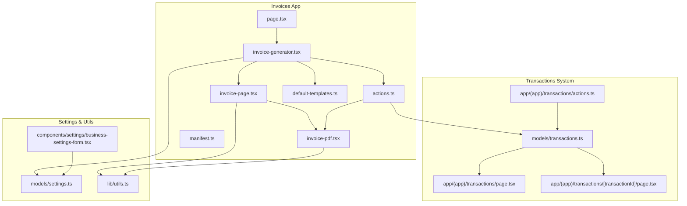
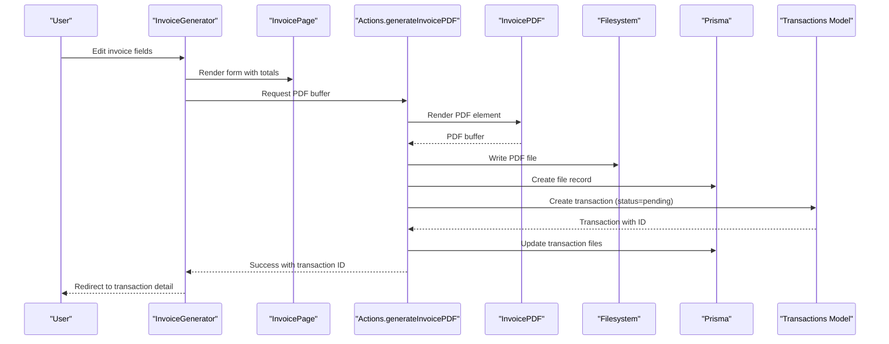
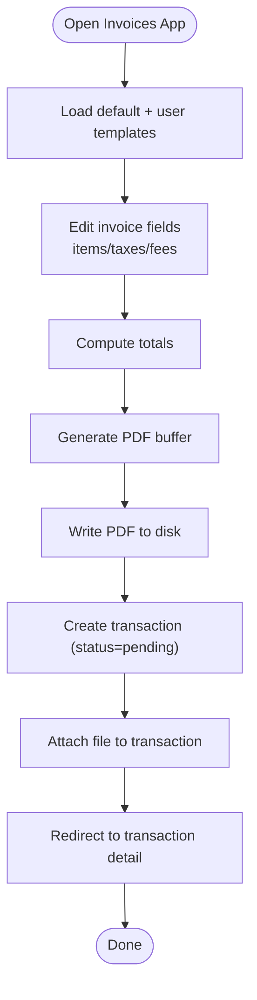
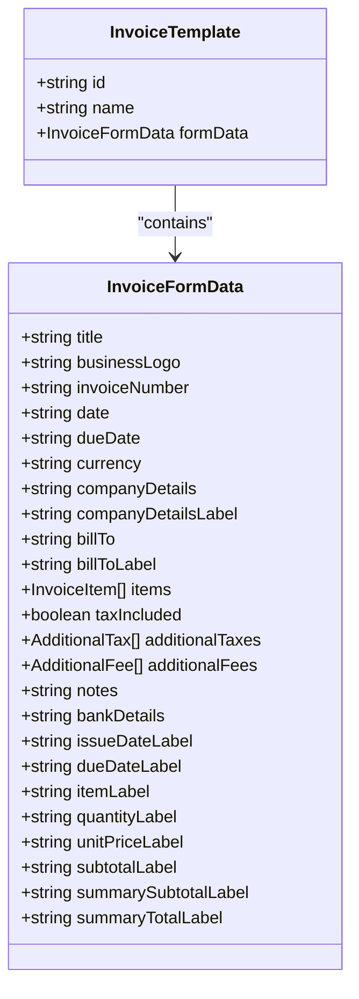
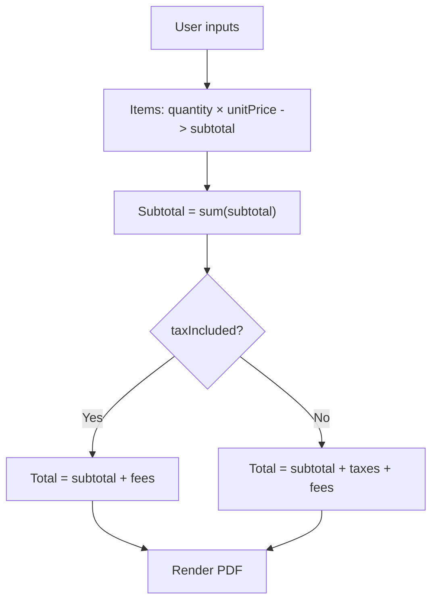
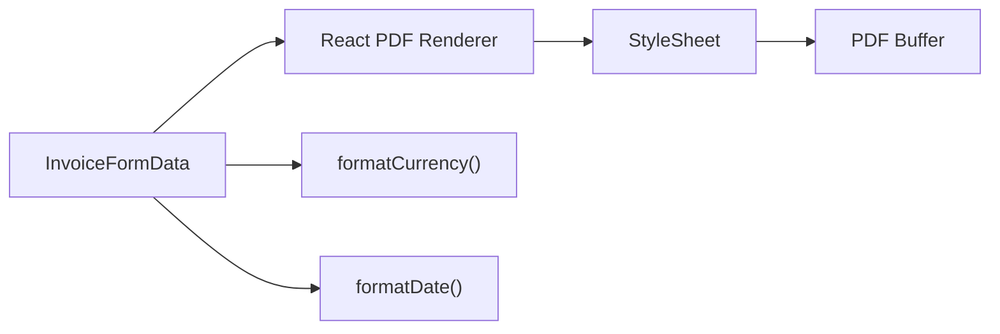
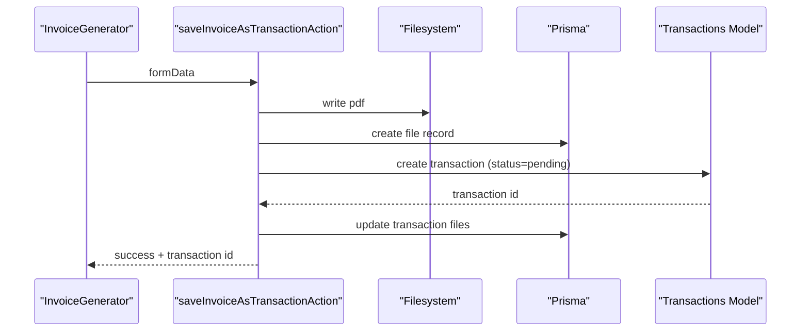
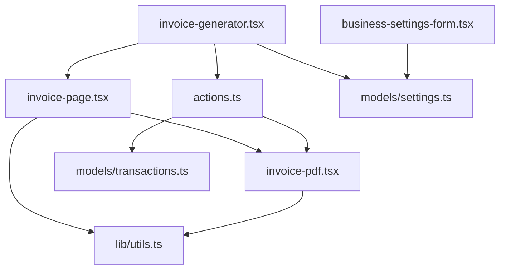

# Invoicing System

<cite>
**Referenced Files in This Document**
- [page.tsx](file://app/(app)/apps/invoices/page.tsx)
- [invoice-generator.tsx](file://app/(app)/apps/invoices/components/invoice-generator.tsx)
- [invoice-page.tsx](file://app/(app)/apps/invoices/components/invoice-page.tsx)
- [invoice-pdf.tsx](file://app/(app)/apps/invoices/components/invoice-pdf.tsx)
- [actions.ts](file://app/(app)/apps/invoices/actions.ts)
- [default-templates.ts](file://app/(app)/apps/invoices/default-templates.ts)
- [manifest.ts](file://app/(app)/apps/invoices/manifest.ts)
- [transactions.ts](file://models/transactions.ts)
- [transactions-page.tsx](file://app/(app)/transactions/page.tsx)
- [transaction-detail-page.tsx](file://app/(app)/transactions/[transactionId]/page.tsx)
- [transactions-actions.ts](file://app/(app)/transactions/actions.ts)
- [settings-model.ts](file://models/settings.ts)
- [business-settings-form.tsx](file://components/settings/business-settings-form.tsx)
- [utils.ts](file://lib/utils.ts)
</cite>

## Table of Contents
1. [Introduction](#introduction)
2. [Project Structure](#project-structure)
3. [Core Components](#core-components)
4. [Architecture Overview](#architecture-overview)
5. [Detailed Component Analysis](#detailed-component-analysis)
6. [Dependency Analysis](#dependency-analysis)
7. [Performance Considerations](#performance-considerations)
8. [Troubleshooting Guide](#troubleshooting-guide)
9. [Conclusion](#conclusion)
10. [Appendices](#appendices)

## Introduction
This document explains TaxHacker’s invoicing system end-to-end: how invoices are created, edited, exported to PDF, saved as transactions, and integrated with the broader transaction management system. It covers the template system, data mapping from business settings and user profiles, PDF styling and branding, invoice totals calculation, and the workflow from invoice creation to transaction persistence and file attachment. It also includes customization options for fields, taxes, and payment terms, along with troubleshooting guidance for common invoicing issues.

## Project Structure
The invoicing app is organized under the “apps/invoices” area and integrates with the transaction system and settings. Key areas:
- Invoices app page and generator UI
- Invoice editing form and PDF renderer
- Actions for PDF generation, template management, and saving invoices as transactions
- Default templates and localization
- Integration with transactions and files
- Business settings for branding and defaults

**Diagram sources**
- [page.tsx](file://app/(app)/apps/invoices/page.tsx#L1-L32)
- [invoice-generator.tsx](file://app/(app)/apps/invoices/components/invoice-generator.tsx#L1-L310)
- [invoice-page.tsx](file://app/(app)/apps/invoices/components/invoice-page.tsx#L1-L565)
- [invoice-pdf.tsx](file://app/(app)/apps/invoices/components/invoice-pdf.tsx#L1-L415)
- [actions.ts](file://app/(app)/apps/invoices/actions.ts#L1-L127)
- [default-templates.ts](file://app/(app)/apps/invoices/default-templates.ts#L1-L72)
- [manifest.ts](file://app/(app)/apps/invoices/manifest.ts#L1-L8)
- [transactions.ts:1-221](file://models/transactions.ts#L1-L221)
- [transactions-page.tsx](file://app/(app)/transactions/page.tsx#L1-L87)
- [transaction-detail-page.tsx](file://app/(app)/transactions/[transactionId]/page.tsx#L1-L84)
- [transactions-actions.ts](file://app/(app)/transactions/actions.ts#L1-L229)
- [settings-model.ts:1-76](file://models/settings.ts#L1-L76)
- [business-settings-form.tsx:1-62](file://components/settings/business-settings-form.tsx#L1-L62)
- [utils.ts:1-159](file://lib/utils.ts#L1-L159)

**Section sources**
- [page.tsx](file://app/(app)/apps/invoices/page.tsx#L1-L32)
- [manifest.ts](file://app/(app)/apps/invoices/manifest.ts#L1-L8)

## Core Components
- Invoices App Page: Initializes the app, loads user settings, currencies, and app-specific stored templates, and renders the invoice generator.
- Invoice Generator: Provides the UI to select templates, edit invoice data, generate PDFs, save as templates, and persist invoices as transactions.
- Invoice Page: The editable invoice form with items, taxes, fees, notes, and totals computation.
- Invoice PDF Renderer: Converts the invoice form data into a styled PDF using @react-pdf/renderer.
- Actions: Server actions for PDF generation, template CRUD, and saving invoices as transactions with file storage and transaction updates.
- Default Templates: Built-in templates with localized labels and default tax settings.
- Transactions Integration: Persists invoices as transactions, attaches generated PDFs as files, and exposes them in the transaction UI.

**Section sources**
- [page.tsx](file://app/(app)/apps/invoices/page.tsx#L13-L31)
- [invoice-generator.tsx](file://app/(app)/apps/invoices/components/invoice-generator.tsx#L72-L310)
- [invoice-page.tsx](file://app/(app)/apps/invoices/components/invoice-page.tsx#L240-L565)
- [invoice-pdf.tsx](file://app/(app)/apps/invoices/components/invoice-pdf.tsx#L281-L415)
- [actions.ts](file://app/(app)/apps/invoices/actions.ts#L25-L127)
- [default-templates.ts](file://app/(app)/apps/invoices/default-templates.ts#L12-L72)
- [transactions.ts:135-166](file://models/transactions.ts#L135-L166)

## Architecture Overview
The invoicing system follows a client-driven UI with server actions for heavy tasks (PDF rendering, file writes, transaction creation). The generator composes form data, applies calculations, and delegates PDF generation to a server action. The resulting PDF buffer is written to disk and recorded in the database, then attached to a newly created transaction.

**Diagram sources**
- [invoice-generator.tsx](file://app/(app)/apps/invoices/components/invoice-generator.tsx#L106-L141)
- [invoice-page.tsx](file://app/(app)/apps/invoices/components/invoice-page.tsx#L265-L277)
- [actions.ts](file://app/(app)/apps/invoices/actions.ts#L25-L29)
- [invoice-pdf.tsx](file://app/(app)/apps/invoices/components/invoice-pdf.tsx#L281-L415)
- [transactions.ts:135-166](file://models/transactions.ts#L135-L166)

## Detailed Component Analysis

### Invoice Creation Workflow
- Template Selection: The generator merges default templates with user-defined templates and allows switching between them.
- Editing: The invoice page computes subtotal, taxes, fees, and total in real time. Users can add/remove items, taxes, and fees.
- PDF Generation: The generator converts the form data to a PDF using a server action that renders a React PDF component to a buffer.
- Storage and Persistence: The server action writes the PDF to the user’s uploads directory, records a file entry, and creates a transaction with status set to pending. The file ID is attached to the transaction.
- Navigation: On success, the generator redirects to the newly created transaction detail page.

**Diagram sources**
- [invoice-generator.tsx](file://app/(app)/apps/invoices/components/invoice-generator.tsx#L83-L91)
- [invoice-page.tsx](file://app/(app)/apps/invoices/components/invoice-page.tsx#L265-L277)
- [actions.ts](file://app/(app)/apps/invoices/actions.ts#L47-L126)

**Section sources**
- [invoice-generator.tsx](file://app/(app)/apps/invoices/components/invoice-generator.tsx#L72-L310)
- [invoice-page.tsx](file://app/(app)/apps/invoices/components/invoice-page.tsx#L240-L565)
- [actions.ts](file://app/(app)/apps/invoices/actions.ts#L25-L127)

### Template System
- Default Templates: Two built-in templates are provided: a generic English template and a German template with localized labels and default tax settings.
- User Templates: Users can save current form data as a new template and delete custom templates. Default templates cannot be deleted.
- Template Selection: The generator displays available templates and applies selected template’s form data to the editor.

**Diagram sources**
- [default-templates.ts](file://app/(app)/apps/invoices/default-templates.ts#L6-L10)
- [invoice-page.tsx](file://app/(app)/apps/invoices/components/invoice-page.tsx#L29-L54)

**Section sources**
- [default-templates.ts](file://app/(app)/apps/invoices/default-templates.ts#L12-L72)
- [invoice-generator.tsx](file://app/(app)/apps/invoices/components/invoice-generator.tsx#L143-L187)

### Invoice Data Mapping
- Business Defaults: Templates populate fields from user business settings (name, address, bank details, logo) and default currency from settings.
- User Inputs: The invoice page collects customer billing details, issue/due dates, currency, items with quantities/prices, optional subtitles, additional taxes, and fees.
- Totals Calculation: Subtotal is computed from items; taxes are derived from rates applied to subtotal; fees are added/subtracted; total reflects tax inclusion flag.
- Localization: Labels for sections and units are customizable per template.

**Diagram sources**
- [invoice-page.tsx](file://app/(app)/apps/invoices/components/invoice-page.tsx#L265-L277)
- [invoice-pdf.tsx](file://app/(app)/apps/invoices/components/invoice-pdf.tsx#L282-L294)

**Section sources**
- [default-templates.ts](file://app/(app)/apps/invoices/default-templates.ts#L13-L38)
- [settings-model.ts:53-62](file://models/settings.ts#L53-L62)
- [invoice-page.tsx](file://app/(app)/apps/invoices/components/invoice-page.tsx#L265-L277)

### PDF Export, Styling, and Branding
- Rendering Engine: Uses @react-pdf/renderer to produce a PDF from a React component.
- Fonts and Emoji: Registers Inter font families and emoji support from CDN.
- Styling: Extensive StyleSheet defines typography, spacing, tables, and section layouts.
- Branding: Supports business logo insertion and localized labels; currency formatting uses locale-aware formatting.

**Diagram sources**
- [invoice-pdf.tsx](file://app/(app)/apps/invoices/components/invoice-pdf.tsx#L7-L71)
- [invoice-pdf.tsx](file://app/(app)/apps/invoices/components/invoice-pdf.tsx#L281-L415)
- [utils.ts:12-25](file://lib/utils.ts#L12-L25)

**Section sources**
- [invoice-pdf.tsx](file://app/(app)/apps/invoices/components/invoice-pdf.tsx#L78-L279)
- [utils.ts:12-25](file://lib/utils.ts#L12-L25)

### Invoice Status Management and Transaction Integration
- Status: When saved as a transaction, invoices are created with status set to pending.
- Files: Generated PDFs are stored on disk and recorded in the files model; the transaction is updated to include the file ID.
- Transaction UI: The transaction list and detail pages display the invoice PDFs alongside other transaction files.

**Diagram sources**
- [actions.ts](file://app/(app)/apps/invoices/actions.ts#L47-L126)
- [transactions.ts:135-166](file://models/transactions.ts#L135-L166)
- [transactions-actions.ts](file://app/(app)/transactions/actions.ts#L155-L191)

**Section sources**
- [actions.ts](file://app/(app)/apps/invoices/actions.ts#L63-L73)
- [transactions.ts:135-166](file://models/transactions.ts#L135-L166)
- [transactions-page.tsx](file://app/(app)/transactions/page.tsx#L24-L87)
- [transaction-detail-page.tsx](file://app/(app)/transactions/[transactionId]/page.tsx#L17-L84)

### Customization Options
- Fields: All labels (issue date, due date, item, quantity, unit price, subtotal, total) are customizable per template.
- Taxes: Multiple additional taxes supported; rate-based amounts auto-computed from subtotal.
- Fees/Discounts: Additional fees/discounts can be added and subtracted from totals.
- Payment Terms: Notes field supports terms and conditions; bank details footer includes payment instructions.
- Branding: Business logo and localized labels enable regional compliance.

**Section sources**
- [invoice-page.tsx](file://app/(app)/apps/invoices/components/invoice-page.tsx#L40-L54)
- [invoice-page.tsx](file://app/(app)/apps/invoices/components/invoice-page.tsx#L482-L517)
- [default-templates.ts](file://app/(app)/apps/invoices/default-templates.ts#L40-L65)

### Integration with Transaction System and File Attachments
- Upload Limits and Storage: File uploads check storage availability and subscription status before writing.
- File Records: Each uploaded file is recorded with metadata; transactions maintain an array of file IDs.
- Bulk Operations: Transactions support bulk deletion and file removal with cascading cleanup.

**Section sources**
- [actions.ts](file://app/(app)/apps/invoices/actions.ts#L75-L88)
- [transactions-actions.ts](file://app/(app)/transactions/actions.ts#L142-L153)
- [transactions.ts:161-166](file://models/transactions.ts#L161-L166)

## Dependency Analysis
- UI depends on:
  - Invoice generator for orchestration
  - Invoice page for form and totals
  - PDF renderer for output
- Server actions depend on:
  - PDF renderer
  - File system utilities
  - Transactions model
  - Settings model for defaults
- Transactions model depends on:
  - Prisma client
  - Files model for attachments
  - Fields model for dynamic fields

**Diagram sources**
- [invoice-generator.tsx](file://app/(app)/apps/invoices/components/invoice-generator.tsx#L1-L310)
- [invoice-page.tsx](file://app/(app)/apps/invoices/components/invoice-page.tsx#L1-L565)
- [invoice-pdf.tsx](file://app/(app)/apps/invoices/components/invoice-pdf.tsx#L1-L415)
- [actions.ts](file://app/(app)/apps/invoices/actions.ts#L1-L127)
- [transactions.ts:1-221](file://models/transactions.ts#L1-L221)
- [settings-model.ts:1-76](file://models/settings.ts#L1-L76)
- [business-settings-form.tsx:1-62](file://components/settings/business-settings-form.tsx#L1-L62)
- [utils.ts:1-159](file://lib/utils.ts#L1-L159)

**Section sources**
- [invoice-generator.tsx](file://app/(app)/apps/invoices/components/invoice-generator.tsx#L1-L310)
- [actions.ts](file://app/(app)/apps/invoices/actions.ts#L1-L127)
- [transactions.ts:1-221](file://models/transactions.ts#L1-L221)

## Performance Considerations
- Client-side totals: Real-time computation avoids unnecessary server round trips during editing.
- PDF rendering: Server action ensures rendering occurs on the server, keeping the client responsive.
- File I/O: Writes are synchronous; for very high throughput, consider asynchronous queues and streaming buffers.
- Currency formatting: Uses locale-aware formatting; avoid excessive re-renders by memoizing computed totals.

[No sources needed since this section provides general guidance]

## Troubleshooting Guide
- PDF fails to generate:
  - Verify business logo URL resolves and is accessible.
  - Ensure sufficient memory for rendering; large images may increase buffer size.
- Cannot save as transaction:
  - Insufficient storage or expired subscription prevents file write; check storage usage and subscription status.
  - Transaction creation errors surface as action failures; review console logs.
- Template not saving/deleting:
  - Ensure template name uniqueness; default templates cannot be deleted.
- Totals mismatch:
  - Confirm taxIncluded flag and that tax rates are applied to subtotal, not total.
- Transaction not showing PDF:
  - Confirm file record exists and transaction was updated with file ID; refresh the transaction page.

**Section sources**
- [invoice-generator.tsx](file://app/(app)/apps/invoices/components/invoice-generator.tsx#L135-L140)
- [actions.ts](file://app/(app)/apps/invoices/actions.ts#L75-L88)
- [transactions-actions.ts](file://app/(app)/transactions/actions.ts#L142-L153)

## Conclusion
TaxHacker’s invoicing system provides a flexible, template-driven workflow for creating invoices, exporting to PDF, and persisting them as transactions with file attachments. Its modular design separates UI, data mapping, PDF rendering, and persistence, enabling customization of fields, taxes, and branding while integrating seamlessly with the transaction system.

[No sources needed since this section summarizes without analyzing specific files]

## Appendices

### Example Workflows
- Create a Standard Invoice:
  - Open the Invoices app, choose a template, fill in customer details and items, adjust taxes/fees, and download the PDF.
- Save as Transaction:
  - After editing, click “Save as Transaction.” The system generates a PDF, stores it, creates a transaction with status pending, and attaches the file. You are redirected to the transaction detail page.
- Customize a Template:
  - Edit labels and defaults, then save as a new template. Use it for future invoices.

[No sources needed since this section provides general guidance]