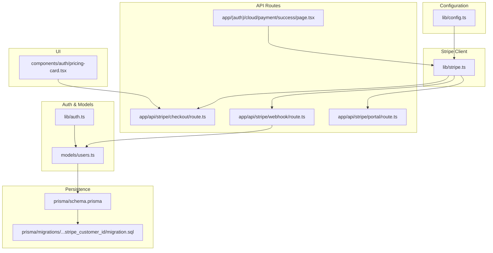
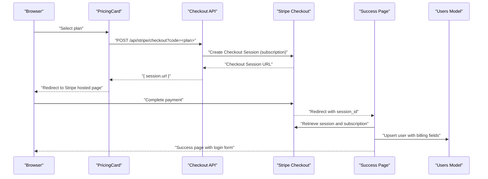
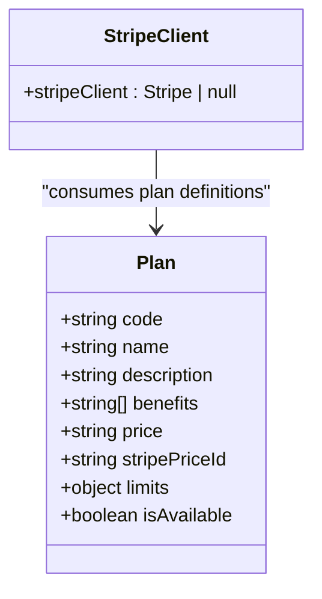
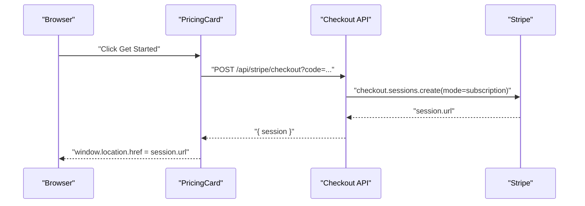
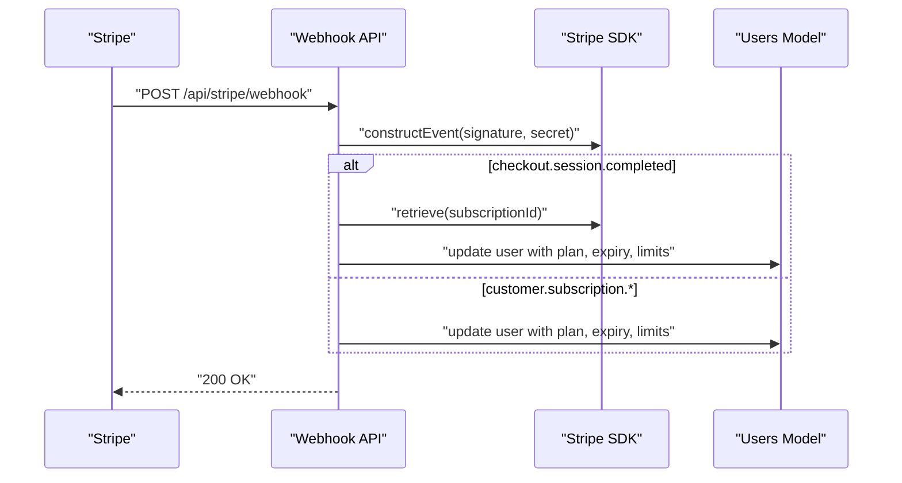
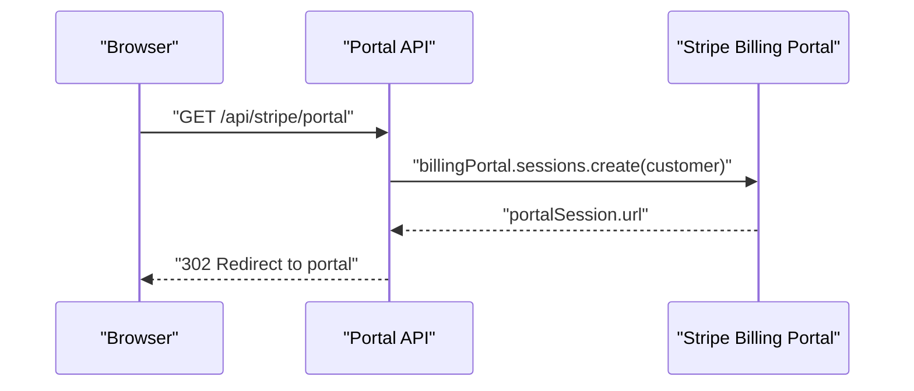
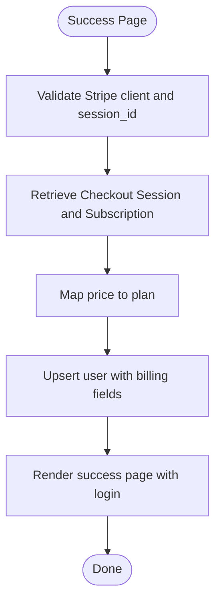
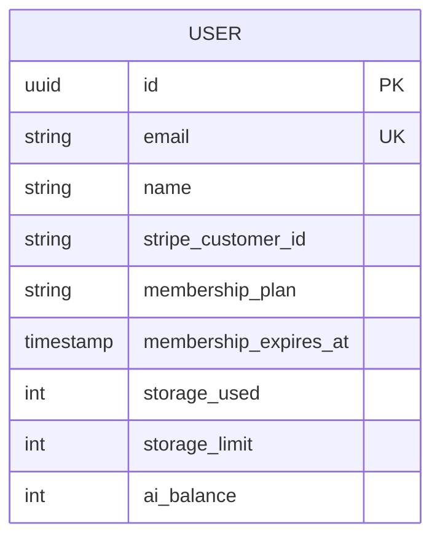
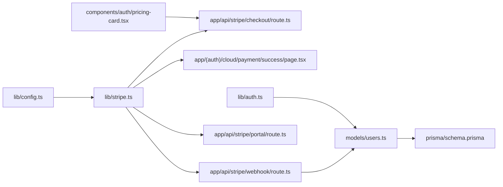

# Payment Processing & Billing

<cite>
**Referenced Files in This Document**
- [lib/stripe.ts](file://lib/stripe.ts)
- [app/api/stripe/checkout/route.ts](file://app/api/stripe/checkout/route.ts)
- [app/api/stripe/webhook/route.ts](file://app/api/stripe/webhook/route.ts)
- [app/api/stripe/portal/route.ts](file://app/api/stripe/portal/route.ts)
- [app/(auth)/cloud/payment/success/page.tsx](file://app/(auth)/cloud/payment/success/page.tsx)
- [components/auth/pricing-card.tsx](file://components/auth/pricing-card.tsx)
- [lib/config.ts](file://lib/config.ts)
- [lib/auth.ts](file://lib/auth.ts)
- [models/users.ts](file://models/users.ts)
- [prisma/schema.prisma](file://prisma/schema.prisma)
- [prisma/migrations/20250424103453_stripe_customer_id/migration.sql](file://prisma/migrations/20250424103453_stripe_customer_id/migration.sql)
- [README.md](file://README.md)
</cite>

## Table of Contents
1. [Introduction](#introduction)
2. [Project Structure](#project-structure)
3. [Core Components](#core-components)
4. [Architecture Overview](#architecture-overview)
5. [Detailed Component Analysis](#detailed-component-analysis)
6. [Dependency Analysis](#dependency-analysis)
7. [Performance Considerations](#performance-considerations)
8. [Troubleshooting Guide](#troubleshooting-guide)
9. [Conclusion](#conclusion)
10. [Appendices](#appendices)

## Introduction
This document explains TaxHacker’s payment processing and billing system with a focus on Stripe integration. It covers checkout sessions, subscription lifecycle, recurring billing, proration handling, subscription tiers and feature access, customer portal, invoice generation, payment history tracking, and the integration between billing and authentication for feature gating. It also outlines self-hosted billing configuration and cloud deployment options, and provides troubleshooting guidance for common payment and subscription issues.

## Project Structure
The billing system spans configuration, Stripe client initialization, API routes for checkout, webhooks, and the customer portal, UI components for pricing selection, and database models that persist billing state.

**Diagram sources**
- [lib/config.ts:68-73](file://lib/config.ts#L68-L73)
- [lib/stripe.ts:1-58](file://lib/stripe.ts#L1-L58)
- [app/api/stripe/checkout/route.ts:1-51](file://app/api/stripe/checkout/route.ts#L1-L51)
- [app/api/stripe/webhook/route.ts:1-112](file://app/api/stripe/webhook/route.ts#L1-L112)
- [app/api/stripe/portal/route.ts:1-31](file://app/api/stripe/portal/route.ts#L1-L31)
- [app/(auth)/cloud/payment/success/page.tsx:14-72](file://app/(auth)/cloud/payment/success/page.tsx#L14-L72)
- [components/auth/pricing-card.tsx:10-32](file://components/auth/pricing-card.tsx#L10-L32)
- [lib/auth.ts:67-114](file://lib/auth.ts#L67-L114)
- [models/users.ts:31-68](file://models/users.ts#L31-L68)
- [prisma/schema.prisma:14-45](file://prisma/schema.prisma#L14-L45)
- [prisma/migrations/20250424103453_stripe_customer_id/migration.sql:1-11](file://prisma/migrations/20250424103453_stripe_customer_id/migration.sql#L1-L11)

**Section sources**
- [lib/config.ts:68-73](file://lib/config.ts#L68-L73)
- [lib/stripe.ts:1-58](file://lib/stripe.ts#L1-L58)
- [app/api/stripe/checkout/route.ts:1-51](file://app/api/stripe/checkout/route.ts#L1-L51)
- [app/api/stripe/webhook/route.ts:1-112](file://app/api/stripe/webhook/route.ts#L1-L112)
- [app/api/stripe/portal/route.ts:1-31](file://app/api/stripe/portal/route.ts#L1-L31)
- [app/(auth)/cloud/payment/success/page.tsx:14-72](file://app/(auth)/cloud/payment/success/page.tsx#L14-L72)
- [components/auth/pricing-card.tsx:10-32](file://components/auth/pricing-card.tsx#L10-L32)
- [lib/auth.ts:67-114](file://lib/auth.ts#L67-L114)
- [models/users.ts:31-68](file://models/users.ts#L31-L68)
- [prisma/schema.prisma:14-45](file://prisma/schema.prisma#L14-L45)
- [prisma/migrations/20250424103453_stripe_customer_id/migration.sql:1-11](file://prisma/migrations/20250424103453_stripe_customer_id/migration.sql#L1-L11)

## Core Components
- Stripe client and plan definitions: Provides Stripe SDK initialization and plan metadata used across checkout and webhooks.
- Checkout API: Creates Stripe Checkout sessions for selected plans and redirects users to Stripe-hosted pages.
- Webhook handler: Processes subscription lifecycle events and updates user billing state.
- Customer Portal API: Generates a Stripe Billing Portal session for managing subscriptions.
- Success page: Confirms successful subscription creation and persists user billing attributes.
- Pricing card UI: Renders plan cards and triggers checkout.
- Authentication and feature gating: Uses user billing fields to gate features.
- Persistence: Stores Stripe customer ID, membership plan, expiry, storage limit, and AI balance.

**Section sources**
- [lib/stripe.ts:10-58](file://lib/stripe.ts#L10-L58)
- [app/api/stripe/checkout/route.ts:5-50](file://app/api/stripe/checkout/route.ts#L5-L50)
- [app/api/stripe/webhook/route.ts:32-111](file://app/api/stripe/webhook/route.ts#L32-L111)
- [app/api/stripe/portal/route.ts:5-30](file://app/api/stripe/portal/route.ts#L5-L30)
- [app/(auth)/cloud/payment/success/page.tsx:27-42](file://app/(auth)/cloud/payment/success/page.tsx#L27-L42)
- [components/auth/pricing-card.tsx:14-32](file://components/auth/pricing-card.tsx#L14-L32)
- [lib/auth.ts:101-113](file://lib/auth.ts#L101-L113)
- [prisma/schema.prisma:28-34](file://prisma/schema.prisma#L28-L34)

## Architecture Overview
The billing architecture integrates Stripe with Next.js API routes and the application’s authentication and persistence layers.

**Diagram sources**
- [components/auth/pricing-card.tsx:14-32](file://components/auth/pricing-card.tsx#L14-L32)
- [app/api/stripe/checkout/route.ts:22-45](file://app/api/stripe/checkout/route.ts#L22-L45)
- [app/(auth)/cloud/payment/success/page.tsx:25-42](file://app/(auth)/cloud/payment/success/page.tsx#L25-L42)
- [models/users.ts:31-43](file://models/users.ts#L31-L43)

## Detailed Component Analysis

### Stripe Client and Plans
- Initializes the Stripe client using environment-configured secret key and API version.
- Defines plan metadata including code, name, description, benefits, Stripe price ID, limits, and availability.
- Supports multiple plans; currently includes an Early Adopter plan configured for subscription checkout.

**Diagram sources**
- [lib/stripe.ts:4-8](file://lib/stripe.ts#L4-L8)
- [lib/stripe.ts:10-58](file://lib/stripe.ts#L10-L58)

**Section sources**
- [lib/stripe.ts:4-8](file://lib/stripe.ts#L4-L8)
- [lib/stripe.ts:24-58](file://lib/stripe.ts#L24-L58)

### Checkout Sessions
- Validates plan code and availability.
- Creates a Stripe Checkout session in subscription mode with automatic tax calculation, promotion codes, and success/cancel URLs.
- Returns the session URL to the client for redirection.

**Diagram sources**
- [components/auth/pricing-card.tsx:14-32](file://components/auth/pricing-card.tsx#L14-L32)
- [app/api/stripe/checkout/route.ts:22-45](file://app/api/stripe/checkout/route.ts#L22-L45)

**Section sources**
- [app/api/stripe/checkout/route.ts:5-50](file://app/api/stripe/checkout/route.ts#L5-L50)

### Subscription Lifecycle and Webhooks
- Verifies webhook signature using the configured webhook secret.
- Handles checkout.session.completed to resolve subscription items and update user billing state.
- Handles customer.subscription.* events to synchronize plan, expiry, and limits.
- Creates or updates users with Stripe customer ID, plan code, expiry, storage limit, and AI balance.

**Diagram sources**
- [app/api/stripe/webhook/route.ts:8-67](file://app/api/stripe/webhook/route.ts#L8-L67)
- [app/api/stripe/webhook/route.ts:70-111](file://app/api/stripe/webhook/route.ts#L70-L111)
- [models/users.ts:57-68](file://models/users.ts#L57-L68)

**Section sources**
- [app/api/stripe/webhook/route.ts:32-111](file://app/api/stripe/webhook/route.ts#L32-L111)

### Customer Portal
- Generates a Stripe Billing Portal session for the authenticated user.
- Redirects the user to the portal URL for managing subscriptions and payment methods.

**Diagram sources**
- [app/api/stripe/portal/route.ts:15-25](file://app/api/stripe/portal/route.ts#L15-L25)

**Section sources**
- [app/api/stripe/portal/route.ts:5-30](file://app/api/stripe/portal/route.ts#L5-L30)

### Payment Success Handling
- On success redirect, retrieves the Checkout session and subscription.
- Upserts the user with Stripe customer ID, plan code, expiry, storage limit, and AI balance.
- Presents a login form for seamless sign-in.

**Diagram sources**
- [app/(auth)/cloud/payment/success/page.tsx:25-42](file://app/(auth)/cloud/payment/success/page.tsx#L25-L42)
- [models/users.ts:31-43](file://models/users.ts#L31-L43)

**Section sources**
- [app/(auth)/cloud/payment/success/page.tsx:14-72](file://app/(auth)/cloud/payment/success/page.tsx#L14-L72)

### Pricing Card UI
- Displays plan details and benefits.
- Calls the checkout API and redirects to Stripe when the user selects a plan.

**Section sources**
- [components/auth/pricing-card.tsx:10-62](file://components/auth/pricing-card.tsx#L10-L62)

### Authentication and Feature Gating
- Determines if a subscription is expired or if AI balance is exhausted.
- Self-hosted mode bypasses subscription checks.

**Section sources**
- [lib/auth.ts:101-113](file://lib/auth.ts#L101-L113)

### Data Model and Persistence
- User model includes Stripe customer ID, membership plan, expiry, storage used/limit, and AI balance.
- Migration adds Stripe customer ID and AI balance fields.

**Diagram sources**
- [prisma/schema.prisma:14-45](file://prisma/schema.prisma#L14-L45)
- [prisma/migrations/20250424103453_stripe_customer_id/migration.sql:7-11](file://prisma/migrations/20250424103453_stripe_customer_id/migration.sql#L7-L11)

**Section sources**
- [prisma/schema.prisma:28-34](file://prisma/schema.prisma#L28-L34)
- [prisma/migrations/20250424103453_stripe_customer_id/migration.sql:7-11](file://prisma/migrations/20250424103453_stripe_customer_id/migration.sql#L7-L11)

## Dependency Analysis
- Configuration drives Stripe client initialization and success/cancel URLs.
- UI components depend on plan definitions and trigger checkout API.
- Checkout and success pages depend on Stripe SDK to create sessions and retrieve subscriptions.
- Webhook handler depends on Stripe SDK and user model to update billing state.
- Authentication module reads billing fields to enforce feature gating.

**Diagram sources**
- [lib/config.ts:68-73](file://lib/config.ts#L68-L73)
- [lib/stripe.ts:4-8](file://lib/stripe.ts#L4-L8)
- [app/api/stripe/checkout/route.ts:1-51](file://app/api/stripe/checkout/route.ts#L1-L51)
- [app/(auth)/cloud/payment/success/page.tsx:14-72](file://app/(auth)/cloud/payment/success/page.tsx#L14-L72)
- [app/api/stripe/webhook/route.ts:1-112](file://app/api/stripe/webhook/route.ts#L1-L112)
- [app/api/stripe/portal/route.ts:1-31](file://app/api/stripe/portal/route.ts#L1-L31)
- [components/auth/pricing-card.tsx:10-32](file://components/auth/pricing-card.tsx#L10-L32)
- [lib/auth.ts:67-114](file://lib/auth.ts#L67-L114)
- [models/users.ts:31-68](file://models/users.ts#L31-L68)
- [prisma/schema.prisma:14-45](file://prisma/schema.prisma#L14-L45)

**Section sources**
- [lib/config.ts:68-73](file://lib/config.ts#L68-L73)
- [lib/stripe.ts:4-8](file://lib/stripe.ts#L4-L8)
- [app/api/stripe/checkout/route.ts:1-51](file://app/api/stripe/checkout/route.ts#L1-L51)
- [app/(auth)/cloud/payment/success/page.tsx:14-72](file://app/(auth)/cloud/payment/success/page.tsx#L14-L72)
- [app/api/stripe/webhook/route.ts:1-112](file://app/api/stripe/webhook/route.ts#L1-L112)
- [app/api/stripe/portal/route.ts:1-31](file://app/api/stripe/portal/route.ts#L1-L31)
- [components/auth/pricing-card.tsx:10-32](file://components/auth/pricing-card.tsx#L10-L32)
- [lib/auth.ts:67-114](file://lib/auth.ts#L67-L114)
- [models/users.ts:31-68](file://models/users.ts#L31-L68)
- [prisma/schema.prisma:14-45](file://prisma/schema.prisma#L14-L45)

## Performance Considerations
- Minimize synchronous Stripe calls in hot paths; rely on asynchronous webhooks for state reconciliation.
- Cache plan and user lookups to reduce repeated database queries.
- Use Stripe’s automatic tax calculation to avoid client-side tax computations.
- Keep webhook handlers idempotent to handle retries gracefully.

## Troubleshooting Guide
- Stripe client not initialized
  - Symptom: Checkout returns internal server error indicating Stripe is not enabled.
  - Cause: Missing secret key in configuration.
  - Resolution: Set the Stripe secret key environment variable and redeploy.

- Webhook signature verification failed
  - Symptom: Webhook endpoint responds with a signature failure error.
  - Cause: Missing or incorrect webhook secret, or mismatched signature header.
  - Resolution: Verify webhook secret and ensure the endpoint receives the correct stripe-signature header.

- Invalid or inactive plan
  - Symptom: Checkout returns an error indicating invalid or inactive plan.
  - Cause: Missing or unavailable plan code.
  - Resolution: Confirm plan code exists and is marked as available in plan definitions.

- Missing Stripe customer ID
  - Symptom: Customer portal returns an error stating no Stripe customer ID found.
  - Cause: User record lacks a Stripe customer ID.
  - Resolution: Ensure the user completes checkout so their Stripe customer ID is stored.

- Subscription not updating after payment
  - Symptom: User remains on a lower tier after successful payment.
  - Cause: Webhook not received or not processed.
  - Resolution: Verify webhook secret, endpoint URL, and logs for errors.

- Self-hosted mode billing behavior
  - Symptom: Subscription expiration checks do not apply in self-hosted mode.
  - Explanation: Self-hosted mode intentionally bypasses subscription checks.
  - Resolution: Configure self-hosted mode appropriately for your deployment.

**Section sources**
- [app/api/stripe/checkout/route.ts:9-20](file://app/api/stripe/checkout/route.ts#L9-L20)
- [app/api/stripe/checkout/route.ts:13-15](file://app/api/stripe/checkout/route.ts#L13-L15)
- [app/api/stripe/webhook/route.ts:12-27](file://app/api/stripe/webhook/route.ts#L12-L27)
- [app/api/stripe/portal/route.ts:16-18](file://app/api/stripe/portal/route.ts#L16-L18)
- [lib/auth.ts:101-106](file://lib/auth.ts#L101-L106)

## Conclusion
TaxHacker’s billing system integrates Stripe Checkout, webhooks, and the customer portal to deliver a seamless subscription experience. Plan definitions drive checkout, webhooks synchronize billing state, and authentication enforces feature gating. Self-hosted deployments bypass cloud billing while preserving core functionality. Proper configuration of Stripe secrets and webhook endpoints ensures reliable recurring billing and subscription management.

## Appendices

### Billing Cycle and Recurring Payments
- Recurring billing is managed by Stripe subscriptions created during checkout.
- Expiry timestamps and plan limits are updated via webhooks upon subscription changes.

**Section sources**
- [app/api/stripe/checkout/route.ts:31-38](file://app/api/stripe/checkout/route.ts#L31-L38)
- [app/api/stripe/webhook/route.ts:46-56](file://app/api/stripe/webhook/route.ts#L46-L56)
- [app/api/stripe/webhook/route.ts:97-108](file://app/api/stripe/webhook/route.ts#L97-L108)

### Proration Handling
- Stripe automatically handles proration for subscription changes; the application consumes the resulting period end timestamps and plan limits from Stripe.

**Section sources**
- [app/api/stripe/webhook/route.ts:97-108](file://app/api/stripe/webhook/route.ts#L97-L108)

### Subscription Tiers and Feature Access Controls
- Plan tiers are defined centrally and mapped to Stripe price IDs.
- Feature gating relies on membership expiry and AI balance checks.

**Section sources**
- [lib/stripe.ts:24-58](file://lib/stripe.ts#L24-L58)
- [lib/auth.ts:101-113](file://lib/auth.ts#L101-L113)

### Usage-Based Billing
- Current implementation sets fixed limits per plan (storage and AI balance) rather than usage-based billing.
- No usage metering or dynamic pricing is implemented in the current codebase.

**Section sources**
- [lib/stripe.ts:17-22](file://lib/stripe.ts#L17-L22)
- [lib/stripe.ts:51-54](file://lib/stripe.ts#L51-L54)

### Customer Portal Functionality
- The portal allows customers to manage payment methods, view invoices, and update subscription details.

**Section sources**
- [app/api/stripe/portal/route.ts:15-25](file://app/api/stripe/portal/route.ts#L15-L25)

### Invoice Generation and Payment History Tracking
- Invoices are generated by Stripe; the application surfaces success and failure outcomes via the success page and webhook-driven user updates.
- Payment history is reflected in user records and Stripe session/subscriptions.

**Section sources**
- [app/(auth)/cloud/payment/success/page.tsx:27-42](file://app/(auth)/cloud/payment/success/page.tsx#L27-L42)
- [app/api/stripe/webhook/route.ts:97-108](file://app/api/stripe/webhook/route.ts#L97-L108)

### Integration Between Billing and Authentication Systems
- Authentication session retrieval and feature gating use user billing fields to determine access.

**Section sources**
- [lib/auth.ts:67-114](file://lib/auth.ts#L67-L114)

### Self-Hosted Billing Configuration and Cloud Deployment Options
- Self-hosted mode disables cloud billing and signup, enabling auto-login and local operation.
- Cloud plans are not yet available in the UI; contact support for custom arrangements.

**Section sources**
- [lib/config.ts:50-54](file://lib/config.ts#L50-L54)
- [app/(auth)/cloud/page.tsx:8-38](file://app/(auth)/cloud/page.tsx#L8-L38)
- [README.md:116-168](file://README.md#L116-L168)