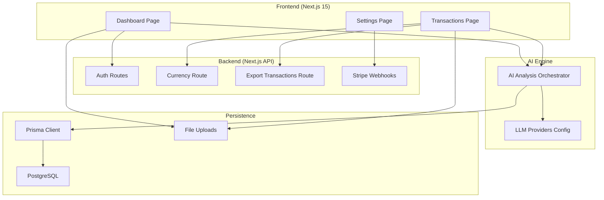
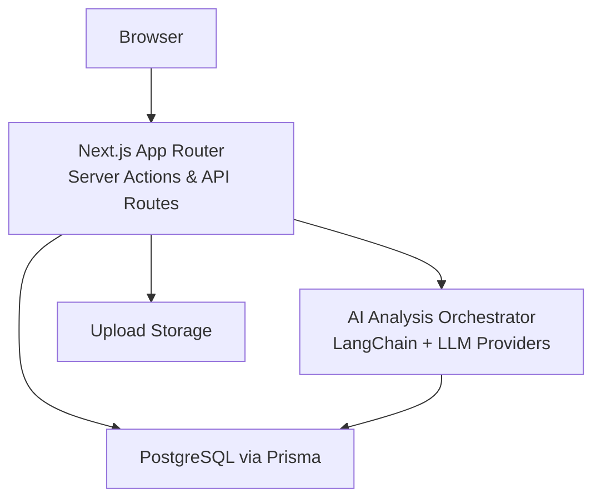
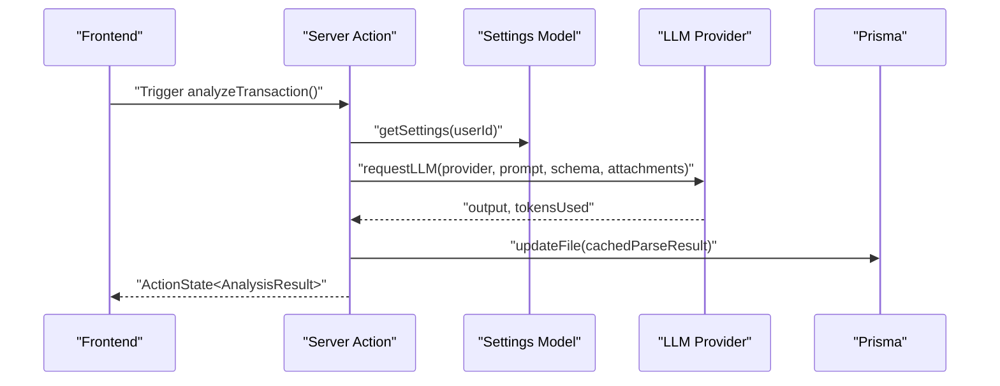
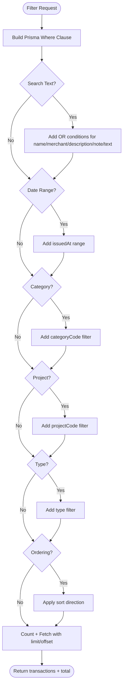
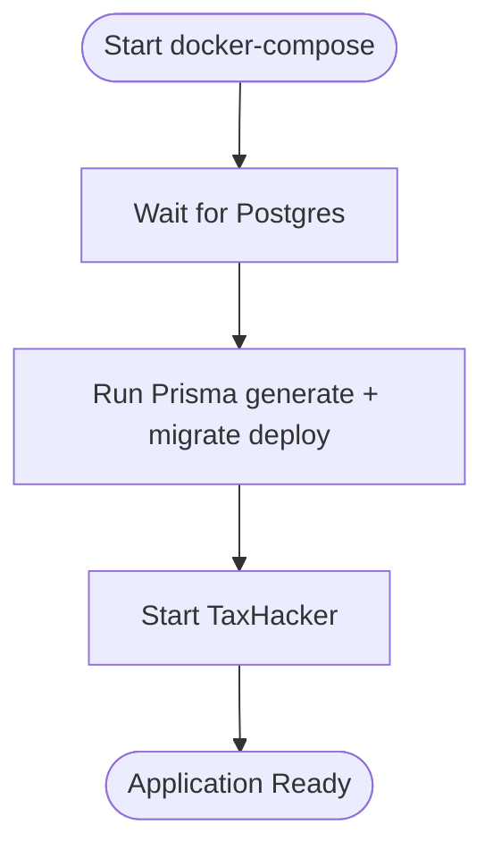
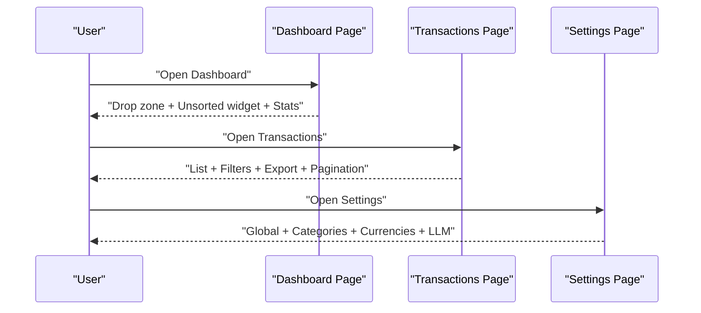
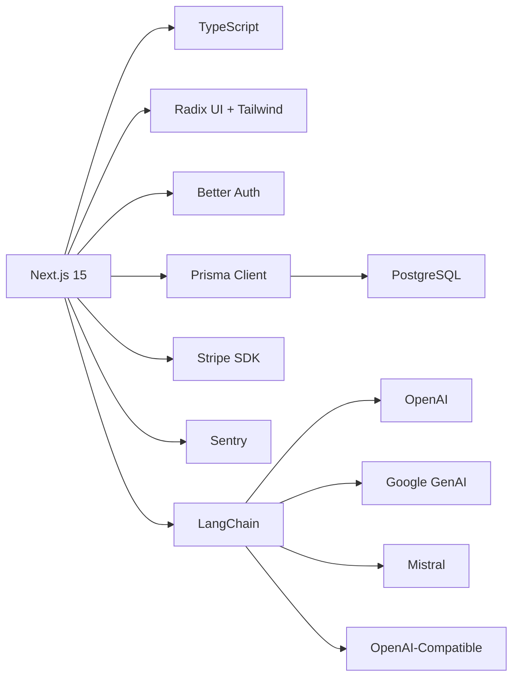

# Project Overview

<cite>
**Referenced Files in This Document**
- [README.md](file://README.md)
- [package.json](file://package.json)
- [next.config.ts](file://next.config.ts)
- [lib/config.ts](file://lib/config.ts)
- [lib/db.ts](file://lib/db.ts)
- [lib/llm-providers.ts](file://lib/llm-providers.ts)
- [ai/analyze.ts](file://ai/analyze.ts)
- [models/transactions.ts](file://models/transactions.ts)
- [models/categories.ts](file://models/categories.ts)
- [models/currencies.ts](file://models/currencies.ts)
- [Dockerfile](file://Dockerfile)
- [docker-compose.yml](file://docker-compose.yml)
- [docker-compose.production.yml](file://docker-compose.production.yml)
- [docker-entrypoint.sh](file://docker-entrypoint.sh)
- [app/(app)/dashboard/page.tsx](file://app/(app)/dashboard/page.tsx)
- [app/(app)/transactions/page.tsx](file://app/(app)/transactions/page.tsx)
- [app/(app)/settings/page.tsx](file://app/(app)/settings/page.tsx)
</cite>

## Table of Contents
1. [Introduction](#introduction)
2. [Project Structure](#project-structure)
3. [Core Components](#core-components)
4. [Architecture Overview](#architecture-overview)
5. [Detailed Component Analysis](#detailed-component-analysis)
6. [Dependency Analysis](#dependency-analysis)
7. [Performance Considerations](#performance-considerations)
8. [Troubleshooting Guide](#troubleshooting-guide)
9. [Conclusion](#conclusion)

## Introduction
TaxHacker is a self-hosted AI accounting application tailored for freelancers, indie hackers, and small businesses. Its core value proposition is to automate expense and income tracking by intelligently analyzing financial documents using modern AI. Users upload photos or PDFs of receipts, invoices, and related documents, and TaxHacker extracts structured data (dates, amounts, merchants, line items, taxes) into a relational database. The platform supports multi-currency processing with historical exchange rates, customizable categories and fields, flexible filtering and export, and offers both self-hosted and cloud deployment options.

Target audience and positioning:
- Primary users: freelancers, indie hackers, and small business owners who want privacy, control, and automation in financial record keeping.
- Market positioning: a privacy-first, extensible, and cost-effective alternative to hosted solutions, emphasizing self-sovereignty of financial data and transparent operations.

Use cases:
- Automate receipt and invoice ingestion with AI-powered extraction.
- Track income and expenses across multiple currencies with historical conversions.
- Build custom categories, projects, and fields to match industry-specific needs.
- Export filtered datasets for tax reporting or accountant handoff.
- Deploy on-premises for compliance and data sovereignty.

## Project Structure
The project follows a modern full-stack architecture:
- Frontend: Next.js 15 App Router with React 19, TypeScript, and Tailwind CSS.
- Backend: Next.js API routes and server actions, with Prisma ORM and PostgreSQL.
- AI processing: LangChain-based LLM orchestration with provider abstraction.
- Storage: PostgreSQL for relational data and local filesystem for uploaded documents.
- Deployment: Docker-native with optional Postgres service, plus production compose for cloud-style hosting.

**Diagram sources**
- [next.config.ts:1-30](file://next.config.ts#L1-L30)
- [lib/db.ts:1-10](file://lib/db.ts#L1-L10)
- [lib/config.ts:1-82](file://lib/config.ts#L1-L82)
- [lib/llm-providers.ts:1-80](file://lib/llm-providers.ts#L1-L80)
- [ai/analyze.ts:1-58](file://ai/analyze.ts#L1-L58)
- [docker-compose.yml:1-36](file://docker-compose.yml#L1-L36)

**Section sources**
- [README.md:170-214](file://README.md#L170-L214)
- [package.json:1-79](file://package.json#L1-L79)
- [next.config.ts:1-30](file://next.config.ts#L1-L30)
- [lib/db.ts:1-10](file://lib/db.ts#L1-L10)
- [docker-compose.yml:1-36](file://docker-compose.yml#L1-L36)

## Core Components
- AI-powered document analysis: Orchestrated via server actions that request LLMs, apply structured prompts, and persist parse results to files and transactions.
- Multi-currency support: Detects currencies and applies historical exchange rates to convert to base currency.
- Customizable taxonomy: Categories, projects, and dynamic fields enable domain-specific extraction and reporting.
- Self-hosted deployment: Docker-based setup with optional Postgres service and production compose for reverse-proxy scenarios.
- Cloud option: Optional cloud mode with Stripe billing and SaaS features behind a dedicated route.

Key feature highlights:
- AI data extraction and auto-categorization from receipts and invoices.
- Structured storage enabling full-text search and advanced filtering.
- Customizable LLM prompts and provider selection (OpenAI, Google Gemini, Mistral, and OpenAI-compatible local LLMs).
- Import/export workflows and data portability.

**Section sources**
- [README.md:18-115](file://README.md#L18-L115)
- [ai/analyze.ts:1-58](file://ai/analyze.ts#L1-L58)
- [lib/llm-providers.ts:1-80](file://lib/llm-providers.ts#L1-L80)
- [models/transactions.ts:1-221](file://models/transactions.ts#L1-L221)
- [models/categories.ts:1-63](file://models/categories.ts#L1-L63)
- [models/currencies.ts:1-39](file://models/currencies.ts#L1-L39)
- [lib/config.ts:1-82](file://lib/config.ts#L1-L82)

## Architecture Overview
TaxHacker’s runtime architecture integrates a Next.js 15 frontend, a TypeScript backend, an AI processing engine, and a PostgreSQL database. The AI engine selects a provider (cloud or local), executes structured prompts against document attachments, and persists results into the database. Self-hosted deployments leverage Docker Compose to provision the app and Postgres, while production compose demonstrates a reverse-proxy setup for cloud-style hosting.

**Diagram sources**
- [next.config.ts:1-30](file://next.config.ts#L1-L30)
- [lib/db.ts:1-10](file://lib/db.ts#L1-L10)
- [lib/llm-providers.ts:1-80](file://lib/llm-providers.ts#L1-L80)
- [ai/analyze.ts:1-58](file://ai/analyze.ts#L1-L58)
- [Dockerfile:1-66](file://Dockerfile#L1-L66)
- [docker-compose.yml:1-36](file://docker-compose.yml#L1-L36)

**Section sources**
- [README.md:116-168](file://README.md#L116-L168)
- [Dockerfile:1-66](file://Dockerfile#L1-L66)
- [docker-compose.yml:1-36](file://docker-compose.yml#L1-L36)
- [docker-compose.production.yml:1-30](file://docker-compose.production.yml#L1-L30)
- [docker-entrypoint.sh:1-23](file://docker-entrypoint.sh#L1-L23)

## Detailed Component Analysis

### AI Processing Engine
The AI engine coordinates LLM requests, applies structured prompts, and updates file records with cached parse results. It reads user settings, selects a provider, and executes the LLM pipeline. Results are logged and persisted for downstream transaction creation or editing.

**Diagram sources**
- [ai/analyze.ts:1-58](file://ai/analyze.ts#L1-L58)
- [lib/config.ts:1-82](file://lib/config.ts#L1-L82)
- [lib/llm-providers.ts:1-80](file://lib/llm-providers.ts#L1-L80)

**Section sources**
- [ai/analyze.ts:1-58](file://ai/analyze.ts#L1-L58)
- [lib/llm-providers.ts:1-80](file://lib/llm-providers.ts#L1-L80)

### Transactions Data Model and Filtering
Transactions are stored with standard fields and an extensible “extra” JSON area for custom fields. Filtering supports full-text search across multiple fields, date ranges, categories, projects, types, and ordering. Pagination is supported for large datasets.

**Diagram sources**
- [models/transactions.ts:43-117](file://models/transactions.ts#L43-L117)

**Section sources**
- [models/transactions.ts:1-221](file://models/transactions.ts#L1-L221)

### Self-Hosted Deployment Pipeline
The self-hosted flow provisions a Postgres container and the TaxHacker app, waits for DB readiness, runs Prisma migrations, and starts the app. Production compose demonstrates a reverse-proxy scenario with environment overrides and network configuration.

**Diagram sources**
- [docker-entrypoint.sh:1-23](file://docker-entrypoint.sh#L1-L23)
- [docker-compose.yml:1-36](file://docker-compose.yml#L1-L36)
- [docker-compose.production.yml:1-30](file://docker-compose.production.yml#L1-L30)

**Section sources**
- [Dockerfile:1-66](file://Dockerfile#L1-L66)
- [docker-compose.yml:1-36](file://docker-compose.yml#L1-L36)
- [docker-compose.production.yml:1-30](file://docker-compose.production.yml#L1-L30)
- [docker-entrypoint.sh:1-23](file://docker-entrypoint.sh#L1-L23)

### Frontend Workflows
Common user workflows:
- Dashboard: Drop zone for quick uploads, unsorted items widget, and welcome message toggle.
- Transactions: Bulk filtering, pagination, export dialog, and manual creation.
- Settings: Global settings, categories, currencies, and LLM configuration.

**Diagram sources**
- [app/(app)/dashboard/page.tsx](file://app/(app)/dashboard/page.tsx#L1-L40)
- [app/(app)/transactions/page.tsx](file://app/(app)/transactions/page.tsx#L1-L87)
- [app/(app)/settings/page.tsx](file://app/(app)/settings/page.tsx#L1-L21)

**Section sources**
- [app/(app)/dashboard/page.tsx](file://app/(app)/dashboard/page.tsx#L1-L40)
- [app/(app)/transactions/page.tsx](file://app/(app)/transactions/page.tsx#L1-L87)
- [app/(app)/settings/page.tsx](file://app/(app)/settings/page.tsx#L1-L21)

## Dependency Analysis
Technology stack and relationships:
- Frontend: Next.js 15, React 19, TypeScript, Tailwind CSS, Radix UI, Sonner, Sentry.
- Backend: Next.js API routes, Better Auth for authentication, Prisma ORM, PostgreSQL.
- AI: LangChain, OpenAI, Google GenAI, Mistral, and OpenAI-compatible providers.
- Utilities: Stripe for payments, Resend for emails, Sharp/PDF2Pic for image/pdf processing, Ghostscript/GraphicsMagick for PDF rendering.

**Diagram sources**
- [package.json:1-79](file://package.json#L1-L79)
- [lib/db.ts:1-10](file://lib/db.ts#L1-L10)
- [lib/llm-providers.ts:1-80](file://lib/llm-providers.ts#L1-L80)
- [lib/config.ts:1-82](file://lib/config.ts#L1-L82)

**Section sources**
- [package.json:1-79](file://package.json#L1-L79)
- [lib/config.ts:1-82](file://lib/config.ts#L1-L82)

## Performance Considerations
- Image and PDF processing: Configure acceptable MIME types and limits for uploads to balance quality and throughput.
- Server actions body size: Increase limits for large document batches when needed.
- Database queries: Use indexed filters (date ranges, category/project/type) and pagination to avoid heavy scans.
- AI token usage: Monitor provider token budgets and tune prompts to reduce overhead.
- Static generation and caching: Leverage React cache and Prisma client initialization patterns to minimize cold starts.

[No sources needed since this section provides general guidance]

## Troubleshooting Guide
- Authentication secret: Ensure a strong secret is configured; otherwise, the app will reject requests.
- Self-hosted mode: Enable self-hosted mode to unlock auto-login and custom API keys.
- Database readiness: On Docker, the entrypoint waits for Postgres; confirm connectivity and credentials.
- Stripe webhooks: Verify secrets and endpoints for payment flows.
- Email delivery: Confirm API key and sender configuration for notifications.

**Section sources**
- [lib/config.ts:1-82](file://lib/config.ts#L1-L82)
- [docker-entrypoint.sh:1-23](file://docker-entrypoint.sh#L1-L23)

## Conclusion
TaxHacker delivers a privacy-preserving, extensible AI-powered accounting solution for freelancers and small businesses. Its modular architecture, robust AI integration, and flexible deployment options make it suitable for self-hosted environments while remaining adaptable to cloud-style operations. By combining intelligent document parsing, multi-currency handling, and customizable taxonomies, it streamlines financial record keeping and reporting.

[No sources needed since this section summarizes without analyzing specific files]