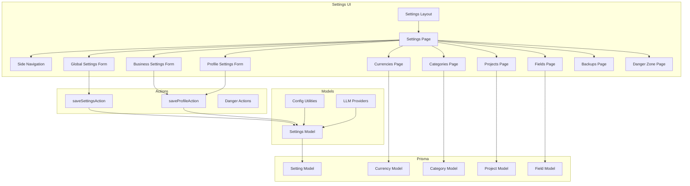
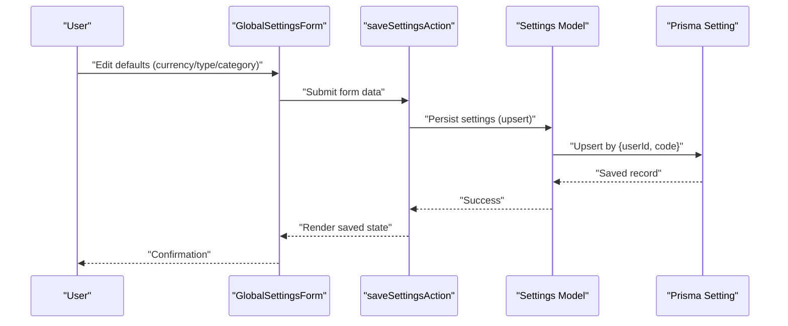
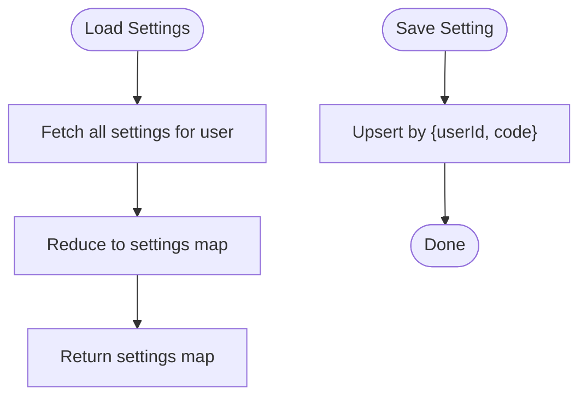
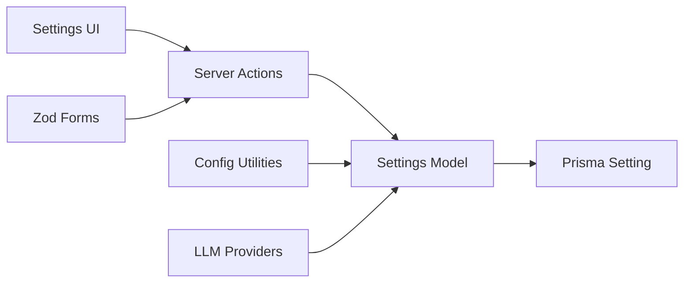

# Settings & Configuration

<cite>
**Referenced Files in This Document**
- [models/settings.ts](file://models/settings.ts)
- [forms/settings.ts](file://forms/settings.ts)
- [components/settings/side-nav.tsx](file://components/settings/side-nav.tsx)
- [components/settings/global-settings-form.tsx](file://components/settings/global-settings-form.tsx)
- [components/settings/business-settings-form.tsx](file://components/settings/business-settings-form.tsx)
- [components/settings/profile-settings-form.tsx](file://components/settings/profile-settings-form.tsx)
- [app/(app)/settings/actions.ts](file://app/(app)/settings/actions.ts)
- [app/(app)/settings/page.tsx](file://app/(app)/settings/page.tsx)
- [app/(app)/settings/layout.tsx](file://app/(app)/settings/layout.tsx)
- [app/(app)/settings/currencies/page.tsx](file://app/(app)/settings/currencies/page.tsx)
- [app/(app)/settings/categories/page.tsx](file://app/(app)/settings/categories/page.tsx)
- [app/(app)/settings/projects/page.tsx](file://app/(app)/settings/projects/page.tsx)
- [app/(app)/settings/fields/page.tsx](file://app/(app)/settings/fields/page.tsx)
- [app/(app)/settings/backups/page.tsx](file://app/(app)/settings/backups/page.tsx)
- [app/(app)/settings/backups/data/route.ts](file://app/(app)/settings/backups/data/route.ts)
- [app/(app)/settings/danger/page.tsx](file://app/(app)/settings/danger/page.tsx)
- [app/(app)/settings/danger/actions.ts](file://app/(app)/settings/danger/actions.ts)
- [components/settings/crud.tsx](file://components/settings/crud.tsx)
- [components/forms/select-currency.tsx](file://components/forms/select-currency.tsx)
- [components/forms/select-category.tsx](file://components/forms/select-category.tsx)
- [components/forms/select-type.tsx](file://components/forms/select-type.tsx)
- [lib/config.ts](file://lib/config.ts)
- [lib/llm-providers.ts](file://lib/llm-providers.ts)
- [prisma/schema.prisma](file://prisma/schema.prisma)
</cite>

## Table of Contents
1. [Introduction](#introduction)
2. [Project Structure](#project-structure)
3. [Core Components](#core-components)
4. [Architecture Overview](#architecture-overview)
5. [Detailed Component Analysis](#detailed-component-analysis)
6. [Dependency Analysis](#dependency-analysis)
7. [Performance Considerations](#performance-considerations)
8. [Troubleshooting Guide](#troubleshooting-guide)
9. [Conclusion](#conclusion)
10. [Appendices](#appendices)

## Introduction
This document explains how to configure and customize TaxHacker across three primary scopes:
- Application-wide settings: business information, currency configuration, feature toggles, and AI/LLM integration.
- User-specific preferences: profile, default selections, and personalization options.
- Business settings: company information, tax details, and regional configurations.

It also covers category and project management, custom fields, validation rules, display preferences, import/export and backup procedures, and best practices for robust configuration.

## Project Structure
TaxHacker organizes settings under the settings route group, with dedicated pages for each domain (business, currencies, categories, projects, fields, backups, danger zone). Shared UI components and forms provide consistent editing experiences. Data is persisted via Prisma and validated with Zod schemas.

**Diagram sources**
- [app/(app)/settings/layout.tsx](file://app/(app)/settings/layout.tsx)
- [app/(app)/settings/page.tsx](file://app/(app)/settings/page.tsx)
- [components/settings/side-nav.tsx](file://components/settings/side-nav.tsx)
- [components/settings/global-settings-form.tsx](file://components/settings/global-settings-form.tsx)
- [components/settings/business-settings-form.tsx](file://components/settings/business-settings-form.tsx)
- [components/settings/profile-settings-form.tsx](file://components/settings/profile-settings-form.tsx)
- [app/(app)/settings/actions.ts](file://app/(app)/settings/actions.ts)
- [models/settings.ts](file://models/settings.ts)
- [lib/config.ts](file://lib/config.ts)
- [lib/llm-providers.ts](file://lib/llm-providers.ts)
- [prisma/schema.prisma](file://prisma/schema.prisma)

**Section sources**
- [app/(app)/settings/layout.tsx](file://app/(app)/settings/layout.tsx)
- [app/(app)/settings/page.tsx](file://app/(app)/settings/page.tsx)
- [components/settings/side-nav.tsx](file://components/settings/side-nav.tsx)

## Core Components
- Settings persistence and retrieval: centralized in a typed settings map with caching and upsert semantics.
- Validation: Zod schemas define allowed keys and constraints for global settings, currencies, projects, categories, and custom fields.
- Forms: reusable form components render default selections and handle saving via server actions.
- LLM integration: provider configuration and model selection are derived from settings and provider metadata.

Key responsibilities:
- Persist user-scoped settings keyed by code.
- Provide strongly-typed accessors for LLM provider settings.
- Enforce validation at the form level and on the server.

**Section sources**
- [models/settings.ts](file://models/settings.ts)
- [forms/settings.ts](file://forms/settings.ts)
- [components/settings/global-settings-form.tsx](file://components/settings/global-settings-form.tsx)
- [components/settings/business-settings-form.tsx](file://components/settings/business-settings-form.tsx)
- [components/settings/profile-settings-form.tsx](file://components/settings/profile-settings-form.tsx)

## Architecture Overview
The settings subsystem follows a layered pattern:
- UI: Next.js client components and server actions.
- Forms: Zod schemas and shared form controls.
- Domain: Prisma models for currencies, categories, projects, fields, and settings.
- Integrations: LLM providers and configuration utilities.

**Diagram sources**
- [components/settings/global-settings-form.tsx](file://components/settings/global-settings-form.tsx)
- [app/(app)/settings/actions.ts](file://app/(app)/settings/actions.ts)
- [models/settings.ts](file://models/settings.ts)
- [prisma/schema.prisma](file://prisma/schema.prisma)

## Detailed Component Analysis

### Application-wide Settings
- Purpose: Configure defaults and feature toggles that apply to all users.
- Keys and behavior:
  - default_currency: ISO-like code with max length constraint.
  - default_type: Transaction type selection.
  - default_category: Default category for new transactions.
  - llm_providers: Comma-separated provider priority list.
  - Provider credentials and model names per provider.
  - openai_compatible_base_url: Optional base URL override for compatible providers.
  - prompt_analyse_new_file: Optional prompt override for file analysis.
  - is_welcome_message_hidden: Optional toggle for UI messaging.

Validation and defaults:
- Zod schemas enforce length limits and provide sensible defaults for model names and provider order.
- The settings map is cached and upserted per user.

Display and selection:
- Forms use select controls for currency, type, and category, rendering current values and available options.

**Section sources**
- [forms/settings.ts](file://forms/settings.ts)
- [models/settings.ts](file://models/settings.ts)
- [components/settings/global-settings-form.tsx](file://components/settings/global-settings-form.tsx)
- [components/forms/select-currency.tsx](file://components/forms/select-currency.tsx)
- [components/forms/select-category.tsx](file://components/forms/select-category.tsx)
- [components/forms/select-type.tsx](file://components/forms/select-type.tsx)

### User-specific Preferences
- Profile settings include avatar, account name, and subscription plan management.
- Business settings include business name, address, bank details, and logo.
- Both forms submit via a shared server action and render success/error feedback.

Personalization options:
- Default selections (currency, type, category) are user-scoped and stored as settings entries.
- Color and prompts for projects and categories are supported in their respective forms.

**Section sources**
- [components/settings/profile-settings-form.tsx](file://components/settings/profile-settings-form.tsx)
- [components/settings/business-settings-form.tsx](file://components/settings/business-settings-form.tsx)
- [app/(app)/settings/actions.ts](file://app/(app)/settings/actions.ts)

### Business Settings
- Company information: name, address, bank details, and logo.
- Regional configurations: handled via currency and country-specific fields exposed by the platform.
- Tax details: captured in business address and bank details fields; ensure compliance with local requirements.

Best practices:
- Keep business address and bank details structured for downstream invoice generation.
- Use the logo upload area to maintain brand consistency.

**Section sources**
- [components/settings/business-settings-form.tsx](file://components/settings/business-settings-form.tsx)

### Currency Configuration
- Purpose: Define and manage currencies used across the application.
- Schema constraints: code and name length limits enforced by Zod.
- Selection: Global settings allow choosing a default currency; lists are populated from the database.

Workflow:
- Create: Submit currency form; persist via server action.
- Modify: Update existing currency record.
- Delete: Remove unused currencies carefully; ensure no transactions depend on them.

**Section sources**
- [forms/settings.ts](file://forms/settings.ts)
- [app/(app)/settings/currencies/page.tsx](file://app/(app)/settings/currencies/page.tsx)
- [components/settings/crud.tsx](file://components/settings/crud.tsx)

### Category Management
- Purpose: Organize transactions by logical buckets with optional prompts and colors.
- Schema constraints: name length limit; optional prompt and color.
- Defaults: New categories can be created with default visibility flags for list and analysis views.

Workflow:
- Create: Provide name and optional prompt/color; persist via server action.
- Modify: Adjust name, prompt, color, or visibility flags.
- Delete: Remove categories that are not referenced by transactions.

**Section sources**
- [forms/settings.ts](file://forms/settings.ts)
- [app/(app)/settings/categories/page.tsx](file://app/(app)/settings/categories/page.tsx)
- [components/settings/crud.tsx](file://components/settings/crud.tsx)

### Project Management
- Purpose: Group transactions by projects with optional prompts and colors.
- Schema constraints: name length limit; optional prompt and color.
- Defaults: Projects support default visibility flags similar to categories.

Workflow:
- Create: Provide name and optional prompt/color; persist via server action.
- Modify: Update attributes and flags.
- Delete: Remove projects that are not referenced by transactions.

**Section sources**
- [forms/settings.ts](file://forms/settings.ts)
- [app/(app)/settings/projects/page.tsx](file://app/(app)/settings/projects/page.tsx)
- [components/settings/crud.tsx](file://components/settings/crud.tsx)

### Custom Fields
- Purpose: Extend data capture beyond standard fields with custom attributes.
- Schema constraints: name length limit; default type is string; optional prompt and visibility flags.
- Validation: Required flag and visibility flags control UI behavior and data collection.

Workflow:
- Create: Choose type, set name and prompt; enable visibility flags.
- Modify: Update type, name, prompt, and flags.
- Delete: Remove fields that are not attached to any records.

**Section sources**
- [forms/settings.ts](file://forms/settings.ts)
- [app/(app)/settings/fields/page.tsx](file://app/(app)/settings/fields/page.tsx)
- [components/settings/crud.tsx](file://components/settings/crud.tsx)

### LLM Integration Settings
- Providers: OpenAI, Google, Mistral, and OpenAI-compatible providers.
- Configuration: API keys, model names, and optional base URL for compatible providers.
- Priority: Comma-separated list controlling fallback order.
- Prompt overrides: Optional prompt for file analysis.

Retrieval:
- Settings map is parsed to build a prioritized provider list with credentials and model names.

**Section sources**
- [models/settings.ts](file://models/settings.ts)
- [lib/llm-providers.ts](file://lib/llm-providers.ts)
- [forms/settings.ts](file://forms/settings.ts)

### Settings Import/Export and Backups
- Backups page: Provides backup data export and restore workflows.
- Data endpoint: Dedicated route for exporting backup data.
- Danger zone: Includes destructive operations (e.g., reset or purge); requires explicit confirmation.

Guidance:
- Export backups regularly to protect against data loss.
- Use the data endpoint to download a snapshot of current settings and related entities.
- Exercise caution in the danger zone; confirm all warnings before proceeding.

**Section sources**
- [app/(app)/settings/backups/page.tsx](file://app/(app)/settings/backups/page.tsx)
- [app/(app)/settings/backups/data/route.ts](file://app/(app)/settings/backups/data/route.ts)
- [app/(app)/settings/danger/page.tsx](file://app/(app)/settings/danger/page.tsx)
- [app/(app)/settings/danger/actions.ts](file://app/(app)/settings/danger/actions.ts)

### Settings Persistence and Retrieval
- Storage: Settings are stored as key-value pairs scoped to a user.
- Access: Cached retrieval aggregates rows into a settings map.
- Upsert: Ensures creation or update of a setting for a given user and code.

**Diagram sources**
- [models/settings.ts](file://models/settings.ts)
- [prisma/schema.prisma](file://prisma/schema.prisma)

**Section sources**
- [models/settings.ts](file://models/settings.ts)

## Dependency Analysis
- UI depends on server actions for persistence.
- Forms depend on Zod schemas for validation.
- Settings model depends on Prisma for storage and on configuration utilities for provider metadata.
- CRUD components coordinate create/update/delete flows for currencies, categories, projects, and fields.

**Diagram sources**
- [app/(app)/settings/actions.ts](file://app/(app)/settings/actions.ts)
- [models/settings.ts](file://models/settings.ts)
- [lib/config.ts](file://lib/config.ts)
- [lib/llm-providers.ts](file://lib/llm-providers.ts)
- [prisma/schema.prisma](file://prisma/schema.prisma)

**Section sources**
- [app/(app)/settings/actions.ts](file://app/(app)/settings/actions.ts)
- [models/settings.ts](file://models/settings.ts)

## Performance Considerations
- Caching: Settings retrieval is cached per user to reduce database load.
- Minimal writes: Upserts avoid unnecessary updates when values are unchanged.
- Batch operations: Prefer bulk actions in CRUD components when available.
- Validation close to the boundary: Zod schemas prevent invalid data from reaching the database.

[No sources needed since this section provides general guidance]

## Troubleshooting Guide
Common issues and resolutions:
- Invalid default selections: Ensure default_currency, default_type, and default_category exist in their respective lists.
- LLM provider errors: Verify API keys and model names; check provider priority order.
- Backup failures: Confirm permissions and network connectivity; retry after addressing errors.
- Destructive operations: Review warnings in the danger zone; keep recent backups before proceeding.

Operational tips:
- Validate forms locally using Zod constraints before submission.
- Monitor server action responses for error messages.
- Use the backups page to restore from a known-good state.

**Section sources**
- [forms/settings.ts](file://forms/settings.ts)
- [app/(app)/settings/actions.ts](file://app/(app)/settings/actions.ts)
- [app/(app)/settings/backups/page.tsx](file://app/(app)/settings/backups/page.tsx)
- [app/(app)/settings/danger/page.tsx](file://app/(app)/settings/danger/page.tsx)

## Conclusion
TaxHacker’s settings system provides a flexible, validated, and persistent foundation for application-wide defaults, user preferences, business information, and extensibility via custom fields. By leveraging the provided forms, server actions, and backup mechanisms, administrators can tailor the platform to their needs while maintaining data integrity and operational safety.

[No sources needed since this section summarizes without analyzing specific files]

## Appendices

### Optimal Configuration Strategies
- Establish defaults early: Set default_currency, default_type, and default_category during onboarding.
- Organize categories and projects: Use descriptive names, optional prompts, and colors to improve discoverability.
- Plan custom fields: Start small; add fields incrementally and remove unused ones.
- Secure LLM integrations: Store API keys securely and rotate them periodically; test provider availability.
- Automate backups: Schedule regular exports and store offsite copies.

[No sources needed since this section provides general guidance]