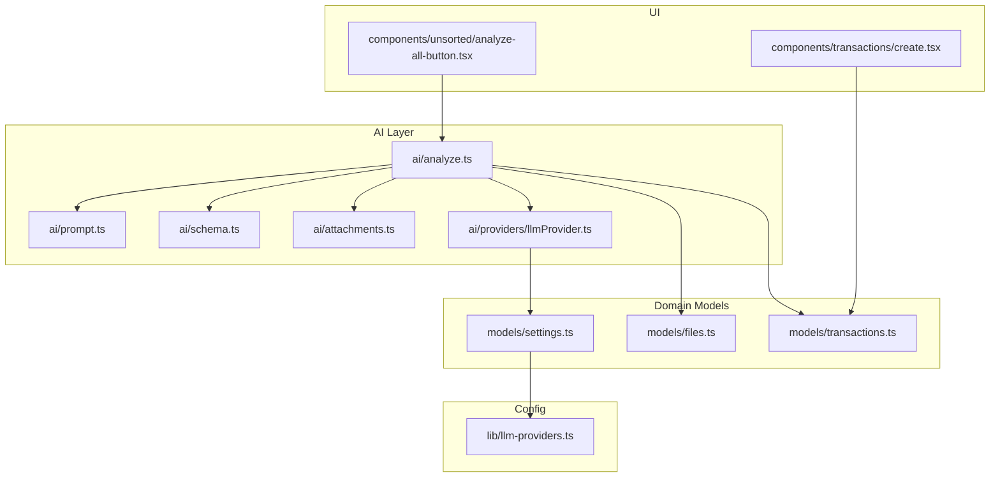
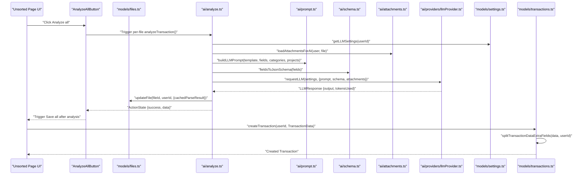
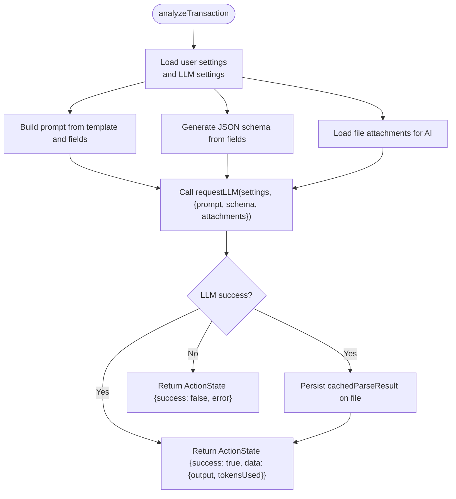
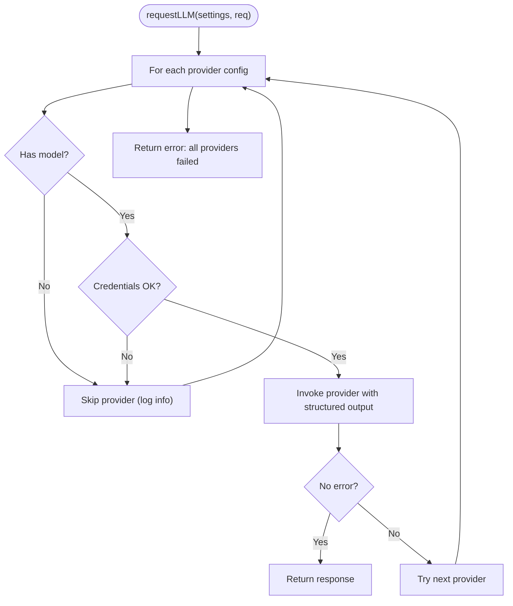
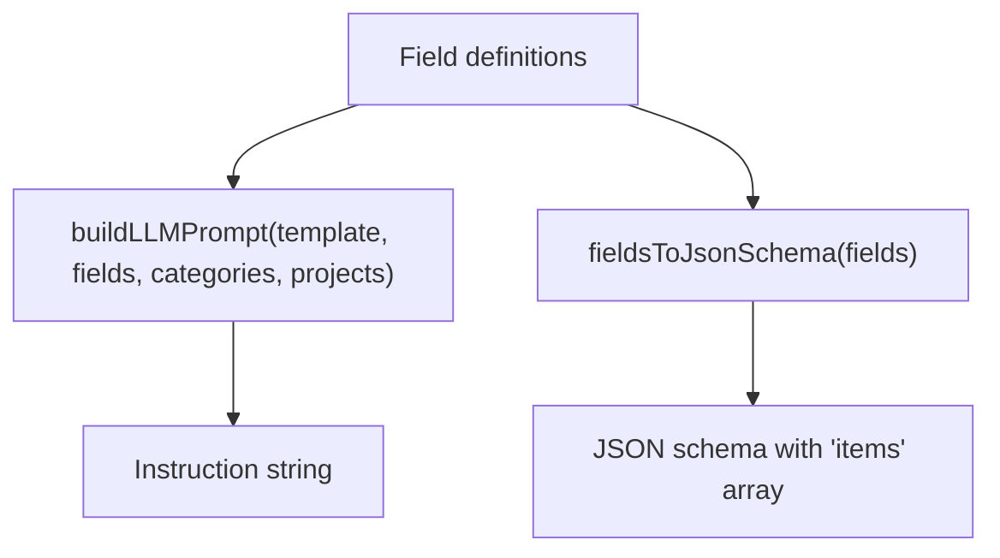
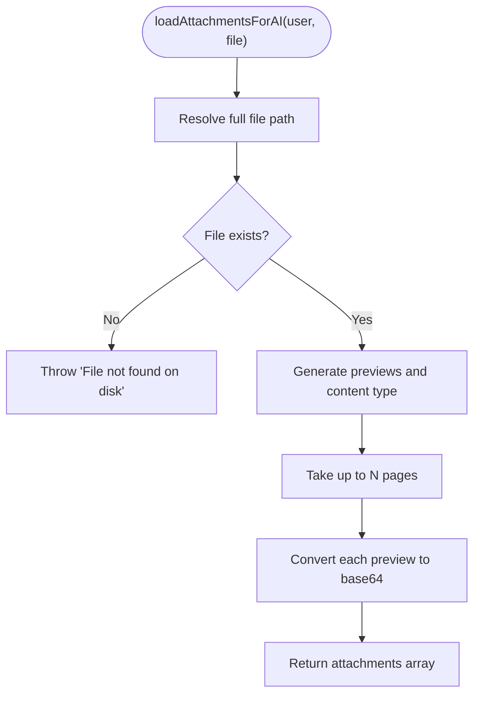
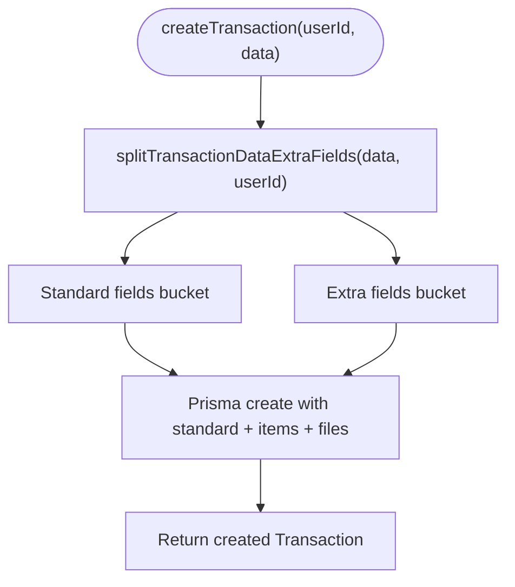
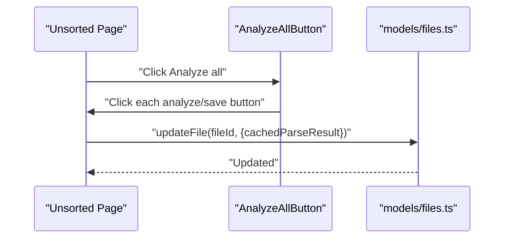
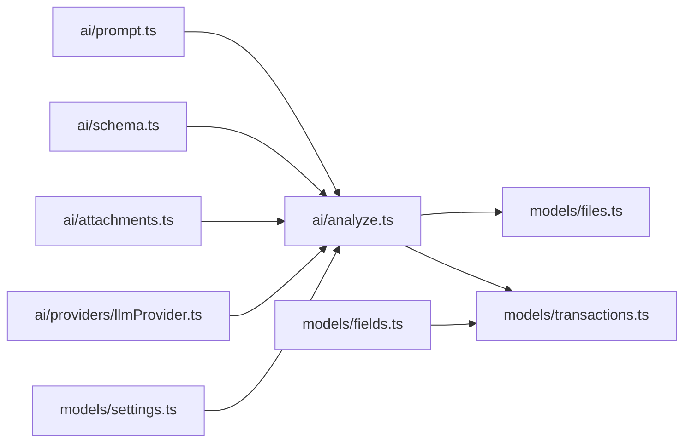

# AI Transaction Integration

<cite>
**Referenced Files in This Document**
- [ai/analyze.ts](file://ai/analyze.ts)
- [ai/providers/llmProvider.ts](file://ai/providers/llmProvider.ts)
- [ai/schema.ts](file://ai/schema.ts)
- [ai/prompt.ts](file://ai/prompt.ts)
- [ai/attachments.ts](file://ai/attachments.ts)
- [lib/llm-providers.ts](file://lib/llm-providers.ts)
- [models/settings.ts](file://models/settings.ts)
- [models/transactions.ts](file://models/transactions.ts)
- [models/files.ts](file://models/files.ts)
- [lib/actions.ts](file://lib/actions.ts)
- [components/unsorted/analyze-all-button.tsx](file://components/unsorted/analyze-all-button.tsx)
- [components/transactions/create.tsx](file://components/transactions/create.tsx)
</cite>

## Table of Contents
1. [Introduction](#introduction)
2. [Project Structure](#project-structure)
3. [Core Components](#core-components)
4. [Architecture Overview](#architecture-overview)
5. [Detailed Component Analysis](#detailed-component-analysis)
6. [Dependency Analysis](#dependency-analysis)
7. [Performance Considerations](#performance-considerations)
8. [Troubleshooting Guide](#troubleshooting-guide)
9. [Conclusion](#conclusion)
10. [Appendices](#appendices)

## Introduction
This document explains how AI-powered transaction creation and integration works in TaxHacker. It traces the flow from AI analysis of unsorted files to the creation of validated transactions, including how AI output is transformed into the internal TransactionData format, how dynamic fields are handled via splitTransactionDataExtraFields, and how the analyze-all-button functionality orchestrates batch processing. It also covers AI provider configuration, token usage tracking, error handling, and performance optimization for batch operations.

## Project Structure
The AI transaction pipeline spans several modules:
- AI analysis orchestration and LLM invocation
- Prompt building and schema generation
- Attachment preparation for multimodal analysis
- Settings and provider configuration
- Transaction model and data splitting
- Unsorted file management and batch controls
- Frontend transaction creation form

**Diagram sources**
- [ai/analyze.ts:14-57](file://ai/analyze.ts#L14-L57)
- [ai/prompt.ts:3-39](file://ai/prompt.ts#L3-L39)
- [ai/schema.ts:3-34](file://ai/schema.ts#L3-L34)
- [ai/providers/llmProvider.ts:106-132](file://ai/providers/llmProvider.ts#L106-L132)
- [ai/attachments.ts:14-35](file://ai/attachments.ts#L14-L35)
- [models/settings.ts:11-51](file://models/settings.ts#L11-L51)
- [models/transactions.ts:135-220](file://models/transactions.ts#L135-L220)
- [models/files.ts:63-68](file://models/files.ts#L63-L68)
- [lib/llm-providers.ts:16-79](file://lib/llm-providers.ts#L16-L79)
- [components/unsorted/analyze-all-button.tsx:6-35](file://components/unsorted/analyze-all-button.tsx#L6-L35)
- [components/transactions/create.tsx:18-137](file://components/transactions/create.tsx#L18-L137)

**Section sources**
- [ai/analyze.ts:14-57](file://ai/analyze.ts#L14-L57)
- [models/transactions.ts:135-220](file://models/transactions.ts#L135-L220)
- [models/files.ts:63-68](file://models/files.ts#L63-L68)
- [components/unsorted/analyze-all-button.tsx:6-35](file://components/unsorted/analyze-all-button.tsx#L6-L35)

## Core Components
- AI analysis orchestrator: analyzeTransaction coordinates settings retrieval, attachment loading, LLM invocation, and caching of parsed results.
- LLM provider abstraction: requestLLM selects a configured provider, constructs multimodal messages, and returns structured JSON or an error.
- Schema and prompt builders: fieldsToJsonSchema generates a JSON schema from user-defined fields; buildLLMPrompt composes a templated instruction enriched with fields, categories, and projects.
- Attachment loader: loadAttachmentsForAI converts file pages into base64 images for multimodal analysis.
- Transaction model: TransactionData defines the internal shape; splitTransactionDataExtraFields separates standard vs extra fields based on field definitions.
- Settings and providers: getLLMSettings builds provider configs from user settings; lib/llm-providers.ts enumerates supported providers and metadata.
- Unsorted files and batch controls: getUnsortedFiles lists pending files; AnalyzeAllButton triggers per-file analysis and save actions.
- Frontend transaction creation: TransactionCreateForm posts to createTransactionAction and redirects upon success.

**Section sources**
- [ai/analyze.ts:14-57](file://ai/analyze.ts#L14-L57)
- [ai/providers/llmProvider.ts:106-132](file://ai/providers/llmProvider.ts#L106-L132)
- [ai/schema.ts:3-34](file://ai/schema.ts#L3-L34)
- [ai/prompt.ts:3-39](file://ai/prompt.ts#L3-L39)
- [ai/attachments.ts:14-35](file://ai/attachments.ts#L14-L35)
- [models/transactions.ts:7-25](file://models/transactions.ts#L7-L25)
- [models/transactions.ts:192-220](file://models/transactions.ts#L192-L220)
- [models/settings.ts:11-51](file://models/settings.ts#L11-L51)
- [lib/llm-providers.ts:16-79](file://lib/llm-providers.ts#L16-L79)
- [models/files.ts:9-19](file://models/files.ts#L9-L19)
- [components/unsorted/analyze-all-button.tsx:6-35](file://components/unsorted/analyze-all-button.tsx#L6-L35)
- [components/transactions/create.tsx:18-137](file://components/transactions/create.tsx#L18-L137)

## Architecture Overview
The AI transaction creation workflow integrates frontend, backend, and external LLM providers. The flow below maps actual code paths and responsibilities.

**Diagram sources**
- [components/unsorted/analyze-all-button.tsx:6-35](file://components/unsorted/analyze-all-button.tsx#L6-L35)
- [models/files.ts:63-68](file://models/files.ts#L63-L68)
- [ai/analyze.ts:14-57](file://ai/analyze.ts#L14-L57)
- [ai/prompt.ts:3-39](file://ai/prompt.ts#L3-L39)
- [ai/schema.ts:3-34](file://ai/schema.ts#L3-L34)
- [ai/attachments.ts:14-35](file://ai/attachments.ts#L14-L35)
- [ai/providers/llmProvider.ts:106-132](file://ai/providers/llmProvider.ts#L106-L132)
- [models/settings.ts:11-51](file://models/settings.ts#L11-L51)
- [models/transactions.ts:135-220](file://models/transactions.ts#L135-L220)

## Detailed Component Analysis

### AI Analysis Orchestration (analyzeTransaction)
- Responsibilities:
  - Load user settings and LLM settings
  - Prepare attachments for multimodal analysis
  - Call requestLLM with prompt, schema, and attachments
  - Persist cachedParseResult on the file
  - Return ActionState with output and tokensUsed
- Error handling:
  - Catches errors during LLM invocation and returns a failure state with message
- Token usage:
  - Tokens used are captured from the LLM response and returned in ActionState

**Diagram sources**
- [ai/analyze.ts:14-57](file://ai/analyze.ts#L14-L57)
- [ai/prompt.ts:3-39](file://ai/prompt.ts#L3-L39)
- [ai/schema.ts:3-34](file://ai/schema.ts#L3-L34)
- [ai/attachments.ts:14-35](file://ai/attachments.ts#L14-L35)
- [ai/providers/llmProvider.ts:106-132](file://ai/providers/llmProvider.ts#L106-L132)
- [models/files.ts:63-68](file://models/files.ts#L63-L68)
- [lib/actions.ts:1-6](file://lib/actions.ts#L1-L6)

**Section sources**
- [ai/analyze.ts:14-57](file://ai/analyze.ts#L14-L57)
- [lib/actions.ts:1-6](file://lib/actions.ts#L1-L6)

### LLM Provider Abstraction (requestLLM)
- Responsibilities:
  - Iterate through configured providers until one succeeds
  - Construct multimodal messages (text + optional images)
  - Use structured output for supported providers; parse JSON for openai_compatible
  - Return unified LLMResponse with provider and tokensUsed
- Provider selection:
  - Uses getLLMSettings to derive provider order and credentials
- Error handling:
  - Returns error string when provider fails or is not configured

**Diagram sources**
- [ai/providers/llmProvider.ts:106-132](file://ai/providers/llmProvider.ts#L106-L132)
- [models/settings.ts:11-51](file://models/settings.ts#L11-L51)

**Section sources**
- [ai/providers/llmProvider.ts:106-132](file://ai/providers/llmProvider.ts#L106-L132)
- [models/settings.ts:11-51](file://models/settings.ts#L11-L51)

### Prompt and Schema Builders
- Prompt builder:
  - Replaces placeholders with field prompts, categories, and projects
  - Produces a single instruction string guiding extraction
- Schema builder:
  - Builds a JSON schema from enabled fields
  - Adds an items array property to capture line-item extractions
  - Ensures required properties and disallows additional properties

**Diagram sources**
- [ai/prompt.ts:3-39](file://ai/prompt.ts#L3-L39)
- [ai/schema.ts:3-34](file://ai/schema.ts#L3-L34)

**Section sources**
- [ai/prompt.ts:3-39](file://ai/prompt.ts#L3-L39)
- [ai/schema.ts:3-34](file://ai/schema.ts#L3-L34)

### Attachment Loading for Multimodal Analysis
- Loads file previews up to a maximum page limit
- Converts each preview to base64 for inclusion in multimodal messages
- Throws if the underlying file is missing

**Diagram sources**
- [ai/attachments.ts:14-35](file://ai/attachments.ts#L14-L35)

**Section sources**
- [ai/attachments.ts:14-35](file://ai/attachments.ts#L14-L35)

### Transaction Creation and Dynamic Field Splitting
- TransactionData format:
  - Standard fields (e.g., name, merchant, total, currencyCode, type, categoryCode, projectCode, issuedAt, note)
  - Items array for line-item extractions
  - extra object for AI-generated dynamic fields not defined as standard
  - text and files arrays for free-form text and file associations
- splitTransactionDataExtraFields:
  - Reads user-defined fields to distinguish standard vs extra
  - Partitions input data into standard and extra buckets
  - Persists extra as JSON in the database while keeping standard fields normalized

**Diagram sources**
- [models/transactions.ts:135-146](file://models/transactions.ts#L135-L146)
- [models/transactions.ts:192-220](file://models/transactions.ts#L192-L220)

**Section sources**
- [models/transactions.ts:7-25](file://models/transactions.ts#L7-L25)
- [models/transactions.ts:135-146](file://models/transactions.ts#L135-L146)
- [models/transactions.ts:192-220](file://models/transactions.ts#L192-L220)

### Unsorted Files and Batch Controls
- Unsorted files:
  - getUnsortedFiles lists files awaiting review
  - updateFile persists cachedParseResult after successful analysis
- Analyze all:
  - AnalyzeAllButton programmatically clicks all per-file analyze/save buttons

**Diagram sources**
- [models/files.ts:63-68](file://models/files.ts#L63-L68)
- [components/unsorted/analyze-all-button.tsx:6-35](file://components/unsorted/analyze-all-button.tsx#L6-L35)

**Section sources**
- [models/files.ts:9-19](file://models/files.ts#L9-L19)
- [models/files.ts:63-68](file://models/files.ts#L63-L68)
- [components/unsorted/analyze-all-button.tsx:6-35](file://components/unsorted/analyze-all-button.tsx#L6-L35)

### Frontend Transaction Creation
- TransactionCreateForm posts to createTransactionAction and navigates to the new transaction on success
- Provides default values from user settings and supports currency conversion fields

**Section sources**
- [components/transactions/create.tsx:18-137](file://components/transactions/create.tsx#L18-L137)

## Dependency Analysis
- AI analysis depends on:
  - Prompt and schema builders for instruction and structure
  - Attachment loader for multimodal inputs
  - LLM provider abstraction for inference
  - Settings for provider configuration
- Transaction creation depends on:
  - Field definitions to split standard vs extra fields
  - File updates to persist cachedParseResult

**Diagram sources**
- [ai/analyze.ts:14-57](file://ai/analyze.ts#L14-L57)
- [ai/prompt.ts:3-39](file://ai/prompt.ts#L3-L39)
- [ai/schema.ts:3-34](file://ai/schema.ts#L3-L34)
- [ai/attachments.ts:14-35](file://ai/attachments.ts#L14-L35)
- [ai/providers/llmProvider.ts:106-132](file://ai/providers/llmProvider.ts#L106-L132)
- [models/settings.ts:11-51](file://models/settings.ts#L11-L51)
- [models/files.ts:63-68](file://models/files.ts#L63-L68)
- [models/transactions.ts:135-220](file://models/transactions.ts#L135-L220)

**Section sources**
- [models/transactions.ts:135-220](file://models/transactions.ts#L135-L220)
- [models/files.ts:63-68](file://models/files.ts#L63-L68)

## Performance Considerations
- Limit pages analyzed per file to reduce cost and latency (attachment loader slices previews).
- Prefer structured output to avoid parsing overhead; fallback to JSON parsing only for compatible providers.
- Cache parsed results on files to avoid reprocessing and enable batch save workflows.
- Batch operations:
  - Use AnalyzeAllButton to trigger multiple analyses efficiently.
  - Group save operations after analysis to minimize database round-trips.
- Provider selection:
  - Configure provider priority and credentials to avoid retries and timeouts.
- Token usage tracking:
  - Capture tokensUsed from LLM responses to monitor consumption per analysis.

[No sources needed since this section provides general guidance]

## Troubleshooting Guide
- AI Analysis errors:
  - analyzeTransaction catches and returns error messages in ActionState
  - requestLLM logs skipped providers and returns a consolidated error when none succeed
- Attachment issues:
  - loadAttachmentsForAI throws if the underlying file is missing; ensure file paths are valid
- Provider misconfiguration:
  - requestLLM skips providers without a model or proper credentials; verify settings
- Manual correction workflow:
  - After analyzeTransaction caches parsed results, users can manually edit transaction fields before saving
  - The frontend form posts to createTransactionAction; on success, navigation occurs to the created transaction

**Section sources**
- [ai/analyze.ts:50-56](file://ai/analyze.ts#L50-L56)
- [ai/providers/llmProvider.ts:106-132](file://ai/providers/llmProvider.ts#L106-L132)
- [ai/attachments.ts:17-18](file://ai/attachments.ts#L17-L18)
- [components/transactions/create.tsx:46-50](file://components/transactions/create.tsx#L46-L50)

## Conclusion
TaxHacker’s AI transaction integration cleanly separates concerns: prompt and schema construction, multimodal attachment handling, provider abstraction, and robust transaction modeling with dynamic field support. The analyze-all-button enables efficient batch processing, while cached parse results streamline manual corrections. With structured output, strict schema enforcement, and clear error propagation, the system balances accuracy and performance for real-world invoice and receipt processing.

[No sources needed since this section summarizes without analyzing specific files]

## Appendices

### AI Provider Configuration
- Supported providers and metadata are defined centrally and include keys, labels, API key names, model names, base URLs, and default values.
- getLLMSettings reads user settings and constructs provider configurations according to priority order.

**Section sources**
- [lib/llm-providers.ts:16-79](file://lib/llm-providers.ts#L16-L79)
- [models/settings.ts:11-51](file://models/settings.ts#L11-L51)

### Field Validation Rules
- JSON schema enforces required properties derived from fields and requires an items array for line-item extractions.
- Additional properties are disallowed to prevent noise in AI output.
- splitTransactionDataExtraFields ensures only known fields populate standard columns, with others stored under extra.

**Section sources**
- [ai/schema.ts:3-34](file://ai/schema.ts#L3-L34)
- [models/transactions.ts:192-220](file://models/transactions.ts#L192-L220)

### Example Workflows
- AI transaction creation:
  - Build prompt and schema from user-defined fields
  - Load file attachments
  - Invoke LLM and receive structured output
  - Cache parsed result on the file
  - Create transaction with split standard and extra fields
- Batch processing:
  - Click Analyze all to trigger per-file analysis
  - Click Save all to persist changes after manual review

**Section sources**
- [ai/analyze.ts:14-57](file://ai/analyze.ts#L14-L57)
- [ai/schema.ts:3-34](file://ai/schema.ts#L3-L34)
- [ai/attachments.ts:14-35](file://ai/attachments.ts#L14-L35)
- [models/transactions.ts:135-146](file://models/transactions.ts#L135-L146)
- [components/unsorted/analyze-all-button.tsx:6-35](file://components/unsorted/analyze-all-button.tsx#L6-L35)