# CRUD Operations

<cite>
**Referenced Files in This Document**
- [models/transactions.ts](file://models/transactions.ts)
- [app/(app)/transactions/actions.ts](file://app/(app)/transactions/actions.ts)
- [components/transactions/create.tsx](file://components/transactions/create.tsx)
- [components/transactions/edit.tsx](file://components/transactions/edit.tsx)
- [components/transactions/new.tsx](file://components/transactions/new.tsx)
- [components/transactions/list.tsx](file://components/transactions/list.tsx)
- [components/transactions/bulk-actions.tsx](file://components/transactions/bulk-actions.tsx)
- [components/transactions/transaction-files.tsx](file://components/transactions/transaction-files.tsx)
- [hooks/use-transaction-filters.tsx](file://hooks/use-transaction-filters.tsx)
- [ai/analyze.ts](file://ai/analyze.ts)
- [ai/schema.ts](file://ai/schema.ts)
- [lib/actions.ts](file://lib/actions.ts)
- [lib/uploads.ts](file://lib/uploads.ts)
</cite>

## Table of Contents
1. [Introduction](#introduction)
2. [Project Structure](#project-structure)
3. [Core Components](#core-components)
4. [Architecture Overview](#architecture-overview)
5. [Detailed Component Analysis](#detailed-component-analysis)
6. [Dependency Analysis](#dependency-analysis)
7. [Performance Considerations](#performance-considerations)
8. [Troubleshooting Guide](#troubleshooting-guide)
9. [Conclusion](#conclusion)

## Introduction
This document explains the complete transaction CRUD lifecycle in TaxHacker, covering creation, updates, deletion, and bulk deletion. It details how transactions are created from AI-extracted data and manual entries, how dynamic fields are handled via splitTransactionDataExtraFields, and how file attachments are managed. It also documents retrieval methods, validation rules, error handling, and the integration with UI components for transaction management.

## Project Structure
The transaction CRUD stack spans UI components, Next.js server actions, and model-layer functions backed by Prisma. Key areas:
- UI forms and lists: components/transactions/*
- Server actions: app/(app)/transactions/actions.ts
- Model functions: models/transactions.ts
- Filters and lists: hooks/use-transaction-filters.tsx, components/transactions/list.tsx
- File attachments: components/transactions/transaction-files.tsx
- AI extraction pipeline: ai/analyze.ts, ai/schema.ts
- Shared action state type: lib/actions.ts

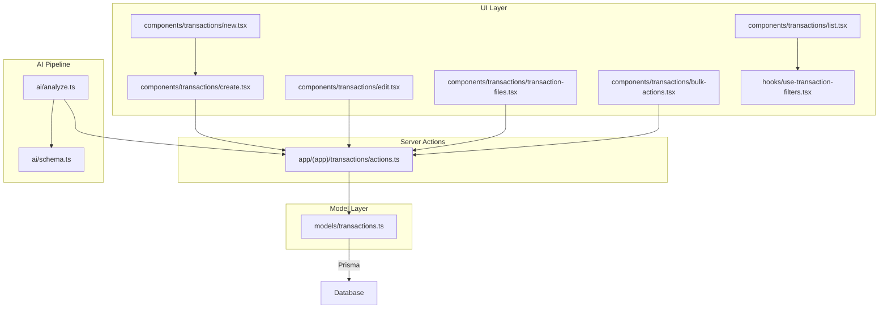

**Diagram sources**
- [components/transactions/create.tsx:1-138](file://components/transactions/create.tsx#L1-L138)
- [components/transactions/edit.tsx:1-255](file://components/transactions/edit.tsx#L1-L255)
- [components/transactions/list.tsx:1-344](file://components/transactions/list.tsx#L1-L344)
- [components/transactions/new.tsx:1-45](file://components/transactions/new.tsx#L1-L45)
- [components/transactions/transaction-files.tsx:1-82](file://components/transactions/transaction-files.tsx#L1-L82)
- [components/transactions/bulk-actions.tsx:1-45](file://components/transactions/bulk-actions.tsx#L1-L45)
- [hooks/use-transaction-filters.tsx:1-91](file://hooks/use-transaction-filters.tsx#L1-L91)
- [app/(app)/transactions/actions.ts](file://app/(app)/transactions/actions.ts#L1-L229)
- [models/transactions.ts:1-221](file://models/transactions.ts#L1-L221)
- [ai/analyze.ts:1-58](file://ai/analyze.ts#L1-L58)
- [ai/schema.ts:1-35](file://ai/schema.ts#L1-L35)

**Section sources**
- [models/transactions.ts:1-221](file://models/transactions.ts#L1-L221)
- [app/(app)/transactions/actions.ts](file://app/(app)/transactions/actions.ts#L1-L229)
- [components/transactions/create.tsx:1-138](file://components/transactions/create.tsx#L1-L138)
- [components/transactions/edit.tsx:1-255](file://components/transactions/edit.tsx#L1-L255)
- [components/transactions/list.tsx:1-344](file://components/transactions/list.tsx#L1-L344)
- [components/transactions/new.tsx:1-45](file://components/transactions/new.tsx#L1-L45)
- [components/transactions/transaction-files.tsx:1-82](file://components/transactions/transaction-files.tsx#L1-L82)
- [components/transactions/bulk-actions.tsx:1-45](file://components/transactions/bulk-actions.tsx#L1-L45)
- [hooks/use-transaction-filters.tsx:1-91](file://hooks/use-transaction-filters.tsx#L1-L91)
- [ai/analyze.ts:1-58](file://ai/analyze.ts#L1-L58)
- [ai/schema.ts:1-35](file://ai/schema.ts#L1-L35)
- [lib/actions.ts:1-6](file://lib/actions.ts#L1-L6)

## Core Components
- Transaction model and CRUD functions: createTransaction, updateTransaction, updateTransactionFiles, deleteTransaction, bulkDeleteTransactions, plus retrieval helpers getTransactionById and getTransactionsByFileId.
- Splitting mechanism: splitTransactionDataExtraFields separates standard fields from extra fields based on user-defined field definitions.
- Server actions: createTransactionAction, saveTransactionAction, deleteTransactionAction, deleteTransactionFileAction, uploadTransactionFilesAction, bulkDeleteTransactionsAction.
- UI forms and lists: TransactionCreateForm, TransactionEditForm, TransactionList, NewTransactionDialog, TransactionFiles, BulkActionsMenu.
- Filters and pagination: useTransactionFilters hook and TransactionList rendering.

Key responsibilities:
- Validation: server actions use transactionFormSchema to validate incoming form data.
- Authorization: actions fetch the current user and enforce ownership via userId filters.
- Storage and file management: uploadTransactionFilesAction validates quotas, writes files, records file metadata, and updates transaction files.
- Error handling: actions return ActionState with success/error/data fields.

**Section sources**
- [models/transactions.ts:135-221](file://models/transactions.ts#L135-L221)
- [app/(app)/transactions/actions.ts](file://app/(app)/transactions/actions.ts#L30-L215)
- [lib/actions.ts:1-6](file://lib/actions.ts#L1-L6)

## Architecture Overview
The transaction lifecycle follows a clear flow from UI to persistence:

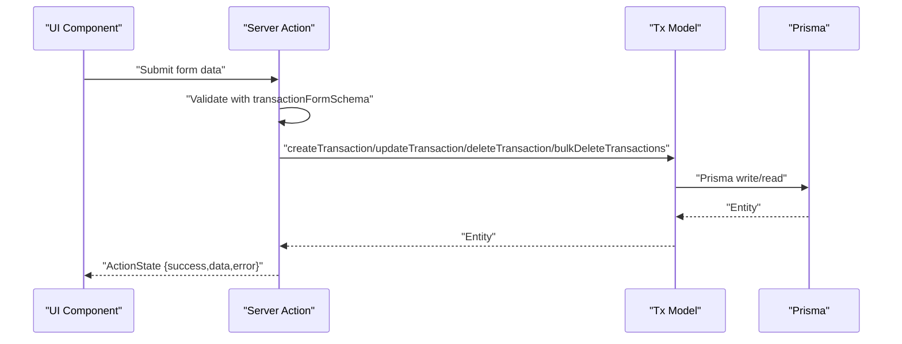

**Diagram sources**
- [app/(app)/transactions/actions.ts](file://app/(app)/transactions/actions.ts#L30-L215)
- [models/transactions.ts:135-221](file://models/transactions.ts#L135-L221)

## Detailed Component Analysis

### Transaction Creation
- UI: TransactionCreateForm posts to createTransactionAction.
- Server action: Validates form data, calls createTransaction.
- Model: Splits standard vs extra fields, persists items as JSON, sets userId.
- Retrieval: Returns the created transaction.

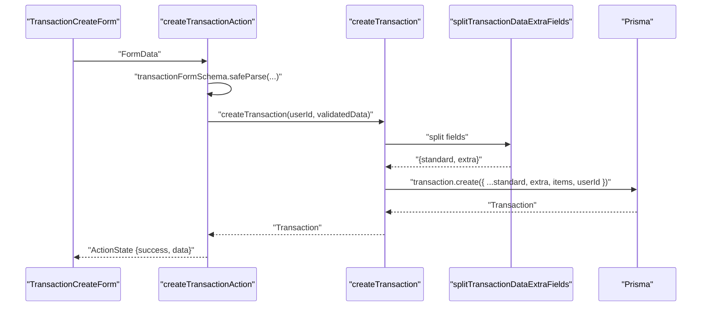

**Diagram sources**
- [components/transactions/create.tsx:30-50](file://components/transactions/create.tsx#L30-L50)
- [app/(app)/transactions/actions.ts](file://app/(app)/transactions/actions.ts#L30-L50)
- [models/transactions.ts:135-146](file://models/transactions.ts#L135-L146)
- [models/transactions.ts:192-220](file://models/transactions.ts#L192-L220)

**Section sources**
- [components/transactions/create.tsx:18-50](file://components/transactions/create.tsx#L18-L50)
- [app/(app)/transactions/actions.ts](file://app/(app)/transactions/actions.ts#L30-L50)
- [models/transactions.ts:135-146](file://models/transactions.ts#L135-L146)
- [models/transactions.ts:192-220](file://models/transactions.ts#L192-L220)

### Transaction Update
- UI: TransactionEditForm posts to saveTransactionAction with hidden transactionId.
- Server action: Validates, loads transaction by ID and userId, calls updateTransaction.
- Model: Splits standard vs extra fields, optionally clears items if not provided.
- Retrieval: Returns the updated transaction.

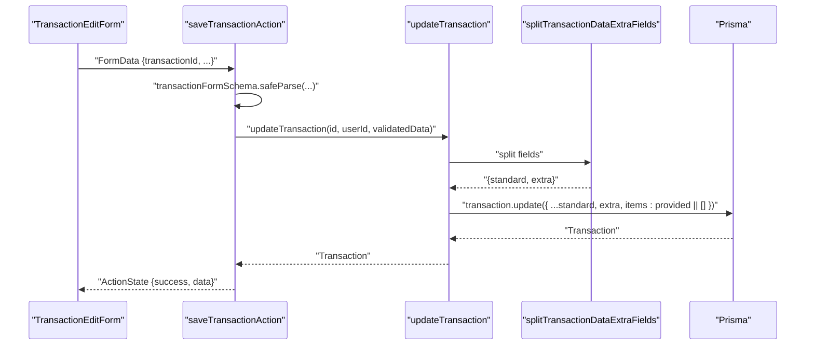

**Diagram sources**
- [components/transactions/edit.tsx:36-86](file://components/transactions/edit.tsx#L36-L86)
- [app/(app)/transactions/actions.ts](file://app/(app)/transactions/actions.ts#L52-L73)
- [models/transactions.ts:148-159](file://models/transactions.ts#L148-L159)
- [models/transactions.ts:192-220](file://models/transactions.ts#L192-L220)

**Section sources**
- [components/transactions/edit.tsx:88-110](file://components/transactions/edit.tsx#L88-L110)
- [app/(app)/transactions/actions.ts](file://app/(app)/transactions/actions.ts#L52-L73)
- [models/transactions.ts:148-159](file://models/transactions.ts#L148-L159)

### Transaction Deletion
- UI: TransactionEditForm triggers deleteTransactionAction.
- Server action: Loads transaction by ID and userId, calls deleteTransaction.
- Model: Removes associated files if no other transactions reference them, deletes transaction.
- Cleanup: Updates storage used after file deletion.

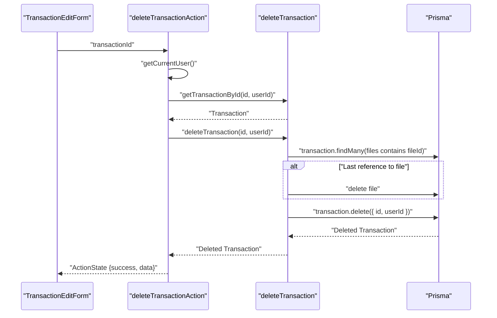

**Diagram sources**
- [components/transactions/edit.tsx:73-80](file://components/transactions/edit.tsx#L73-L80)
- [app/(app)/transactions/actions.ts](file://app/(app)/transactions/actions.ts#L75-L93)
- [models/transactions.ts:168-184](file://models/transactions.ts#L168-L184)

**Section sources**
- [app/(app)/transactions/actions.ts](file://app/(app)/transactions/actions.ts#L75-L93)
- [models/transactions.ts:168-184](file://models/transactions.ts#L168-L184)

### Bulk Deletion
- UI: BulkActionsMenu triggers bulkDeleteTransactionsAction with selected IDs.
- Server action: Calls bulkDeleteTransactions and revalidates cache.

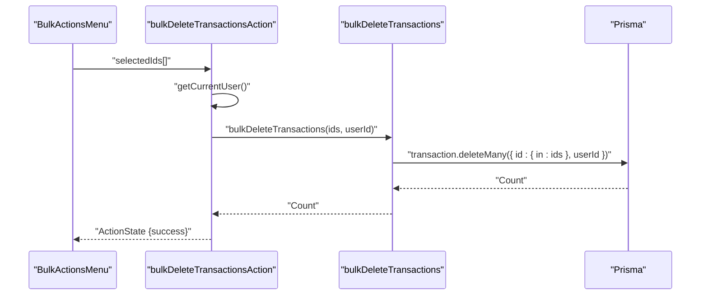

**Diagram sources**
- [components/transactions/bulk-actions.tsx:13-34](file://components/transactions/bulk-actions.tsx#L13-L34)
- [app/(app)/transactions/actions.ts](file://app/(app)/transactions/actions.ts#L205-L215)
- [models/transactions.ts:186-190](file://models/transactions.ts#L186-L190)

**Section sources**
- [components/transactions/bulk-actions.tsx:13-34](file://components/transactions/bulk-actions.tsx#L13-L34)
- [app/(app)/transactions/actions.ts](file://app/(app)/transactions/actions.ts#L205-L215)
- [models/transactions.ts:186-190](file://models/transactions.ts#L186-L190)

### File Attachment Management
- Upload: uploadTransactionFilesAction validates storage and subscription, writes files, creates file records, and appends IDs to transaction.files.
- Delete: deleteTransactionFileAction removes a file from transaction.files and deletes the file record if present.
- UI: TransactionFiles renders previews and handles drag-and-drop or input selection.

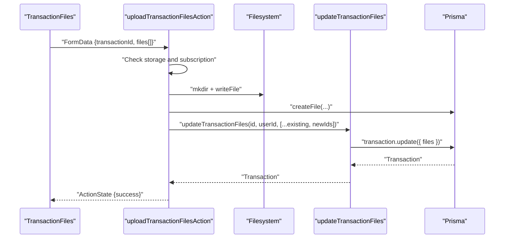

**Diagram sources**
- [components/transactions/transaction-files.tsx:19-30](file://components/transactions/transaction-files.tsx#L19-L30)
- [app/(app)/transactions/actions.ts](file://app/(app)/transactions/actions.ts#L125-L203)
- [models/transactions.ts:161-166](file://models/transactions.ts#L161-L166)

**Section sources**
- [components/transactions/transaction-files.tsx:12-30](file://components/transactions/transaction-files.tsx#L12-L30)
- [app/(app)/transactions/actions.ts](file://app/(app)/transactions/actions.ts#L125-L203)
- [models/transactions.ts:161-166](file://models/transactions.ts#L161-L166)

### AI-Extracted Data and Manual Entry
- AI extraction: analyzeTransaction requests LLM, stores parsed result in file metadata, and returns ActionState.
- Dynamic schema: fieldsToJsonSchema builds a JSON schema from user-defined fields with LLM prompts, enabling structured extraction including items.
- Manual entry: TransactionCreateForm and TransactionEditForm collect standard and extra fields via form controls.

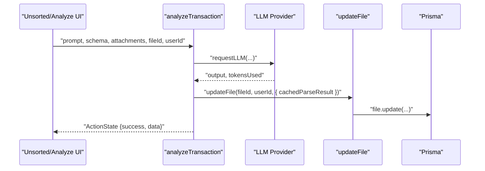

**Diagram sources**
- [ai/analyze.ts:14-57](file://ai/analyze.ts#L14-L57)
- [ai/schema.ts:3-34](file://ai/schema.ts#L3-L34)
- [app/(app)/transactions/actions.ts](file://app/(app)/transactions/actions.ts#L41-L42)

**Section sources**
- [ai/analyze.ts:14-57](file://ai/analyze.ts#L14-L57)
- [ai/schema.ts:3-34](file://ai/schema.ts#L3-L34)
- [components/transactions/create.tsx:18-50](file://components/transactions/create.tsx#L18-L50)
- [components/transactions/edit.tsx:20-61](file://components/transactions/edit.tsx#L20-L61)

### Transaction Retrieval Methods
- getTransactionById: Fetches a single transaction with category and project included.
- getTransactionsByFileId: Lists all transactions referencing a given file ID.
- getTransactions: Paginated listing with flexible filters and ordering.

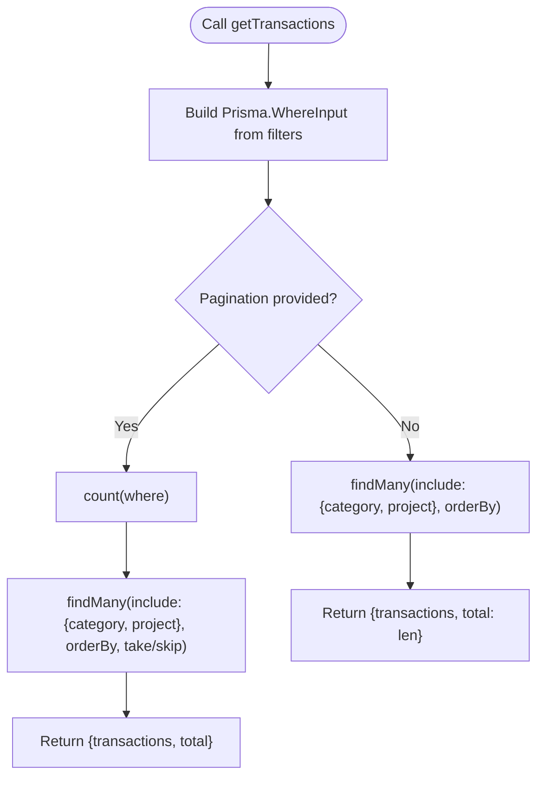

**Diagram sources**
- [models/transactions.ts:43-117](file://models/transactions.ts#L43-L117)

**Section sources**
- [models/transactions.ts:119-133](file://models/transactions.ts#L119-L133)
- [models/transactions.ts:43-117](file://models/transactions.ts#L43-L117)

### Splitting Standard vs Extra Fields
- splitTransactionDataExtraFields reads user fields, separates keys into standard vs extra, and returns two objects for persistence.
- Extra fields are stored under the extra JSONB column; standard fields map to dedicated columns.

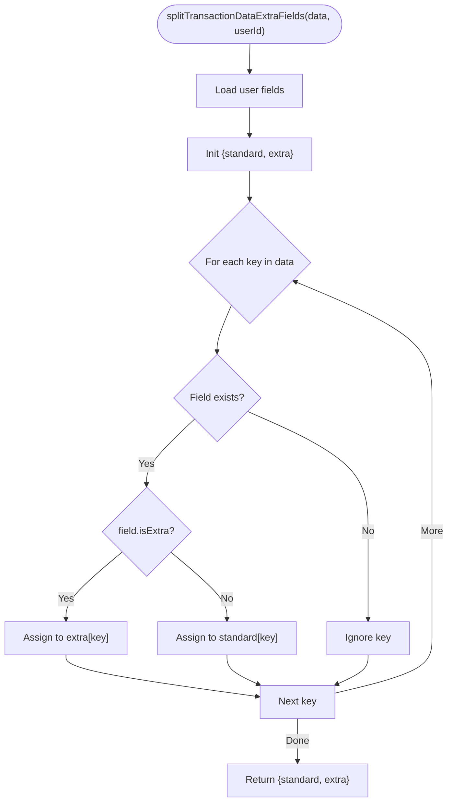

**Diagram sources**
- [models/transactions.ts:192-220](file://models/transactions.ts#L192-L220)

**Section sources**
- [models/transactions.ts:192-220](file://models/transactions.ts#L192-L220)

### Transaction State Management and UI Integration
- ActionState: All actions return ActionState with success/error/data to drive UI feedback.
- Forms: useActionState integrates server actions with React state, updating router on success.
- Lists: TransactionList renders standard and extra fields, supports sorting and bulk actions.
- Filters: useTransactionFilters synchronizes URL query parameters with filters and ordering.

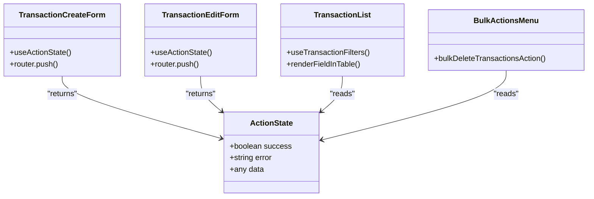

**Diagram sources**
- [lib/actions.ts:1-6](file://lib/actions.ts#L1-L6)
- [components/transactions/create.tsx:30-50](file://components/transactions/create.tsx#L30-L50)
- [components/transactions/edit.tsx:36-86](file://components/transactions/edit.tsx#L36-L86)
- [components/transactions/list.tsx:184-264](file://components/transactions/list.tsx#L184-L264)
- [components/transactions/bulk-actions.tsx:13-34](file://components/transactions/bulk-actions.tsx#L13-L34)

**Section sources**
- [lib/actions.ts:1-6](file://lib/actions.ts#L1-L6)
- [components/transactions/create.tsx:30-50](file://components/transactions/create.tsx#L30-L50)
- [components/transactions/edit.tsx:36-86](file://components/transactions/edit.tsx#L36-L86)
- [components/transactions/list.tsx:184-264](file://components/transactions/list.tsx#L184-L264)
- [components/transactions/bulk-actions.tsx:13-34](file://components/transactions/bulk-actions.tsx#L13-L34)

## Dependency Analysis
- UI components depend on server actions for mutations and on hooks for filtering.
- Server actions depend on model functions and Prisma for persistence.
- Model functions depend on field definitions to split standard vs extra fields.
- File operations depend on filesystem utilities and Prisma file records.

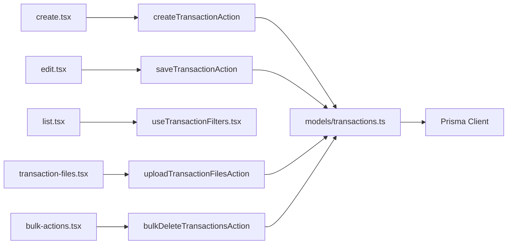

**Diagram sources**
- [components/transactions/create.tsx:30-50](file://components/transactions/create.tsx#L30-L50)
- [components/transactions/edit.tsx:36-86](file://components/transactions/edit.tsx#L36-L86)
- [components/transactions/list.tsx:184-264](file://components/transactions/list.tsx#L184-L264)
- [components/transactions/transaction-files.tsx:19-30](file://components/transactions/transaction-files.tsx#L19-L30)
- [components/transactions/bulk-actions.tsx:13-34](file://components/transactions/bulk-actions.tsx#L13-L34)
- [app/(app)/transactions/actions.ts](file://app/(app)/transactions/actions.ts#L30-L215)
- [models/transactions.ts:135-221](file://models/transactions.ts#L135-L221)

**Section sources**
- [app/(app)/transactions/actions.ts](file://app/(app)/transactions/actions.ts#L1-L29)
- [models/transactions.ts:1-6](file://models/transactions.ts#L1-L6)

## Performance Considerations
- Caching: getTransactions uses React cache to avoid redundant queries.
- Pagination: getTransactions supports take/skip to limit result sets.
- Sorting: orderBy is applied per field; ensure appropriate indexes on frequently sorted columns.
- File storage: batch writes and revalidation occur after file operations to minimize repeated cache invalidations.
- Extra fields: storing arbitrary fields in JSONB is flexible but can increase payload sizes; consider indexing strategies if querying extra fields frequently.

[No sources needed since this section provides general guidance]

## Troubleshooting Guide
Common issues and resolutions:
- Validation errors: transactionFormSchema errors are returned as ActionState.error; surface messages in UI via FormError.
- Ownership failures: actions require current user and match userId; ensure authentication is active.
- Storage limits: uploadTransactionFilesAction checks quota; handle insufficient storage errors gracefully.
- Subscription expiry: uploadTransactionFilesAction checks subscription status; prompt users to upgrade if needed.
- File deletion: deleteTransactionFileAction removes file records and updates storage used; ensure file IDs are valid.
- Bulk deletion: confirm dialog prevents accidental deletions; verify selected IDs exist and belong to the user.

**Section sources**
- [app/(app)/transactions/actions.ts](file://app/(app)/transactions/actions.ts#L36-L49)
- [app/(app)/transactions/actions.ts](file://app/(app)/transactions/actions.ts#L142-L153)
- [components/transactions/bulk-actions.tsx:16-34](file://components/transactions/bulk-actions.tsx#L16-L34)
- [components/transactions/transaction-files.tsx:15-30](file://components/transactions/transaction-files.tsx#L15-L30)

## Conclusion
TaxHacker’s transaction CRUD is built around a robust separation of concerns: UI forms trigger server actions, which validate and delegate to model functions. The model layer enforces ownership, splits standard and extra fields, and manages file attachments. Filtering, sorting, and bulk operations are integrated into the UI for efficient management. AI extraction complements manual entry by providing structured data that maps cleanly into the same transaction model.