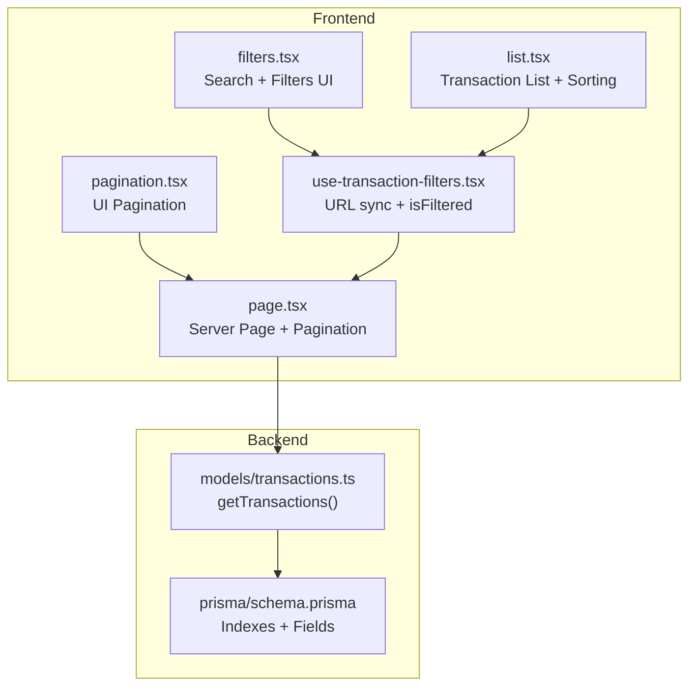
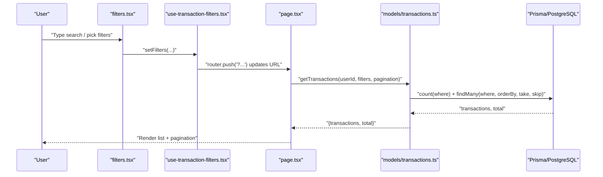
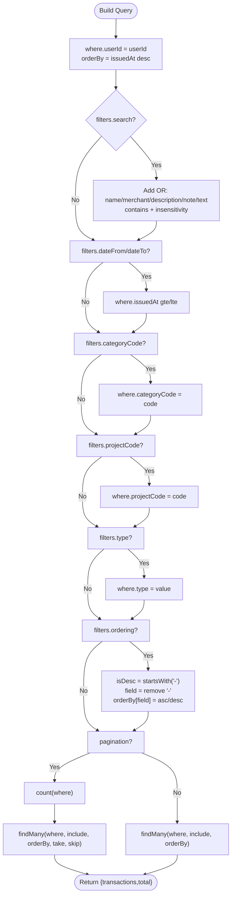
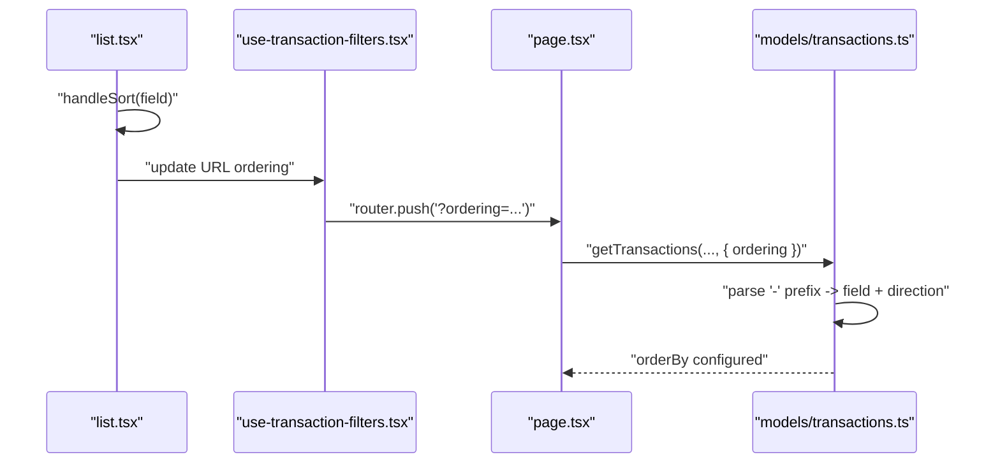
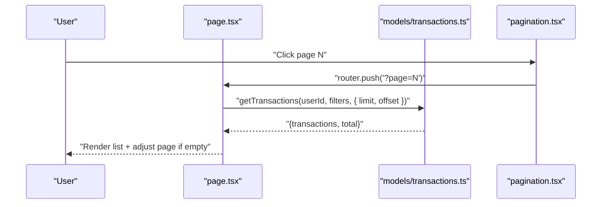
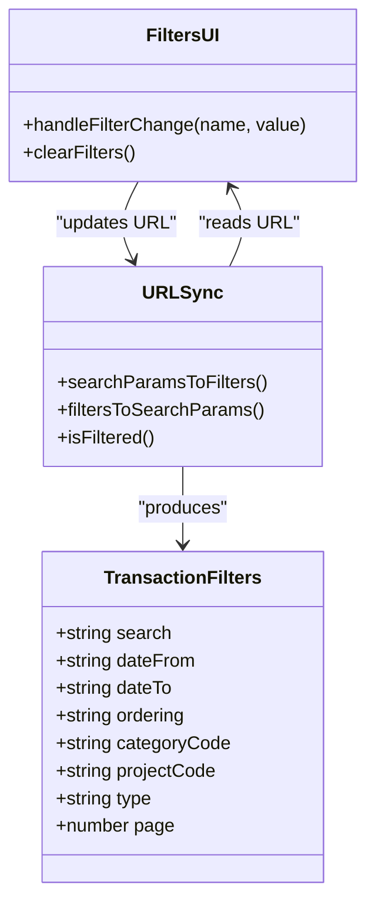
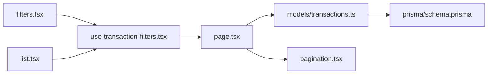

# Filtering and Search

<cite>
**Referenced Files in This Document**
- [models/transactions.ts](file://models/transactions.ts)
- [hooks/use-transaction-filters.tsx](file://hooks/use-transaction-filters.tsx)
- [components/transactions/filters.tsx](file://components/transactions/filters.tsx)
- [components/transactions/list.tsx](file://components/transactions/list.tsx)
- [components/transactions/pagination.tsx](file://components/transactions/pagination.tsx)
- [app/(app)/transactions/page.tsx](file://app/(app)/transactions/page.tsx)
- [prisma/schema.prisma](file://prisma/schema.prisma)
</cite>

## Table of Contents
1. [Introduction](#introduction)
2. [Project Structure](#project-structure)
3. [Core Components](#core-components)
4. [Architecture Overview](#architecture-overview)
5. [Detailed Component Analysis](#detailed-component-analysis)
6. [Dependency Analysis](#dependency-analysis)
7. [Performance Considerations](#performance-considerations)
8. [Troubleshooting Guide](#troubleshooting-guide)
9. [Conclusion](#conclusion)

## Introduction
This document explains the transaction filtering and search capabilities in TaxHacker. It covers the TransactionFilters interface, dynamic query construction in the backend, multi-field search behavior, ordering semantics, pagination, and the integration with frontend filter and list components. It also includes examples of complex filter combinations and practical guidance for performance with large datasets.

## Project Structure
The filtering pipeline spans frontend components and hooks that manage URL state, a server action page that orchestrates pagination and passes filters to the backend, and a backend model that builds Prisma queries dynamically from filter inputs.

**Diagram sources**
- [components/transactions/filters.tsx:1-113](file://components/transactions/filters.tsx#L1-L113)
- [hooks/use-transaction-filters.tsx:1-91](file://hooks/use-transaction-filters.tsx#L1-L91)
- [components/transactions/list.tsx:1-344](file://components/transactions/list.tsx#L1-L344)
- [components/transactions/pagination.tsx:1-115](file://components/transactions/pagination.tsx#L1-L115)
- [app/(app)/transactions/page.tsx:1-87](file://app/(app)/transactions/page.tsx#L1-L87)
- [models/transactions.ts:1-221](file://models/transactions.ts#L1-L221)
- [prisma/schema.prisma:170-203](file://prisma/schema.prisma#L170-L203)

**Section sources**
- [components/transactions/filters.tsx:1-113](file://components/transactions/filters.tsx#L1-L113)
- [hooks/use-transaction-filters.tsx:1-91](file://hooks/use-transaction-filters.tsx#L1-L91)
- [components/transactions/list.tsx:1-344](file://components/transactions/list.tsx#L1-L344)
- [components/transactions/pagination.tsx:1-115](file://components/transactions/pagination.tsx#L1-L115)
- [app/(app)/transactions/page.tsx:1-87](file://app/(app)/transactions/page.tsx#L1-L87)
- [models/transactions.ts:1-221](file://models/transactions.ts#L1-L221)
- [prisma/schema.prisma:170-203](file://prisma/schema.prisma#L170-L203)

## Core Components
- TransactionFilters interface: search, dateFrom, dateTo, ordering, categoryCode, projectCode, type, page.
- Dynamic query builder: getTransactions() composes Prisma.WhereInput and orderBy based on filters.
- Multi-field search: case-insensitive substring match across name, merchant, description, note, text.
- Ordering: single-field sort with optional "-" prefix for descending; frontend toggles direction and updates URL.
- Pagination: server-side pagination via limit/offset; frontend pagination UI updates URL page param.

**Section sources**
- [models/transactions.ts:27-41](file://models/transactions.ts#L27-L41)
- [models/transactions.ts:43-117](file://models/transactions.ts#L43-L117)
- [hooks/use-transaction-filters.tsx:6-26](file://hooks/use-transaction-filters.tsx#L6-L26)
- [components/transactions/list.tsx:189-264](file://components/transactions/list.tsx#L189-L264)
- [app/(app)/transactions/page.tsx:22-30](file://app/(app)/transactions/page.tsx#L22-L30)

## Architecture Overview
The filtering and search pipeline integrates frontend state, URL synchronization, server rendering, and backend query building.

**Diagram sources**
- [components/transactions/filters.tsx:24-29](file://components/transactions/filters.tsx#L24-L29)
- [hooks/use-transaction-filters.tsx:16-19](file://hooks/use-transaction-filters.tsx#L16-L19)
- [app/(app)/transactions/page.tsx:24-30](file://app/(app)/transactions/page.tsx#L24-L30)
- [models/transactions.ts:43-117](file://models/transactions.ts#L43-L117)

## Detailed Component Analysis

### TransactionFilters Interface and Dynamic Query Building
- Interface fields:
  - search: multi-field substring match (case-insensitive).
  - dateFrom/dateTo: issuedAt range.
  - categoryCode: category filter.
  - projectCode: project filter.
  - type: transaction type filter.
  - ordering: single-field sort with optional "-" prefix for descending.
  - page: pagination page (used to compute offset).
- Dynamic query construction:
  - Base where clause includes userId.
  - OR conditions for multi-field search across name, merchant, description, note, text.
  - issuedAt range via gte/lte.
  - Equality filters for categoryCode, projectCode, type.
  - orderBy derived from ordering with "-" indicating descending.
  - count + findMany with include for category/project; pagination via take/skip.

**Diagram sources**
- [models/transactions.ts:52-117](file://models/transactions.ts#L52-L117)

**Section sources**
- [models/transactions.ts:27-41](file://models/transactions.ts#L27-L41)
- [models/transactions.ts:55-90](file://models/transactions.ts#L55-L90)
- [models/transactions.ts:92-116](file://models/transactions.ts#L92-L116)

### Multi-Field Search Behavior
- Case-insensitive substring matching across five fields: name, merchant, description, note, text.
- Implemented as an OR condition so any match satisfies the filter.
- Useful for fuzzy discovery across textual content of transactions.

**Section sources**
- [models/transactions.ts:56-63](file://models/transactions.ts#L56-L63)

### Ordering System
- Single-field ordering with optional "-" prefix for descending.
- Frontend list component reads URL ordering, supports toggling direction, and writes back to URL.
- Backend respects the "-" prefix to set Prisma orderBy direction.

**Diagram sources**
- [components/transactions/list.tsx:231-264](file://components/transactions/list.tsx#L231-L264)
- [hooks/use-transaction-filters.tsx:35-86](file://hooks/use-transaction-filters.tsx#L35-L86)
- [models/transactions.ts:85-89](file://models/transactions.ts#L85-L89)

**Section sources**
- [components/transactions/list.tsx:189-264](file://components/transactions/list.tsx#L189-L264)
- [hooks/use-transaction-filters.tsx:67-71](file://hooks/use-transaction-filters.tsx#L67-L71)
- [models/transactions.ts:85-89](file://models/transactions.ts#L85-L89)

### Pagination and Page Parameter
- Server page.tsx extracts page from URL searchParams and computes offset as (page - 1) × limit.
- Default page size is 500; pagination UI renders only when total > limit.
- If a non-first page yields zero results, the server redirects to the same filters without the page parameter to reset to the first page.

**Diagram sources**
- [app/(app)/transactions/page.tsx:24-39](file://app/(app)/transactions/page.tsx#L24-L39)
- [components/transactions/pagination.tsx:18-25](file://components/transactions/pagination.tsx#L18-L25)
- [models/transactions.ts:92-116](file://models/transactions.ts#L92-L116)

**Section sources**
- [app/(app)/transactions/page.tsx:22-39](file://app/(app)/transactions/page.tsx#L22-L39)
- [components/transactions/pagination.tsx:14-73](file://components/transactions/pagination.tsx#L14-L73)
- [models/transactions.ts:92-116](file://models/transactions.ts#L92-L116)

### Frontend Filter Components and URL Integration
- filters.tsx provides:
  - Text search input with Enter-triggered update.
  - Category and Project selects with special "-" value representing "All".
  - DateRangePicker binding dateFrom/dateTo.
  - Clear filters button using isFiltered().
- use-transaction-filters.tsx:
  - Synchronizes filters to/from URL searchParams.
  - Converts dates to yyyy-MM-dd strings.
  - Exposes isFiltered() to show clear button when active.

**Diagram sources**
- [models/transactions.ts:27-36](file://models/transactions.ts#L27-L36)
- [components/transactions/filters.tsx:24-106](file://components/transactions/filters.tsx#L24-L106)
- [hooks/use-transaction-filters.tsx:28-90](file://hooks/use-transaction-filters.tsx#L28-L90)

**Section sources**
- [components/transactions/filters.tsx:13-113](file://components/transactions/filters.tsx#L13-L113)
- [hooks/use-transaction-filters.tsx:28-90](file://hooks/use-transaction-filters.tsx#L28-L90)

## Dependency Analysis
- Frontend depends on URL state to persist filters and ordering.
- Server page.tsx depends on models/transactions.ts to fetch paginated results.
- models/transactions.ts depends on Prisma schema indexes for efficient filtering and sorting.
- No circular dependencies observed among these components.

**Diagram sources**
- [components/transactions/filters.tsx:1-113](file://components/transactions/filters.tsx#L1-L113)
- [hooks/use-transaction-filters.tsx:1-91](file://hooks/use-transaction-filters.tsx#L1-L91)
- [app/(app)/transactions/page.tsx:1-87](file://app/(app)/transactions/page.tsx#L1-L87)
- [models/transactions.ts:1-221](file://models/transactions.ts#L1-L221)
- [prisma/schema.prisma:170-203](file://prisma/schema.prisma#L170-L203)
- [components/transactions/list.tsx:1-344](file://components/transactions/list.tsx#L1-L344)
- [components/transactions/pagination.tsx:1-115](file://components/transactions/pagination.tsx#L1-L115)

**Section sources**
- [components/transactions/filters.tsx:1-113](file://components/transactions/filters.tsx#L1-L113)
- [hooks/use-transaction-filters.tsx:1-91](file://hooks/use-transaction-filters.tsx#L1-L91)
- [app/(app)/transactions/page.tsx:1-87](file://app/(app)/transactions/page.tsx#L1-L87)
- [models/transactions.ts:1-221](file://models/transactions.ts#L1-L221)
- [prisma/schema.prisma:170-203](file://prisma/schema.prisma#L170-L203)
- [components/transactions/list.tsx:1-344](file://components/transactions/list.tsx#L1-L344)
- [components/transactions/pagination.tsx:1-115](file://components/transactions/pagination.tsx#L1-L115)

## Performance Considerations
- Indexes: The Prisma schema defines multiple indexes on frequently filtered/sorted fields (userId, projectCode, categoryCode, issuedAt, name, merchant, total). These support efficient filtering and sorting.
- Multi-field search: The OR across five text fields can be expensive on large datasets. Consider:
  - Adding database full-text indexes if supported by your PostgreSQL version.
  - Limiting search scope by combining with date/category/project filters.
  - Using prefix-only searches or word-boundary matching if feasible.
- Pagination: Server-side pagination with take/skip prevents loading entire tables. Keep page sizes reasonable (currently 500).
- Ordering: Single-field ordering avoids complex joins; ensure the chosen field is indexed (issuedAt is indexed).
- Caching: getTransactions() uses React caching; repeated identical queries avoid DB round-trips.

**Section sources**
- [prisma/schema.prisma:195-202](file://prisma/schema.prisma#L195-L202)
- [models/transactions.ts:43-117](file://models/transactions.ts#L43-L117)
- [app/(app)/transactions/page.tsx:22-30](file://app/(app)/transactions/page.tsx#L22-L30)

## Troubleshooting Guide
- Filters not applying:
  - Verify URL contains expected keys (search, dateFrom, dateTo, ordering, categoryCode, projectCode).
  - Confirm use-transaction-filters.tsx is updating URL on change.
- Empty results:
  - If a non-first page yields zero results, the server redirects to the same filters without the page parameter. Check that the redirect logic runs.
- Ordering icon not visible:
  - Ensure the clicked column is sortable and matches the ordering field.
- Pagination links not changing:
  - Confirm pagination.tsx reads page from URL and updates URL on click.
- Multi-field search too broad:
  - Combine with categoryCode, projectCode, or date range to narrow results.

**Section sources**
- [hooks/use-transaction-filters.tsx:16-23](file://hooks/use-transaction-filters.tsx#L16-L23)
- [app/(app)/transactions/page.tsx:35-39](file://app/(app)/transactions/page.tsx#L35-L39)
- [components/transactions/list.tsx:266-273](file://components/transactions/list.tsx#L266-L273)
- [components/transactions/pagination.tsx:19-25](file://components/transactions/pagination.tsx#L19-L25)

## Conclusion
TaxHacker’s filtering and search system combines a concise TransactionFilters interface with a robust dynamic query builder, multi-field case-insensitive search, single-field ordering with URL persistence, and server-side pagination. The frontend components keep filters and ordering synchronized with the URL, while the backend leverages Prisma indexes for efficient retrieval. For large datasets, combine filters, limit search scope, and monitor query plans to maintain responsiveness.