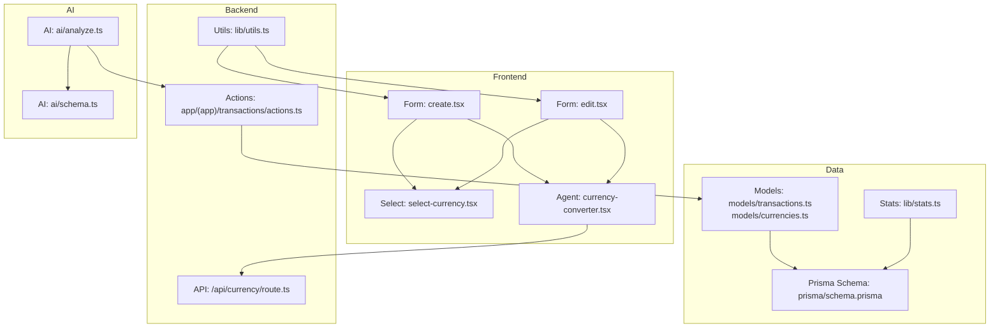
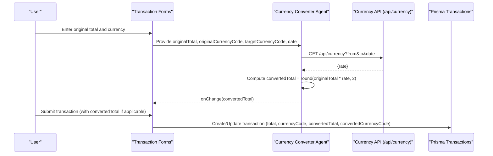
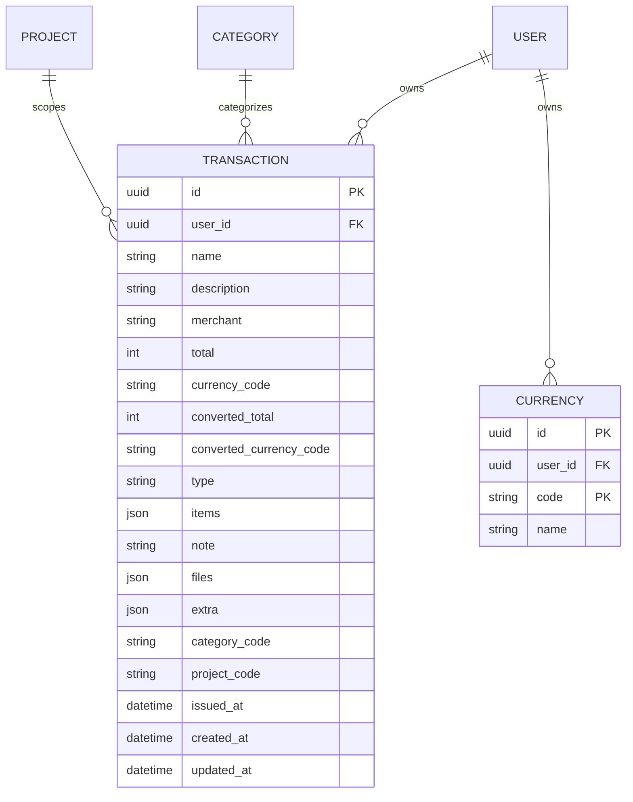
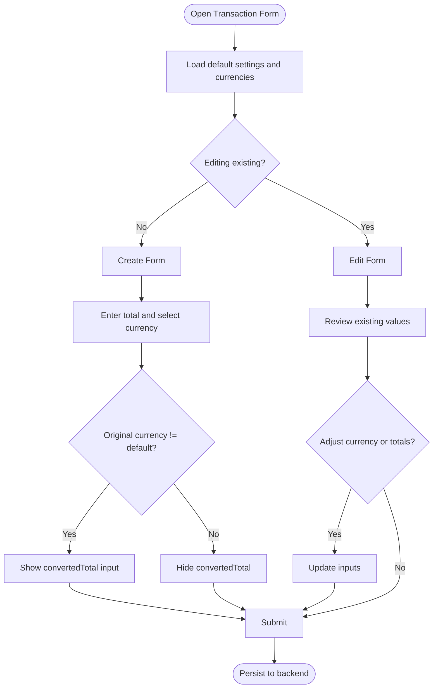
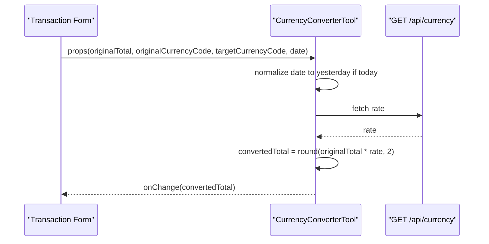
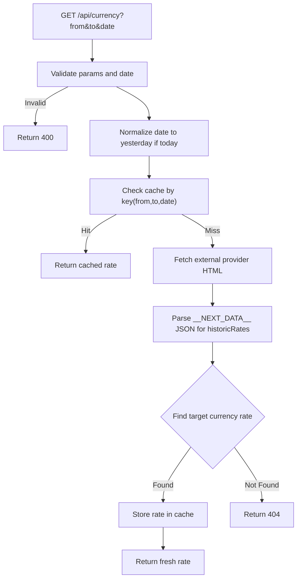
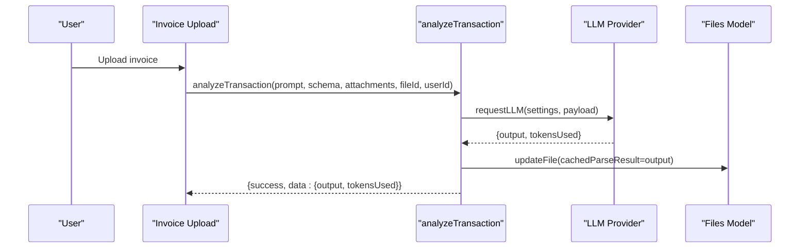
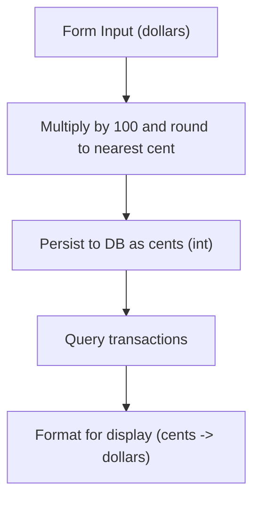
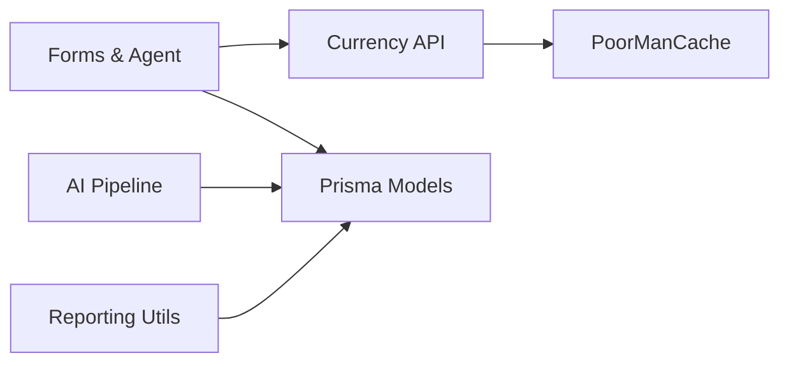

# Multi-Currency Support

<cite>
**Referenced Files in This Document**
- [transactions.ts](file://models/transactions.ts)
- [currencies.ts](file://models/currencies.ts)
- [currency-converter.tsx](file://components/agents/currency-converter.tsx)
- [select-currency.tsx](file://components/forms/select-currency.tsx)
- [route.ts](file://app/api/currency/route.ts)
- [analyze.ts](file://ai/analyze.ts)
- [schema.ts](file://ai/schema.ts)
- [create.tsx](file://components/transactions/create.tsx)
- [edit.tsx](file://components/transactions/edit.tsx)
- [utils.ts](file://lib/utils.ts)
- [schema.prisma](file://prisma/schema.prisma)
- [actions.ts](file://app/(app)/transactions/actions.ts)
- [transactions.ts](file://forms/transactions.ts)
- [page.tsx](file://app/(app)/settings/currencies/page.tsx)
- [global-settings-form.tsx](file://components/settings/global-settings-form.tsx)
- [stats.ts](file://lib/stats.ts)
</cite>

## Table of Contents
1. [Introduction](#introduction)
2. [Project Structure](#project-structure)
3. [Core Components](#core-components)
4. [Architecture Overview](#architecture-overview)
5. [Detailed Component Analysis](#detailed-component-analysis)
6. [Dependency Analysis](#dependency-analysis)
7. [Performance Considerations](#performance-considerations)
8. [Troubleshooting Guide](#troubleshooting-guide)
9. [Conclusion](#conclusion)
10. [Appendices](#appendices)

## Introduction
This document explains multi-currency transaction support in TaxHacker. It covers the dual currency system with original and converted amounts, automatic currency conversion during transaction processing, AI-driven extraction and conversion, manual entry workflows, real-time exchange rate integration, and reporting capabilities. It also documents currency formatting, precision handling, rounding strategies, and user interface components for currency selection.

## Project Structure
The multi-currency feature spans frontend UI components, backend APIs, database models, and AI processing layers:
- Database model defines transaction fields for original and converted amounts.
- Frontend forms collect original totals and currencies, and optionally converted totals.
- A currency conversion agent fetches historical exchange rates and updates converted values.
- An AI pipeline extracts structured data from invoices and can trigger currency conversion.
- Backend routes integrate with an external exchange rate service and cache results.
- Utilities format currency amounts for display.

**Diagram sources**
- [create.tsx:18-138](file://components/transactions/create.tsx#L18-L138)
- [edit.tsx:20-255](file://components/transactions/edit.tsx#L20-L255)
- [select-currency.tsx:5-42](file://components/forms/select-currency.tsx#L5-L42)
- [currency-converter.tsx:22-118](file://components/agents/currency-converter.tsx#L22-L118)
- [route.ts:23-103](file://app/api/currency/route.ts#L23-L103)
- [actions.ts](file://app/(app)/transactions/actions.ts#L30-L93)
- [utils.ts:12-25](file://lib/utils.ts#L12-L25)
- [schema.prisma:170-214](file://prisma/schema.prisma#L170-L214)
- [transactions.ts:135-160](file://models/transactions.ts#L135-L160)
- [currencies.ts:5-39](file://models/currencies.ts#L5-L39)
- [stats.ts:3-34](file://lib/stats.ts#L3-L34)
- [analyze.ts:14-57](file://ai/analyze.ts#L14-L57)
- [schema.ts:3-35](file://ai/schema.ts#L3-L35)

**Section sources**
- [schema.prisma:170-214](file://prisma/schema.prisma#L170-L214)
- [create.tsx:18-138](file://components/transactions/create.tsx#L18-L138)
- [edit.tsx:20-255](file://components/transactions/edit.tsx#L20-L255)
- [currency-converter.tsx:22-118](file://components/agents/currency-converter.tsx#L22-L118)
- [route.ts:23-103](file://app/api/currency/route.ts#L23-L103)
- [actions.ts](file://app/(app)/transactions/actions.ts#L30-L93)
- [utils.ts:12-25](file://lib/utils.ts#L12-L25)
- [transactions.ts:135-160](file://models/transactions.ts#L135-L160)
- [currencies.ts:5-39](file://models/currencies.ts#L5-L39)
- [stats.ts:3-34](file://lib/stats.ts#L3-L34)
- [analyze.ts:14-57](file://ai/analyze.ts#L14-L57)
- [schema.ts:3-35](file://ai/schema.ts#L3-L35)

## Core Components
- Dual currency fields in the transaction model:
  - Original amount and currency: total (stored in cents) and currencyCode.
  - Converted amount and currency: convertedTotal (stored in cents) and convertedCurrencyCode.
- Frontend forms:
  - Transaction creation and editing forms capture original total, currency, optional converted total, and target currency.
  - Currency selection component renders selectable currencies with code/name badges.
- Currency conversion agent:
  - Fetches historical exchange rates from the backend API and computes convertedTotal with rounding.
- Backend currency API:
  - Validates parameters, normalizes date to prior day if today, scrapes exchange rates, caches results, and returns the requested rate.
- AI processing:
  - Extracts structured transaction data from invoices and can be combined with currency conversion logic.
- Utilities:
  - Currency formatting for display with locale-aware formatting and fallback behavior.

**Section sources**
- [schema.prisma:170-214](file://prisma/schema.prisma#L170-L214)
- [create.tsx:31-89](file://components/transactions/create.tsx#L31-L89)
- [edit.tsx:40-177](file://components/transactions/edit.tsx#L40-L177)
- [select-currency.tsx:5-42](file://components/forms/select-currency.tsx#L5-L42)
- [currency-converter.tsx:22-118](file://components/agents/currency-converter.tsx#L22-L118)
- [route.ts:23-103](file://app/api/currency/route.ts#L23-L103)
- [utils.ts:12-25](file://lib/utils.ts#L12-L25)
- [transactions.ts:135-160](file://models/transactions.ts#L135-L160)
- [analyze.ts:14-57](file://ai/analyze.ts#L14-L57)

## Architecture Overview
The multi-currency flow integrates user input, AI extraction, and real-time exchange rate retrieval to produce a dual-currency transaction record.

**Diagram sources**
- [currency-converter.tsx:8-20](file://components/agents/currency-converter.tsx#L8-L20)
- [route.ts:23-103](file://app/api/currency/route.ts#L23-L103)
- [create.tsx:31-89](file://components/transactions/create.tsx#L31-L89)
- [edit.tsx:40-177](file://components/transactions/edit.tsx#L40-L177)
- [schema.prisma:170-214](file://prisma/schema.prisma#L170-L214)

## Detailed Component Analysis

### Database Model: Transactions and Currencies
- Transaction fields:
  - total: integer representing cents to avoid floating-point errors.
  - currencyCode: ISO-style code for the original transaction amount.
  - convertedTotal: integer representing cents in the default currency.
  - convertedCurrencyCode: ISO-style code for the converted amount.
- Currency entity:
  - Stores user-specific currency definitions with unique code per user.

**Diagram sources**
- [schema.prisma:170-214](file://prisma/schema.prisma#L170-L214)

**Section sources**
- [schema.prisma:170-214](file://prisma/schema.prisma#L170-L214)

### Frontend Forms: Manual Entry Workflows
- TransactionCreateForm:
  - Collects name, merchant, description, total, currencyCode, type, categoryCode, projectCode, issuedAt, note.
  - Shows convertedTotal input only when the selected currency differs from the default currency.
- TransactionEditForm:
  - Loads existing values, supports editing total, currencyCode, convertedTotal, convertedCurrencyCode, and dates.
  - Conditionally renders convertedTotal and convertedCurrencyCode controls based on default currency and existing values.

**Diagram sources**
- [create.tsx:31-89](file://components/transactions/create.tsx#L31-L89)
- [edit.tsx:40-177](file://components/transactions/edit.tsx#L40-L177)

**Section sources**
- [create.tsx:31-89](file://components/transactions/create.tsx#L31-L89)
- [edit.tsx:40-177](file://components/transactions/edit.tsx#L40-L177)

### Currency Conversion Agent
- Purpose: compute convertedTotal from originalTotal using a historical exchange rate and notify the parent form.
- Behavior:
  - Normalizes date to the previous day if today is requested.
  - Fetches rate from /api/currency.
  - Computes convertedTotal = round(originalTotal × rate, 2).
  - Exposes onChange callback to propagate convertedTotal to the form.
  - Provides retry and error handling.

**Diagram sources**
- [currency-converter.tsx:22-118](file://components/agents/currency-converter.tsx#L22-L118)
- [route.ts:23-103](file://app/api/currency/route.ts#L23-L103)

**Section sources**
- [currency-converter.tsx:22-118](file://components/agents/currency-converter.tsx#L22-L118)

### Currency Conversion API Integration
- Endpoint: GET /api/currency?from&to&date
- Validation:
  - Requires from, to, date parameters.
  - Rejects invalid date formats.
  - Normalizes date to yesterday if it equals today.
- Data Source:
  - Fetches historical rates from an external provider, parses embedded JSON from the page, and extracts the requested rate.
- Caching:
  - Uses an in-memory cache keyed by from,to,date with periodic cleanup.
- Response:
  - Returns { rate, cached } on success; otherwise returns error with appropriate status.

**Diagram sources**
- [route.ts:23-103](file://app/api/currency/route.ts#L23-L103)

**Section sources**
- [route.ts:23-103](file://app/api/currency/route.ts#L23-L103)

### AI Processing and Currency Extraction
- AI analyzeTransaction:
  - Requests LLM with a dynamic schema derived from user-defined fields.
  - Updates file cached parse result with extracted output.
- Schema generation:
  - Builds JSON schema for LLM prompting, including an items array for line items.
- Integration:
  - After successful AI parsing, the system can populate transaction fields and trigger currency conversion if needed.

**Diagram sources**
- [analyze.ts:14-57](file://ai/analyze.ts#L14-L57)
- [schema.ts:3-35](file://ai/schema.ts#L3-L35)

**Section sources**
- [analyze.ts:14-57](file://ai/analyze.ts#L14-L57)
- [schema.ts:3-35](file://ai/schema.ts#L3-L35)

### Data Persistence and Precision Handling
- Backend actions:
  - createTransactionAction and saveTransactionAction validate and persist transactions.
  - The transaction form schema transforms numeric inputs to cents (multiplied by 100 and rounded).
- Database storage:
  - total and convertedTotal are stored as integers (cents) to prevent precision drift.
- Currency selection:
  - FormSelectCurrency renders currency options with code and name badges.

**Diagram sources**
- [transactions.ts:9-33](file://forms/transactions.ts#L9-L33)
- [actions.ts](file://app/(app)/transactions/actions.ts#L30-L93)
- [schema.prisma:170-214](file://prisma/schema.prisma#L170-L214)
- [utils.ts:12-25](file://lib/utils.ts#L12-L25)

**Section sources**
- [transactions.ts:9-33](file://forms/transactions.ts#L9-L33)
- [actions.ts](file://app/(app)/transactions/actions.ts#L30-L93)
- [utils.ts:12-25](file://lib/utils.ts#L12-L25)

### Currency Formatting and Display
- formatCurrency:
  - Uses Intl.NumberFormat with locale-aware currency formatting.
  - Ensures two decimal places and grouping.
  - Falls back to code + amount if currency code is unsupported.

**Section sources**
- [utils.ts:12-25](file://lib/utils.ts#L12-L25)

### Multi-Currency Reporting
- calcTotalPerCurrency and calcNetTotalPerCurrency:
  - Aggregate totals by currency, preferring converted totals when available.
  - Normalize currency codes to uppercase for consistent grouping.

**Section sources**
- [stats.ts:3-34](file://lib/stats.ts#L3-L34)

## Dependency Analysis
- Frontend depends on:
  - Currency conversion agent for computed convertedTotal.
  - Currency API for historical rates.
  - Form components for user input.
- Backend depends on:
  - Currency API for exchange rates.
  - Prisma models for persistence.
  - Cache utility for rate caching.
- AI pipeline depends on:
  - Dynamic schema generation and LLM provider integration.

**Diagram sources**
- [currency-converter.tsx:22-118](file://components/agents/currency-converter.tsx#L22-L118)
- [route.ts:23-103](file://app/api/currency/route.ts#L23-L103)
- [schema.prisma:170-214](file://prisma/schema.prisma#L170-L214)
- [stats.ts:3-34](file://lib/stats.ts#L3-L34)

**Section sources**
- [currency-converter.tsx:22-118](file://components/agents/currency-converter.tsx#L22-L118)
- [route.ts:23-103](file://app/api/currency/route.ts#L23-L103)
- [schema.prisma:170-214](file://prisma/schema.prisma#L170-L214)
- [stats.ts:3-34](file://lib/stats.ts#L3-L34)

## Performance Considerations
- Exchange rate caching:
  - 24-hour TTL reduces external API calls and latency.
  - Periodic cleanup prevents memory growth.
- Integer storage:
  - Storing amounts as cents avoids floating-point precision issues and simplifies comparisons.
- Conditional rendering:
  - Converted inputs appear only when needed, reducing DOM overhead.
- Rounding strategy:
  - Round to two decimals after multiplication to minimize cumulative error.

[No sources needed since this section provides general guidance]

## Troubleshooting Guide
- Currency API errors:
  - Missing parameters or invalid date cause 400/404 responses.
  - Network failures or missing embedded JSON lead to 500 errors.
  - The agent displays errors and offers retry.
- Conversion agent issues:
  - If from/to/date are missing or equal, the agent hides itself.
  - Converted total remains zero until a valid rate is fetched.
- Display anomalies:
  - Unsupported currency codes fall back to code + amount formatting.
- Storage and limits:
  - File uploads check user storage capacity and subscription status before proceeding.

**Section sources**
- [route.ts:35-43](file://app/api/currency/route.ts#L35-L43)
- [route.ts:64-79](file://app/api/currency/route.ts#L64-L79)
- [currency-converter.tsx:12-20](file://components/agents/currency-converter.tsx#L12-L20)
- [utils.ts:21-24](file://lib/utils.ts#L21-L24)
- [uploadTransactionFilesAction](file://app/(app)/transactions/actions.ts#L142-L153)

## Conclusion
TaxHacker’s multi-currency support combines precise internal representation (cents), flexible user input, historical exchange rate integration, and robust formatting. The dual-currency model preserves the original transaction amount while enabling display and reporting in a user’s default currency. AI-driven extraction complements manual entry, and caching ensures efficient operation.

[No sources needed since this section summarizes without analyzing specific files]

## Appendices

### A. Example Workflows

- Manual entry with conversion:
  - User selects original currency and enters total.
  - Converted total appears; user can adjust or accept.
  - Submission persists total, currencyCode, convertedTotal, and convertedCurrencyCode.

- AI extraction with conversion:
  - User uploads invoice; AI extracts fields and items.
  - System computes convertedTotal using historical rates and stores both original and converted values.

- Historical rate lookup:
  - If today’s date is selected, the system requests yesterday’s rate automatically.

**Section sources**
- [create.tsx:31-89](file://components/transactions/create.tsx#L31-L89)
- [edit.tsx:40-177](file://components/transactions/edit.tsx#L40-L177)
- [currency-converter.tsx:35-67](file://components/agents/currency-converter.tsx#L35-L67)
- [route.ts:46-48](file://app/api/currency/route.ts#L46-L48)

### B. Currency Conversion Rate Management
- Supported currencies:
  - Users can manage custom currencies via settings.
  - Custom currencies are not auto-converted but can be used in transactions.

**Section sources**
- [page.tsx](file://app/(app)/settings/currencies/page.tsx#L6-L42)
- [currencies.ts:5-39](file://models/currencies.ts#L5-L39)

### C. Currency Formatting for International Users
- Locale-aware formatting:
  - Two decimal places and grouping separators.
  - Fallback to code + amount for unsupported currencies.

**Section sources**
- [utils.ts:12-25](file://lib/utils.ts#L12-L25)

### D. Multi-Currency Reporting Capabilities
- Aggregation:
  - Totals grouped by currency, preferring converted totals when present.
  - Net totals computed similarly.

**Section sources**
- [stats.ts:3-34](file://lib/stats.ts#L3-L34)