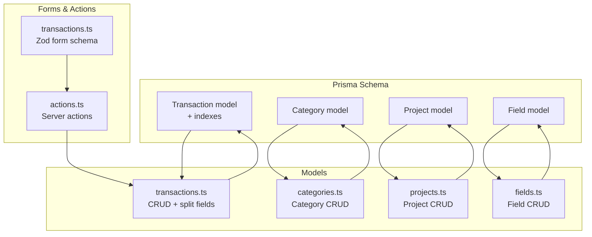
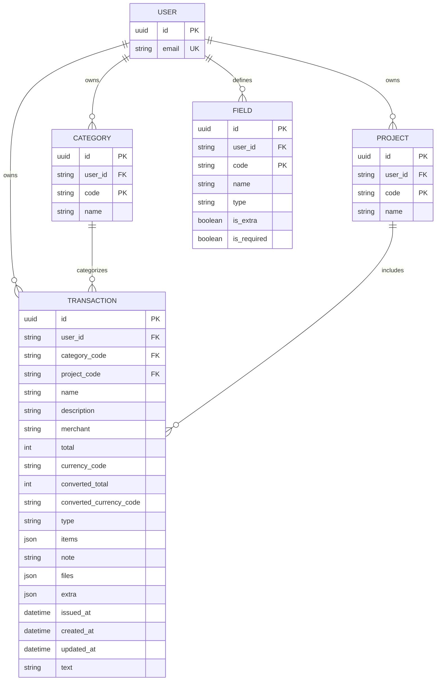
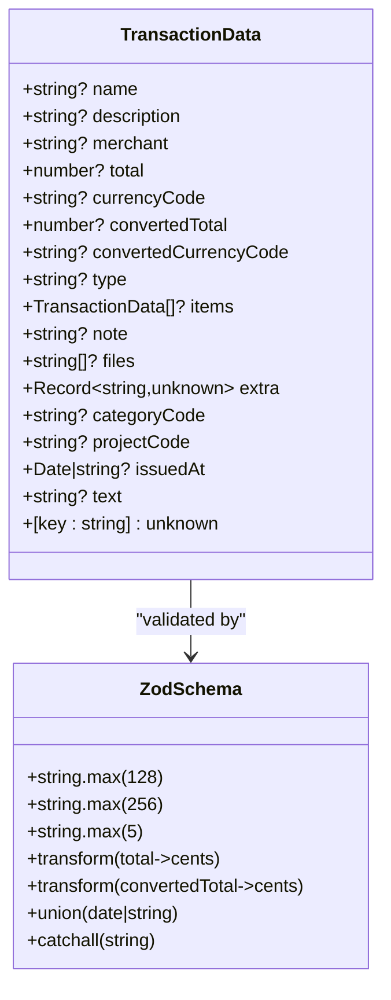
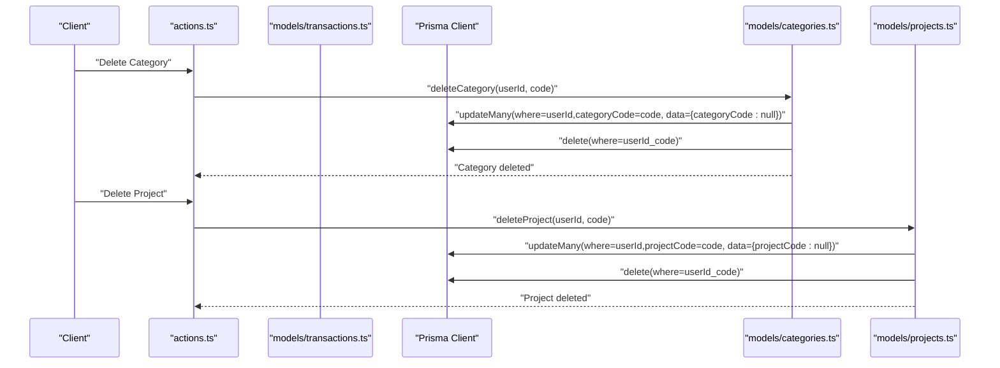
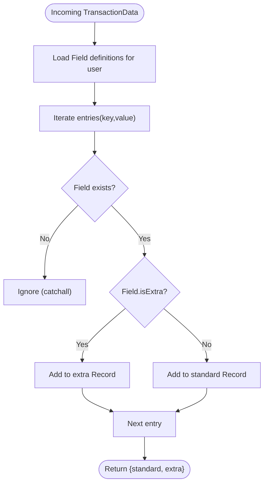
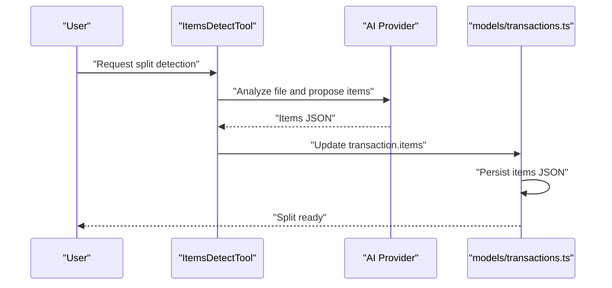
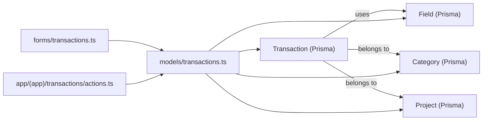

# Transaction Data Model

<cite>
**Referenced Files in This Document**
- [transactions.ts](file://models/transactions.ts)
- [schema.prisma](file://prisma/schema.prisma)
- [transactions.ts](file://forms/transactions.ts)
- [actions.ts](file://app/(app)/transactions/actions.ts)
- [fields.ts](file://models/fields.ts)
- [categories.ts](file://models/categories.ts)
- [projects.ts](file://models/projects.ts)
- [stats.ts](file://lib/stats.ts)
- [route.ts](file://app/(app)/export/transactions/route.ts)
- [migration.sql](file://prisma/migrations/20250523104130_split_tx_items/migration.sql)
</cite>

## Table of Contents
1. [Introduction](#introduction)
2. [Project Structure](#project-structure)
3. [Core Components](#core-components)
4. [Architecture Overview](#architecture-overview)
5. [Detailed Component Analysis](#detailed-component-analysis)
6. [Dependency Analysis](#dependency-analysis)
7. [Performance Considerations](#performance-considerations)
8. [Troubleshooting Guide](#troubleshooting-guide)
9. [Conclusion](#conclusion)

## Introduction
This document provides comprehensive data model documentation for the Transaction entity in TaxHacker. It covers the transaction schema, field definitions, validation rules, relationships with Category and Project entities, and the flexible extra field system. It also explains the splitTransactionDataExtraFields mechanism, indexing strategies, and the items array used for transaction splitting functionality.

## Project Structure
The Transaction data model spans several layers:
- Prisma schema defines the database model and indexes
- Models encapsulate CRUD operations and field separation logic
- Forms define validation rules for incoming data
- Actions orchestrate server-side operations
- Fields, Categories, and Projects define related entities and relationships

**Diagram sources**
- [schema.prisma:170-203](file://prisma/schema.prisma#L170-L203)
- [transactions.ts:1-221](file://models/transactions.ts#L1-L221)
- [transactions.ts:1-63](file://forms/transactions.ts#L1-L63)
- [actions.ts](file://app/(app)/transactions/actions.ts#L1-L229)
- [fields.ts:1-47](file://models/fields.ts#L1-L47)
- [categories.ts:1-63](file://models/categories.ts#L1-L63)
- [projects.ts:1-63](file://models/projects.ts#L1-L63)

**Section sources**
- [schema.prisma:170-203](file://prisma/schema.prisma#L170-L203)
- [transactions.ts:1-221](file://models/transactions.ts#L1-L221)
- [transactions.ts:1-63](file://forms/transactions.ts#L1-L63)
- [actions.ts](file://app/(app)/transactions/actions.ts#L1-L229)

## Core Components
This section documents the Transaction entity schema, relationships, and validation rules.

- Transaction schema definition
  - Fields: id, userId, name, description, merchant, total, currencyCode, convertedTotal, convertedCurrencyCode, type, items, note, files, extra, categoryCode, projectCode, issuedAt, createdAt, updatedAt, text
  - Data types: UUID id, String? name/description/merchant/currencyCode/convertedCurrencyCode/type/note/text, Int? total/convertedTotal, DateTime? issuedAt, Json items/files/extra
  - Defaults: type defaults to "expense", items defaults to empty JSON array, files defaults to empty JSON array, extra defaults to null
  - Required vs optional: All fields are nullable except type default and items default

- Relationships
  - Belongs to Category via composite foreign key (categoryCode, userId)
  - Belongs to Project via composite foreign key (projectCode, userId)

- Indexes
  - Single-column: userId, projectCode, categoryCode, issuedAt, name, merchant, total
  - Composite: (code, userId) on Category and Project for uniqueness and relation matching

- Validation rules
  - Zod schema enforces max lengths and transforms numeric fields to integer cents, validates dates, and accepts arbitrary additional fields via catchall

**Section sources**
- [schema.prisma:170-203](file://prisma/schema.prisma#L170-L203)
- [transactions.ts:1-63](file://forms/transactions.ts#L1-L63)

## Architecture Overview
The Transaction data model integrates with related entities and flexible field definitions.

**Diagram sources**
- [schema.prisma:14-203](file://prisma/schema.prisma#L14-L203)

## Detailed Component Analysis

### TransactionData Interface and Validation
- TransactionData interface supports:
  - Standard fields: name, description, merchant, total, currencyCode, convertedTotal, convertedCurrencyCode, type, note, files, categoryCode, projectCode, issuedAt, text
  - Dynamic extra fields: extra Record<string, unknown>
  - Splitting support: items TransactionData[] | undefined
  - Catchall: [key: string]: unknown
- Validation constraints:
  - String length limits enforced by Zod schema
  - Numeric fields transformed to integer cents
  - Date parsing and coercion
  - Items JSON parsing with validation

**Diagram sources**
- [transactions.ts:7-25](file://models/transactions.ts#L7-L25)
- [transactions.ts:1-63](file://forms/transactions.ts#L1-L63)

**Section sources**
- [transactions.ts:7-25](file://models/transactions.ts#L7-L25)
- [transactions.ts:1-63](file://forms/transactions.ts#L1-L63)

### Relationship with Category and Project
- Foreign keys:
  - categoryCode references Category.code with userId constraint
  - projectCode references Project.code with userId constraint
- Behavior on deletion:
  - Deleting a Category sets categoryCode to null in affected Transactions
  - Deleting a Project sets projectCode to null in affected Transactions

**Diagram sources**
- [categories.ts:48-62](file://models/categories.ts#L48-L62)
- [projects.ts:48-62](file://models/projects.ts#L48-L62)

**Section sources**
- [categories.ts:48-62](file://models/categories.ts#L48-L62)
- [projects.ts:48-62](file://models/projects.ts#L48-L62)

### Extra Field System and Dynamic Field Handling
- Field definitions:
  - Field model includes code, name, type, isExtra, isVisibleInList, isVisibleInAnalysis, isRequired
- Splitting mechanism:
  - splitTransactionDataExtraFields separates standard fields from extra fields based on Field.isExtra
  - Standard fields go to the Transaction record
  - Extra fields go to the extra JSON column
- Required field enforcement:
  - incompleteTransactionFields checks required fields against both standard and extra values
  - Values considered missing: undefined, null, empty string

**Diagram sources**
- [transactions.ts:192-220](file://models/transactions.ts#L192-L220)
- [fields.ts:10-17](file://models/fields.ts#L10-L17)
- [stats.ts:51-61](file://lib/stats.ts#L51-L61)

**Section sources**
- [transactions.ts:192-220](file://models/transactions.ts#L192-L220)
- [fields.ts:10-17](file://models/fields.ts#L10-L17)
- [stats.ts:51-61](file://lib/stats.ts#L51-L61)

### Items Array for Transaction Splitting
- Purpose: Support splitting a single transaction into multiple line items
- Storage: JSON array in the items column
- Migration: Added JSONB items column with default empty array
- UI/processing: Used by AI tools to propose splits and by components to render split items

**Diagram sources**
- [migration.sql:1-6](file://prisma/migrations/20250523104130_split_tx_items/migration.sql#L1-L6)
- [transactions.ts:135-159](file://models/transactions.ts#L135-L159)

**Section sources**
- [migration.sql:1-6](file://prisma/migrations/20250523104130_split_tx_items/migration.sql#L1-L6)
- [transactions.ts:135-159](file://models/transactions.ts#L135-L159)

### Data Integrity and Constraints
- Database constraints:
  - Unique composite keys: (userId, code) for Category and Project
  - Foreign keys: categoryCode+userId to Category(code,userId), projectCode+userId to Project(code,userId)
  - Not-null constraints on items JSONB column
- Application-level constraints:
  - Zod schema validation for input fields
  - Numeric fields normalized to integer cents
  - Optional fields handled gracefully in queries and exports

**Section sources**
- [schema.prisma:116-133](file://prisma/schema.prisma#L116-L133)
- [schema.prisma:195-202](file://prisma/schema.prisma#L195-L202)
- [transactions.ts:1-63](file://forms/transactions.ts#L1-L63)

### Export Integration with Flexible Fields
- Export process:
  - Builds CSV headers from existing Field definitions
  - Reads standard fields directly from Transaction
  - Reads extra fields from Transaction.extra JSON
  - Handles visibility and mapping via export/import settings

**Section sources**
- [route.ts](file://app/(app)/export/transactions/route.ts#L28-L58)

## Dependency Analysis
The Transaction model depends on Field definitions for flexible field handling and on Category/Project for categorization.

**Diagram sources**
- [schema.prisma:135-203](file://prisma/schema.prisma#L135-L203)
- [transactions.ts:1-221](file://models/transactions.ts#L1-L221)
- [transactions.ts:1-63](file://forms/transactions.ts#L1-L63)
- [actions.ts](file://app/(app)/transactions/actions.ts#L1-L229)

**Section sources**
- [schema.prisma:135-203](file://prisma/schema.prisma#L135-L203)
- [transactions.ts:1-221](file://models/transactions.ts#L1-L221)
- [transactions.ts:1-63](file://forms/transactions.ts#L1-L63)
- [actions.ts](file://app/(app)/transactions/actions.ts#L1-L229)

## Performance Considerations
- Index utilization:
  - Queries filter by userId, categoryCode, projectCode, issuedAt, name, merchant, total
  - Consider adding targeted indexes if specific filters become hotspots
- JSON fields:
  - extra and items are JSON; avoid selective filtering on these fields when possible
  - Prefer standard fields for frequent queries
- Pagination:
  - getTransactions supports pagination with include for related entities
  - Consider projection strategies if performance degrades with includes

## Troubleshooting Guide
- Missing or invalid numeric values:
  - Ensure totals are valid numbers; schema converts to integer cents
- Date parsing errors:
  - Provide valid date formats; schema accepts Date or parsable string
- Extra field not persisting:
  - Verify Field definitions exist and isExtra is set appropriately
  - Confirm splitTransactionDataExtraFields runs before persistence
- Incomplete transaction detection:
  - Use incompleteTransactionFields to check required fields across standard and extra
- File handling during deletion:
  - Deleting a transaction removes orphaned files; ensure file references are accurate

**Section sources**
- [transactions.ts:1-63](file://forms/transactions.ts#L1-L63)
- [transactions.ts:192-220](file://models/transactions.ts#L192-L220)
- [stats.ts:51-61](file://lib/stats.ts#L51-L61)
- [transactions.ts:168-184](file://models/transactions.ts#L168-L184)

## Conclusion
The Transaction data model in TaxHacker combines a robust relational schema with a flexible JSON-based extra field system. It supports categorization and project assignment through foreign keys, enforces validation at the form level, and leverages Prisma relations for integrity. The items array enables transaction splitting, while the splitTransactionDataExtraFields mechanism cleanly separates standard and custom attributes. Proper indexing and careful use of JSON fields will help maintain performance as the dataset grows.