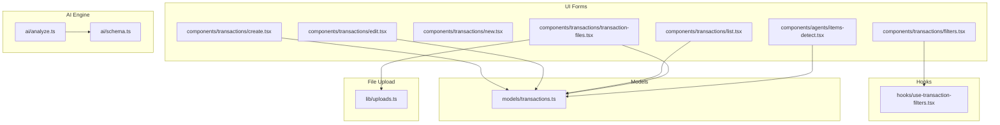
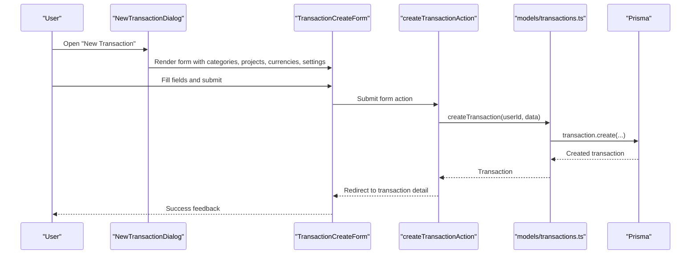
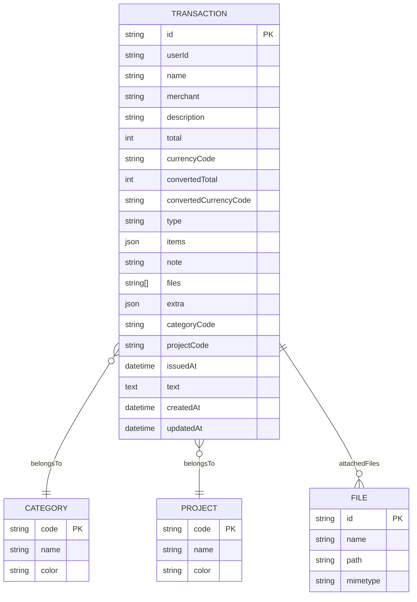
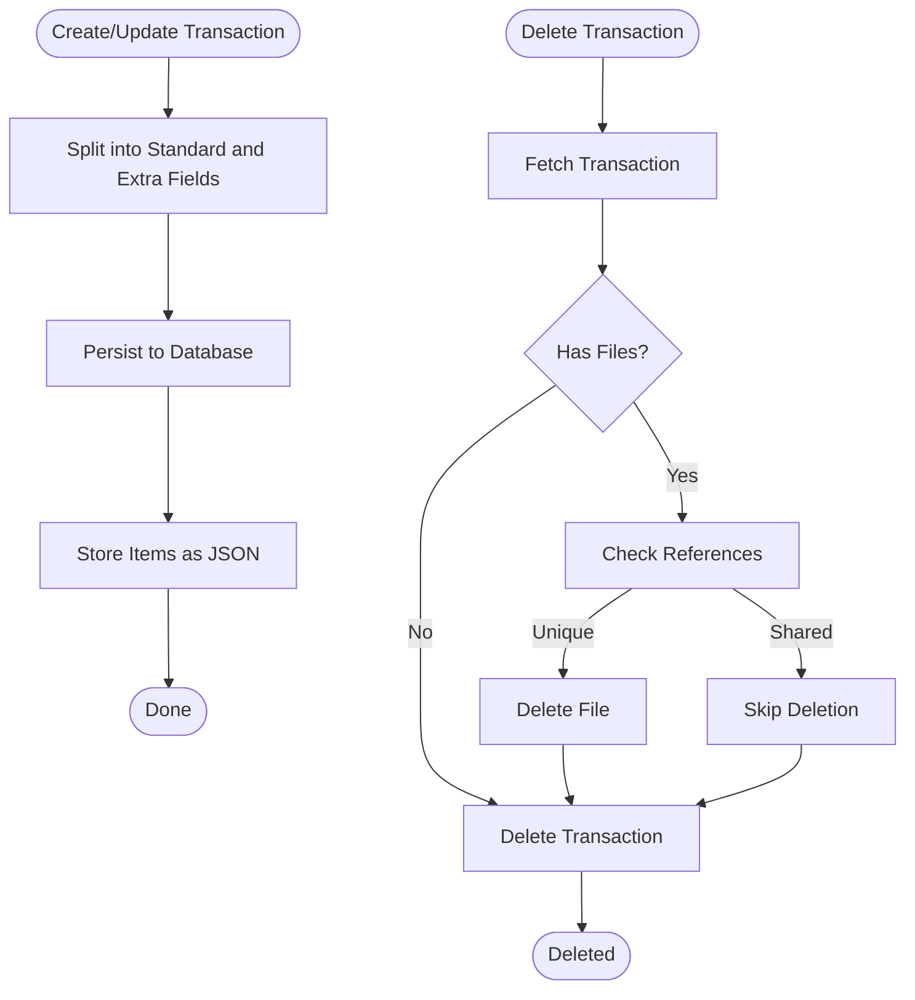
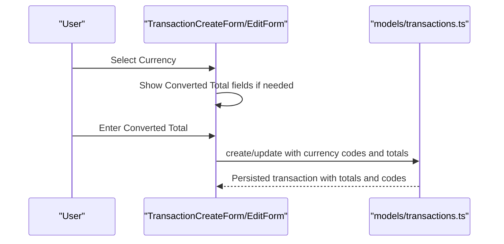
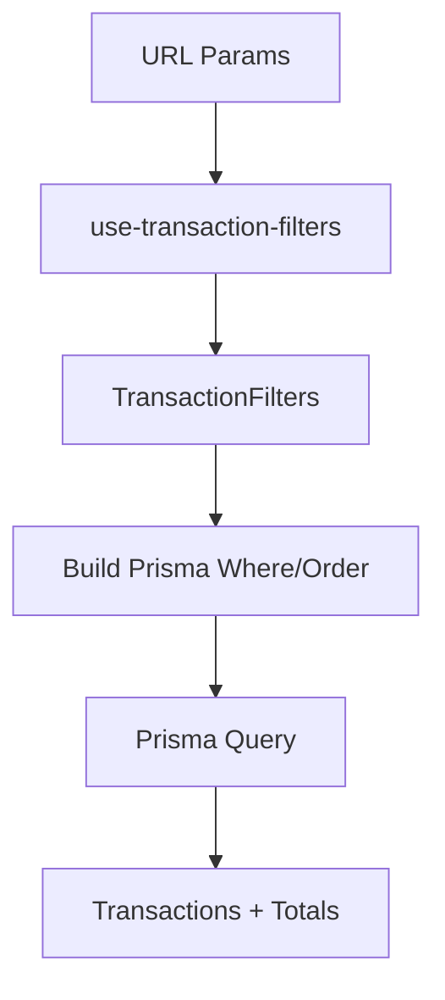
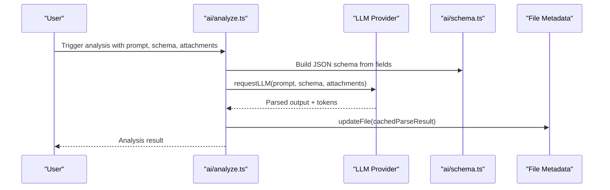
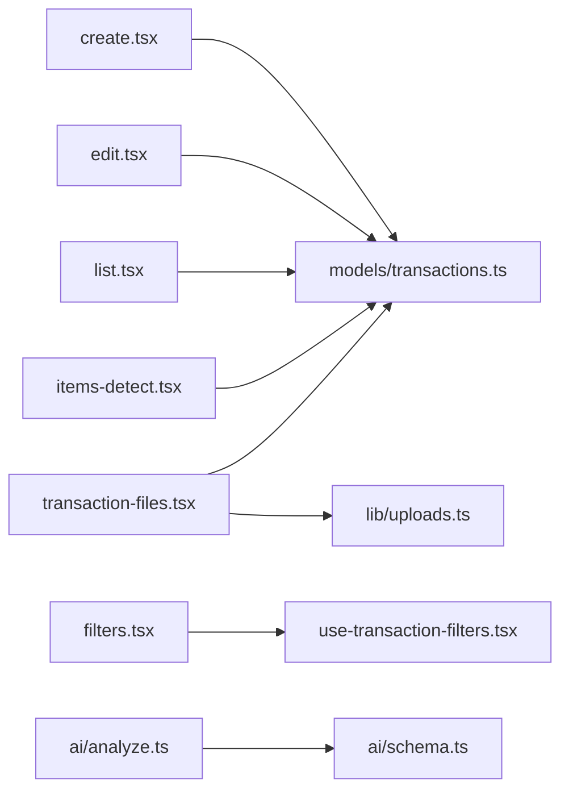

# Transaction Management System

<cite>
**Referenced Files in This Document**
- [models/transactions.ts](file://models/transactions.ts)
- [components/transactions/create.tsx](file://components/transactions/create.tsx)
- [components/transactions/edit.tsx](file://components/transactions/edit.tsx)
- [components/transactions/list.tsx](file://components/transactions/list.tsx)
- [components/transactions/filters.tsx](file://components/transactions/filters.tsx)
- [components/transactions/new.tsx](file://components/transactions/new.tsx)
- [components/transactions/bulk-actions.tsx](file://components/transactions/bulk-actions.tsx)
- [components/transactions/transaction-files.tsx](file://components/transactions/transaction-files.tsx)
- [components/agents/items-detect.tsx](file://components/agents/items-detect.tsx)
- [hooks/use-transaction-filters.tsx](file://hooks/use-transaction-filters.tsx)
- [ai/analyze.ts](file://ai/analyze.ts)
- [ai/schema.ts](file://ai/schema.ts)
- [lib/uploads.ts](file://lib/uploads.ts)
</cite>

## Table of Contents
1. [Introduction](#introduction)
2. [Project Structure](#project-structure)
3. [Core Components](#core-components)
4. [Architecture Overview](#architecture-overview)
5. [Detailed Component Analysis](#detailed-component-analysis)
6. [Dependency Analysis](#dependency-analysis)
7. [Performance Considerations](#performance-considerations)
8. [Troubleshooting Guide](#troubleshooting-guide)
9. [Conclusion](#conclusion)
10. [Appendices](#appendices)

## Introduction
This document describes the Transaction Management System used by TaxHacker. It covers the transaction data model, CRUD operations, multi-currency support, category and project associations, advanced filtering and search, bulk operations, editing workflows, creation from AI-extracted data, manual entry, splitting functionality, status management, approval workflows, audit trails, AI processing engine integration, and file attachments. It also includes practical workflows and troubleshooting guidance.

## Project Structure
The transaction system spans model-level persistence, UI forms and lists, filters, bulk actions, file attachments, and AI-powered extraction and splitting.

**Diagram sources**
- [models/transactions.ts:1-221](file://models/transactions.ts#L1-L221)
- [components/transactions/create.tsx:1-138](file://components/transactions/create.tsx#L1-L138)
- [components/transactions/edit.tsx:1-255](file://components/transactions/edit.tsx#L1-L255)
- [components/transactions/list.tsx:1-344](file://components/transactions/list.tsx#L1-L344)
- [components/transactions/filters.tsx:1-113](file://components/transactions/filters.tsx#L1-L113)
- [components/transactions/new.tsx:1-45](file://components/transactions/new.tsx#L1-L45)
- [components/transactions/bulk-actions.tsx:1-45](file://components/transactions/bulk-actions.tsx#L1-L45)
- [components/transactions/transaction-files.tsx:1-82](file://components/transactions/transaction-files.tsx#L1-L82)
- [components/agents/items-detect.tsx:1-80](file://components/agents/items-detect.tsx#L1-L80)
- [hooks/use-transaction-filters.tsx:1-91](file://hooks/use-transaction-filters.tsx#L1-L91)
- [ai/analyze.ts:1-58](file://ai/analyze.ts#L1-L58)
- [ai/schema.ts:1-35](file://ai/schema.ts#L1-L35)
- [lib/uploads.ts:1-61](file://lib/uploads.ts#L1-L61)

**Section sources**
- [models/transactions.ts:1-221](file://models/transactions.ts#L1-L221)
- [components/transactions/create.tsx:1-138](file://components/transactions/create.tsx#L1-L138)
- [components/transactions/edit.tsx:1-255](file://components/transactions/edit.tsx#L1-L255)
- [components/transactions/list.tsx:1-344](file://components/transactions/list.tsx#L1-L344)
- [components/transactions/filters.tsx:1-113](file://components/transactions/filters.tsx#L1-L113)
- [components/transactions/new.tsx:1-45](file://components/transactions/new.tsx#L1-L45)
- [components/transactions/bulk-actions.tsx:1-45](file://components/transactions/bulk-actions.tsx#L1-L45)
- [components/transactions/transaction-files.tsx:1-82](file://components/transactions/transaction-files.tsx#L1-L82)
- [components/agents/items-detect.tsx:1-80](file://components/agents/items-detect.tsx#L1-L80)
- [hooks/use-transaction-filters.tsx:1-91](file://hooks/use-transaction-filters.tsx#L1-L91)
- [ai/analyze.ts:1-58](file://ai/analyze.ts#L1-L58)
- [ai/schema.ts:1-35](file://ai/schema.ts#L1-L35)
- [lib/uploads.ts:1-61](file://lib/uploads.ts#L1-L61)

## Core Components
- Transaction model and repository: Provides typed transaction data, filters, pagination, CRUD, and extra-field separation logic.
- Transaction forms: Create and edit forms with dynamic fields, currency conversion, and category/project selection.
- Transaction list and filters: Sortable columns, search, date range, category/project filters, and bulk actions.
- File attachments: Upload, preview, and deletion of files associated with transactions.
- AI integration: LLM-powered extraction and schema-driven parsing; splitting detected items into separate transactions.
- Hooks: URL-based filters synchronization and persistence.

**Section sources**
- [models/transactions.ts:7-221](file://models/transactions.ts#L7-L221)
- [components/transactions/create.tsx:18-138](file://components/transactions/create.tsx#L18-L138)
- [components/transactions/edit.tsx:20-255](file://components/transactions/edit.tsx#L20-L255)
- [components/transactions/list.tsx:184-344](file://components/transactions/list.tsx#L184-L344)
- [components/transactions/filters.tsx:13-113](file://components/transactions/filters.tsx#L13-L113)
- [components/transactions/transaction-files.tsx:12-82](file://components/transactions/transaction-files.tsx#L12-L82)
- [components/agents/items-detect.tsx:11-80](file://components/agents/items-detect.tsx#L11-L80)
- [hooks/use-transaction-filters.tsx:8-91](file://hooks/use-transaction-filters.tsx#L8-L91)

## Architecture Overview
The system follows a layered pattern:
- UI Layer: Forms, dialogs, list, filters, and tools.
- Hook Layer: Synchronizes filters with URL and manages state.
- Model Layer: Centralized transaction operations and data shaping.
- AI Layer: Extraction and schema generation for LLM parsing.
- File Layer: Upload pipeline and storage handling.

**Diagram sources**
- [components/transactions/new.tsx:17-45](file://components/transactions/new.tsx#L17-L45)
- [components/transactions/create.tsx:30-50](file://components/transactions/create.tsx#L30-L50)
- [models/transactions.ts:135-146](file://models/transactions.ts#L135-L146)

## Detailed Component Analysis

### Transaction Data Model
The model defines the transaction shape, filters, pagination, and CRUD operations. It separates standard fields from extra fields based on user-defined field definitions, enabling flexible schemas while maintaining strict relational fields.

Key aspects:
- Fields: Name, merchant, description, total, currency codes, converted totals, type, items, note, files, extra metadata, category/project codes, issued date, raw text.
- Filters: Search across multiple text fields, date range, category, project, type, ordering, pagination.
- Validation: Extra fields are validated against user-defined field definitions; standard fields are persisted directly.
- Relationships: Includes category and project relations for rendering.

**Diagram sources**
- [models/transactions.ts:7-25](file://models/transactions.ts#L7-L25)
- [models/transactions.ts:43-117](file://models/transactions.ts#L43-L117)

**Section sources**
- [models/transactions.ts:7-25](file://models/transactions.ts#L7-L25)
- [models/transactions.ts:27-41](file://models/transactions.ts#L27-L41)
- [models/transactions.ts:43-117](file://models/transactions.ts#L43-L117)
- [models/transactions.ts:192-220](file://models/transactions.ts#L192-L220)

### CRUD Operations
- Create: Splits incoming data into standard and extra parts, persists items as JSON, and associates with the user.
- Read: Retrieves paginated transactions with optional filters and includes category/project relations.
- Update: Applies the same split logic; supports clearing items by passing an empty array.
- Delete: Removes transaction and deletes attached files if no other transaction references them.
- Bulk delete: Deletes multiple transactions atomically.

**Diagram sources**
- [models/transactions.ts:135-146](file://models/transactions.ts#L135-L146)
- [models/transactions.ts:148-159](file://models/transactions.ts#L148-L159)
- [models/transactions.ts:168-184](file://models/transactions.ts#L168-L184)
- [models/transactions.ts:186-190](file://models/transactions.ts#L186-L190)
- [models/transactions.ts:192-220](file://models/transactions.ts#L192-L220)

**Section sources**
- [models/transactions.ts:135-190](file://models/transactions.ts#L135-L190)
- [models/transactions.ts:192-220](file://models/transactions.ts#L192-L220)

### Multi-Currency Support and Automatic Conversion
- Users can specify a base currency and optionally convert amounts to a default currency.
- The UI conditionally renders conversion fields when the selected currency differs from the default.
- Converted totals are stored alongside original totals and currency codes for reporting and display.

**Diagram sources**
- [components/transactions/create.tsx:77-89](file://components/transactions/create.tsx#L77-L89)
- [components/transactions/edit.tsx:151-177](file://components/transactions/edit.tsx#L151-L177)
- [models/transactions.ts:135-159](file://models/transactions.ts#L135-L159)

**Section sources**
- [components/transactions/create.tsx:31-44](file://components/transactions/create.tsx#L31-L44)
- [components/transactions/create.tsx:77-89](file://components/transactions/create.tsx#L77-L89)
- [components/transactions/edit.tsx:40-61](file://components/transactions/edit.tsx#L40-L61)
- [components/transactions/edit.tsx:151-177](file://components/transactions/edit.tsx#L151-L177)
- [models/transactions.ts:135-159](file://models/transactions.ts#L135-L159)

### Category and Project Associations
- Transactions are associated with category and project codes.
- UI selects from available categories and projects; badges render with color and name.
- Filtering supports category and project selection.

**Section sources**
- [components/transactions/list.tsx:49-74](file://components/transactions/list.tsx#L49-L74)
- [components/transactions/filters.tsx:47-81](file://components/transactions/filters.tsx#L47-L81)
- [models/transactions.ts:73-79](file://models/transactions.ts#L73-L79)

### Advanced Filtering and Search
- Search: Insensitive substring match across name, merchant, description, note, and raw text.
- Date range: issuedAt bounds.
- Category/Project/Type: discrete filters.
- Ordering: single-field ascending/descending; URL-synced via hook.
- Column visibility: configurable via field selector.

**Diagram sources**
- [hooks/use-transaction-filters.tsx:8-26](file://hooks/use-transaction-filters.tsx#L8-L26)
- [hooks/use-transaction-filters.tsx:28-86](file://hooks/use-transaction-filters.tsx#L28-L86)
- [models/transactions.ts:55-90](file://models/transactions.ts#L55-L90)

**Section sources**
- [components/transactions/filters.tsx:13-113](file://components/transactions/filters.tsx#L13-L113)
- [hooks/use-transaction-filters.tsx:8-91](file://hooks/use-transaction-filters.tsx#L8-L91)
- [models/transactions.ts:55-90](file://models/transactions.ts#L55-L90)

### Bulk Operations
- Bulk delete: Selected IDs are deleted in a single operation; confirmation is enforced.
- Selection: Table row checkboxes enable multi-selection; a fixed action menu appears when selections exist.

**Section sources**
- [components/transactions/bulk-actions.tsx:13-45](file://components/transactions/bulk-actions.tsx#L13-L45)
- [components/transactions/list.tsx:184-344](file://components/transactions/list.tsx#L184-L344)
- [models/transactions.ts:186-190](file://models/transactions.ts#L186-L190)

### Transaction Editing Workflows
- Dynamic fields: Extra fields are rendered based on user-defined field definitions.
- Required fields: Respect required flags per field definition.
- Items preview: Detected items are shown with a tool window; supports splitting into multiple transactions.

**Section sources**
- [components/transactions/edit.tsx:39-71](file://components/transactions/edit.tsx#L39-L71)
- [components/transactions/edit.tsx:205-223](file://components/transactions/edit.tsx#L205-L223)
- [components/agents/items-detect.tsx:11-80](file://components/agents/items-detect.tsx#L11-L80)

### Transaction Creation from AI-Extracted Data
- AI extraction: Uses LLM provider with a schema derived from user-defined fields to parse attachments and produce structured output.
- Schema generation: Builds a JSON schema that includes extra fields and an items array.
- File caching: Stores parsed results in file metadata for reuse.

**Diagram sources**
- [ai/analyze.ts:14-57](file://ai/analyze.ts#L14-L57)
- [ai/schema.ts:3-34](file://ai/schema.ts#L3-L34)

**Section sources**
- [ai/analyze.ts:14-57](file://ai/analyze.ts#L14-L57)
- [ai/schema.ts:3-34](file://ai/schema.ts#L3-L34)

### Manual Entry Processes
- New transaction dialog loads categories, projects, currencies, and settings.
- Create form initializes defaults from settings and submits to backend action.

**Section sources**
- [components/transactions/new.tsx:17-45](file://components/transactions/new.tsx#L17-L45)
- [components/transactions/create.tsx:18-50](file://components/transactions/create.tsx#L18-L50)

### Transaction Splitting Functionality
- Items detection tool displays detected items with formatted totals.
- Splitting creates multiple transactions from a single file’s items, notifying the user and updating sidebar counts.

**Section sources**
- [components/agents/items-detect.tsx:11-80](file://components/agents/items-detect.tsx#L11-L80)

### Status Management, Approval Workflows, and Audit Trails
- Current implementation tracks issued date, type (income/expense/other), totals, and extra metadata. No explicit status or approval fields are present in the model.
- Audit trail: Not implemented in the referenced files; consider adding change logs or versioning at the model level if required.

**Section sources**
- [models/transactions.ts:7-25](file://models/transactions.ts#L7-L25)
- [models/transactions.ts:43-117](file://models/transactions.ts#L43-L117)

### File Attachment System
- Upload: Accepts multiple files, validates MIME types, and stores them under user-scoped directories.
- Preview: Renders file previews inside transaction detail.
- Association: Files are stored as an array of IDs on the transaction record.
- Deletion: Removes files only when no other transaction references them.

**Section sources**
- [components/transactions/transaction-files.tsx:12-82](file://components/transactions/transaction-files.tsx#L12-L82)
- [lib/uploads.ts:8-61](file://lib/uploads.ts#L8-L61)
- [models/transactions.ts:161-184](file://models/transactions.ts#L161-L184)

## Dependency Analysis
- UI forms depend on model operations and settings.
- Filters synchronize with URL via a shared hook.
- AI schema generation depends on user-defined fields.
- File operations depend on upload utilities and Prisma relations.

**Diagram sources**
- [components/transactions/create.tsx:3-30](file://components/transactions/create.tsx#L3-L30)
- [components/transactions/edit.tsx:3-37](file://components/transactions/edit.tsx#L3-L37)
- [components/transactions/list.tsx:1-13](file://components/transactions/list.tsx#L1-L13)
- [components/transactions/filters.tsx:8-22](file://components/transactions/filters.tsx#L8-L22)
- [components/transactions/transaction-files.tsx:3-17](file://components/transactions/transaction-files.tsx#L3-L17)
- [components/agents/items-detect.tsx:5-8](file://components/agents/items-detect.tsx#L5-L8)
- [ai/analyze.ts:5-7](file://ai/analyze.ts#L5-L7)
- [ai/schema.ts:1-2](file://ai/schema.ts#L1-L2)
- [lib/uploads.ts:1-6](file://lib/uploads.ts#L1-L6)
- [models/transactions.ts:1-6](file://models/transactions.ts#L1-L6)

**Section sources**
- [components/transactions/create.tsx:3-30](file://components/transactions/create.tsx#L3-L30)
- [components/transactions/edit.tsx:3-37](file://components/transactions/edit.tsx#L3-L37)
- [components/transactions/list.tsx:1-13](file://components/transactions/list.tsx#L1-L13)
- [components/transactions/filters.tsx:8-22](file://components/transactions/filters.tsx#L8-L22)
- [components/transactions/transaction-files.tsx:3-17](file://components/transactions/transaction-files.tsx#L3-L17)
- [components/agents/items-detect.tsx:5-8](file://components/agents/items-detect.tsx#L5-L8)
- [ai/analyze.ts:5-7](file://ai/analyze.ts#L5-L7)
- [ai/schema.ts:1-2](file://ai/schema.ts#L1-L2)
- [lib/uploads.ts:1-6](file://lib/uploads.ts#L1-L6)
- [models/transactions.ts:1-6](file://models/transactions.ts#L1-L6)

## Performance Considerations
- Pagination: Use limit/offset to avoid large result sets; ensure indexes on frequently filtered fields (e.g., issuedAt, categoryCode, projectCode).
- Sorting: Single-field ordering is efficient; composite ordering may require database indexes.
- Extra fields: Stored as JSON; avoid excessive nesting or very large objects to keep queries fast.
- File handling: Validate sizes and MIME types early; batch deletions reduce DB round-trips.
- AI parsing: Cache results in file metadata to avoid repeated LLM calls.

## Troubleshooting Guide
- Search yields no results:
  - Verify filters and date range; clear filters via the clear button.
  - Ensure search term matches insensitive substrings across supported fields.
- Currency conversion not appearing:
  - Confirm the selected currency differs from the default; conversion fields appear conditionally.
- Files not attaching:
  - Check accepted MIME types and file size limits; ensure upload directory exists and is writable.
- Bulk delete fails:
  - Confirm selection and network connectivity; check console for errors.
- AI extraction errors:
  - Validate LLM provider settings and schema; review cached parse result updates.

**Section sources**
- [components/transactions/filters.tsx:94-106](file://components/transactions/filters.tsx#L94-L106)
- [components/transactions/create.tsx:77-89](file://components/transactions/create.tsx#L77-L89)
- [lib/uploads.ts:18-20](file://lib/uploads.ts#L18-L20)
- [components/transactions/bulk-actions.tsx:16-34](file://components/transactions/bulk-actions.tsx#L16-L34)
- [ai/analyze.ts:50-56](file://ai/analyze.ts#L50-L56)

## Conclusion
TaxHacker’s Transaction Management System provides robust CRUD, flexible field schemas, multi-currency support, powerful filtering, and AI-driven extraction and splitting. While status and approval workflows are not implemented in the referenced files, the foundation is extensible for future enhancements. File handling integrates seamlessly with upload utilities and Prisma relations.

## Appendices

### Example Workflows

- Create a transaction manually:
  - Open the new transaction dialog, fill in standard and extra fields, and submit.
  - Optionally attach files after creation.

- Create from AI-extracted data:
  - Trigger AI analysis with prompt and attachments.
  - Use detected items to split into multiple transactions.

- Edit and split items:
  - Open transaction edit, review detected items, and split into separate transactions.

- Bulk delete:
  - Select rows, open bulk actions menu, confirm, and delete.

**Section sources**
- [components/transactions/new.tsx:17-45](file://components/transactions/new.tsx#L17-L45)
- [components/transactions/create.tsx:30-50](file://components/transactions/create.tsx#L30-L50)
- [ai/analyze.ts:14-57](file://ai/analyze.ts#L14-L57)
- [components/agents/items-detect.tsx:15-41](file://components/agents/items-detect.tsx#L15-L41)
- [components/transactions/bulk-actions.tsx:16-34](file://components/transactions/bulk-actions.tsx#L16-L34)