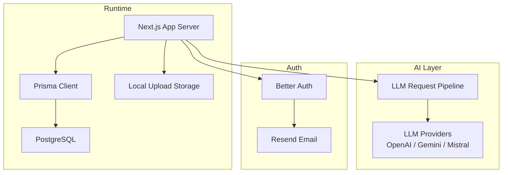
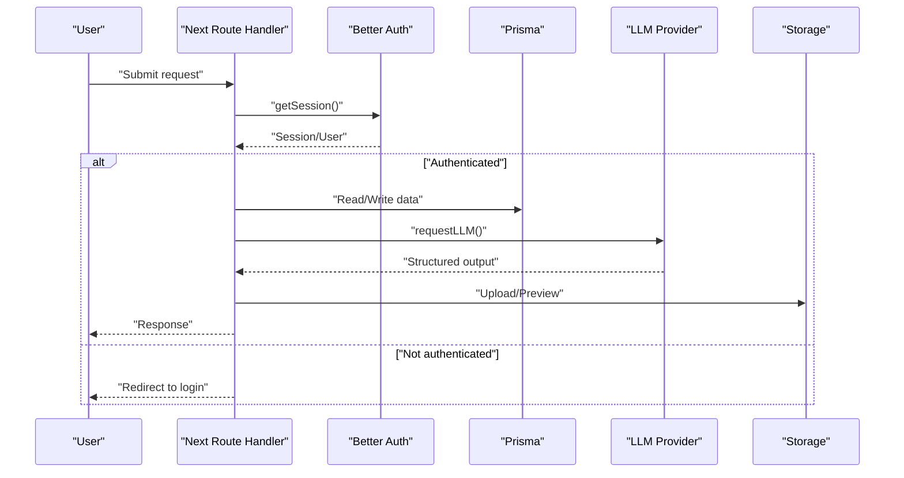
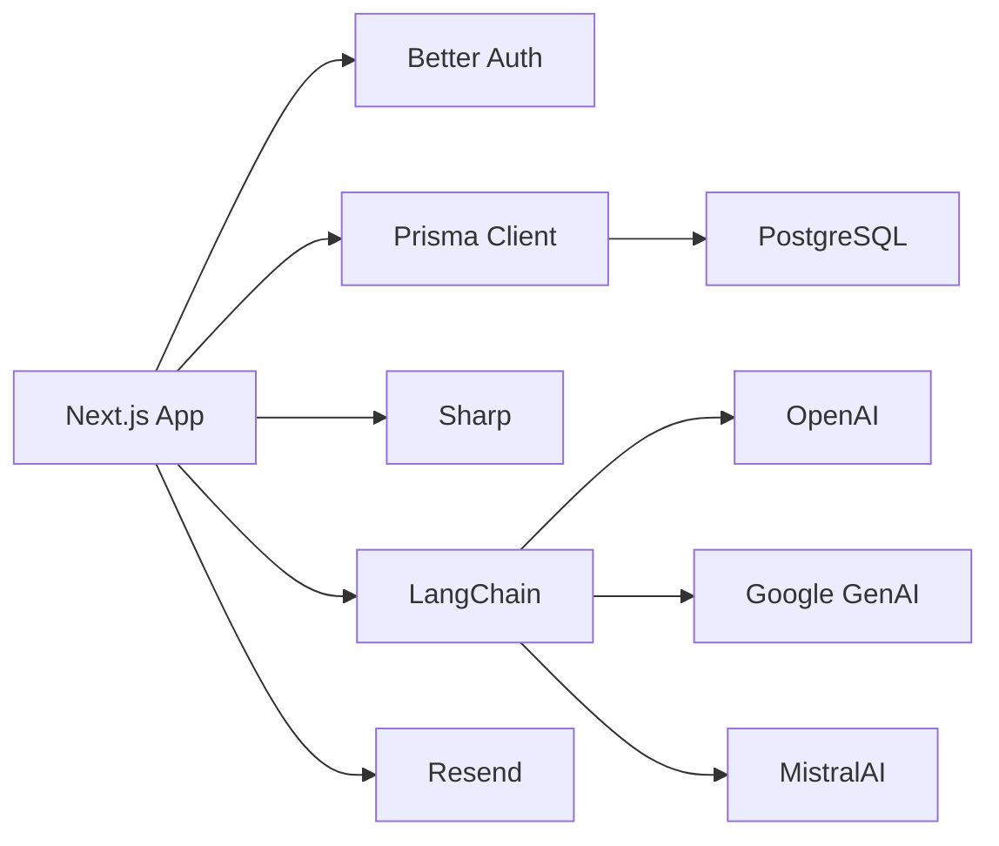

# Troubleshooting & FAQ

<cite>
**Referenced Files in This Document**
- [lib/db.ts](file://lib/db.ts)
- [lib/config.ts](file://lib/config.ts)
- [lib/auth.ts](file://lib/auth.ts)
- [app/(auth)/actions.ts](file://app/(auth)/actions.ts)
- [lib/auth-client.ts](file://lib/auth-client.ts)
- [lib/uploads.ts](file://lib/uploads.ts)
- [lib/files.ts](file://lib/files.ts)
- [models/files.ts](file://models/files.ts)
- [ai/analyze.ts](file://ai/analyze.ts)
- [ai/providers/llmProvider.ts](file://ai/providers/llmProvider.ts)
- [lib/actions.ts](file://lib/actions.ts)
- [app/global-error.tsx](file://app/global-error.tsx)
- [Dockerfile](file://Dockerfile)
- [docker-compose.yml](file://docker-compose.yml)
- [package.json](file://package.json)
- [lib/email.ts](file://lib/email.ts)
</cite>

## Table of Contents
1. [Introduction](#introduction)
2. [Project Structure](#project-structure)
3. [Core Components](#core-components)
4. [Architecture Overview](#architecture-overview)
5. [Detailed Component Analysis](#detailed-component-analysis)
6. [Dependency Analysis](#dependency-analysis)
7. [Performance Considerations](#performance-considerations)
8. [Troubleshooting Guide](#troubleshooting-guide)
9. [Conclusion](#conclusion)
10. [Appendices](#appendices)

## Introduction
This document provides a comprehensive Troubleshooting & FAQ guide for TaxHacker. It focuses on diagnosing and resolving common issues such as authentication failures, file upload problems, AI processing errors, and database connectivity issues. It also covers performance troubleshooting, migration and upgrade concerns, environment-specific pitfalls (Docker, cloud, self-hosted), security and permission issues, and escalation pathways.

## Project Structure
TaxHacker is a Next.js application with a layered architecture:
- Authentication and session management via Better Auth
- Prisma ORM for database access
- AI processing powered by LangChain integrations with OpenAI, Google Generative AI, and Mistral
- File handling with Sharp and local storage
- Email delivery via Resend
- Containerized deployment with Docker and docker-compose

**Diagram sources**
- [lib/db.ts](file://lib/db.ts)
- [lib/config.ts](file://lib/config.ts)
- [lib/auth.ts](file://lib/auth.ts)
- [lib/email.ts](file://lib/email.ts)
- [ai/providers/llmProvider.ts](file://ai/providers/llmProvider.ts)
- [lib/uploads.ts](file://lib/uploads.ts)

**Section sources**
- [lib/db.ts](file://lib/db.ts)
- [lib/config.ts](file://lib/config.ts)
- [lib/auth.ts](file://lib/auth.ts)
- [lib/email.ts](file://lib/email.ts)
- [ai/providers/llmProvider.ts](file://ai/providers/llmProvider.ts)
- [lib/uploads.ts](file://lib/uploads.ts)

## Core Components
- Authentication and session management: Better Auth with JWT sessions, email OTP, and self-hosted mode support.
- Database connectivity: Prisma client configured with query/info/warn/error logging.
- AI processing: Unified LLM request pipeline supporting multiple providers with fallback.
- File handling: Image upload pipeline with Sharp, path normalization, and safety checks.
- Email delivery: Resend integration for OTP and newsletter emails.
- Deployment: Docker multi-stage build with production runtime and system dependencies.

**Section sources**
- [lib/auth.ts](file://lib/auth.ts)
- [lib/db.ts](file://lib/db.ts)
- [ai/analyze.ts](file://ai/analyze.ts)
- [ai/providers/llmProvider.ts](file://ai/providers/llmProvider.ts)
- [lib/uploads.ts](file://lib/uploads.ts)
- [lib/files.ts](file://lib/files.ts)
- [lib/email.ts](file://lib/email.ts)
- [Dockerfile](file://Dockerfile)

## Architecture Overview
The system integrates several subsystems:
- Frontend requests hit Next.js routes/controllers
- Authentication middleware validates sessions and enforces policies
- Database operations are executed via Prisma
- AI analysis requests are routed through a unified provider interface
- File operations leverage local storage and Sharp transformations
- Emails are sent via Resend

**Diagram sources**
- [lib/auth.ts](file://lib/auth.ts)
- [lib/db.ts](file://lib/db.ts)
- [ai/providers/llmProvider.ts](file://ai/providers/llmProvider.ts)
- [lib/uploads.ts](file://lib/uploads.ts)

## Detailed Component Analysis

### Authentication Failures
Common symptoms:
- Redirect loops to login
- Session not recognized
- Self-hosted mode not applying

Diagnostic steps:
- Verify environment variables for Better Auth secret and base URL
- Confirm self-hosted mode flag and redirect URLs
- Inspect session cookie domain/path and expiration
- Check email OTP delivery and expiration window

Resolution strategies:
- Set a strong Better Auth secret and ensure it matches across restarts
- Align BASE_URL with your deployment’s external URL
- For self-hosted mode, ensure the flag is enabled and the setup action has been run
- Validate email provider credentials and sender address

**Section sources**
- [lib/config.ts](file://lib/config.ts)
- [lib/auth.ts](file://lib/auth.ts)
- [app/(auth)/actions.ts](file://app/(auth)/actions.ts)

### File Upload Issues
Common symptoms:
- Upload rejected due to insufficient storage
- Unsupported target format
- Path traversal errors
- Preview generation failures

Diagnostic steps:
- Confirm storage limits and current usage per user
- Verify target filename extension and supported formats
- Check upload directory permissions and path normalization
- Review Sharp conversion parameters and system dependencies

Resolution strategies:
- Increase user storage limit or free up space
- Use supported extensions (png, jpg/jpeg, webp, avif)
- Ensure UPLOAD_PATH is writable and correctly mounted in containerized environments
- Validate system dependencies for image processing are installed

**Section sources**
- [lib/uploads.ts](file://lib/uploads.ts)
- [lib/files.ts](file://lib/files.ts)
- [models/files.ts](file://models/files.ts)
- [Dockerfile](file://Dockerfile)

### AI Processing Errors
Common symptoms:
- All providers fail or are not configured
- Structured output parsing errors
- LLM request timeouts or invalid responses

Diagnostic steps:
- Check provider API keys and model names
- Verify provider availability and quotas
- Inspect logs for provider skipping messages
- Validate prompt/schema compatibility

Resolution strategies:
- Configure at least one provider with valid API key and model
- Use compatible schemas for structured outputs
- Adjust provider order and fallback behavior
- Monitor provider rate limits and retry policies

**Section sources**
- [ai/analyze.ts](file://ai/analyze.ts)
- [ai/providers/llmProvider.ts](file://ai/providers/llmProvider.ts)
- [lib/config.ts](file://lib/config.ts)

### Database Connectivity Problems
Common symptoms:
- Migration failures on startup
- Query errors or connection refused
- Slow queries impacting UI responsiveness

Diagnostic steps:
- Confirm DATABASE_URL format and connectivity
- Run Prisma migrations manually if auto-deploy fails
- Enable Prisma query logging to capture slow queries
- Check PostgreSQL resource limits and network ACLs

Resolution strategies:
- Fix DATABASE_URL and credentials
- Apply migrations before starting the service
- Optimize queries and add indexes as needed
- Scale PostgreSQL resources if necessary

**Section sources**
- [lib/db.ts](file://lib/db.ts)
- [lib/config.ts](file://lib/config.ts)
- [package.json](file://package.json)

### Email Delivery Failures
Common symptoms:
- OTP emails not received
- Newsletter welcome emails failing

Diagnostic steps:
- Verify Resend API key and sender configuration
- Check email provider logs and deliverability
- Test sending a test email from the admin panel

Resolution strategies:
- Update Resend API key and sender address
- Ensure FROM address complies with domain policy
- Retry failed deliveries and monitor bounce rates

**Section sources**
- [lib/email.ts](file://lib/email.ts)
- [lib/config.ts](file://lib/config.ts)

### Environment-Specific Troubleshooting

#### Docker Deployments
Symptoms:
- Application starts but cannot connect to database
- Uploads fail due to missing directories or permissions
- Entrypoint scripts not executing

Checks:
- Ensure UPLOAD_PATH volume is mounted and writable
- Confirm DATABASE_URL points to reachable Postgres service
- Validate entrypoint script permissions and execution

Resolution:
- Mount persistent volumes for uploads and Postgres data
- Use docker-compose networking to connect services
- Rebuild image after updating dependencies

**Section sources**
- [docker-compose.yml](file://docker-compose.yml)
- [Dockerfile](file://Dockerfile)

#### Cloud Hosting
Symptoms:
- Base URL mismatch causing auth redirects
- Rate limiting on AI providers

Checks:
- Set BASE_URL to the external hostname
- Monitor provider quotas and adjust provider selection

Resolution:
- Update environment variables for BASE_URL and provider keys
- Choose providers with higher quotas or on-premises compatible endpoints

**Section sources**
- [lib/config.ts](file://lib/config.ts)
- [ai/providers/llmProvider.ts](file://ai/providers/llmProvider.ts)

#### Self-Hosted Installations
Symptoms:
- Self-hosted mode not taking effect
- Initial setup not completing

Checks:
- Run self-hosted setup action to initialize defaults
- Verify self-hosted flag and redirect URLs

Resolution:
- Complete the self-hosted onboarding flow
- Ensure database is initialized and migrations applied

**Section sources**
- [app/(auth)/actions.ts](file://app/(auth)/actions.ts)
- [lib/config.ts](file://lib/config.ts)

### Security and Permission Problems
Common symptoms:
- Path traversal attempts blocked
- Unauthorized file deletions
- Insufficient storage checks bypassed

Checks:
- Review path normalization and safe join logic
- Verify file deletion resolves within upload directory bounds
- Confirm storage checks consider user limits

Resolution:
- Do not override safe path joins
- Enforce storage quotas and prevent oversized uploads
- Restrict upload directories to authenticated users

**Section sources**
- [lib/files.ts](file://lib/files.ts)
- [models/files.ts](file://models/files.ts)
- [lib/uploads.ts](file://lib/uploads.ts)

### Migration and Version Upgrade Issues
Common symptoms:
- Startup fails due to pending migrations
- Schema inconsistencies after upgrades

Checks:
- Review Prisma migration status
- Compare schema.prisma with deployed migrations
- Validate environment variables after upgrade

Resolution:
- Apply migrations before starting the service
- Back up data before major upgrades
- Re-run migrations if schema drift is detected

**Section sources**
- [lib/db.ts](file://lib/db.ts)
- [package.json](file://package.json)

## Dependency Analysis
Key runtime dependencies and their roles:
- Prisma client for database operations
- LangChain providers for AI processing
- Sharp for image transformations
- Resend for email delivery
- Better Auth for authentication

**Diagram sources**
- [lib/db.ts](file://lib/db.ts)
- [ai/providers/llmProvider.ts](file://ai/providers/llmProvider.ts)
- [lib/uploads.ts](file://lib/uploads.ts)
- [lib/email.ts](file://lib/email.ts)

**Section sources**
- [lib/db.ts](file://lib/db.ts)
- [ai/providers/llmProvider.ts](file://ai/providers/llmProvider.ts)
- [lib/uploads.ts](file://lib/uploads.ts)
- [lib/email.ts](file://lib/email.ts)

## Performance Considerations
- Database performance: enable Prisma query logging, analyze slow queries, add indexes on hot paths, and scale PostgreSQL resources.
- AI latency: prefer providers with lower latency, configure fallbacks, and cache results where appropriate.
- File processing: optimize Sharp parameters, reduce image sizes, and ensure sufficient disk I/O.
- Memory usage: monitor Next.js worker memory, avoid large in-memory buffers, and stream large operations.

[No sources needed since this section provides general guidance]

## Troubleshooting Guide

### Step-by-Step Diagnostic Procedures

#### Authentication Diagnostics
1. Verify Better Auth secret and base URL in environment variables.
2. Confirm self-hosted mode flag and redirect URLs.
3. Check session cookie presence and expiration.
4. Validate email OTP delivery and sender configuration.

Resolution references:
- [lib/config.ts](file://lib/config.ts)
- [lib/auth.ts](file://lib/auth.ts)
- [lib/email.ts](file://lib/email.ts)

#### File Upload Diagnostics
1. Confirm user storage limits and current usage.
2. Validate target filename extension and supported formats.
3. Check upload directory permissions and mount points.
4. Review Sharp conversion logs and system dependencies.

Resolution references:
- [lib/files.ts](file://lib/files.ts)
- [lib/uploads.ts](file://lib/uploads.ts)
- [Dockerfile](file://Dockerfile)

#### AI Processing Diagnostics
1. Check provider API keys and model names.
2. Inspect logs for provider skipping and fallback behavior.
3. Validate prompt/schema compatibility.
4. Monitor provider quotas and retry policies.

Resolution references:
- [ai/analyze.ts](file://ai/analyze.ts)
- [ai/providers/llmProvider.ts](file://ai/providers/llmProvider.ts)
- [lib/config.ts](file://lib/config.ts)

#### Database Diagnostics
1. Verify DATABASE_URL and connectivity.
2. Run Prisma migrations manually if needed.
3. Enable Prisma query logging to identify slow queries.
4. Scale PostgreSQL resources if necessary.

Resolution references:
- [lib/db.ts](file://lib/db.ts)
- [lib/config.ts](file://lib/config.ts)
- [package.json](file://package.json)

#### Email Diagnostics
1. Verify Resend API key and sender address.
2. Check email deliverability and provider logs.
3. Send a test email to confirm configuration.

Resolution references:
- [lib/email.ts](file://lib/email.ts)
- [lib/config.ts](file://lib/config.ts)

#### Environment Diagnostics
- Docker: ensure UPLOAD_PATH volume is mounted and DATABASE_URL points to Postgres service.
- Cloud: set BASE_URL to external hostname; monitor provider quotas.
- Self-hosted: run setup action and verify self-hosted flag.

Resolution references:
- [docker-compose.yml](file://docker-compose.yml)
- [Dockerfile](file://Dockerfile)
- [app/(auth)/actions.ts](file://app/(auth)/actions.ts)
- [lib/config.ts](file://lib/config.ts)

### Error Code References and Log Analysis
- ActionState structure for server actions: success/error/data fields.
- Global error boundary captures exceptions and forwards to Sentry.
- Prisma client logs queries, info, warnings, and errors.
- LLM provider responses include provider metadata and error messages.

Resolution references:
- [lib/actions.ts](file://lib/actions.ts)
- [app/global-error.tsx](file://app/global-error.tsx)
- [lib/db.ts](file://lib/db.ts)
- [ai/providers/llmProvider.ts](file://ai/providers/llmProvider.ts)

### Debugging Workflows
- Authentication: simulate login flow, inspect session cookies, and verify redirect behavior.
- File upload: test with supported formats, check Sharp conversion logs, and validate filesystem permissions.
- AI processing: test with minimal prompts and schemas, verify provider configuration, and review structured output parsing.
- Database: run manual migrations, enable query logging, and profile slow queries.

Resolution references:
- [lib/auth.ts](file://lib/auth.ts)
- [lib/uploads.ts](file://lib/uploads.ts)
- [ai/analyze.ts](file://ai/analyze.ts)
- [lib/db.ts](file://lib/db.ts)

### Escalation Procedures and Community Support
- Capture global errors and Sentry events for incident tracking.
- Provide environment details, logs, and reproduction steps when requesting help.
- Use GitHub Discussions or repository issues for community support.

Resolution references:
- [app/global-error.tsx](file://app/global-error.tsx)
- [lib/config.ts](file://lib/config.ts)

## Conclusion
This guide consolidates practical diagnostics and resolutions for the most frequent TaxHacker issues. By following the step-by-step procedures, leveraging the provided references, and aligning configurations with environment-specific constraints, most problems can be identified and resolved efficiently. For unresolved issues, escalate with detailed logs and environment information.

## Appendices

### Quick Reference: Environment Variables
- BASE_URL: Application base URL
- PORT: Listening port
- SELF_HOSTED_MODE: Enable/disable self-hosted mode
- OPENAI_API_KEY, OPENAI_MODEL_NAME
- GOOGLE_API_KEY, GOOGLE_MODEL_NAME
- MISTRAL_API_KEY, MISTRAL_MODEL_NAME
- BETTER_AUTH_SECRET: Secret for Better Auth
- DISABLE_SIGNUP: Disable sign-ups
- RESEND_API_KEY, RESEND_FROM_EMAIL, RESEND_AUDIENCE_ID
- STRIPE_SECRET_KEY, STRIPE_WEBHOOK_SECRET
- UPLOAD_PATH: Local uploads directory

**Section sources**
- [lib/config.ts](file://lib/config.ts)