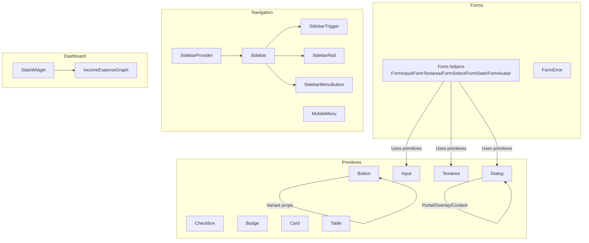
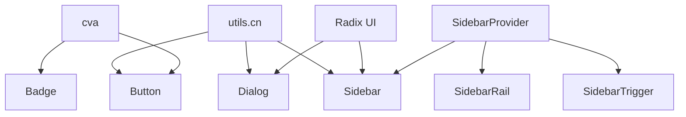
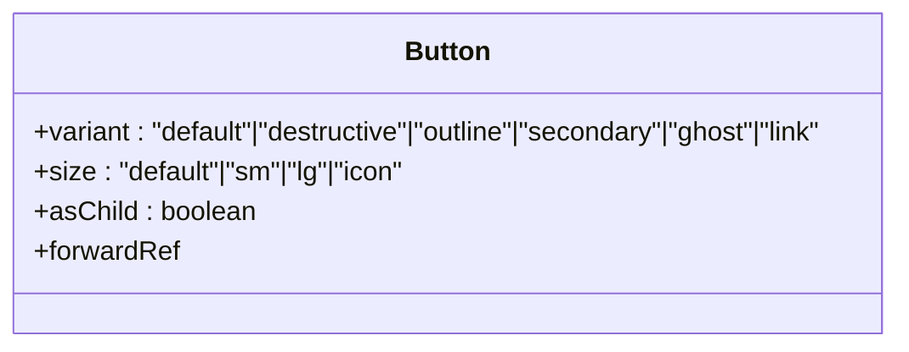
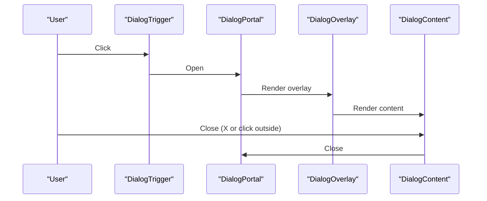
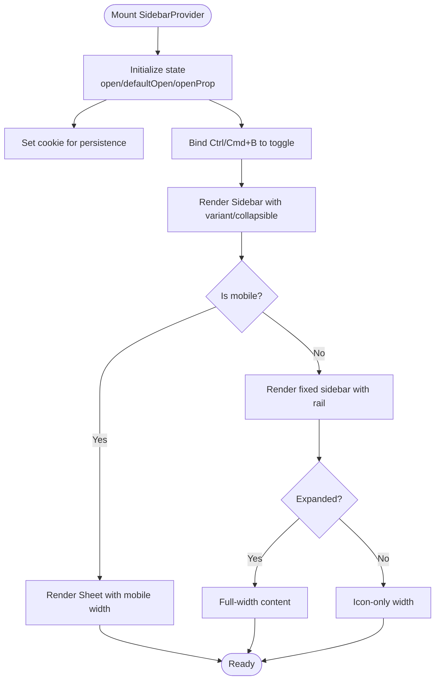
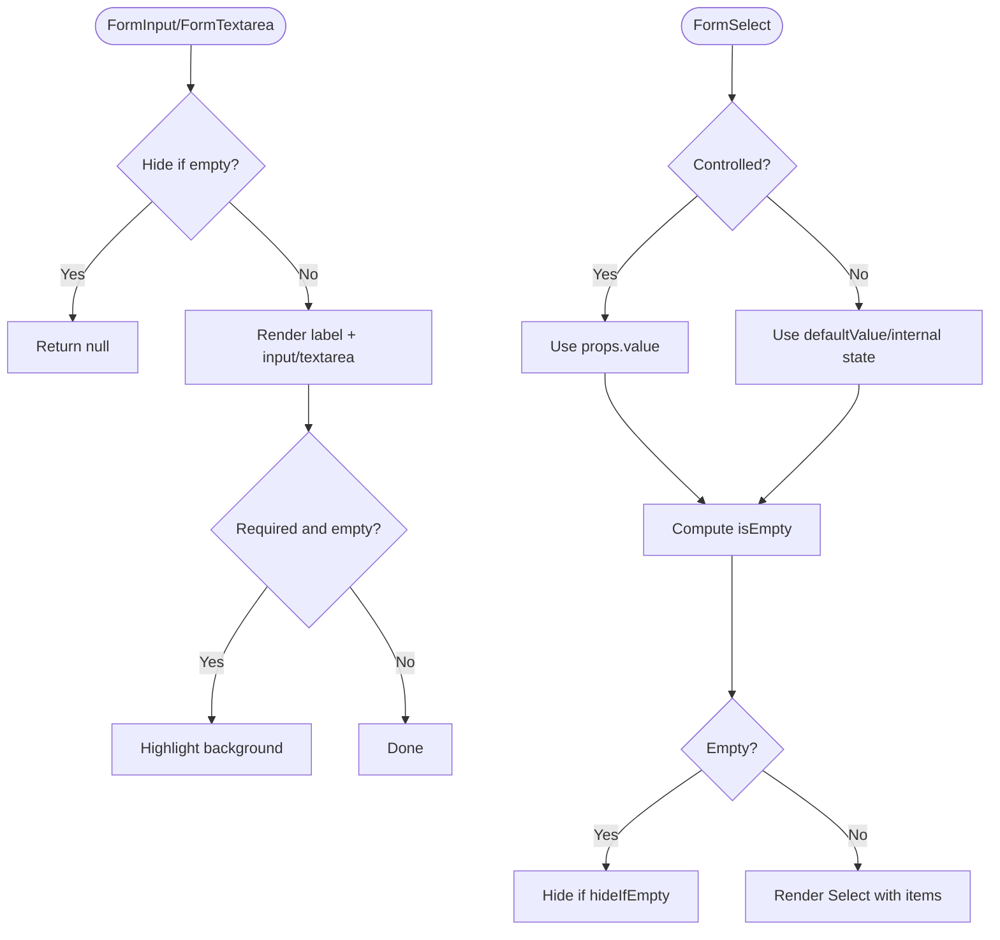
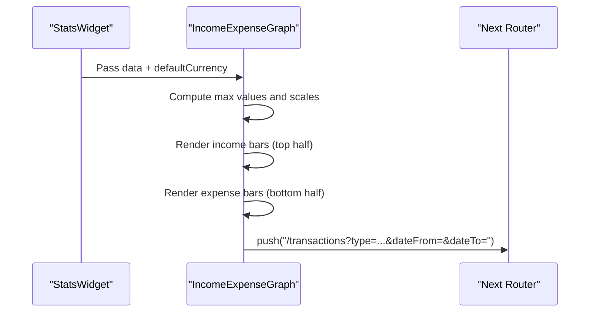
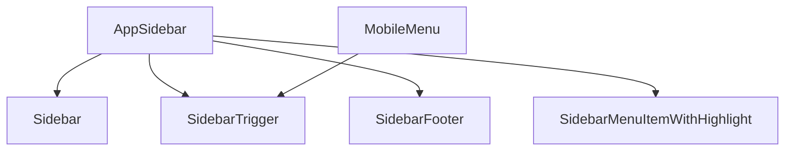
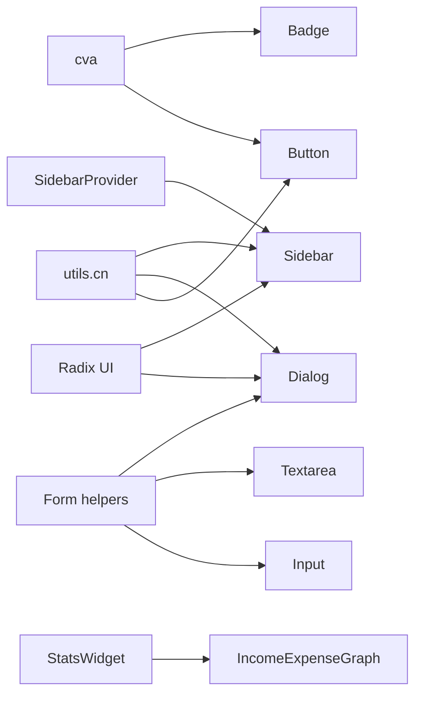

# UI Components & Design System

<cite>
**Referenced Files in This Document**
- [button.tsx](file://components/ui/button.tsx)
- [input.tsx](file://components/ui/input.tsx)
- [dialog.tsx](file://components/ui/dialog.tsx)
- [sidebar.tsx](file://components/ui/sidebar.tsx)
- [simple.tsx](file://components/forms/simple.tsx)
- [error.tsx](file://components/forms/error.tsx)
- [table.tsx](file://components/ui/table.tsx)
- [card.tsx](file://components/ui/card.tsx)
- [badge.tsx](file://components/ui/badge.tsx)
- [checkbox.tsx](file://components/ui/checkbox.tsx)
- [textarea.tsx](file://components/ui/textarea.tsx)
- [income-expense-graph.tsx](file://components/dashboard/income-expense-graph.tsx)
- [stats-widget.tsx](file://components/dashboard/stats-widget.tsx)
- [sidebar.tsx](file://components/sidebar/sidebar.tsx)
- [mobile-menu.tsx](file://components/sidebar/mobile-menu.tsx)
</cite>

## Table of Contents
1. [Introduction](#introduction)
2. [Project Structure](#project-structure)
3. [Core Components](#core-components)
4. [Architecture Overview](#architecture-overview)
5. [Detailed Component Analysis](#detailed-component-analysis)
6. [Dependency Analysis](#dependency-analysis)
7. [Performance Considerations](#performance-considerations)
8. [Troubleshooting Guide](#troubleshooting-guide)
9. [Conclusion](#conclusion)
10. [Appendices](#appendices)

## Introduction
This document describes the UI components and design system used in the TaxHacker React application. It covers reusable primitives (buttons, inputs, dialogs), form components with validation and accessibility, dashboard widgets and charts, navigation components (sidebar, mobile menu), and the design system (colors, typography, spacing, variants). It also documents composition patterns, prop interfaces, customization options, Tailwind integration, theme management, and contribution standards.

## Project Structure
The UI system is organized around:
- Primitive components under components/ui
- Form helpers and validation under components/forms
- Dashboard widgets under components/dashboard
- Navigation under components/sidebar and components/ui/sidebar
- Shared utilities under lib/utils and shared Tailwind/CSS variables

**Diagram sources**
- [button.tsx:1-58](file://components/ui/button.tsx#L1-L58)
- [input.tsx:1-23](file://components/ui/input.tsx#L1-L23)
- [textarea.tsx:1-23](file://components/ui/textarea.tsx#L1-L23)
- [checkbox.tsx:1-29](file://components/ui/checkbox.tsx#L1-L29)
- [badge.tsx:1-37](file://components/ui/badge.tsx#L1-L37)
- [card.tsx:1-77](file://components/ui/card.tsx#L1-L77)
- [table.tsx:1-121](file://components/ui/table.tsx#L1-L121)
- [dialog.tsx:1-123](file://components/ui/dialog.tsx#L1-L123)
- [sidebar.tsx:1-641](file://components/ui/sidebar.tsx#L1-L641)
- [simple.tsx:1-289](file://components/forms/simple.tsx#L1-L289)
- [error.tsx:1-17](file://components/forms/error.tsx#L1-L17)
- [stats-widget.tsx:1-115](file://components/dashboard/stats-widget.tsx#L1-L115)
- [income-expense-graph.tsx:1-192](file://components/dashboard/income-expense-graph.tsx#L1-L192)
- [mobile-menu.tsx:1-29](file://components/sidebar/mobile-menu.tsx#L1-L29)

**Section sources**
- [button.tsx:1-58](file://components/ui/button.tsx#L1-L58)
- [input.tsx:1-23](file://components/ui/input.tsx#L1-L23)
- [dialog.tsx:1-123](file://components/ui/dialog.tsx#L1-L123)
- [sidebar.tsx:1-641](file://components/ui/sidebar.tsx#L1-L641)
- [simple.tsx:1-289](file://components/forms/simple.tsx#L1-L289)
- [error.tsx:1-17](file://components/forms/error.tsx#L1-L17)
- [table.tsx:1-121](file://components/ui/table.tsx#L1-L121)
- [card.tsx:1-77](file://components/ui/card.tsx#L1-L77)
- [badge.tsx:1-37](file://components/ui/badge.tsx#L1-L37)
- [checkbox.tsx:1-29](file://components/ui/checkbox.tsx#L1-L29)
- [textarea.tsx:1-23](file://components/ui/textarea.tsx#L1-L23)
- [stats-widget.tsx:1-115](file://components/dashboard/stats-widget.tsx#L1-L115)
- [income-expense-graph.tsx:1-192](file://components/dashboard/income-expense-graph.tsx#L1-L192)
- [mobile-menu.tsx:1-29](file://components/sidebar/mobile-menu.tsx#L1-L29)

## Core Components
This section documents the foundational UI primitives and their variants, props, and composition patterns.

- Button
  - Variants: default, destructive, outline, secondary, ghost, link
  - Sizes: default, sm, lg, icon
  - Props: variant, size, asChild, plus native button attributes
  - Composition: Uses class variance authority and cn utility for conditional classes
  - Accessibility: Inherits native button semantics; supports slot pattern for semantic wrappers

- Input
  - Purpose: Text input with consistent focus states, ring, and placeholder styling
  - Props: type, className, plus native input attributes
  - Accessibility: Standard input semantics; integrates with labels and form helpers

- Textarea
  - Purpose: Multi-line text input with consistent focus states and sizing
  - Props: className, plus native textarea attributes
  - Accessibility: Standard textarea semantics

- Checkbox
  - Purpose: Accessible checkbox with indicator
  - Props: className, plus native checkbox attributes
  - Accessibility: Uses Radix UI primitives for focus management and keyboard support

- Badge
  - Variants: default, secondary, destructive, outline
  - Props: variant, className, plus HTML attributes
  - Composition: Uses cva for variant classes

- Card
  - Sections: Card, CardHeader, CardTitle, CardDescription, CardContent, CardFooter
  - Props: className, plus HTML attributes
  - Composition: Provides consistent spacing and shadow

- Table
  - Sections: Table, TableHeader, TableBody, TableFooter, TableRow, TableHead, TableCell, TableCaption
  - Props: className, plus HTML attributes
  - Composition: Wraps table in overflow container for responsiveness

- Dialog
  - Parts: Root, Portal, Overlay, Close, Trigger, Content, Header, Footer, Title, Description
  - Props: className, plus primitive-specific attributes
  - Accessibility: Focus trapping, escape key handling, overlay click-to-close, ARIA roles

**Section sources**
- [button.tsx:37-58](file://components/ui/button.tsx#L37-L58)
- [input.tsx:5-23](file://components/ui/input.tsx#L5-L23)
- [textarea.tsx:5-23](file://components/ui/textarea.tsx#L5-L23)
- [checkbox.tsx:9-29](file://components/ui/checkbox.tsx#L9-L29)
- [badge.tsx:26-37](file://components/ui/badge.tsx#L26-L37)
- [card.tsx:5-77](file://components/ui/card.tsx#L5-L77)
- [table.tsx:5-121](file://components/ui/table.tsx#L5-L121)
- [dialog.tsx:9-123](file://components/ui/dialog.tsx#L9-L123)

## Architecture Overview
The design system centers on:
- Tailwind CSS for base styles and responsive utilities
- Class variance authority (cva) for component variants
- cn utility for composing conditional classes
- Radix UI primitives for accessible interactions
- A central SidebarProvider managing state, cookies, and keyboard shortcuts

**Diagram sources**
- [button.tsx:1-6](file://components/ui/button.tsx#L1-L6)
- [badge.tsx:6-24](file://components/ui/badge.tsx#L6-L24)
- [dialog.tsx:3-7](file://components/ui/dialog.tsx#L3-L7)
- [sidebar.tsx:3-15](file://components/ui/sidebar.tsx#L3-L15)
- [sidebar.tsx:45-131](file://components/ui/sidebar.tsx#L45-L131)
- [sidebar.tsx:222-245](file://components/ui/sidebar.tsx#L222-L245)
- [sidebar.tsx:247-273](file://components/ui/sidebar.tsx#L247-L273)

**Section sources**
- [button.tsx:1-6](file://components/ui/button.tsx#L1-L6)
- [badge.tsx:6-24](file://components/ui/badge.tsx#L6-L24)
- [dialog.tsx:3-7](file://components/ui/dialog.tsx#L3-L7)
- [sidebar.tsx:3-15](file://components/ui/sidebar.tsx#L3-L15)
- [sidebar.tsx:45-131](file://components/ui/sidebar.tsx#L45-L131)
- [sidebar.tsx:222-245](file://components/ui/sidebar.tsx#L222-L245)
- [sidebar.tsx:247-273](file://components/ui/sidebar.tsx#L247-L273)

## Detailed Component Analysis

### Button
- Variants and sizes are defined via cva and applied conditionally
- Supports asChild to render a different tag while preserving styling
- Integrates with Tailwind utilities for focus-visible rings and transitions

**Diagram sources**
- [button.tsx:37-58](file://components/ui/button.tsx#L37-L58)

**Section sources**
- [button.tsx:7-35](file://components/ui/button.tsx#L7-L35)
- [button.tsx:37-58](file://components/ui/button.tsx#L37-L58)

### Dialog
- Composed from Radix UI primitives with animated transitions
- Overlay and content use Tailwind classes for positioning and animation
- Includes header/footer containers and accessible title/description slots

**Diagram sources**
- [dialog.tsx:9-54](file://components/ui/dialog.tsx#L9-L54)

**Section sources**
- [dialog.tsx:9-123](file://components/ui/dialog.tsx#L9-L123)

### Sidebar System
- SidebarProvider manages expanded/collapsed state, cookies, mobile mode, and keyboard shortcuts
- Sidebar supports variants (sidebar/floating/inset) and collapsible modes (offcanvas/icon/none)
- SidebarTrigger toggles state; SidebarRail enables resizing on desktop
- Menu components (SidebarMenuButton, SidebarMenuAction, SidebarMenuBadge) support tooltips and active states

**Diagram sources**
- [sidebar.tsx:45-131](file://components/ui/sidebar.tsx#L45-L131)
- [sidebar.tsx:133-220](file://components/ui/sidebar.tsx#L133-L220)
- [sidebar.tsx:222-273](file://components/ui/sidebar.tsx#L222-L273)

**Section sources**
- [sidebar.tsx:17-34](file://components/ui/sidebar.tsx#L17-L34)
- [sidebar.tsx:45-131](file://components/ui/sidebar.tsx#L45-L131)
- [sidebar.tsx:133-220](file://components/ui/sidebar.tsx#L133-L220)
- [sidebar.tsx:222-273](file://components/ui/sidebar.tsx#L222-L273)
- [sidebar.tsx:417-478](file://components/ui/sidebar.tsx#L417-L478)

### Form Components and Validation
- FormInput/FormTextarea: optional hiding when empty, required highlighting, auto-resize textarea
- FormSelect: controlled/uncontrolled value handling, hidden input for submission, badges/logos/colors per item
- FormDate: popover-triggered calendar with manual date input fallback
- FormAvatar: image preview with hover overlay and file input
- FormError: standardized red error message with icon

**Diagram sources**
- [simple.tsx:23-41](file://components/forms/simple.tsx#L23-L41)
- [simple.tsx:49-84](file://components/forms/simple.tsx#L49-L84)
- [simple.tsx:86-165](file://components/forms/simple.tsx#L86-L165)
- [simple.tsx:167-230](file://components/forms/simple.tsx#L167-L230)
- [simple.tsx:232-289](file://components/forms/simple.tsx#L232-L289)

**Section sources**
- [simple.tsx:17-41](file://components/forms/simple.tsx#L17-L41)
- [simple.tsx:43-84](file://components/forms/simple.tsx#L43-L84)
- [simple.tsx:86-165](file://components/forms/simple.tsx#L86-L165)
- [simple.tsx:167-230](file://components/forms/simple.tsx#L167-L230)
- [simple.tsx:232-289](file://components/forms/simple.tsx#L232-L289)
- [error.tsx:4-17](file://components/forms/error.tsx#L4-L17)

### Dashboard Widgets and Charts
- StatsWidget: renders summary cards and links to filtered transactions, embeds IncomeExpenseGraph
- IncomeExpenseGraph: dual-axis chart with income (green) and expenses (red), tooltips, click-to-filter

**Diagram sources**
- [stats-widget.tsx:14-115](file://components/dashboard/stats-widget.tsx#L14-L115)
- [income-expense-graph.tsx:15-192](file://components/dashboard/income-expense-graph.tsx#L15-L192)

**Section sources**
- [stats-widget.tsx:14-115](file://components/dashboard/stats-widget.tsx#L14-L115)
- [income-expense-graph.tsx:15-192](file://components/dashboard/income-expense-graph.tsx#L15-L192)

### Navigation Components
- AppSidebar: integrates with SidebarProvider, renders groups, triggers, user profile, and notifications
- MobileMenu: small top bar with avatar trigger and unsorted count badge

**Diagram sources**
- [sidebar.tsx:31-174](file://components/sidebar/sidebar.tsx#L31-L174)
- [mobile-menu.tsx:8-29](file://components/sidebar/mobile-menu.tsx#L8-L29)

**Section sources**
- [sidebar.tsx:31-174](file://components/sidebar/sidebar.tsx#L31-L174)
- [mobile-menu.tsx:8-29](file://components/sidebar/mobile-menu.tsx#L8-L29)

## Dependency Analysis
- Primitives depend on Tailwind classes and cn utility
- Form components compose primitives and Radix UI components
- Dashboard widgets depend on models and routing
- Navigation depends on SidebarProvider and Radix UI

**Diagram sources**
- [button.tsx:1-6](file://components/ui/button.tsx#L1-L6)
- [badge.tsx:6-24](file://components/ui/badge.tsx#L6-L24)
- [dialog.tsx:3-7](file://components/ui/dialog.tsx#L3-L7)
- [sidebar.tsx:3-15](file://components/ui/sidebar.tsx#L3-L15)
- [simple.tsx:1-15](file://components/forms/simple.tsx#L1-L15)
- [stats-widget.tsx:1-12](file://components/dashboard/stats-widget.tsx#L1-L12)
- [income-expense-graph.tsx:1-8](file://components/dashboard/income-expense-graph.tsx#L1-L8)

**Section sources**
- [button.tsx:1-6](file://components/ui/button.tsx#L1-L6)
- [badge.tsx:6-24](file://components/ui/badge.tsx#L6-L24)
- [dialog.tsx:3-7](file://components/ui/dialog.tsx#L3-L7)
- [sidebar.tsx:3-15](file://components/ui/sidebar.tsx#L3-L15)
- [simple.tsx:1-15](file://components/forms/simple.tsx#L1-L15)
- [stats-widget.tsx:1-12](file://components/dashboard/stats-widget.tsx#L1-L12)
- [income-expense-graph.tsx:1-8](file://components/dashboard/income-expense-graph.tsx#L1-L8)

## Performance Considerations
- Prefer controlled components for large forms to avoid unnecessary reflows
- Memoize computed values in charts (e.g., max values) to prevent recalculations
- Use virtualized lists for long tables when data grows
- Defer heavy computations to Web Workers if needed
- Keep animations minimal; leverage CSS transitions rather than heavy JS animations

## Troubleshooting Guide
- Dialog not closing on overlay click: ensure Portal and Overlay are rendered and Close is present
- Sidebar not persisting state: verify cookie setting and SidebarProvider props
- Form field not submitting value: ensure hidden inputs are rendered for selects
- Checkbox not accessible: confirm Radix UI usage and proper labeling
- Chart bars misaligned: check min-width and gap calculations in chart container

**Section sources**
- [dialog.tsx:9-54](file://components/ui/dialog.tsx#L9-L54)
- [sidebar.tsx:60-73](file://components/ui/sidebar.tsx#L60-L73)
- [simple.tsx:134-135](file://components/forms/simple.tsx#L134-L135)
- [checkbox.tsx:9-29](file://components/ui/checkbox.tsx#L9-L29)
- [income-expense-graph.tsx:108-109](file://components/dashboard/income-expense-graph.tsx#L108-L109)

## Conclusion
The TaxHacker UI system emphasizes accessibility, composability, and consistency through Tailwind, cva, and Radix UI. The primitives, forms, navigation, and dashboard components provide a solid foundation for building scalable financial applications with strong UX and maintainability.

## Appendices

### Design System Reference
- Color tokens: primary, secondary, destructive, muted, accent, border, background, foreground
- Typography: base text sizes, font weights, line heights
- Spacing: consistent padding/margin scale derived from theme spacing
- Variants: outlined, filled, subtle, destructive, link-like
- Dark/light mode: supported via Tailwind’s dark mode configuration and semantic color tokens

[No sources needed since this section provides general guidance]

### Prop Interfaces Summary
- Button: variant, size, asChild, plus button attributes
- Dialog: overlay/content props, header/footer/title/description attributes
- Sidebar: variant, collapsible, side, plus provider props
- FormInput/FormTextarea: title, hideIfEmpty, isRequired, plus input/textarea attributes
- FormSelect: items, title, emptyValue, placeholder, hideIfEmpty, isRequired, plus select attributes
- FormDate: name, title, placeholder, defaultValue
- FormAvatar: title, defaultValue, plus input attributes

**Section sources**
- [button.tsx:37-58](file://components/ui/button.tsx#L37-L58)
- [dialog.tsx:111-123](file://components/ui/dialog.tsx#L111-L123)
- [sidebar.tsx:133-139](file://components/ui/sidebar.tsx#L133-L139)
- [simple.tsx:17-41](file://components/forms/simple.tsx#L17-L41)
- [simple.tsx:86-165](file://components/forms/simple.tsx#L86-L165)
- [simple.tsx:167-230](file://components/forms/simple.tsx#L167-L230)
- [simple.tsx:232-289](file://components/forms/simple.tsx#L232-L289)

### Accessibility Guidelines
- Use semantic labels and aria-labelledby for form controls
- Ensure focus management in dialogs and sheets
- Provide keyboard shortcuts where appropriate (Ctrl/Cmd+B for sidebar)
- Maintain sufficient color contrast and avoid color-only indicators
- Support screen readers with sr-only text for icons

**Section sources**
- [dialog.tsx:47-51](file://components/ui/dialog.tsx#L47-L51)
- [sidebar.tsx:81-91](file://components/ui/sidebar.tsx#L81-L91)
- [simple.tsx:128-132](file://components/forms/simple.tsx#L128-L132)

### Contribution Standards
- Add new primitives to components/ui with cva variants and Tailwind classes
- Export variants and forward refs with proper displayName
- Compose existing primitives rather than reinventing styles
- Include accessibility attributes and keyboard support
- Write concise tests for interactive behaviors (dialogs, sidebar toggles)
- Document props and usage in component files

**Section sources**
- [button.tsx:1-6](file://components/ui/button.tsx#L1-L6)
- [dialog.tsx:1-123](file://components/ui/dialog.tsx#L1-L123)
- [sidebar.tsx:1-641](file://components/ui/sidebar.tsx#L1-L641)